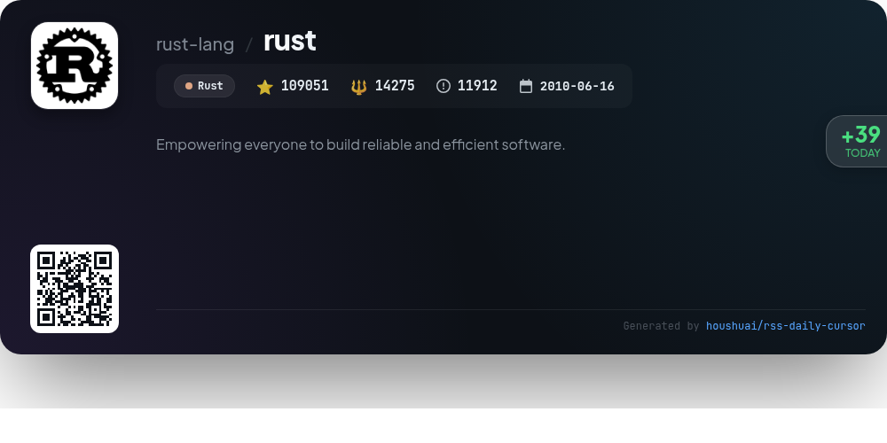
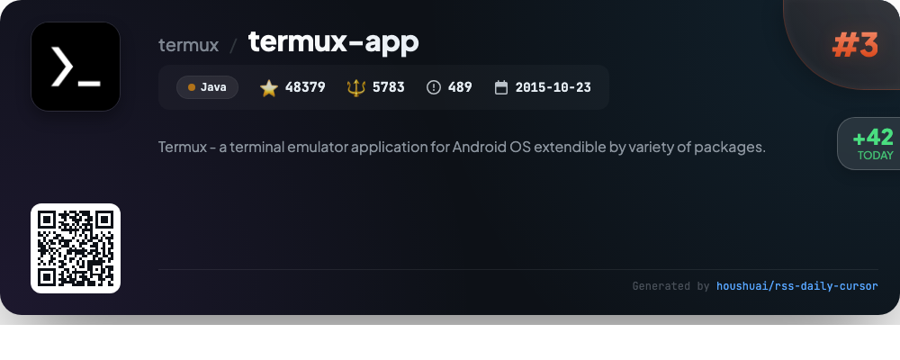
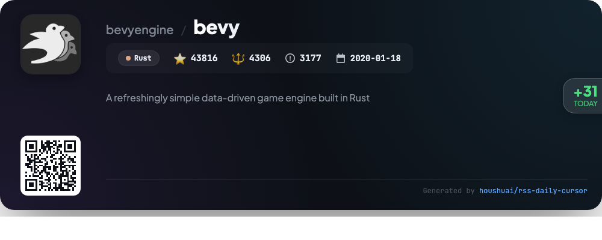
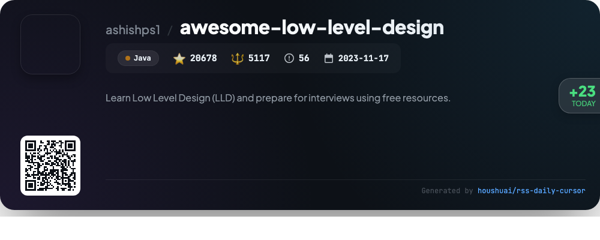
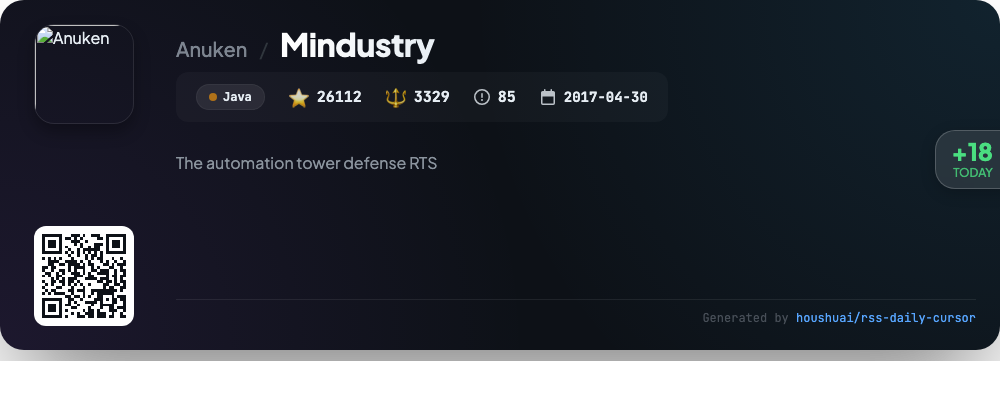

# 🌟 GitHub Trending Daily - 2026-01-03

> 📅 每日精选 GitHub 热门仓库 | 基于智能算法推荐

## 📊 Today's Highlights

| 统计项 | 数值 |
|--------|------|
| 📦 精选项目 | **10** 个 |
| ⏰ 更新时间 | 2026-01-03 01:13 UTC |

---

## 🌟 每日 Top 10 精选

### 1. [elasticsearch](https://github.com/elastic/elasticsearch)

| 指标 | 值 |
|------|----|
| ⭐ Stars | **75778** |
| 🍴 Forks | **25751** |
| 💻 Language | Java |
| 🏷️ Tags | `elasticsearch` `java` `search-engine` |

**📝 Description:** Free and Open Source, Distributed, RESTful Search Engine

### 2. [rust](https://github.com/rust-lang/rust)

| 指标 | 值 |
|------|----|
| ⭐ Stars | **109048** |
| 🍴 Forks | **14275** |
| 💻 Language | Rust |
| 🏷️ Tags | `compiler` `language` `rust` |

**📝 Description:** Empowering everyone to build reliable and efficient software.

### 3. [termux-app](https://github.com/termux/termux-app)

| 指标 | 值 |
|------|----|
| ⭐ Stars | **48379** |
| 🍴 Forks | **5783** |
| 💻 Language | Java |
| 🏷️ Tags | `android` `hacktoberfest` `linux` `terminal` `termux` |

**📝 Description:** Termux - a terminal emulator application for Android OS extendible by variety of packages.

### 4. [flink](https://github.com/apache/flink)

| 指标 | 值 |
|------|----|
| ⭐ Stars | **25663** |
| 🍴 Forks | **13810** |
| 💻 Language | Java |
| 🏷️ Tags | `big-data` `flink` `java` `python` `scala` |

**📝 Description:** Apache Flink

### 5. [DSA-Bootcamp-Java](https://github.com/kunal-kushwaha/DSA-Bootcamp-Java)

| 指标 | 值 |
|------|----|
| ⭐ Stars | **21487** |
| 🍴 Forks | **12891** |
| 💻 Language | Java |
| 🏷️ Tags | `algorithms` `competitive-programming` `data-structures` `faang-interview` `faang-preparation` |

**📝 Description:** This repository consists of the code samples, assignments, and notes for the Java data structures & algorithms + interview preparation bootcamp of WeMakeDevs.

### 6. [bevy](https://github.com/bevyengine/bevy)

| 指标 | 值 |
|------|----|
| ⭐ Stars | **43816** |
| 🍴 Forks | **4306** |
| 💻 Language | Rust |
| 🏷️ Tags | `bevy` `game-development` `game-engine` `gamedev` `open-source` |

**📝 Description:** A refreshingly simple data-driven game engine built in Rust

### 7. [gson](https://github.com/google/gson)

| 指标 | 值 |
|------|----|
| ⭐ Stars | **24292** |
| 🍴 Forks | **4370** |
| 💻 Language | Java |

**📝 Description:** A Java serialization/deserialization library to convert Java Objects into JSON and back

### 8. [awesome-low-level-design](https://github.com/ashishps1/awesome-low-level-design)

| 指标 | 值 |
|------|----|
| ⭐ Stars | **20678** |
| 🍴 Forks | **5117** |
| 💻 Language | Java |
| 🏷️ Tags | `awesome` `design-patterns` `interview` `interview-practice` `interview-questions` |

**📝 Description:** Learn Low Level Design (LLD) and prepare for interviews using free resources.

### 9. [Mindustry](https://github.com/Anuken/Mindustry)

| 指标 | 值 |
|------|----|
| ⭐ Stars | **26112** |
| 🍴 Forks | **3329** |
| 💻 Language | Java |
| 🏷️ Tags | `android` `desktop` `game` `java` `mindustry` |

**📝 Description:** The automation tower defense RTS

### 10. [SmartTube](https://github.com/yuliskov/SmartTube)

| 指标 | 值 |
|------|----|
| ⭐ Stars | **27338** |
| 🍴 Forks | **1472** |
| 💻 Language | Java |
| 🏷️ Tags | `android` `android-tv` `android-tv-box` `java` `kotlin` |

**📝 Description:** Browse media content with your own rules on Android TV

---

## 📡 RSS订阅

通过 RSS 订阅，第一时间获取每日精选项目：

- 🔔 [每日 Top 10 精选](../daily-top.xml)

---

*⚡ Powered by Smart Trending Algorithm | Generated at 2026-01-03 01:13:28 UTC*
