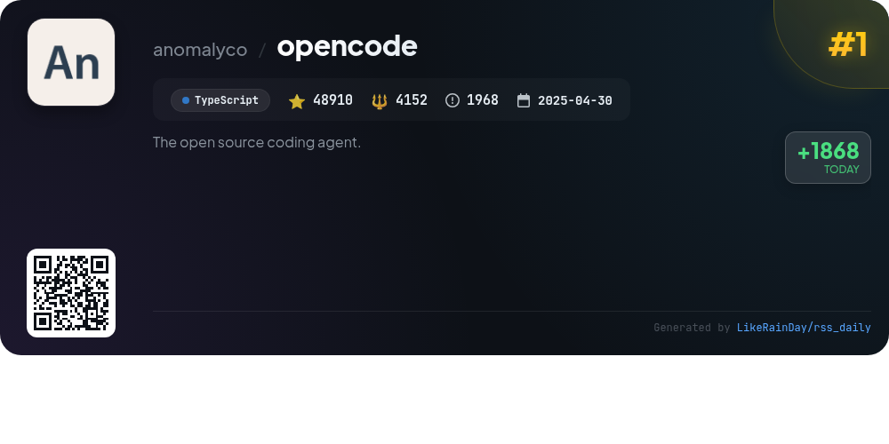
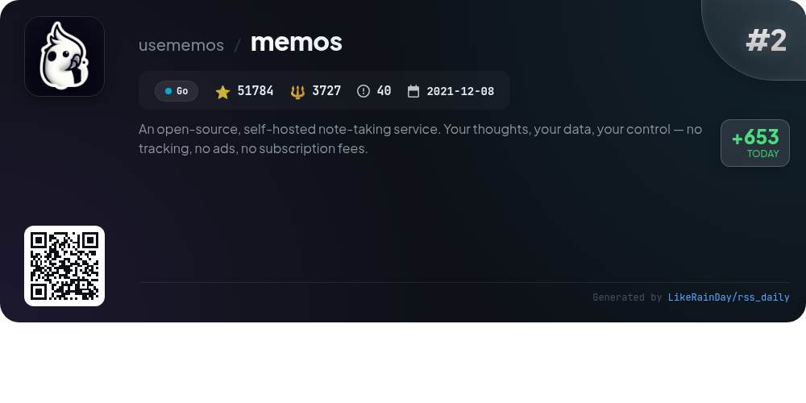
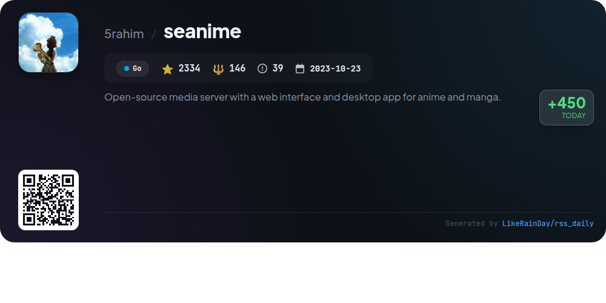
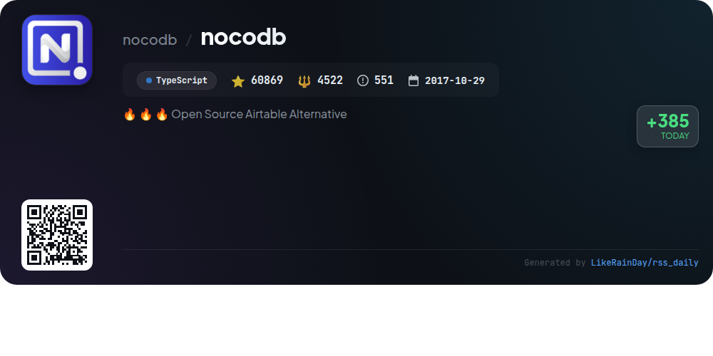
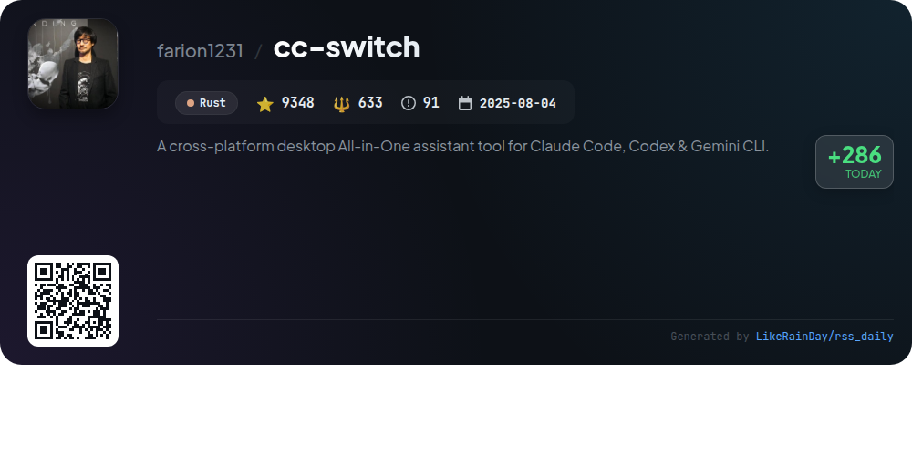
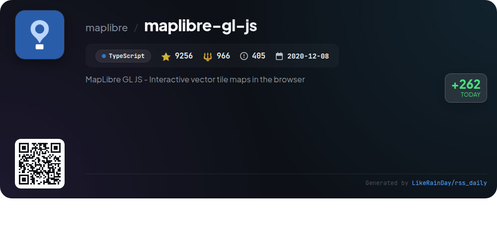
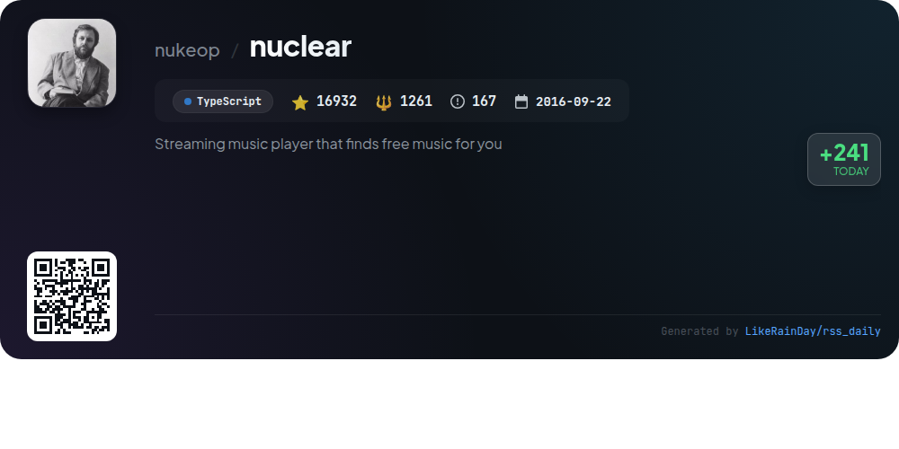
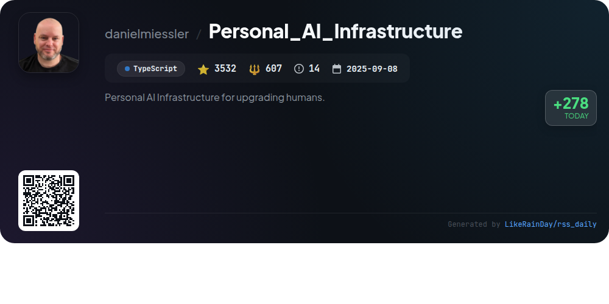

# 📊 🌟 GitHub Trending Daily - 2026-01-05

> > 📅 每日精选 GitHub 热门仓库 | 基于智能算法推荐

## 📋 Overview

**10** 个项目 | **252509** ⭐ | **20391** 🍴

**热门语言:** `TypeScript` (6) · `Go` (2) · `Rust` (1)

**更新时间:** 2026-01-05 13:00 UTC

**分类分布:**

- 🌟 每日 Top 10 精选 (10 项)

---

## 🌟 每日 Top 10 精选

### 1. [opencode](https://github.com/anomalyco/opencode)

> 🤖 **推荐理由**  
> *OpenCode is an open-source AI coding agent built in TypeScript, designed to enhance development workflows. With over 48,910 stars on GitHub, it offers a terminal user interface (TUI) and two built-in agents: "build" for full access development and "plan" for read-only code exploration. OpenCode supports multiple platforms, including desktop applications for macOS, Windows, and Linux. Its provider-agnostic design allows integration with various AI models, emphasizing flexibility and usability. For more features, visit opencode.ai.*

- ⭐ 48910 stars
- 💻 TypeScript
- 📅 Updated: 2026-01-05

### 2. [memos](https://github.com/usememos/memos)

> 🤖 **推荐理由**  
> *Memos is an open-source, self-hosted note-taking service designed for privacy and data ownership. With over 51,600 stars, it offers a fast and seamless experience for personal notes and team wikis, built using Go and React. Key features include complete data control with no tracking or ads, full markdown support, simple Docker deployment, and REST/gRPC APIs for easy integration. Memos is free forever under the MIT license, making it a cost-effective alternative to cloud services. Experience the beautiful interface and responsive design today.*

- ⭐ 51636 stars
- 💻 Go
- 📅 Updated: 2026-01-05

### 3. [daytona](https://github.com/daytonaio/daytona)

> 🤖 **推荐理由**  
> *Daytona is a cutting-edge infrastructure designed for securely executing AI-generated code. With over 42,000 stars on GitHub, it offers lightning-fast sandbox creation (under 90ms), isolated runtime environments to ensure security, and massive parallelization capabilities for concurrent AI workflows. It supports programmatic control through APIs and is compatible with OCI/Docker images. Daytona provides SDKs in Python and TypeScript, enabling easy integration. Join a growing community and explore extensive documentation to get started.*

- ⭐ 42698 stars
- 💻 TypeScript
- 📅 Updated: 2026-01-05

### 4. [seanime](https://github.com/5rahim/seanime)

> 🤖 **推荐理由**  
> *Seanime is an open-source media server designed for managing anime and manga libraries with a web interface and desktop app. Key features include a built-in video player with subtitle support, AniList integration for managing content, and custom source support for additional series. Users can stream torrents directly, download episodes automatically, and read manga from their library. Offline mode, a customizable UI, and compatibility with popular media players enhance the user experience. Seanime promotes legal media access and does not provide content itself.*

- ⭐ 2334 stars
- 💻 Go
- 📅 Updated: 2026-01-05

### 5. [nocodb](https://github.com/nocodb/nocodb)

> 🤖 **推荐理由**  
> *🔥 🔥 🔥 Open Source Airtable Alternative. popular project, actively maintained, recently updated*

- ⭐ 60816 stars
- 🍴 4521 forks
- 💻 TypeScript
- 📅 Updated: 2026-01-05

### 6. [cc-switch](https://github.com/farion1231/cc-switch)

> 🤖 **推荐理由**  
> *cc-switch is a cross-platform desktop assistant (v3.8.3) built in Rust, supporting Claude Code, Codex, and Gemini CLI with 9,310 stars on GitHub. Key features include a dual-layer architecture for data management, a redesigned UI with Japanese language support, and enhanced skills and prompts management systems. Users can easily switch between providers, manage MCP servers, and test API speeds. The tool integrates with services like Z.ai, PackyCode, and AIGoCode for AI coding, offering a streamlined experience for developers across Windows, macOS, and Linux platforms.*

- ⭐ 9310 stars
- 💻 Rust
- 📅 Updated: 2026-01-05

### 7. [maplibre-gl-js](https://github.com/maplibre/maplibre-gl-js)

> 🤖 **推荐理由**  
> *MapLibre GL JS is an open-source library for creating interactive vector tile maps in web applications, leveraging GPU-accelerated rendering for fast performance. Initially a fork of Mapbox GL JS, it has evolved to offer enhanced functionalities. Key features include customizable map styles, support for third-party vector tiles, and advanced visualizations like 3D buildings and heatmaps. The library is designed for easy integration with HTML and supports bindings for React and Angular. Comprehensive documentation and examples are available, fostering community contributions and collaboration.*

- ⭐ 9256 stars
- 💻 TypeScript
- 📅 Updated: 2026-01-05

### 8. [nuclear](https://github.com/nukeop/nuclear)

> 🤖 **推荐理由**  
> *Nuclear is a free, open-source music streaming player that aggregates music from various free sources like YouTube, Jamendo, Audius, and SoundCloud. Key features include playlist management, real-time lyrics, genre browsing, and a radio mode for automatic track queuing. Users can scrobble to Last.fm, enjoy audio normalization, and download tracks without ads or accounts. A new version is in development, promising auto-updates, enhanced performance, and a robust plugin system. Join the community on Discord and contribute to its growth!*

- ⭐ 16932 stars
- 💻 TypeScript
- 📅 Updated: 2026-01-05

### 9. [Personal_AI_Infrastructure](https://github.com/danielmiessler/Personal_AI_Infrastructure)

> 🤖 **推荐理由**  
> *Personal_AI_Infrastructure (PAI) is an open-source framework designed for building personalized AI systems that enhance human productivity. With 3,476 stars on GitHub, it offers modular packs for customizable skills, persistent memory, and context-aware workflows. Key features include a universal goal-oriented pattern, an inner scientific loop for iterative learning, and a hook system for event-driven automation. Users can install packs independently or as curated bundles, making PAI adaptable for various platforms and personal use cases, ultimately promoting self-improvement and intelligent assistance.*

- ⭐ 3476 stars
- 💻 TypeScript
- 📅 Updated: 2026-01-05

### 10. [escrcpy](https://github.com/viarotel-org/escrcpy)

> 🤖 **推荐理由**  
> *Escrcpy is an open-source tool that allows users to display and control their Android devices graphically using Electron. Key features include intelligent control via natural-language commands, automation for efficient workflow management across multiple devices, and high-performance screen mirroring. It supports wireless connections with reverse tethering and provides multi-device management through visual orchestration. Installation is straightforward via released packages or Homebrew for macOS. The project is actively maintained and welcomes contributions from developers.*

- ⭐ 7141 stars
- 💻 JavaScript
- 📅 Updated: 2026-01-05

---

## 📡 RSS订阅

通过 RSS 订阅，第一时间获取每日精选项目：

- 🔔 [RSS 订阅源] (../../daily-top.xml)
- 🔔 [每日简报] (../../GITHUB_TODAY_CN.md)
- 🔔 [每日 Top 10 精选](../../daily-top.xml)

---

*⚡ Powered by Smart Trending Algorithm | Generated at 2026-01-05 13:00:57 UTC
