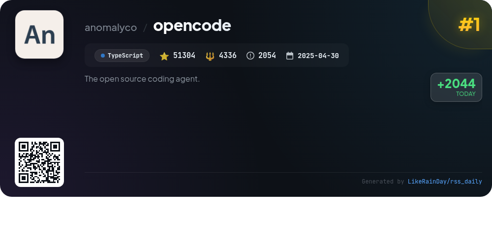
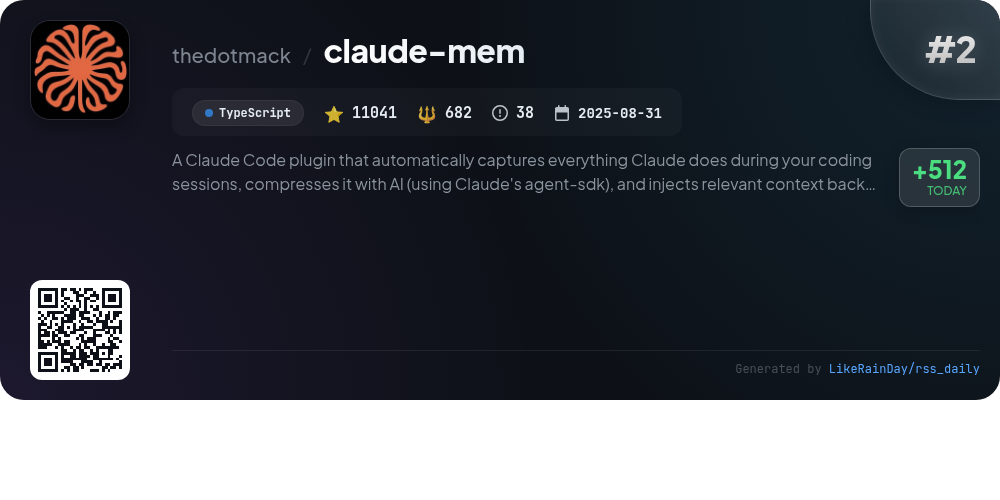
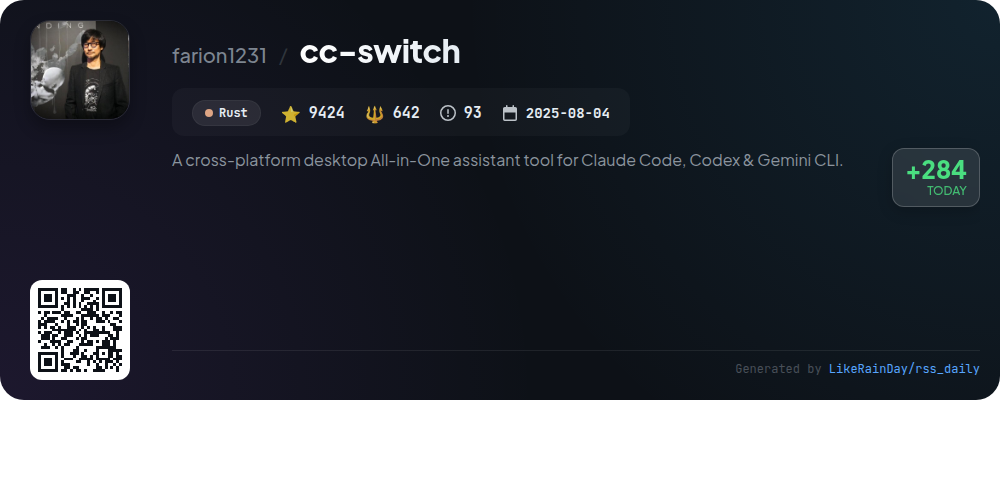
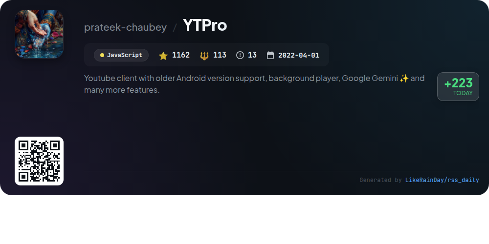
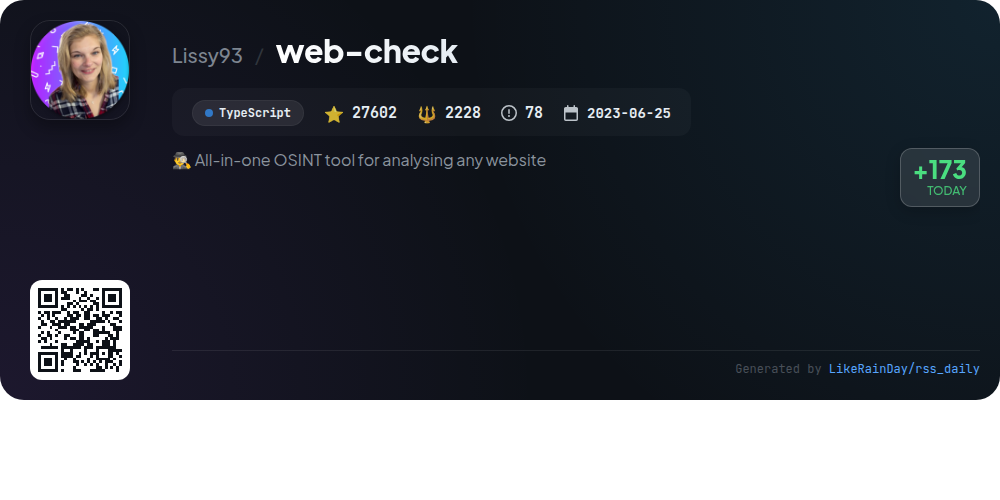
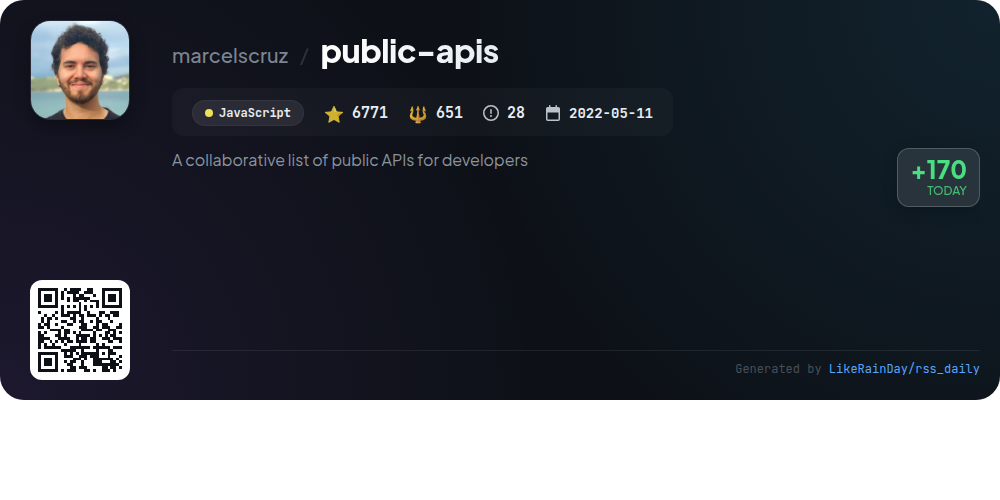
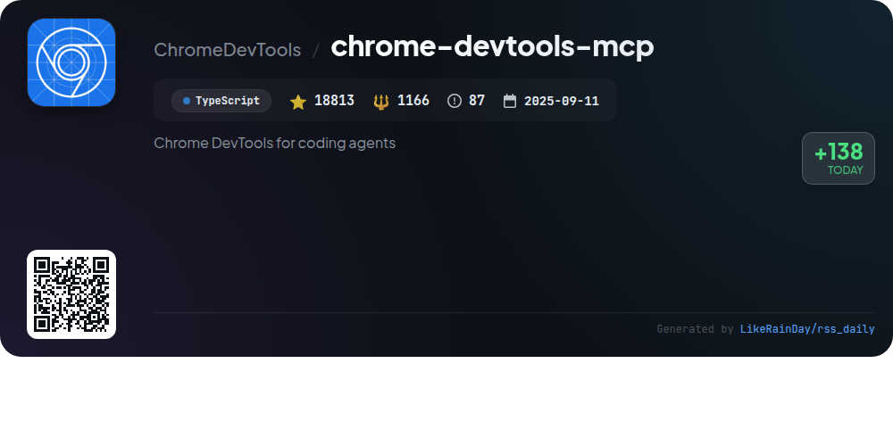
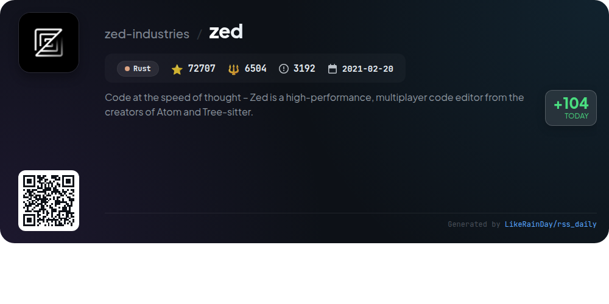
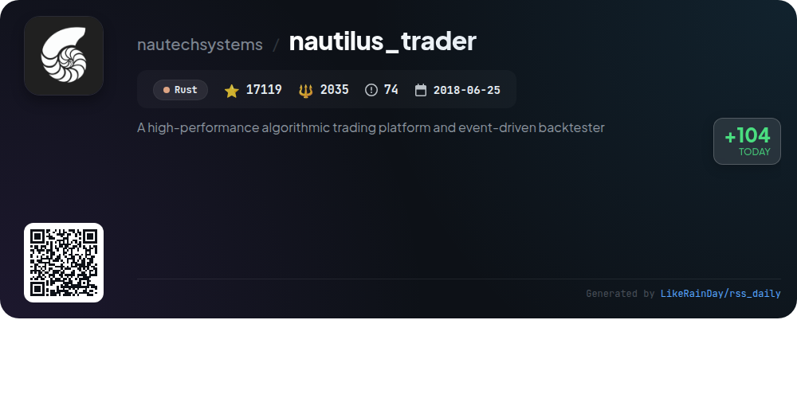
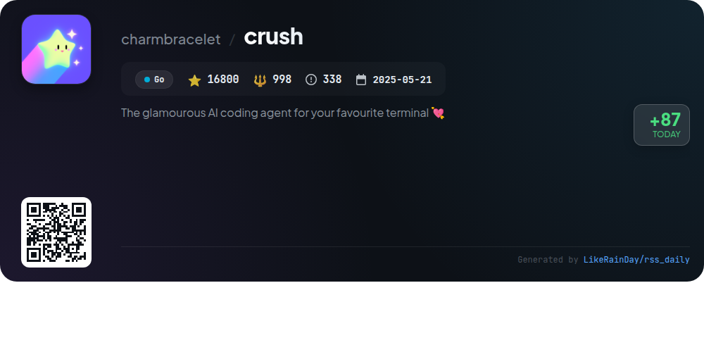

# 📊 🌟 GitHub Trending Daily - 2026-01-06

> > 📅 Daily Picks of GitHub Trending Repositories | Powered by Smart Algorithms

## 📋 Overview

**10** Projects | **232898** ⭐ | **19365** 🍴

**Top Languages:** `TypeScript` (4) · `Rust` (3) · `JavaScript` (2)

**Updated:** 2026-01-06 18:42 UTC

**Categories:**

- 🌟 Daily Top 10 (10 items)

---

## 🌟 Daily Top 10

### 1. [opencode](https://github.com/anomalyco/opencode)

> 🤖 **Why Recommend**  
> *OpenCode is an open-source AI coding agent built in TypeScript, boasting over 51,000 stars on GitHub. It features two primary agents: a full-access "build" agent for development and a "plan" agent for code exploration, enhancing user interactions with codebases. OpenCode supports multiple platforms via a desktop app and offers extensive documentation for configuration. It stands out for its provider-agnostic design, allowing integration with various AI models, and emphasizes a terminal user interface. Join the community on Discord for support and collaboration.*

- ⭐ 51304 stars
- 💻 TypeScript
- 📅 Updated: 2026-01-06

### 2. [claude-mem](https://github.com/thedotmack/claude-mem)

> 🤖 **Why Recommend**  
> *Claude-Mem is a powerful plugin for Claude Code that enhances coding sessions by automatically capturing user actions and compressing this data with AI for future reference. Key features include persistent memory to maintain context across sessions, skill-based search for project history, and a web-based UI for real-time memory access. Additional highlights include privacy controls, automatic operation, and an innovative beta channel for experimental features. With over 11,000 stars on GitHub, it streamlines coding workflows and optimizes knowledge retention.*

- ⭐ 11041 stars
- 💻 TypeScript
- 📅 Updated: 2026-01-06

### 3. [cc-switch](https://github.com/farion1231/cc-switch)

> 🤖 **Why Recommend**  
> *cc-switch is a cross-platform desktop assistant tool for Claude Code, Codex, and Gemini CLI, built with Rust and Tauri. With over 9,500 stars, it features a dual-layer architecture for data management, a revamped user interface, and support for multiple languages (English, Chinese, Japanese). Key functionalities include easy provider management, skills and prompts management systems, environment variable conflict detection, and an auto-syncing MCP server. The tool also offers seamless integration with various AI coding platforms, optimized performance, and user-friendly configuration options.*

- ⭐ 9579 stars
- 💻 Rust
- 📅 Updated: 2026-01-06

### 4. [YTPro](https://github.com/prateek-chaubey/YTPro)

> 🤖 **Why Recommend**  
> *YTPro is a feature-rich YouTube client designed for older Android versions, boasting 1,162 stars on GitHub. Key features include Google Gemini for video summarization, video and thumbnails downloading, an ads blocker, background audio playback, Picture-in-Picture mode, and gesture controls. Users can customize prompts, save videos without logging in, and enjoy minimal internal dependencies with an APK size under 50KB. The project emphasizes user experience with adaptive UI icons and auto updates, making it an efficient choice for YouTube enthusiasts.*

- ⭐ 1162 stars
- 💻 JavaScript
- 📅 Updated: 2026-01-06

### 5. [web-check](https://github.com/Lissy93/web-check)

> 🤖 **Why Recommend**  
> *Web-Check is a powerful OSINT tool for analyzing websites, offering insights into security configurations, server architecture, and technologies used. Key features include IP info, SSL chain analysis, DNS records, cookie inspection, and performance metrics. Users can explore associated hostnames, open ports, and redirect chains, enhancing their understanding of potential vulnerabilities. With support for Docker and easy deployment options via Netlify or Vercel, Web-Check is designed for security researchers and developers seeking to optimize and secure their web presence efficiently.*

- ⭐ 27602 stars
- 💻 TypeScript
- 📅 Updated: 2026-01-06

### 6. [public-apis](https://github.com/marcelscruz/public-apis)

> 🤖 **Why Recommend**  
> *The public-apis project is a collaborative repository featuring a comprehensive list of public APIs for developers, boasting over 6,700 stars on GitHub. It categorizes APIs across diverse domains, including Animals, Finance, Machine Learning, and Weather, allowing users to easily discover APIs suited to their needs. Key features include access to real-time data, extensive documentation, and a variety of services from entertainment to geolocation. This resource aims to streamline API integration, enhancing development efficiency and innovation.*

- ⭐ 6771 stars
- 💻 JavaScript
- 📅 Updated: 2026-01-06

### 7. [chrome-devtools-mcp](https://github.com/ChromeDevTools/chrome-devtools-mcp)

> 🤖 **Why Recommend**  
> *chrome-devtools-mcp is a TypeScript-based project enabling coding agents like Gemini and Copilot to control and inspect live Chrome browsers. With 18,813 stars, it serves as a Model-Context-Protocol (MCP) server, facilitating reliable automation, advanced debugging, and performance analysis using Chrome DevTools. Key features include actionable performance insights, network request analysis, and automation through Puppeteer. It requires Node.js and the latest Chrome version, and integrates seamlessly with various MCP clients for enhanced development workflows.*

- ⭐ 18813 stars
- 💻 TypeScript
- 📅 Updated: 2026-01-06

### 8. [zed](https://github.com/zed-industries/zed)

> 🤖 **Why Recommend**  
> *Zed is a high-performance, multiplayer code editor developed by the creators of Atom and Tree-sitter, designed for speed and collaboration. It supports macOS, Linux, and Windows, allowing users to install via direct download or local package managers. Key features include real-time collaboration, efficient code editing, and extensive customization options. Zed is open for contributions, and the project actively seeks new talent. The team utilizes automated tools to ensure compliance with open-source licenses. Explore more at zed.dev.*

- ⭐ 72707 stars
- 💻 Rust
- 📅 Updated: 2026-01-06

### 9. [nautilus_trader](https://github.com/nautechsystems/nautilus_trader)

> 🤖 **Why Recommend**  
> *NautilusTrader is a high-performance, open-source algorithmic trading platform built in Rust, designed for quantitative traders. It features an event-driven backtester for portfolios of automated strategies, allowing seamless transitions from backtesting to live trading without code changes. Key capabilities include high-frequency trading across diverse asset classes, modular API integrations, customizable components, advanced order types, and AI training support. NautilusTrader prioritizes software correctness and safety, making it ideal for mission-critical trading environments.*

- ⭐ 17119 stars
- 💻 Rust
- 📅 Updated: 2026-01-06

### 10. [crush](https://github.com/charmbracelet/crush)

> 🤖 **Why Recommend**  
> *Crush is a sophisticated AI coding agent designed for seamless integration with your terminal. Key features include multi-model support for various LLMs, session-based context management, and the ability to switch models mid-session. It enhances productivity through Language Server Protocol (LSP) integration and is highly extensible via Model Context Protocols (MCPs). Crush is compatible with macOS, Linux, Windows, and more, making it versatile across platforms. Installation is straightforward via popular package managers, ensuring easy access to powerful AI-driven coding assistance.*

- ⭐ 16800 stars
- 💻 Go
- 📅 Updated: 2026-01-06

---

## 📡 RSS Subscription

Subscribe via RSS to get daily trending updates:

- 🔔 [RSS XML] (../../daily-top.xml)
- 🔔 [Daily Report] (../../GITHUB_TODAY.md)
- 🔔 [Daily Top 10](../../daily-top.xml)

---

*⚡ Powered by Smart Trending Algorithm | Generated at 2026-01-06 18:42:03 UTC
