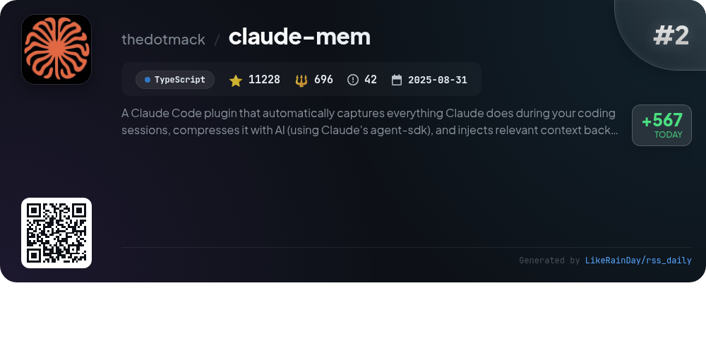
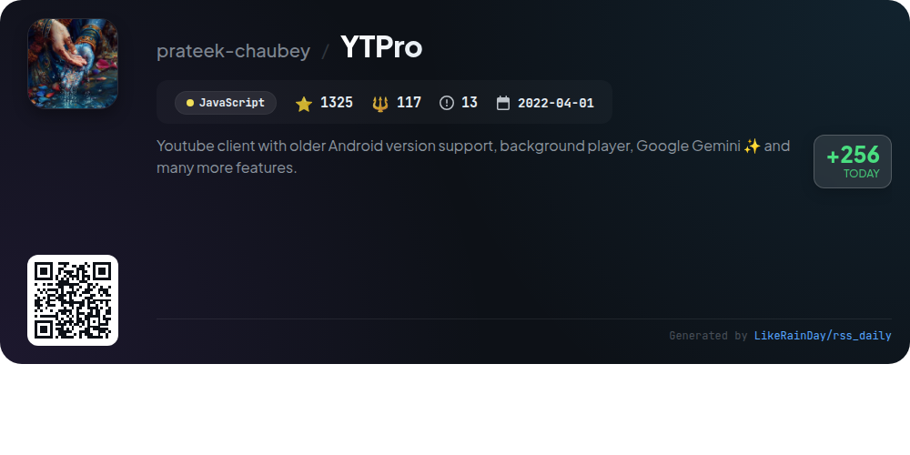
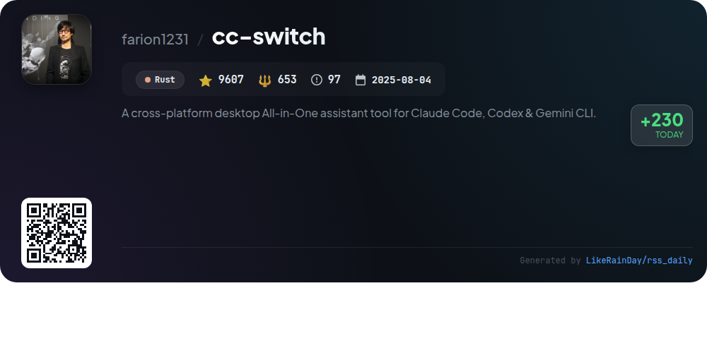
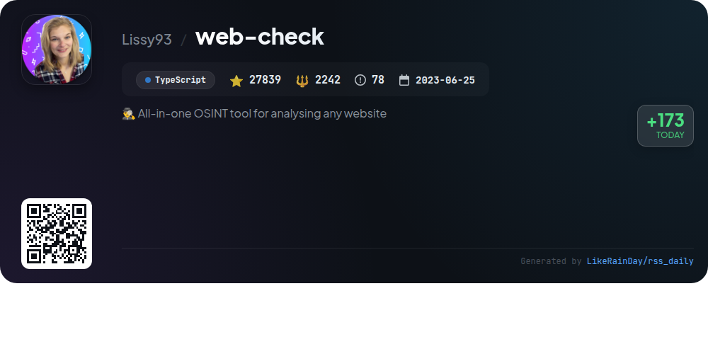
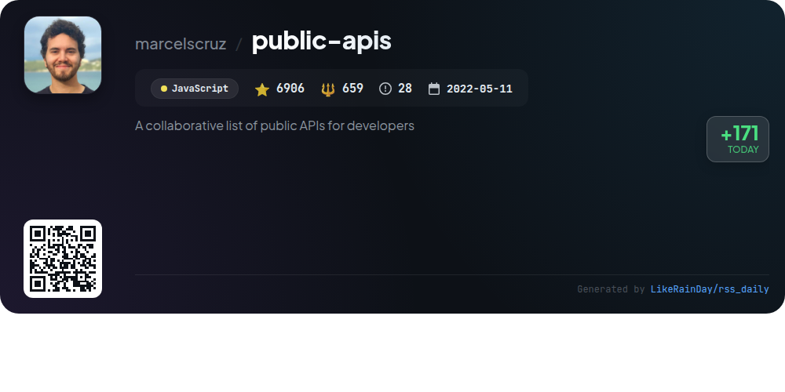
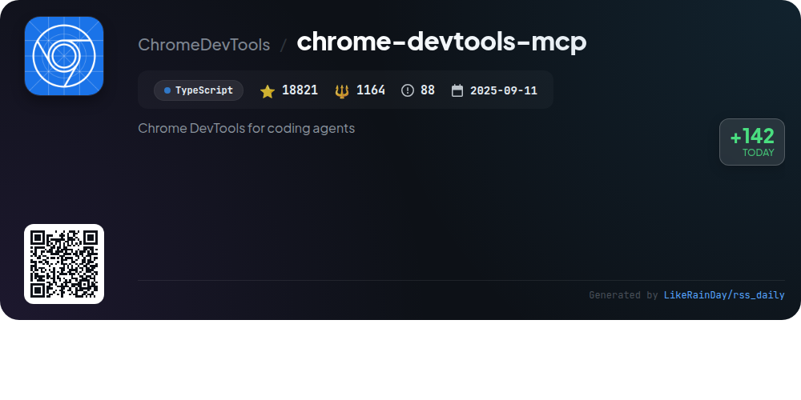
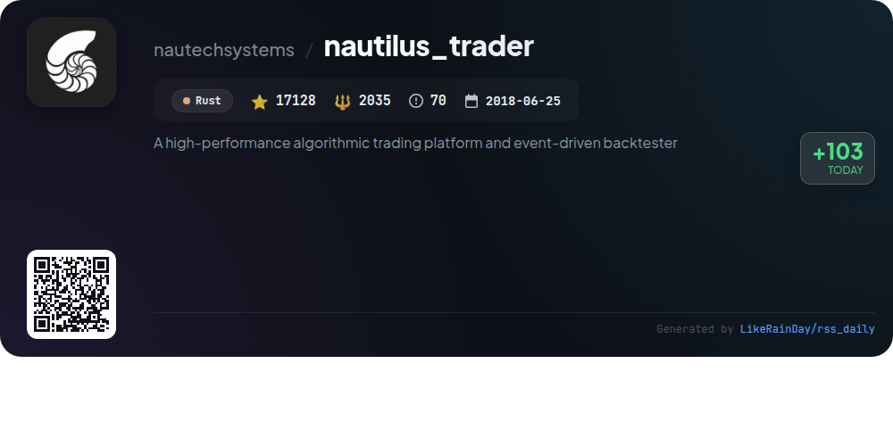
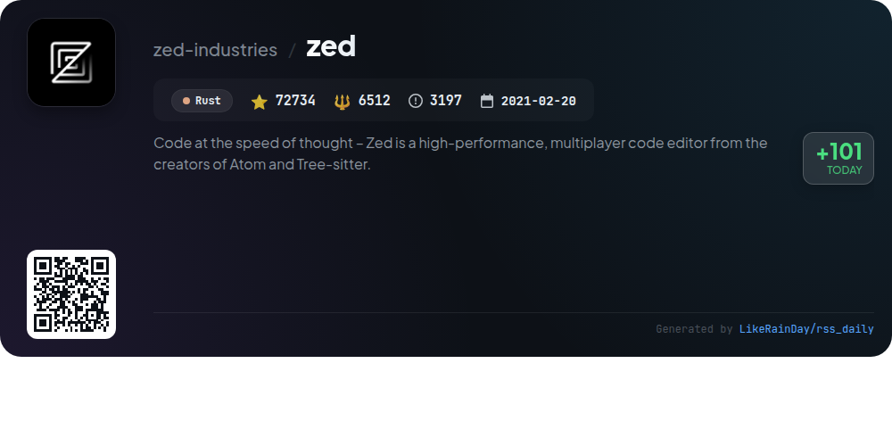
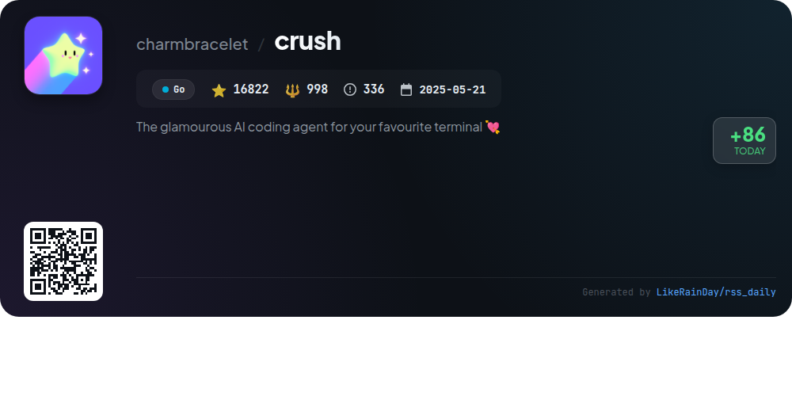

# 📊 🌟 GitHub Trending Daily - 2026-01-07

> > 📅 Daily Picks of GitHub Trending Repositories | Powered by Smart Algorithms

## 📋 Overview

**10** Projects | **234022** ⭐ | **19441** 🍴

**Top Languages:** `TypeScript` (4) · `Rust` (3) · `JavaScript` (2)

**Updated:** 2026-01-07 02:09 UTC

**Categories:**

- 🌟 Daily Top 10 (10 items)

---

## 🌟 Daily Top 10

### 1. [opencode](https://github.com/anomalyco/opencode)

> 🤖 **Why Recommend**  
> *OpenCode is an open-source AI coding agent designed for developers, built with TypeScript. It features two built-in agents: a full-access "build" agent for development and a read-only "plan" agent for code exploration, ensuring safe analysis. The project offers a desktop application for multiple platforms and supports various installation methods. OpenCode is provider-agnostic, allowing compatibility with various AI models and emphasizes terminal user interface (TUI) usability. Join the community on Discord for support and collaboration.*

- ⭐ 51705 stars
- 💻 TypeScript
- 📅 Updated: 2026-01-07

### 2. [claude-mem](https://github.com/thedotmack/claude-mem)

> 🤖 **Why Recommend**  
> *Claude-Mem is a TypeScript plugin for Claude Code that captures and compresses coding session data, enhancing continuity by preserving context across sessions. Key features include persistent memory, skill-based search, a web viewer UI, and automatic operation without manual input. Users benefit from privacy controls, detailed context configuration, and the ability to reference past observations. With over 11,000 stars, Claude-Mem streamlines project management by enabling intelligent memory retrieval, making coding sessions more efficient and coherent.*

- ⭐ 11228 stars
- 💻 TypeScript
- 📅 Updated: 2026-01-07

### 3. [YTPro](https://github.com/prateek-chaubey/YTPro)

> 🤖 **Why Recommend**  
> *YTPro is a versatile YouTube client designed for older Android versions, featuring a background audio player, Google Gemini integration for video summarization, and a host of user-friendly tools. Key features include video and caption downloading, ad blocking, gesture controls, and a customizable interface. The app supports Picture-in-Picture mode, displays dislike counts, and allows users to save videos without an account. With an APK size under 50KB and minimal dependencies, YTPro offers a lightweight yet powerful alternative for YouTube enthusiasts.*

- ⭐ 1232 stars
- 💻 JavaScript
- 📅 Updated: 2026-01-07

### 4. [cc-switch](https://github.com/farion1231/cc-switch)

> 🤖 **Why Recommend**  
> *cc-switch is a cross-platform desktop assistant tool designed for Claude Code, Codex, and Gemini CLI, built with Rust and Tauri. With over 9,600 stars, it offers features such as a dual-layer SQLite + JSON architecture for data management, a redesigned user interface, and support for multiple languages. Key capabilities include provider management, skills and prompts systems, and seamless MCP server integration. The tool also supports one-click switching between APIs, auto-launch on startup, and cloud sync functionality, enhancing the AI coding experience for developers.*

- ⭐ 9607 stars
- 💻 Rust
- 📅 Updated: 2026-01-07

### 5. [web-check](https://github.com/Lissy93/web-check)

> 🤖 **Why Recommend**  
> *Web-Check is a powerful OSINT tool for comprehensive website analysis, boasting over 27,000 stars on GitHub. Built in TypeScript, it provides insights into a site's IP info, SSL chain, DNS records, cookies, server architecture, and technologies used. Key features include security assessments (like open port checks and malware detection), performance metrics via Lighthouse, and environmental impact analysis. Additionally, it supports various deployment options, including Docker and cloud services. This tool aims to enhance website optimization and security for users.*

- ⭐ 27839 stars
- 💻 TypeScript
- 📅 Updated: 2026-01-07

### 6. [public-apis](https://github.com/marcelscruz/public-apis)

> 🤖 **Why Recommend**  
> *The public-apis project is a collaborative repository of over 1,000 free public APIs, organized into categories such as Animals, Finance, Health, and many more. With over 6,900 stars on GitHub, it serves as a valuable resource for developers seeking APIs for diverse functionalities, including data validation, weather updates, machine learning, and social media integration. Each API entry includes details like authentication requirements, HTTPS support, and CORS policy, making it easy to find suitable APIs for various projects.*

- ⭐ 6906 stars
- 💻 JavaScript
- 📅 Updated: 2026-01-07

### 7. [chrome-devtools-mcp](https://github.com/ChromeDevTools/chrome-devtools-mcp)

> 🤖 **Why Recommend**  
> *The `chrome-devtools-mcp` project enables AI coding agents like Gemini and Copilot to control and inspect live Chrome browsers. Key features include in-depth performance analysis, advanced debugging (network requests, screenshots, console checks), and reliable automation via Puppeteer. It acts as a Model-Context-Protocol server, providing access to Chrome DevTools for robust automation and debugging tasks. The setup requires Node.js and Chrome, with various configuration options available for different environments. The project has garnered 18,821 stars on GitHub, reflecting its popularity and utility.*

- ⭐ 18821 stars
- 💻 TypeScript
- 📅 Updated: 2026-01-07

### 8. [nautilus_trader](https://github.com/nautechsystems/nautilus_trader)

> 🤖 **Why Recommend**  
> *NautilusTrader is a high-performance, open-source algorithmic trading platform designed for quantitative traders. Built in Rust and Python, it enables efficient backtesting and live trading of automated strategies without code changes. Core features include a robust event-driven architecture, support for multiple asset classes, modular integration with various trading venues, and advanced order types. The platform emphasizes safety and correctness, making it suitable for mission-critical trading applications. With capabilities for AI training and high-frequency trading, NautilusTrader is an ideal solution for modern trading needs.*

- ⭐ 17128 stars
- 💻 Rust
- 📅 Updated: 2026-01-07

### 9. [zed](https://github.com/zed-industries/zed)

> 🤖 **Why Recommend**  
> *Zed is a high-performance, multiplayer code editor developed by the creators of Atom and Tree-sitter. It features real-time collaboration, making it ideal for teams coding together seamlessly. Zed is available for macOS, Linux, and Windows, with easy installation options via direct download or package managers. The project is open for contributions, and the team is actively hiring. With a focus on speed and efficiency, Zed is designed to enhance coding productivity. For more details, visit [zed.dev](https://zed.dev).*

- ⭐ 72734 stars
- 💻 Rust
- 📅 Updated: 2026-01-07

### 10. [crush](https://github.com/charmbracelet/crush)

> 🤖 **Why Recommend**  
> *Crush is a powerful AI coding assistant designed for various terminals, enabling seamless integration with multiple large language models (LLMs) via OpenAI or Anthropic APIs. Key features include session persistence, LSP support for enhanced context, and extensibility through Model Context Protocols (MCPs). Crush is compatible with macOS, Linux, Windows, and BSD systems, offering easy installation through various package managers. With support for custom providers and automatic updates from the community-driven Catwalk repository, Crush enhances coding workflows and productivity.*

- ⭐ 16822 stars
- 💻 Go
- 📅 Updated: 2026-01-07

---

## 📡 RSS Subscription

Subscribe via RSS to get daily trending updates:

- 🔔 [RSS XML] (../../daily-top.xml)
- 🔔 [Daily Report] (../../GITHUB_TODAY.md)
- 🔔 [Daily Top 10](../../daily-top.xml)

---

*⚡ Powered by Smart Trending Algorithm | Generated at 2026-01-07 02:09:36 UTC
