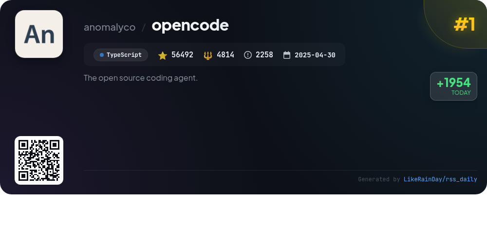
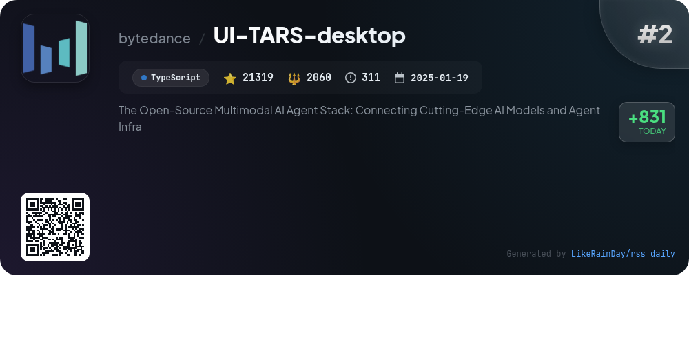
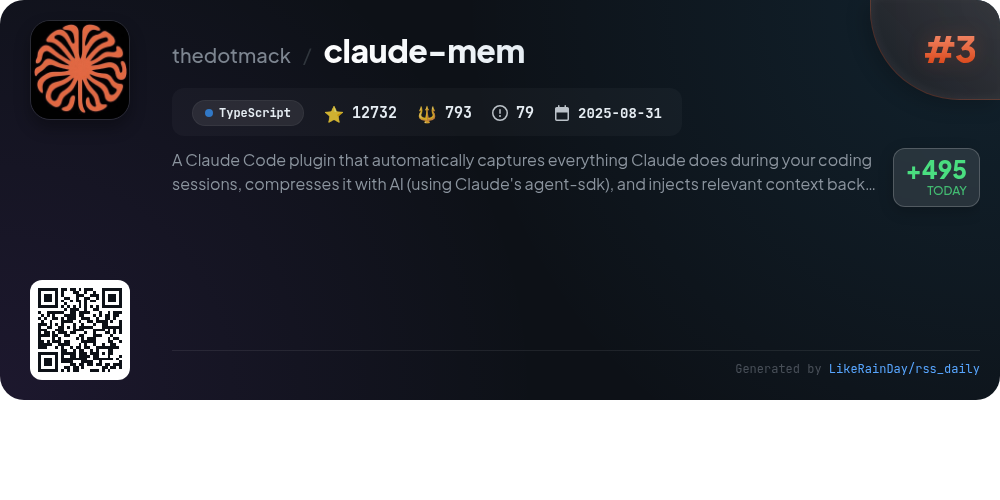
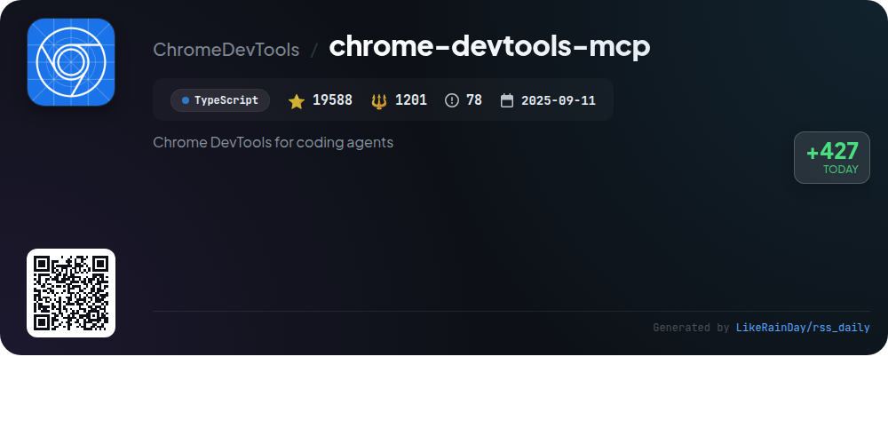
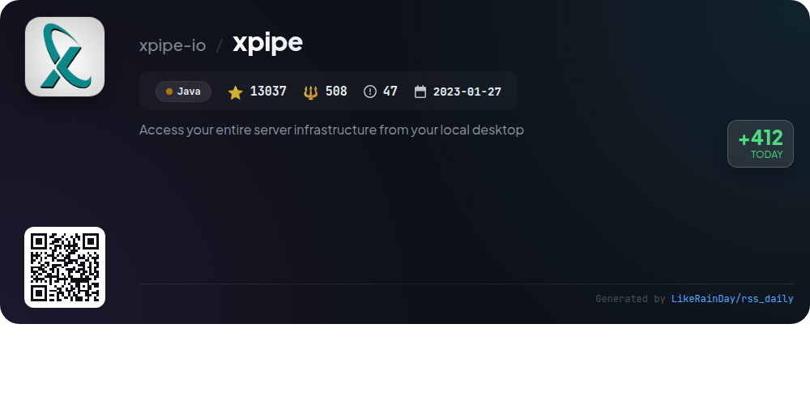
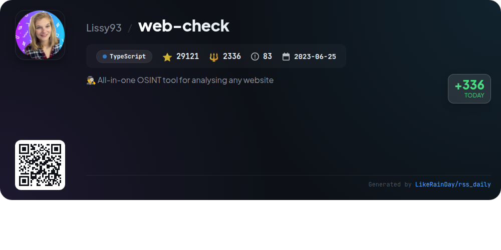
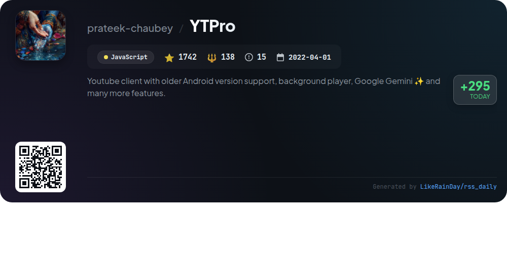
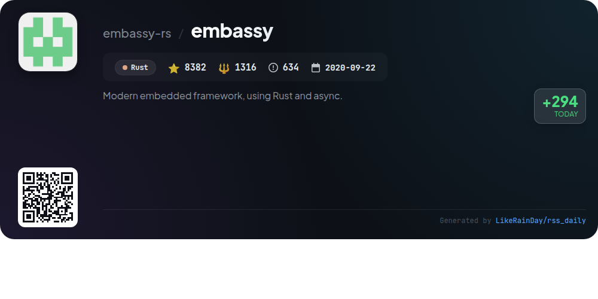
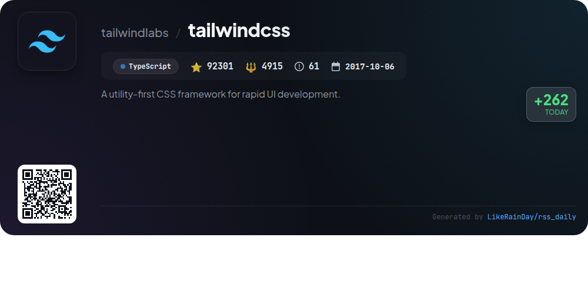
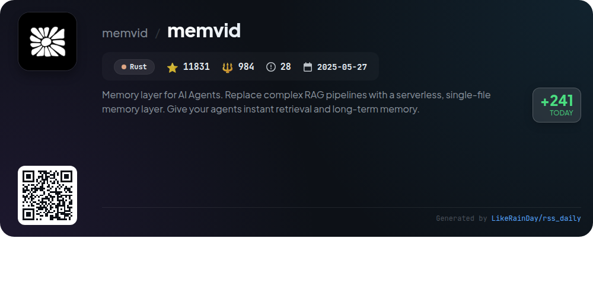

# 📊 🌟 GitHub Trending Daily - 2026-01-09

> > 📅 Daily Picks of GitHub Trending Repositories | Powered by Smart Algorithms

## 📋 Overview

**10** Projects | **266545** ⭐ | **19065** 🍴

**Top Languages:** `TypeScript` (6) · `Rust` (2) · `JavaScript` (1)

**Updated:** 2026-01-09 12:30 UTC

**Categories:**

- 🌟 Daily Top 10 (10 items)

---

## 🌟 Daily Top 10

### 1. [opencode](https://github.com/anomalyco/opencode)

> 🤖 **Why Recommend**  
> *OpenCode is an open-source AI coding agent built in TypeScript, boasting over 56,000 stars on GitHub. It features two main agents: "build" for full development access and "plan" for read-only analysis, ideal for exploring unfamiliar codebases. The project offers a desktop application for macOS, Windows, and Linux, alongside a client/server architecture that supports various AI models. With a focus on terminal user interface (TUI), OpenCode provides seamless integration with coding environments, making it a versatile tool for developers. Join the community on Discord for support and collaboration.*

- ⭐ 56492 stars
- 💻 TypeScript
- 📅 Updated: 2026-01-09

### 2. [UI-TARS-desktop](https://github.com/bytedance/UI-TARS-desktop)

> 🤖 **Why Recommend**  
> *UI-TARS-desktop is an open-source multimodal AI agent stack designed to enhance user interaction with computers and browsers. It features a native GUI agent leveraging advanced Vision-Language Models for natural language control, visual recognition, and precise input handling. Key highlights include seamless local and remote operation capabilities, real-time feedback, cross-platform support, and robust integration with real-world tools through MCP. Its user-friendly interfaces and powerful automation make it an ideal solution for efficient task management.*

- ⭐ 21319 stars
- 💻 TypeScript
- 📅 Updated: 2026-01-09

### 3. [claude-mem](https://github.com/thedotmack/claude-mem)

> 🤖 **Why Recommend**  
> *Claude-Mem is a powerful TypeScript plugin for Claude Code that enhances coding sessions by automatically capturing and compressing context from previous sessions. Key features include persistent memory to preserve context, a skill-based search tool for querying project history, and a web UI for real-time memory access. It supports privacy controls, automatic operation, and citations for past observations. With a beta channel for experimental features, Claude-Mem optimizes AI interactions, making coding more efficient and context-aware.*

- ⭐ 12732 stars
- 💻 TypeScript
- 📅 Updated: 2026-01-09

### 4. [chrome-devtools-mcp](https://github.com/ChromeDevTools/chrome-devtools-mcp)

> 🤖 **Why Recommend**  
> *chrome-devtools-mcp is a TypeScript library enabling coding agents like Gemini and Copilot to control and inspect live Chrome browsers via a Model-Context-Protocol (MCP) server. Key features include advanced browser debugging, performance insights, and reliable automation using Puppeteer. The library allows for detailed analysis of network requests, console messages, and performance traces. With support for multiple MCP clients, it seamlessly integrates into various development environments for enhancing coding efficiency.*

- ⭐ 19588 stars
- 💻 TypeScript
- 📅 Updated: 2026-01-09

### 5. [xpipe](https://github.com/xpipe-io/xpipe)

> 🤖 **Why Recommend**  
> *XPipe is a powerful connection hub enabling seamless access to your entire server infrastructure from your local desktop. With support for SSH, Docker, Kubernetes, RDP, and various cloud services, it integrates effortlessly with your favorite tools, allowing for efficient management of remote connections. Key features include a centralized connection management interface, a versatile file browser, and a customizable terminal launcher. XPipe also offers an extensible scripting system and secure vault for managing credentials. Designed for professionals, it prioritizes user privacy with no external data storage.*

- ⭐ 13037 stars
- 💻 Java
- 📅 Updated: 2026-01-09

### 6. [web-check](https://github.com/Lissy93/web-check)

> 🤖 **Why Recommend**  
> *Web-Check is an all-in-one OSINT tool for analyzing websites, boasting over 29,000 stars on GitHub. Built with TypeScript, it provides detailed insights into web infrastructure, including IP info, SSL certificates, DNS records, and server configurations. Key features encompass site performance metrics, associated hostnames, security checks, and technologies used. Users can explore a live demo at web-check.xyz and deploy via Netlify, Vercel, Docker, or from source. Web-Check aims to optimize website security and performance while enhancing understanding of web technologies.*

- ⭐ 29121 stars
- 💻 TypeScript
- 📅 Updated: 2026-01-09

### 7. [YTPro](https://github.com/prateek-chaubey/YTPro)

> 🤖 **Why Recommend**  
> *YTPro is a feature-rich YouTube client designed for older Android versions, boasting a range of functionalities including a background audio player, Google Gemini integration for video summarization, and ad-blocking capabilities. Users can download videos, shorts, and captions, while enjoying minimal internal dependencies and an APK size under 50KB. Key features include gesture controls, a custom heart feature for saving videos, and the ability to skip sponsors. YTPro offers a customizable and adaptive UI, ensuring a seamless user experience.*

- ⭐ 1742 stars
- 💻 JavaScript
- 📅 Updated: 2026-01-09

### 8. [embassy](https://github.com/embassy-rs/embassy)

> 🤖 **Why Recommend**  
> *Embassy is a modern embedded framework designed for efficient embedded application development using Rust and async programming. It ensures safety and performance without the need for a traditional RTOS. Key features include hardware abstraction layers (HALs) for various microcontrollers, a real-time cooperative multitasking model, low-power operation, and comprehensive networking support via embassy-net. Additional functionalities include Bluetooth, USB, and LoRa integration, along with a robust bootloader for firmware upgrades. With extensive documentation and examples, Embassy accelerates embedded coding while enhancing reliability.*

- ⭐ 8382 stars
- 💻 Rust
- 📅 Updated: 2026-01-09

### 9. [tailwindcss](https://github.com/tailwindlabs/tailwindcss)

> 🤖 **Why Recommend**  
> *Tailwind CSS is a utility-first CSS framework designed for rapid UI development, enabling developers to create custom user interfaces efficiently. With over 92,000 stars on GitHub, it supports a modular approach, allowing developers to apply styles directly in HTML using utility classes. Tailwind CSS emphasizes flexibility and responsiveness, making it ideal for modern web applications. The project includes comprehensive documentation, a vibrant community for support, and guidelines for contributors. Explore more at [tailwindcss.com](https://tailwindcss.com).*

- ⭐ 92301 stars
- 💻 TypeScript
- 📅 Updated: 2026-01-09

### 10. [memvid](https://github.com/memvid/memvid)

> 🤖 **Why Recommend**  
> *Memvid is a Rust-based, serverless memory layer for AI agents, simplifying complex RAG pipelines into a single-file solution. It enables instant retrieval and long-term memory, storing data as efficient Smart Frames for quick access and crash safety. Key features include a Living Memory Engine, time-travel debugging, and smart recall capabilities. Memvid supports multiple use cases, from enterprise knowledge bases to personal assistants, and offers SDKs for various programming languages. With over 11,800 stars on GitHub, it's a robust tool for developers seeking portable, model-agnostic memory solutions.*

- ⭐ 11831 stars
- 💻 Rust
- 📅 Updated: 2026-01-09

---

## 📡 RSS Subscription

Subscribe via RSS to get daily trending updates:

- 🔔 [RSS XML] (../../daily-top.xml)
- 🔔 [Daily Report] (../../GITHUB_TODAY.md)
- 🔔 [Daily Top 10](../../daily-top.xml)

---

*⚡ Powered by Smart Trending Algorithm | Generated at 2026-01-09 12:30:07 UTC
