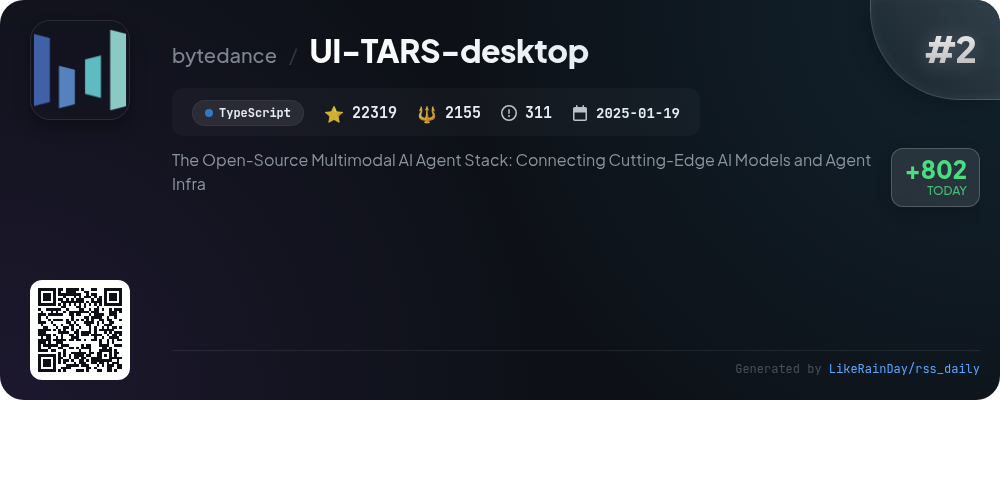
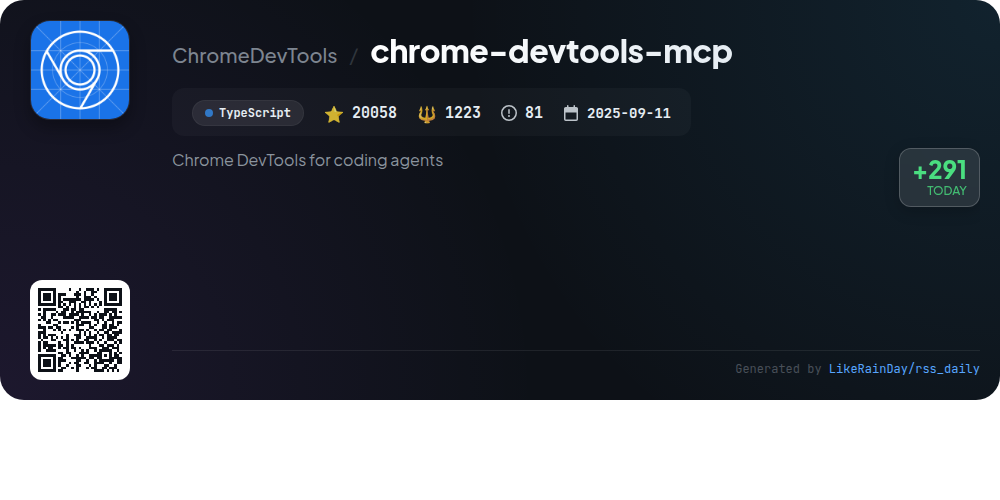
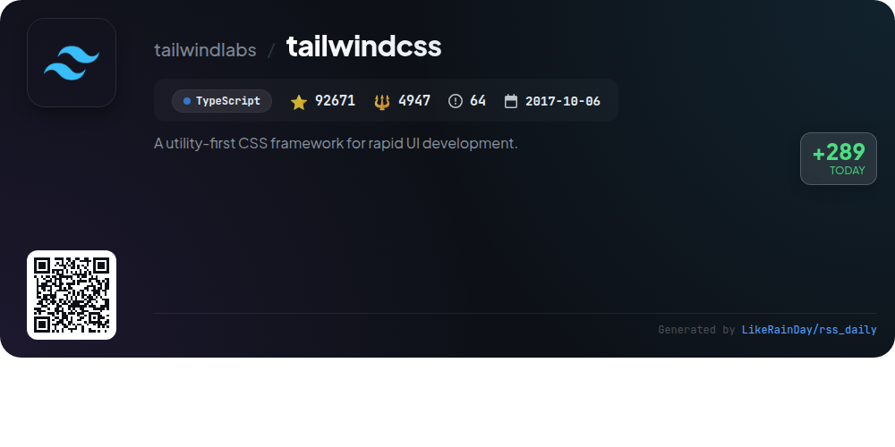
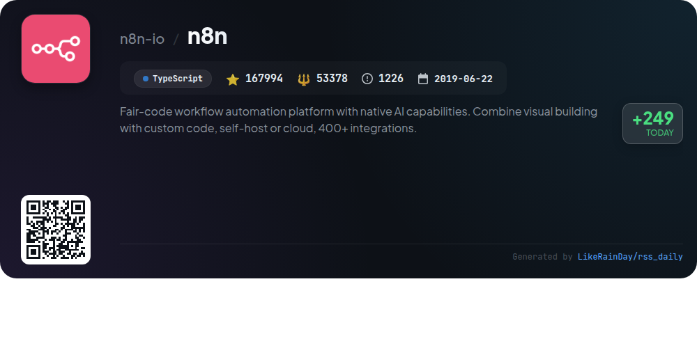
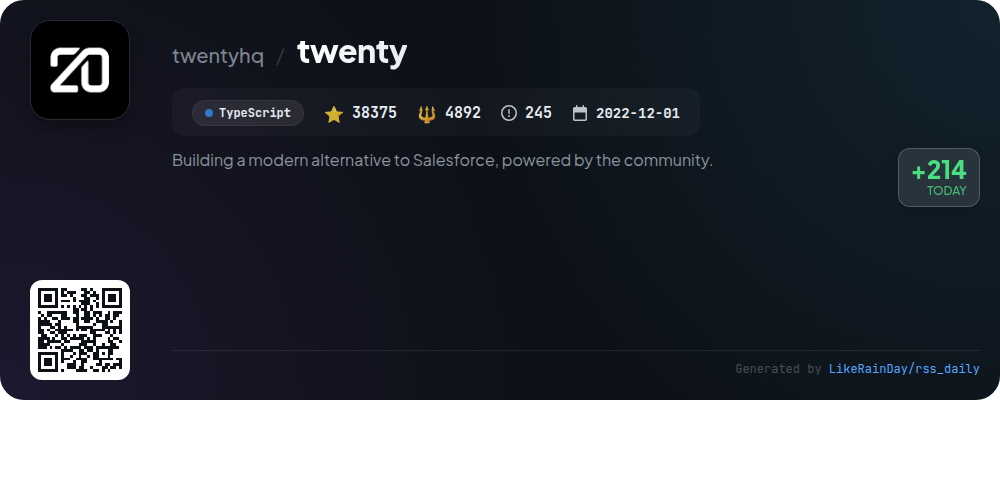
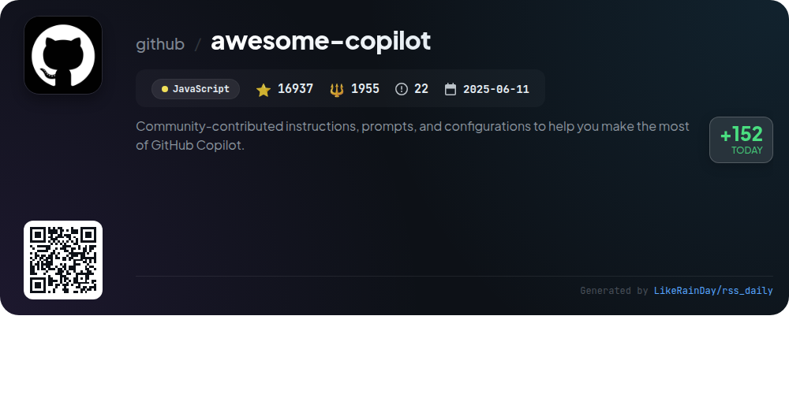
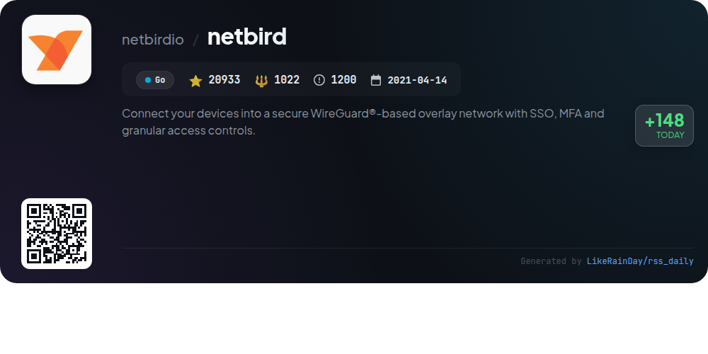

# 📊 🌟 GitHub Trending Daily - 2026-01-11

> > 📅 每日精选 GitHub 热门仓库 | 基于智能算法推荐

## 📋 Overview

**10** 个项目 | **470725** ⭐ | **76486** 🍴

**热门语言:** `TypeScript` (7) · `Go` (2) · `JavaScript` (1)

**更新时间:** 2026-01-11 01:14 UTC

**分类分布:**

- 🌟 每日 Top 10 精选 (10 项)

---

## 🌟 每日 Top 10 精选

### 1. [opencode](https://github.com/anomalyco/opencode)

> 🤖 **推荐理由**  
> *OpenCode is an open-source AI coding agent designed for seamless development and code exploration. It features a dual-agent system, allowing users to switch between a full-access development agent and a read-only planning agent for safe code analysis. Installation is straightforward across platforms, including a desktop app in beta. OpenCode offers built-in support for various models and emphasizes a terminal user interface, catering to neovim users. With a community-driven approach and comprehensive documentation, OpenCode is ideal for developers seeking flexibility and control in their coding workflows.*

- ⭐ 59754 stars
- 💻 TypeScript
- 📅 Updated: 2026-01-11

### 2. [UI-TARS-desktop](https://github.com/bytedance/UI-TARS-desktop)

> 🤖 **推荐理由**  
> *UI-TARS-desktop is an open-source multimodal AI agent stack that integrates advanced AI models and agent infrastructure, receiving over 22,000 stars on GitHub. Key features include natural language control powered by Vision-Language Models, precise mouse and keyboard control, and support for real-time feedback across platforms (Windows, MacOS, Browser). The application enables local and remote operations for tasks like GUI automation and browser interactions, while ensuring privacy with fully local processing. It aims to facilitate human-like task completion through seamless integration with real-world tools.*

- ⭐ 22319 stars
- 💻 TypeScript
- 📅 Updated: 2026-01-11

### 3. [ConvertX](https://github.com/C4illin/ConvertX)

> 🤖 **推荐理由**  
> *ConvertX is a self-hosted file converter supporting over 1000 formats, built with TypeScript, Bun, and Elysia. Key features include batch processing, password protection, and multiple user accounts. It supports a wide range of converters such as Inkscape, FFmpeg, and LibreOffice, allowing conversions for images, documents, and videos. The project is easily deployable via Docker and offers customizable settings for user management and file handling. With over 14,000 stars on GitHub, ConvertX is a robust solution for file conversion needs.*

- ⭐ 14251 stars
- 💻 TypeScript
- 📅 Updated: 2026-01-11

### 4. [chrome-devtools-mcp](https://github.com/ChromeDevTools/chrome-devtools-mcp)

> 🤖 **推荐理由**  
> *chrome-devtools-mcp is a powerful TypeScript library that enables coding agents like Gemini and Copilot to control and inspect a live Chrome browser. With over 20,000 stars on GitHub, it serves as a Model-Context-Protocol (MCP) server, facilitating reliable automation, advanced debugging, and performance analysis via Chrome DevTools. Key features include performance insights recording, network request analysis, and screenshot capabilities. It seamlessly integrates with various MCP clients, supporting customizable configurations for optimized browser interactions.*

- ⭐ 20058 stars
- 💻 TypeScript
- 📅 Updated: 2026-01-11

### 5. [tailwindcss](https://github.com/tailwindlabs/tailwindcss)

> 🤖 **推荐理由**  
> *Tailwind CSS is a utility-first CSS framework designed for rapid UI development, enabling developers to create custom user interfaces efficiently. With over 92,000 stars on GitHub, it emphasizes a flexible and responsive design approach, allowing for easy customization through utility classes. The framework is built in TypeScript and supports extensive documentation available at tailwindcss.com. Community engagement is encouraged through discussions and contributions, fostering a collaborative environment for best practices and feature enhancements.*

- ⭐ 92671 stars
- 💻 TypeScript
- 📅 Updated: 2026-01-11

### 6. [n8n](https://github.com/n8n-io/n8n)

> 🤖 **推荐理由**  
> *n8n is a fair-code workflow automation platform designed for technical teams, combining the flexibility of code with no-code speed. With over 400 integrations and native AI capabilities, users can create powerful automations while retaining full data control. Key features include a visual interface, support for JavaScript/Python, self-hosting options, and enterprise-ready solutions with advanced permissions. The platform also boasts an active community offering over 900 templates and extensive documentation. n8n is self-hostable and extensible, making it ideal for diverse automation needs.*

- ⭐ 167994 stars
- 💻 TypeScript
- 📅 Updated: 2026-01-11

### 7. [twenty](https://github.com/twentyhq/twenty)

> 🤖 **推荐理由**  
> *Twenty is a modern open-source CRM, designed as a community-driven alternative to Salesforce, with over 38,000 stars on GitHub. Key features include customizable layouts with filters, roles and permissions management, and workflow automation. It supports integration of emails, calendar events, and files. Built with TypeScript and React, it emphasizes user-friendly design inspired by tools like Notion and Airtable. The project encourages community contributions and offers extensive documentation, a roadmap, and active support via Discord and other platforms.*

- ⭐ 38375 stars
- 💻 TypeScript
- 📅 Updated: 2026-01-11

### 8. [crush](https://github.com/charmbracelet/crush)

> 🤖 **推荐理由**  
> *Crush is a sophisticated AI coding assistant designed for integration with various terminal environments. Key features include multi-model support for LLMs, session-based context preservation, and LSP-enhanced functionalities, enabling seamless workflow management. The tool is extensible through Model Context Protocols (MCPs) and offers compatibility across macOS, Linux, Windows, and BSD systems. Installation is straightforward via multiple package managers. Crush empowers developers by streamlining coding tasks while maintaining flexibility and adaptability in diverse coding environments.*

- ⭐ 17433 stars
- 💻 Go
- 📅 Updated: 2026-01-11

### 9. [awesome-copilot](https://github.com/github/awesome-copilot)

> 🤖 **推荐理由**  
> *Awesome Copilot is a community-driven repository offering a collection of custom agents, prompts, and instructions to enhance your GitHub Copilot experience. With 16,937 stars, it includes specialized agents for various workflows, task-specific prompts for code generation, and best practice instructions tailored to file patterns. Key features include curated collections for efficient coding, an MCP server for easy installation of customizations, and support for continuous learning through community contributions. Ideal for developers seeking to optimize their coding productivity and adherence to best practices.*

- ⭐ 16937 stars
- 💻 JavaScript
- 📅 Updated: 2026-01-11

### 10. [netbird](https://github.com/netbirdio/netbird)

> 🤖 **推荐理由**  
> *NetBird is an open-source project that creates secure, WireGuard®-based overlay networks for seamless device connectivity with features like Single Sign-On (SSO), Multi-Factor Authentication (MFA), and granular access controls. It simplifies network management through an Admin Web UI and supports auto peer discovery, public APIs, and private DNS. Key highlights include peer-to-peer connections, NAT traversal, and robust security measures like quantum-resistant encryption. NetBird is available for multiple platforms, including Linux, Windows, and Docker, and offers both cloud and self-hosted deployment options.*

- ⭐ 20933 stars
- 💻 Go
- 📅 Updated: 2026-01-11

---

## 📡 RSS订阅

通过 RSS 订阅，第一时间获取每日精选项目：

- 🔔 [RSS 订阅源] (../../daily-top.xml)
- 🔔 [每日简报] (../../GITHUB_TODAY_CN.md)
- 🔔 [每日 Top 10 精选](../../daily-top.xml)

---

*⚡ Powered by Smart Trending Algorithm | Generated at 2026-01-11 01:14:01 UTC
