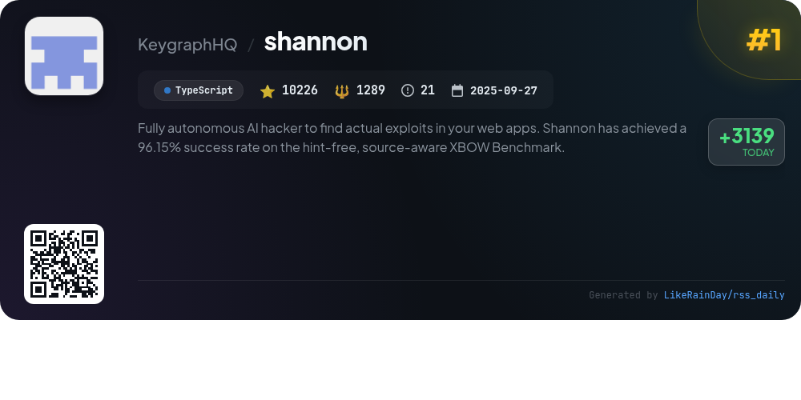
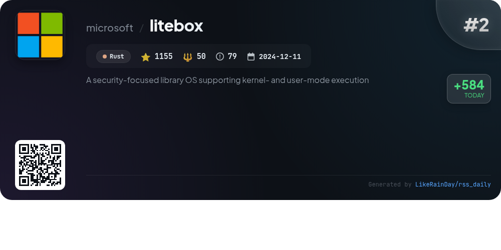
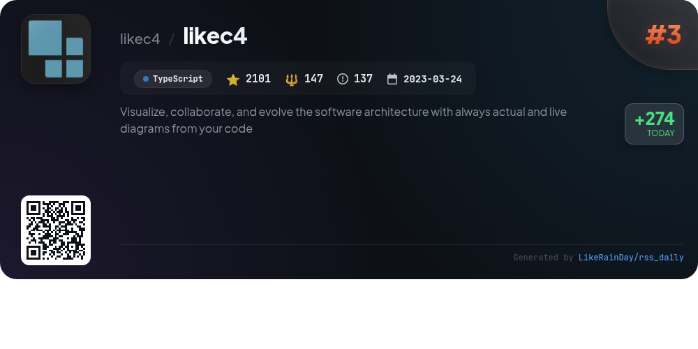
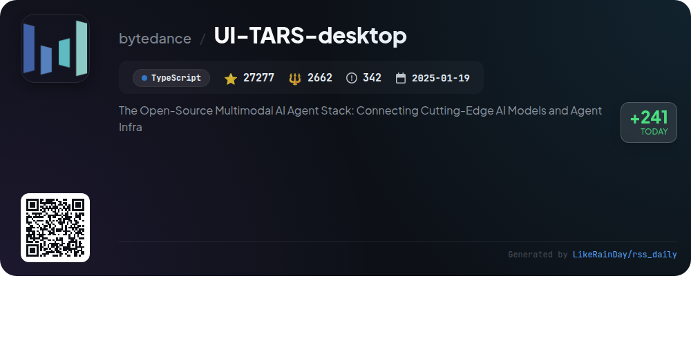
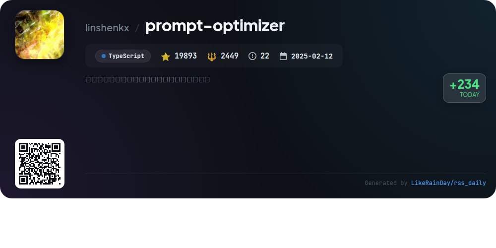
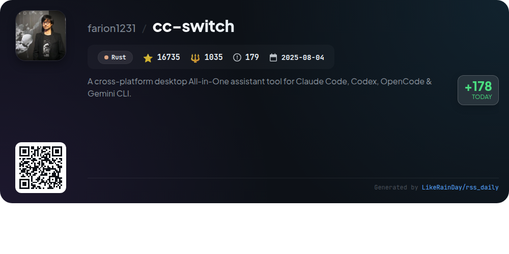
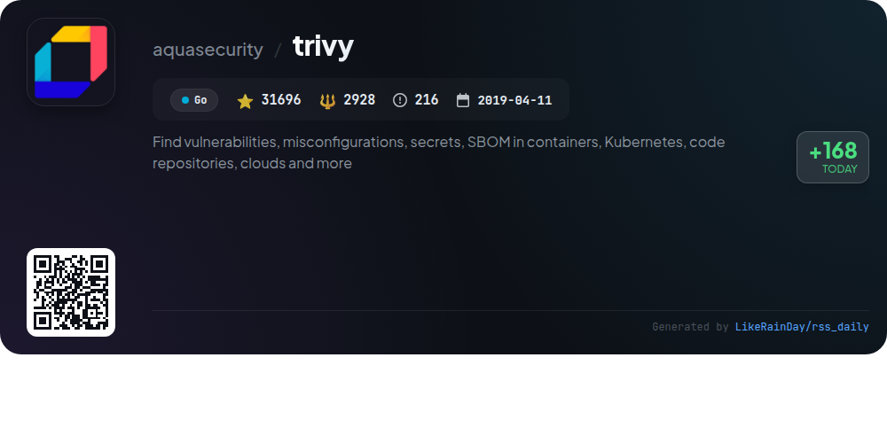
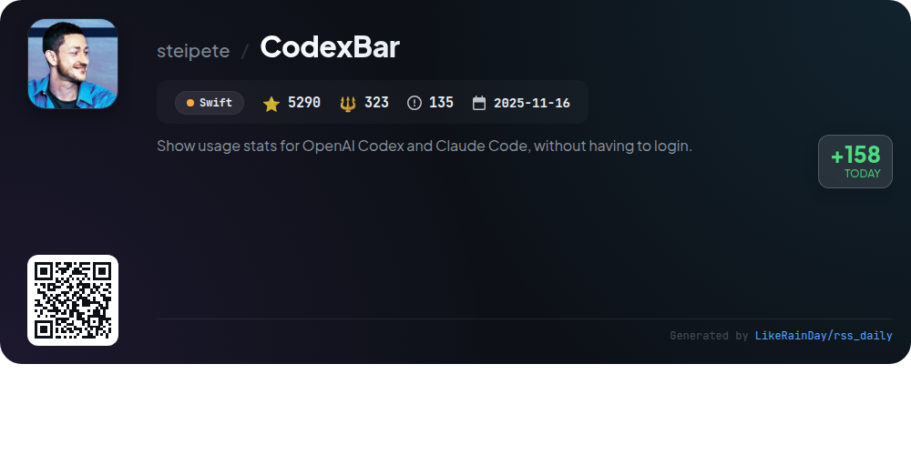
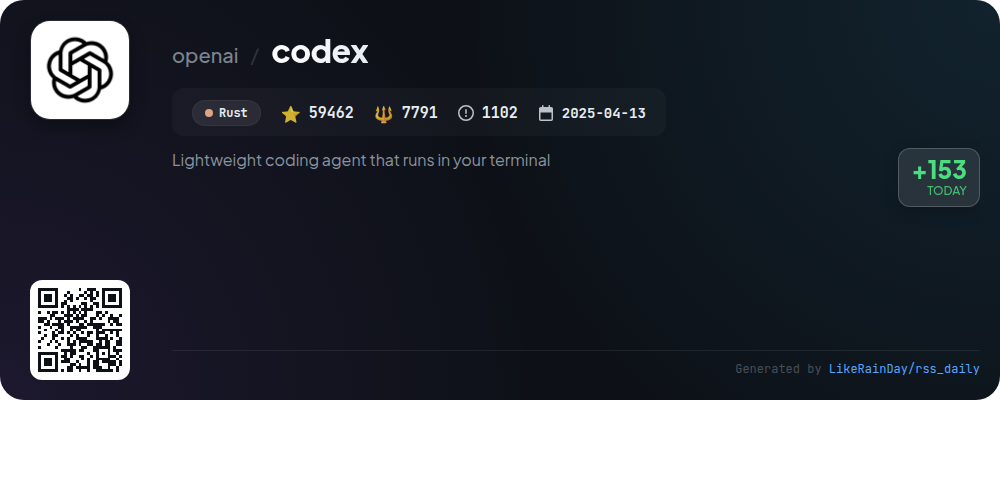
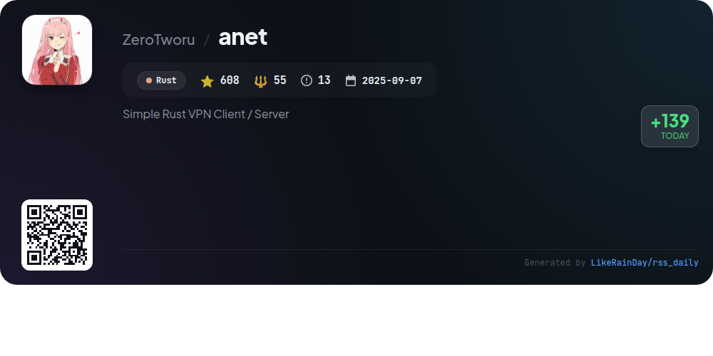

# 📊 🌟 GitHub Trending Daily - 2026-02-08

> > 📅 Daily Picks of GitHub Trending Repositories | Powered by Smart Algorithms

## 📋 Overview

**10** Projects | **174443** ⭐ | **18729** 🍴

**Top Languages:** `TypeScript` (4) · `Rust` (4) · `Swift` (1)

**Updated:** 2026-02-08 03:19 UTC

**Categories:**

- 🌟 Daily Top 10 (10 items)

---

## 🌟 Daily Top 10

### 1. [shannon](https://github.com/KeygraphHQ/shannon)

> 🤖 **Why Recommend**  
> *Shannon is a fully autonomous AI pentester designed to identify and exploit vulnerabilities in web applications. Achieving a 96.15% success rate on the XBOW Benchmark, it autonomously performs penetration testing, executing real exploits to provide concrete proof of vulnerabilities. Key features include dynamic testing, pentester-grade reports, and critical OWASP vulnerability coverage. Shannon integrates with the Keygraph Security and Compliance Platform, streamlining compliance and security management. Available in Lite and Pro editions, it caters to both independent researchers and enterprises.*

- ⭐ 10226 stars
- 💻 TypeScript
- 📅 Updated: 2026-02-08

### 2. [litebox](https://github.com/microsoft/litebox)

> 🤖 **Why Recommend**  
> *LiteBox is a security-focused library OS written in Rust, designed for both kernel and user-mode execution. It minimizes the attack surface by significantly reducing the host interface, enhancing security. LiteBox features a flexible "North" interface inspired by `nix` and `rustix`, allowing seamless integration with various "South" platforms. Key use cases include running unmodified Linux programs on Windows, sandboxing Linux applications, and executing programs on SEV SNP and OP-TEE. The project is actively evolving, welcoming experimentation while aiming for a stable release.*

- ⭐ 1155 stars
- 💻 Rust
- 📅 Updated: 2026-02-08

### 3. [likec4](https://github.com/likec4/likec4)

> 🤖 **Why Recommend**  
> *LikeC4 is an open-source tool for visualizing and evolving software architecture through dynamic, code-generated diagrams. Inspired by the C4 Model and Structurizr DSL, it allows users to customize notations and element types, facilitating tailored architecture modeling. The project features a CLI for easy previewing, comprehensive documentation, and a supportive community via Discord and GitHub Discussions. With over 2,100 stars on GitHub, LikeC4 integrates seamlessly with VSCode, making it a versatile choice for developers seeking real-time architectural insights.*

- ⭐ 2101 stars
- 💻 TypeScript
- 📅 Updated: 2026-02-08

### 4. [UI-TARS-desktop](https://github.com/bytedance/UI-TARS-desktop)

> 🤖 **Why Recommend**  
> *UI-TARS-desktop is an open-source multimodal AI agent stack designed to enhance user interactions through advanced AI models. With over 27,000 stars on GitHub, it features a native GUI agent that supports natural language control, visual recognition, and precise mouse/keyboard commands across platforms (Windows, MacOS, Browser). Key highlights include local and remote operator capabilities, one-click CLI execution, and seamless integration with real-world tools. It empowers users to automate tasks efficiently, making it ideal for both developers and everyday users.*

- ⭐ 27277 stars
- 💻 TypeScript
- 📅 Updated: 2026-02-08

### 5. [prompt-optimizer](https://github.com/linshenkx/prompt-optimizer)

> 🤖 **Why Recommend**  
> *Prompt Optimizer is a powerful AI prompt optimization tool designed to enhance the quality of AI-generated content. It supports multiple platforms, including web, desktop, Chrome extension, and Docker deployment. Key features include smart prompt optimization, dual-mode enhancements for user and system prompts, real-time comparisons, multi-model integration (OpenAI, Gemini, etc.), and advanced testing capabilities. Users can generate images from text, manage variables, and utilize secure, client-side processing. The tool is open-source with a robust community and extensive documentation.*

- ⭐ 19893 stars
- 💻 TypeScript
- 📅 Updated: 2026-02-08

### 6. [cc-switch](https://github.com/farion1231/cc-switch)

> 🤖 **Why Recommend**  
> *cc-switch is a cross-platform desktop assistant tool designed for Claude Code, Codex, and Gemini CLI, built with Rust. With over 16,735 stars, it offers a user-friendly interface and powerful features such as seamless provider management, skills and prompts management, and integrated MCP server support. Key highlights include SQLite-based data persistence, multi-language support (English, Chinese, Japanese), and a customizable UI. Sponsored by multiple API relay services, it ensures efficient AI coding experiences, making it a comprehensive solution for developers.*

- ⭐ 16735 stars
- 💻 Rust
- 📅 Updated: 2026-02-08

### 7. [trivy](https://github.com/aquasecurity/trivy)

> 🤖 **Why Recommend**  
> *Trivy is a powerful open-source security scanner developed by Aqua Security that identifies vulnerabilities, misconfigurations, secrets, and Software Bill of Materials (SBOM) across various targets, including container images, Kubernetes, and code repositories. With over 31,000 stars on GitHub, it supports a wide range of programming languages and platforms. Key features include scanning for OS packages, known CVEs, IaC issues, and sensitive information. Trivy integrates seamlessly with popular tools like GitHub Actions and Kubernetes operators, making it essential for enhancing security in DevOps workflows.*

- ⭐ 31696 stars
- 💻 Go
- 📅 Updated: 2026-02-08

### 8. [CodexBar](https://github.com/steipete/CodexBar)

> 🤖 **Why Recommend**  
> *CodexBar is a lightweight macOS 14+ menu bar app that provides real-time usage statistics for various AI code assistants like OpenAI Codex and Claude, without requiring login. With over 5,290 stars, it features session and weekly usage meters, reset countdowns, and multi-provider toggles. Users can customize the display and access optional web dashboard enhancements. The app prioritizes privacy, using on-device data parsing and offering a command-line interface for Linux. CodexBar also supports a wide range of AI providers, making it a versatile tool for developers.*

- ⭐ 5290 stars
- 💻 Swift
- 📅 Updated: 2026-02-08

### 9. [codex](https://github.com/openai/codex)

> 🤖 **Why Recommend**  
> *Codex is a lightweight coding agent from OpenAI that operates directly in your terminal, designed for seamless integration with various code editors like VS Code. With over 59,462 stars, Codex supports installations via npm or Homebrew, enabling users to quickly set up and run coding tasks. It offers both local and cloud-based options, with the latter accessible through ChatGPT plans. Key features include API key support and extensive documentation for user guidance. Codex is built with Rust and is open-source under the Apache-2.0 License.*

- ⭐ 59462 stars
- 💻 Rust
- 📅 Updated: 2026-02-08

### 10. [anet](https://github.com/ZeroTworu/anet)

> 🤖 **Why Recommend**  
> *ANet is a simple Rust-based VPN client/server designed to create a private and secure communication space among trusted individuals. It employs the proprietary ASTP (ANet Secure Transport Protocol) focusing on privacy, resilience in unstable networks, and traffic obfuscation. Key features include end-to-end encryption (ChaCha20Poly1305/X25519), cross-platform support (Linux, Windows, Android), and components like a server, CLI and GUI clients, and an Android library. ANet is built with an emphasis on reliable connectivity and user privacy.*

- ⭐ 608 stars
- 💻 Rust
- 📅 Updated: 2026-02-08

---

## 📡 RSS Subscription

Subscribe via RSS to get daily trending updates:

- 🔔 [RSS XML] (../../daily-top.xml)
- 🔔 [Daily Report] (../../GITHUB_TODAY.md)
- 🔔 [Daily Top 10](../../daily-top.xml)

---

*⚡ Powered by Smart Trending Algorithm | Generated at 2026-02-08 03:19:45 UTC
