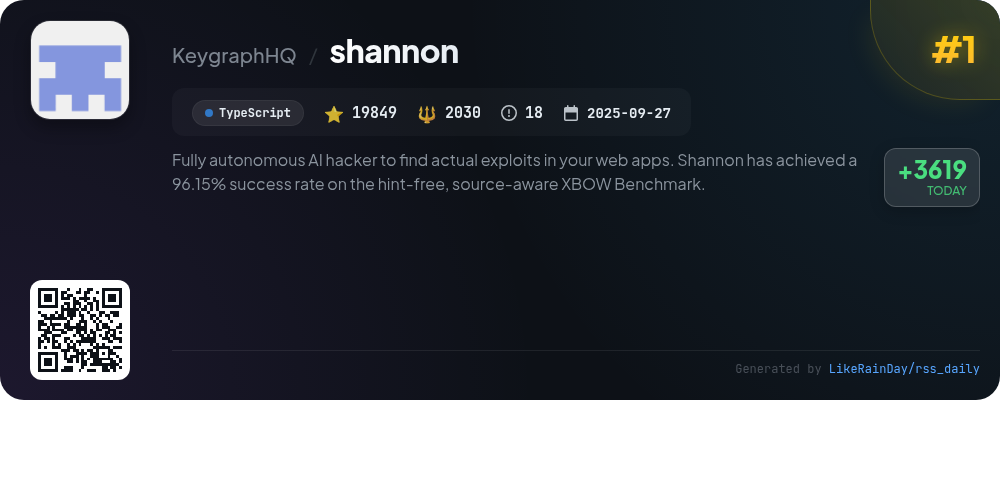
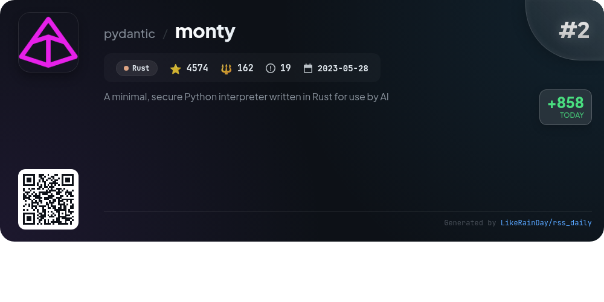
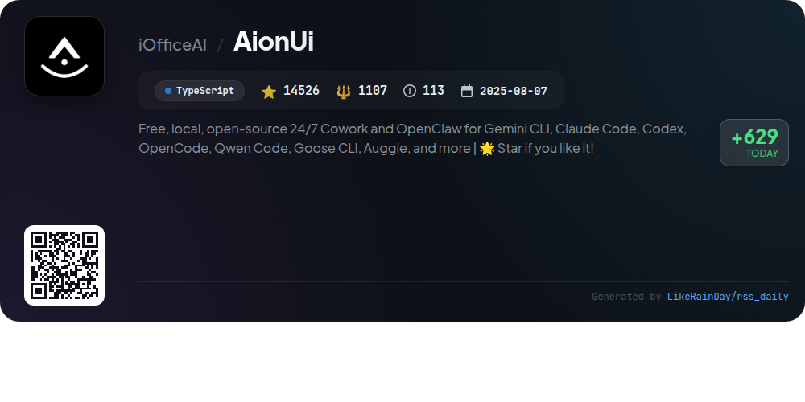
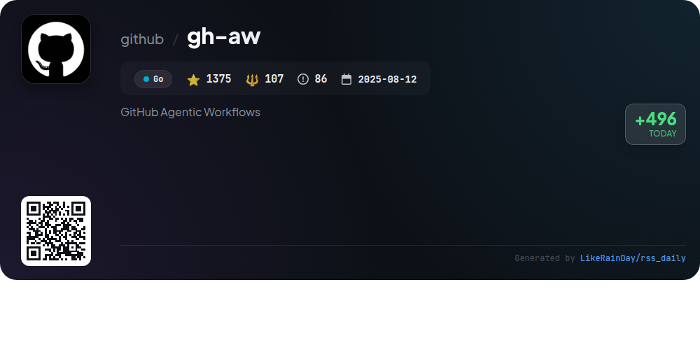
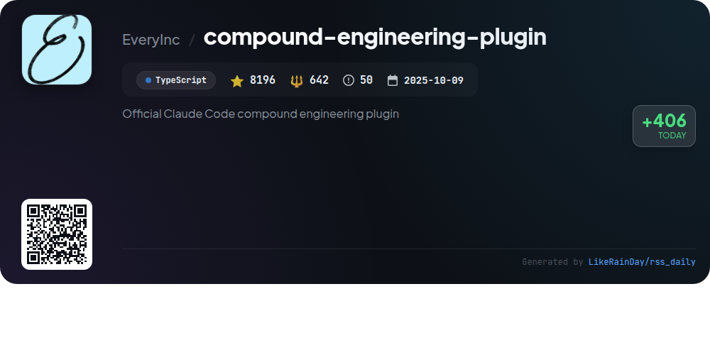
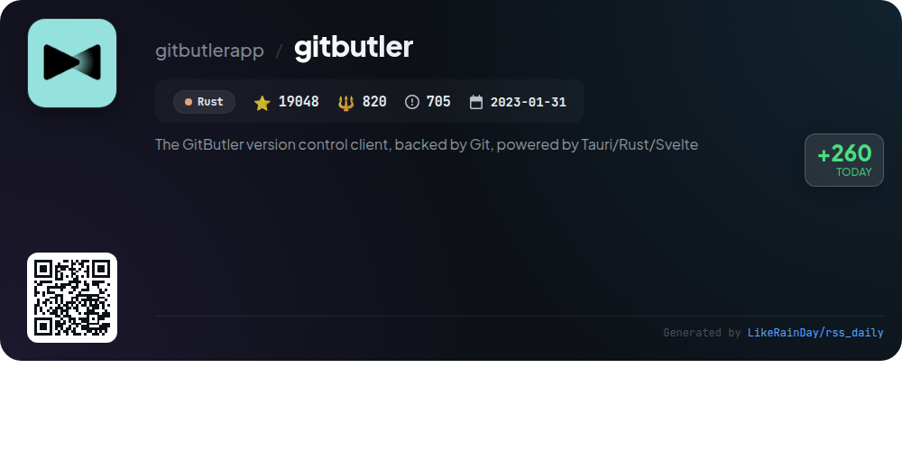
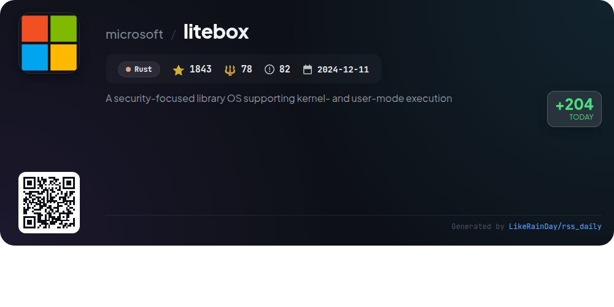
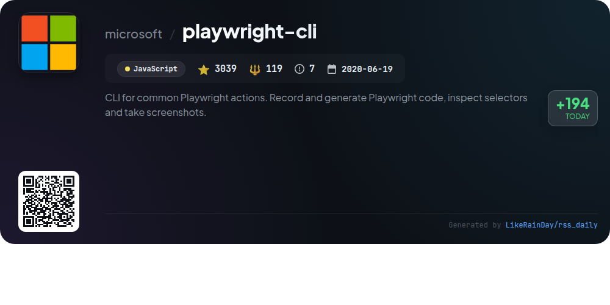
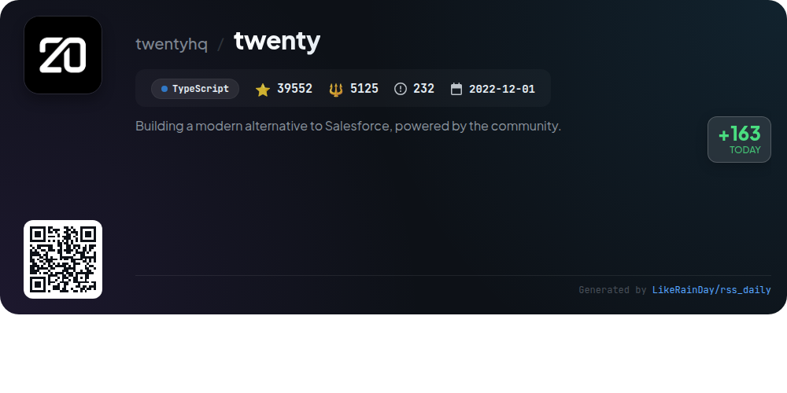

# 📊 🌟 GitHub Trending Daily - 2026-02-11

> > 📅 每日精选 GitHub 热门仓库 | 基于智能算法推荐

## 📋 Overview

**10** 个项目 | **126189** ⭐ | **11894** 🍴

**热门语言:** `TypeScript` (5) · `Rust` (3) · `Go` (1)

**更新时间:** 2026-02-11 02:55 UTC

**分类分布:**

- 🌟 每日 Top 10 精选 (10 项)

---

## 🌟 每日 Top 10 精选

### 1. [shannon](https://github.com/KeygraphHQ/shannon)

> 🤖 **推荐理由**  
> *Shannon is a fully autonomous AI pentester designed to identify real exploits in web applications. With a 96.15% success rate on the XBOW Benchmark, it autonomously tests for vulnerabilities such as Injection, XSS, and SSRF. Key features include one-command operation, pentester-grade reports with actionable Proof-of-Concepts, and code-aware dynamic testing. Available in Lite and Pro editions, Shannon not only finds vulnerabilities but also executes real exploits, providing comprehensive security assessments. Ideal for continuous security assurance, it integrates seamlessly into development workflows.*

- ⭐ 19849 stars
- 💻 TypeScript
- 📅 Updated: 2026-02-11

### 2. [monty](https://github.com/pydantic/monty)

> 🤖 **推荐理由**  
> *Monty is a minimal, secure Python interpreter written in Rust, designed for AI applications. It allows rapid execution of a subset of Python code with startup times under 1 microsecond. Key features include strict environment access control, type checking with modern Python hints, and the ability to pause and resume execution via serialization. Monty can be integrated with Rust, Python, or JavaScript without dependencies on CPython. It is particularly useful for running LLM-generated code, optimizing performance while maintaining security.*

- ⭐ 4574 stars
- 💻 Rust
- 📅 Updated: 2026-02-11

### 3. [dexter](https://github.com/virattt/dexter)

> 🤖 **推荐理由**  
> *Dexter is an autonomous financial research agent that intelligently decomposes complex queries into actionable research plans. Leveraging real-time market data, it autonomously executes tasks, self-validates results, and iterates until confident answers are achieved. Key features include intelligent task planning, access to financial datasets, and built-in safety mechanisms to prevent runaway execution. The project is designed for seamless installation and includes an evaluation suite for tracking performance. With over 14,000 stars on GitHub, Dexter is poised to revolutionize financial research.*

- ⭐ 14187 stars
- 💻 TypeScript
- 📅 Updated: 2026-02-11

### 4. [AionUi](https://github.com/iOfficeAI/AionUi)

> 🤖 **推荐理由**  
> *AionUi is a free, open-source platform designed for seamless coworking with AI command-line tools like Gemini CLI, Claude Code, and more. It features a unified graphical interface, multi-agent support, and local data security. Key services include real-time multi-session chat, smart file management, and AI image generation. Users can access AionUi remotely via WebUI or chat platforms like Telegram and Slack. With powerful automation capabilities and customizable interfaces, AionUi enhances AI office automation for macOS, Windows, and Linux users.*

- ⭐ 14526 stars
- 💻 TypeScript
- 📅 Updated: 2026-02-11

### 5. [gh-aw](https://github.com/github/gh-aw)

> 🤖 **推荐理由**  
> *GitHub Agentic Workflows (gh-aw) allows users to create and execute agentic workflows in natural language markdown within GitHub Actions. With 1,375 stars, this Go-based tool emphasizes safety through guardrails such as read-only permissions, input sanitization, and sandboxed execution. Key features include a Quick Start Guide, comprehensive documentation, and integration with companion projects like Agent Workflow Firewall for enhanced security. Designed for secure automation of repository tasks, it prioritizes user supervision and safety in AI operations.*

- ⭐ 1375 stars
- 💻 Go
- 📅 Updated: 2026-02-11

### 6. [compound-engineering-plugin](https://github.com/EveryInc/compound-engineering-plugin)

> 🤖 **推荐理由**  
> *The Compound Engineering Plugin is an official Claude Code marketplace tool designed to streamline engineering workflows. It enables users to plan, execute, review, and document work effectively, promoting a philosophy where each task eases future efforts. Key features include plugin installation, conversion to OpenCode and Codex formats, and syncing of personal configurations. The workflow emphasizes thorough planning and review, reducing technical debt and enhancing code quality. With over 8,196 stars, this TypeScript-based plugin is pivotal for optimizing engineering processes.*

- ⭐ 8196 stars
- 💻 TypeScript
- 📅 Updated: 2026-02-11

### 7. [gitbutler](https://github.com/gitbutlerapp/gitbutler)

> 🤖 **推荐理由**  
> *GitButler is a modern, Git-based version control client designed for enhanced user experience with both a GUI and CLI. Key features include stacked and parallel branches for efficient branch management, easy commit mutations, and an undo timeline for tracking changes. It integrates seamlessly with GitHub and GitLab for Pull Requests and CI statuses, and incorporates AI tools for generating commit messages and branch names. Built with Tauri, Rust, and Svelte, GitButler offers a user-friendly alternative to traditional Git workflows, making version control simpler and more powerful.*

- ⭐ 19048 stars
- 💻 Rust
- 📅 Updated: 2026-02-11

### 8. [litebox](https://github.com/microsoft/litebox)

> 🤖 **推荐理由**  
> *LiteBox is a security-focused library operating system written in Rust, designed to minimize the attack surface by drastically reducing the interface to the host. It supports both kernel- and user-mode execution, enabling seamless interoperability between diverse "North" shims and "South" platforms. Key use cases include running unmodified Linux programs on Windows, sandboxing Linux applications, and executing programs on SEV SNP or OP-TEE. LiteBox is actively evolving, encouraging experimentation while aiming for a stable release.*

- ⭐ 1843 stars
- 💻 Rust
- 📅 Updated: 2026-02-11

### 9. [playwright-cli](https://github.com/microsoft/playwright-cli)

> 🤖 **推荐理由**  
> *playwright-cli is a powerful command-line interface for Playwright, enabling efficient browser automation. With over 3000 stars, it facilitates recording and generating Playwright code, inspecting selectors, and capturing screenshots. Key features include token-efficient operations for coding agents, session management with persistent profiles, and a range of commands for navigation, user interaction, and storage state management. The CLI supports modern coding workflows, making it ideal for high-throughput environments. Easily install and use with Node.js 18+ and popular coding agents.*

- ⭐ 3039 stars
- 💻 JavaScript
- 📅 Updated: 2026-02-11

### 10. [twenty](https://github.com/twentyhq/twenty)

> 🤖 **推荐理由**  
> *twenty is a powerful open-source CRM alternative to Salesforce, designed for flexibility and community collaboration. Key features include customizable layouts (filters, kanban, table views), object and field personalization, role-based permissions management, and automated workflows with triggers. Built using TypeScript, NestJS, and React, it aims to provide a cohesive user experience inspired by modern tools. With a focus on affordability and open-source development, twenty encourages contributions and community engagement through platforms like Discord and GitHub.*

- ⭐ 39552 stars
- 💻 TypeScript
- 📅 Updated: 2026-02-11

---

## 📡 RSS订阅

通过 RSS 订阅，第一时间获取每日精选项目：

- 🔔 [RSS 订阅源] (../../daily-top.xml)
- 🔔 [每日简报] (../../GITHUB_TODAY_CN.md)
- 🔔 [每日 Top 10 精选](../../daily-top.xml)

---

*⚡ Powered by Smart Trending Algorithm | Generated at 2026-02-11 02:55:39 UTC
