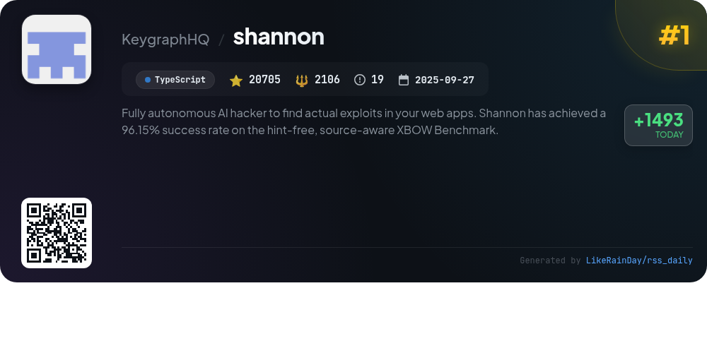
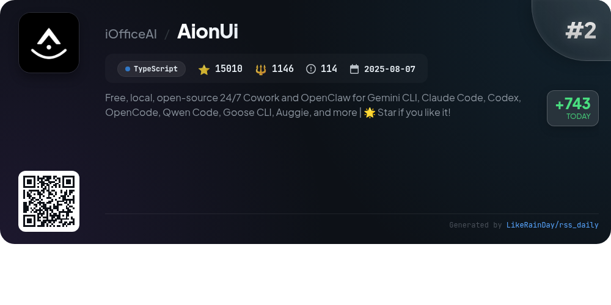
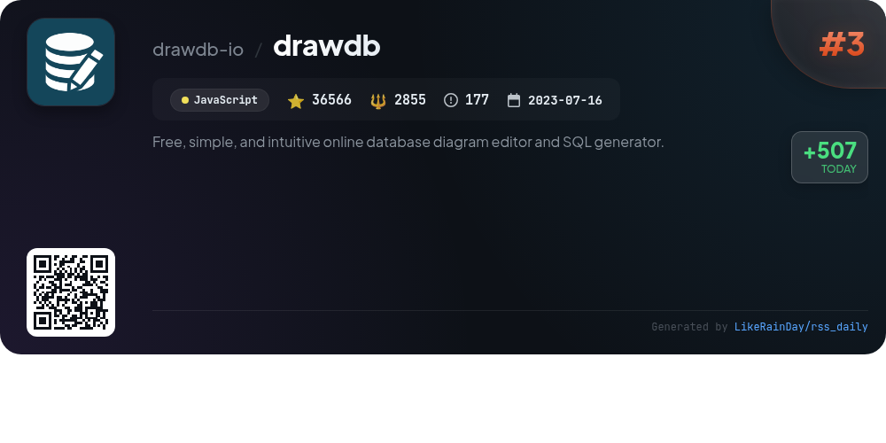
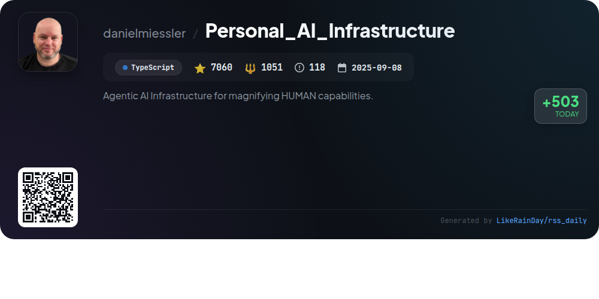
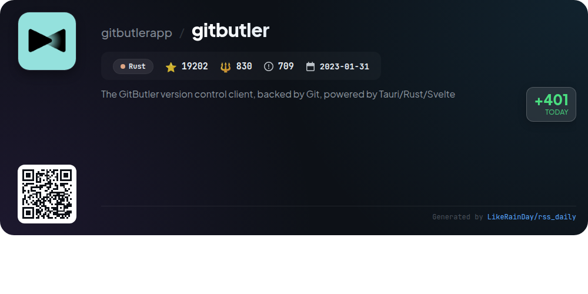
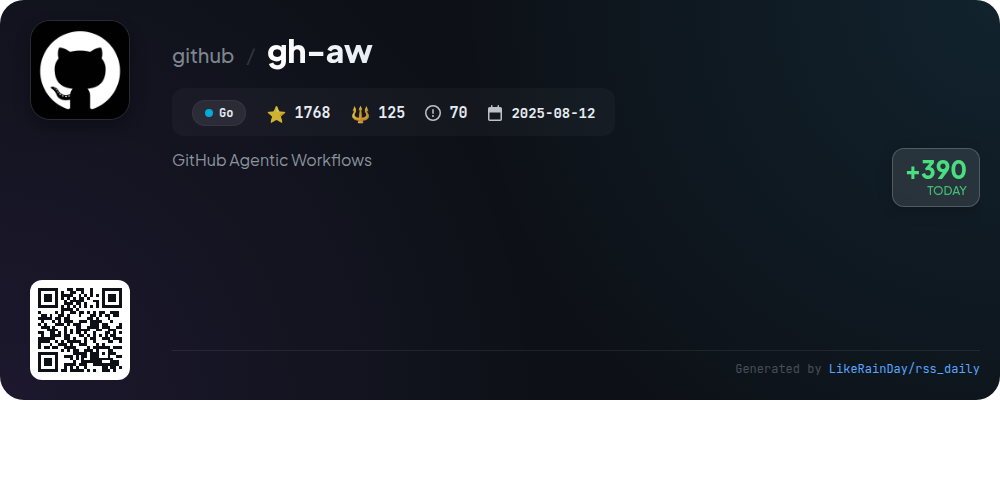
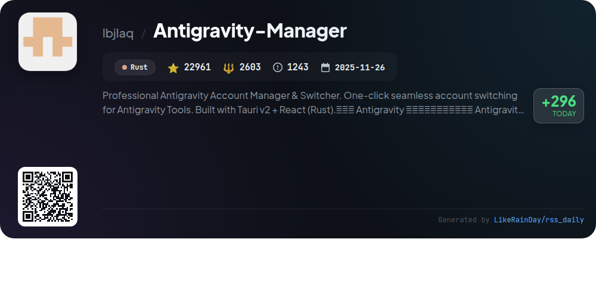
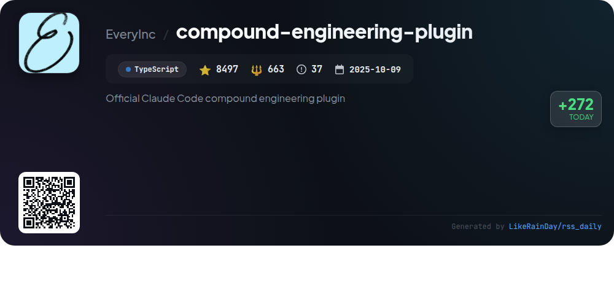
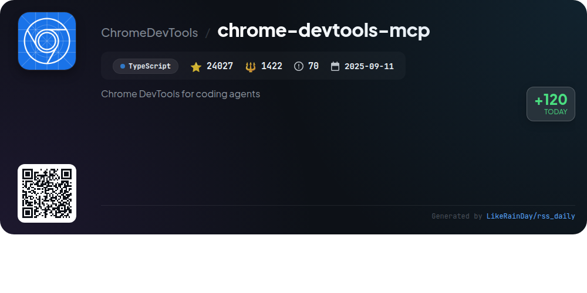
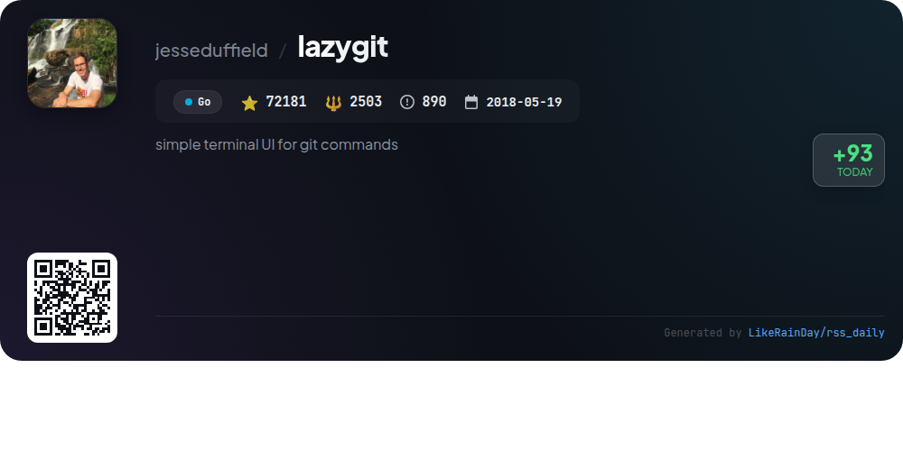

# 📊 🌟 GitHub Trending Daily - 2026-02-12

> > 📅 每日精选 GitHub 热门仓库 | 基于智能算法推荐

## 📋 Overview

**10** 个项目 | **227977** ⭐ | **15304** 🍴

**热门语言:** `TypeScript` (5) · `Go` (2) · `Rust` (2)

**更新时间:** 2026-02-12 02:51 UTC

**分类分布:**

- 🌟 每日 Top 10 精选 (10 项)

---

## 🌟 每日 Top 10 精选

### 1. [shannon](https://github.com/KeygraphHQ/shannon)

> 🤖 **推荐理由**  
> *Shannon is a fully autonomous AI pentester designed to identify and exploit vulnerabilities in web applications, achieving a 96.15% success rate on the hint-free, source-aware XBOW benchmark. It autonomously executes real exploits, such as injection attacks, providing actionable proof of vulnerabilities. Key features include automated pentesting, comprehensive reports with reproducible exploits, and critical OWASP vulnerability coverage. As part of the Keygraph Security and Compliance Platform, Shannon streamlines security and compliance, making it ideal for developers and security teams alike.*

- ⭐ 20705 stars
- 💻 TypeScript
- 📅 Updated: 2026-02-12

### 2. [AionUi](https://github.com/iOfficeAI/AionUi)

> 🤖 **推荐理由**  
> *AionUi is a free, open-source platform designed for seamless collaboration with various command-line AI tools such as Gemini CLI, Claude Code, and Codex. It features a unified graphical interface, multi-agent support, and local data security, allowing users to manage multiple sessions with independent contexts. Key highlights include a WebUI for remote access, smart file management, AI image generation, and real-time document previews. With extensive customization options and a community-driven approach, AionUi enhances AI office automation for macOS, Windows, and Linux users.*

- ⭐ 15010 stars
- 💻 TypeScript
- 📅 Updated: 2026-02-12

### 3. [drawdb](https://github.com/drawdb-io/drawdb)

> 🤖 **推荐理由**  
> *drawDB is a free, intuitive online database diagram editor and SQL generator, designed for simplicity and efficiency. Users can create database entity relationship diagrams effortlessly, export SQL scripts, and customize their editing experience—all without needing to register. With over 36,000 stars on GitHub, it boasts robust functionality accessible directly in the browser. Key features include easy diagramming, seamless SQL export, and optional file sharing through a server setup. Start building at drawdb.app and join the community on Discord.*

- ⭐ 36566 stars
- 💻 JavaScript
- 📅 Updated: 2026-02-12

### 4. [Personal_AI_Infrastructure](https://github.com/danielmiessler/Personal_AI_Infrastructure)

> 🤖 **推荐理由**  
> *Personal_AI_Infrastructure (PAI) is an open-source TypeScript project designed to enhance human capabilities through personalized AI systems. With over 7,060 stars, PAI focuses on activating individual potential by helping users identify their goals and preferences. Key features include continuous learning, goal-oriented assistance, and modular packs for tailored functionalities. PAI supports diverse users, from small business owners to creative professionals, ensuring accessible AI for everyone. Its architecture emphasizes user-centric design, making it a pioneering platform for personal AI development.*

- ⭐ 7060 stars
- 💻 TypeScript
- 📅 Updated: 2026-02-12

### 5. [gitbutler](https://github.com/gitbutlerapp/gitbutler)

> 🤖 **推荐理由**  
> *GitButler is a modern, AI-powered Git-based version control client, featuring a user-friendly GUI and CLI. Key highlights include stacked and parallel branches for efficient workflow, easy commit management without complex rebasing, an undo timeline for tracking changes, and first-class conflict resolution. It integrates seamlessly with GitHub and GitLab for effortless pull request management. Built with Tauri, Rust, and Svelte, GitButler aims to enhance Git's usability and flexibility, making it an ideal choice for developers seeking a powerful alternative to traditional Git interfaces.*

- ⭐ 19202 stars
- 💻 Rust
- 📅 Updated: 2026-02-12

### 6. [gh-aw](https://github.com/github/gh-aw)

> 🤖 **推荐理由**  
> *GitHub Agentic Workflows (gh-aw) enables users to create and execute workflows in natural language markdown within GitHub Actions. Key features include step-by-step installation guides, customizable agent workflows, and robust security measures like read-only permissions by default, input sanitization, and human approval gates for sensitive operations. The project promotes safe automation with tools like the Agent Workflow Firewall for network security and the MCP Gateway for centralized access management. With 1,768 stars, it emphasizes safety, ease of use, and community feedback.*

- ⭐ 1768 stars
- 💻 Go
- 📅 Updated: 2026-02-12

### 7. [Antigravity-Manager](https://github.com/lbjlaq/Antigravity-Manager)

> 🤖 **推荐理由**  
> *Antigravity-Manager is a professional account management tool for seamless switching between Antigravity Tools, built with Tauri v2 and React. Key features include a smart dashboard for real-time quota monitoring, OAuth 2.0 account management, API proxy for multiple protocols, and intelligent model routing to optimize usage efficiency. The application supports custom model configurations and automatic quota protection, ensuring stable performance across various user scenarios. With over 22,961 stars on GitHub, it aims to enhance user experience in managing AI accounts effectively.*

- ⭐ 22961 stars
- 💻 Rust
- 📅 Updated: 2026-02-12

### 8. [compound-engineering-plugin](https://github.com/EveryInc/compound-engineering-plugin)

> 🤖 **推荐理由**  
> *The Compound Engineering Plugin for Claude Code enhances engineering workflows by streamlining planning, execution, and review processes. Key features include a marketplace for plugins, conversion tools for OpenCode, Codex, and Factory Droid formats, and syncing capabilities for personal configurations. The plugin promotes a philosophy of reducing technical debt by emphasizing thorough planning and documentation. Core commands facilitate planning, task management, multi-agent code reviews, and knowledge codification, ensuring each engineering unit simplifies future efforts. With 8,497 stars, it is a valuable resource for efficient software development.*

- ⭐ 8497 stars
- 💻 TypeScript
- 📅 Updated: 2026-02-12

### 9. [chrome-devtools-mcp](https://github.com/ChromeDevTools/chrome-devtools-mcp)

> 🤖 **推荐理由**  
> *Chrome DevTools MCP is a powerful tool that enables coding agents like Gemini and Copilot to control and inspect live Chrome browsers. With over 24,000 stars on GitHub, it offers features such as advanced browser debugging, performance insights, and reliable automation via Puppeteer. Key highlights include the ability to analyze network requests, capture screenshots, and extract performance data. The project supports various MCP clients and allows customization through configuration options, making it ideal for developers seeking to enhance their coding experiences and browser interactions.*

- ⭐ 24027 stars
- 💻 TypeScript
- 📅 Updated: 2026-02-12

### 10. [lazygit](https://github.com/jesseduffield/lazygit)

> 🤖 **推荐理由**  
> *Lazygit is a powerful terminal UI for Git commands, designed to simplify common tasks. Key features include staging individual lines, interactive rebasing, cherry-picking, and the ability to nuke the working tree. It supports custom commands, worktrees, and undo/redo capabilities, enhancing user control. With over 72,000 stars on GitHub, Lazygit offers a seamless experience for both novice and experienced developers, making Git's complex functionalities more accessible. Installation is easy across various platforms, including Homebrew and Scoop.*

- ⭐ 72181 stars
- 💻 Go
- 📅 Updated: 2026-02-12

---

## 📡 RSS订阅

通过 RSS 订阅，第一时间获取每日精选项目：

- 🔔 [RSS 订阅源] (../../daily-top.xml)
- 🔔 [每日简报] (../../GITHUB_TODAY_CN.md)
- 🔔 [每日 Top 10 精选](../../daily-top.xml)

---

*⚡ Powered by Smart Trending Algorithm | Generated at 2026-02-12 02:51:04 UTC
