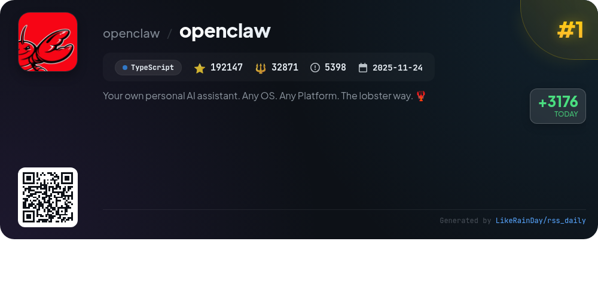
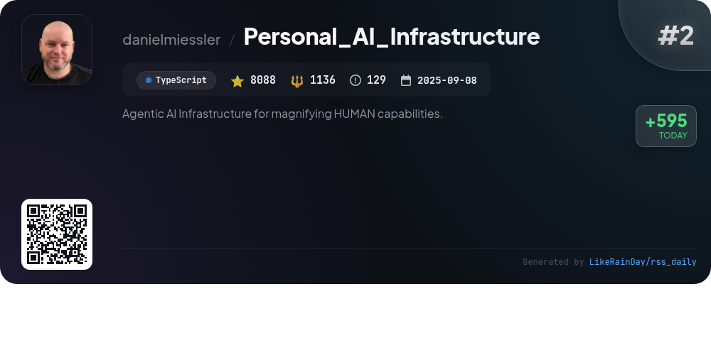
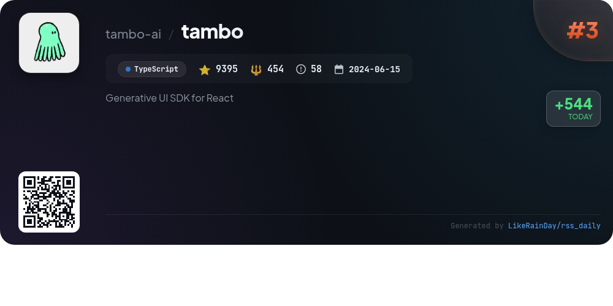
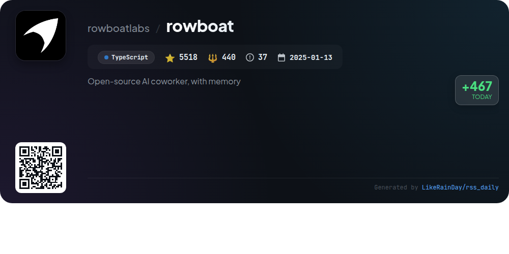
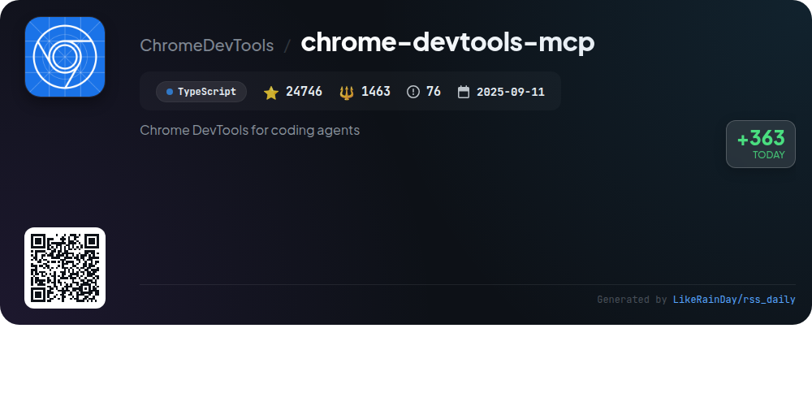
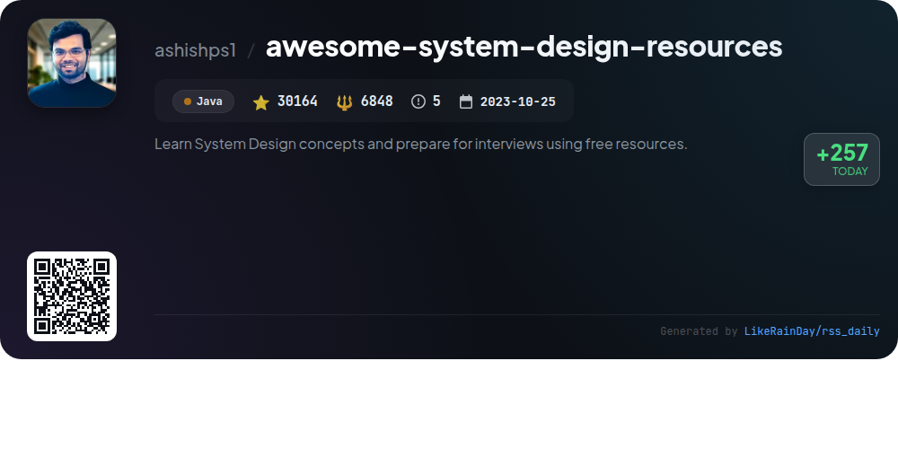
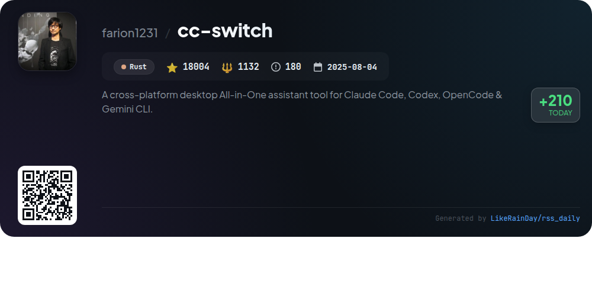
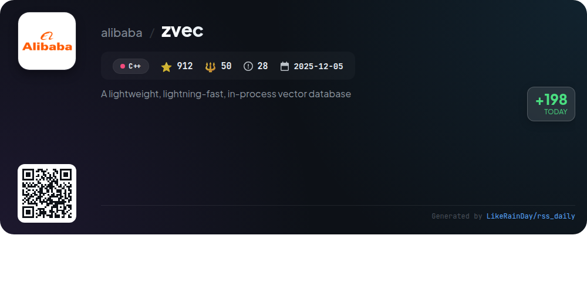
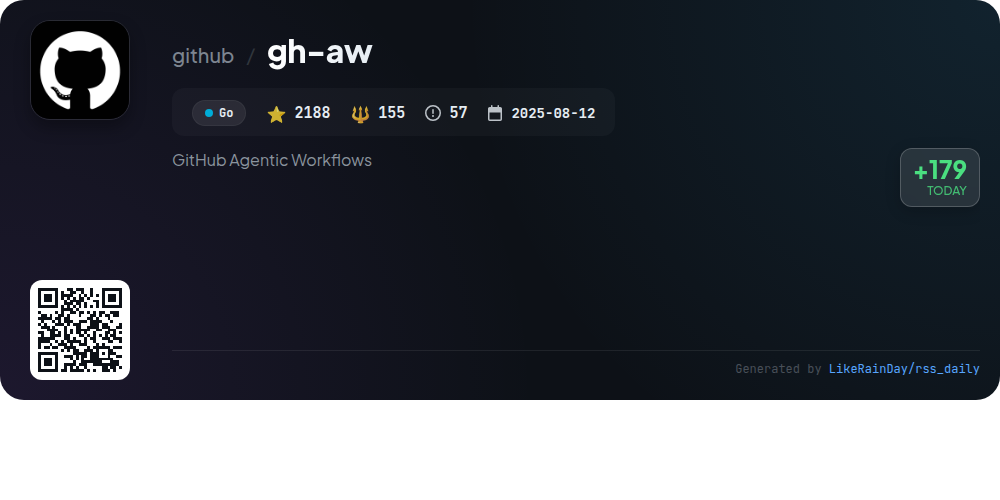
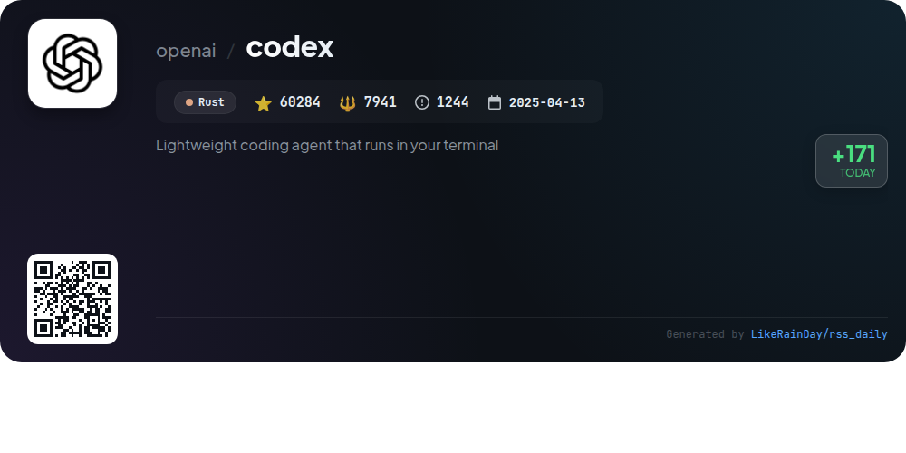

# 📊 🌟 GitHub Trending Daily - 2026-02-14

> > 📅 每日精选 GitHub 热门仓库 | 基于智能算法推荐

## 📋 Overview

**10** 个项目 | **351446** ⭐ | **52490** 🍴

**热门语言:** `TypeScript` (5) · `Rust` (2) · `C++` (1)

**更新时间:** 2026-02-14 02:38 UTC

**分类分布:**

- 🌟 每日 Top 10 精选 (10 项)

---

## 🌟 每日 Top 10 精选

### 1. [openclaw](https://github.com/openclaw/openclaw)

> 🤖 **推荐理由**  
> *OpenClaw is a versatile personal AI assistant that operates across multiple platforms (macOS, iOS, Android, Linux, and Windows via WSL2). It integrates seamlessly with popular messaging channels like WhatsApp, Telegram, Slack, Discord, and more. Key features include multi-channel support, voice interaction, a live Canvas for visual tasks, and a wizard-driven onboarding process. OpenClaw supports various AI models (recommended use of Anthropic and OpenAI) and offers tools for automation, making it ideal for users seeking a fast, local, and always-on assistant experience.*

- ⭐ 192147 stars
- 💻 TypeScript
- 📅 Updated: 2026-02-14

### 2. [Personal_AI_Infrastructure](https://github.com/danielmiessler/Personal_AI_Infrastructure)

> 🤖 **推荐理由**  
> *Personal_AI_Infrastructure (PAI) is an open-source project designed to enhance human capabilities through personalized AI. It features a goal-oriented architecture that learns from user interactions, improving over time. Key highlights include a modular system with 23 self-contained packs, a memory system for continuous learning, and event-driven automation. PAI serves diverse users, from small business owners to creative professionals, by providing tailored AI solutions that adapt to individual needs. With a focus on accessibility, PAI aims to democratize AI technology for everyone.*

- ⭐ 8088 stars
- 💻 TypeScript
- 📅 Updated: 2026-02-14

### 3. [tambo](https://github.com/tambo-ai/tambo)

> 🤖 **推荐理由**  
> *Tambo is an open-source generative UI toolkit for React, enabling developers to create AI-driven applications that adapt to user interactions. Key features include a complete React SDK, backend support for conversation state and agent orchestration, and seamless integration with various LLM providers like OpenAI and Google Gemini. Tambo offers streaming infrastructure for real-time component updates, customizable agents, and support for MCP integrations. Developers can choose between Tambo Cloud or self-hosting via Docker, making it a versatile solution for dynamic UI generation.*

- ⭐ 9395 stars
- 💻 TypeScript
- 📅 Updated: 2026-02-14

### 4. [rowboat](https://github.com/rowboatlabs/rowboat)

> 🤖 **推荐理由**  
> *Rowboat is an open-source AI coworker that transforms work into a long-lived knowledge graph, enhancing productivity with features like meeting preparation, email drafting, and document generation. It connects to services like Gmail and Granola for seamless integration and maintains a local Markdown vault for user control over data. Key highlights include background agents for automation, customizable model setups, and the ability to visualize and edit the knowledge graph. Rowboat prioritizes privacy by storing all data locally, making it a powerful tool for efficient work management.*

- ⭐ 5518 stars
- 💻 TypeScript
- 📅 Updated: 2026-02-14

### 5. [chrome-devtools-mcp](https://github.com/ChromeDevTools/chrome-devtools-mcp)

> 🤖 **推荐理由**  
> *chrome-devtools-mcp is a TypeScript-based tool that enables AI coding agents like Gemini and Copilot to control and inspect a live Chrome browser. With over 24,700 stars, it offers key features such as advanced browser debugging, performance insights via Chrome DevTools, and reliable automation using Puppeteer. Users can analyze network requests, take screenshots, and obtain actionable performance data. The tool supports various configurations for seamless integration with multiple coding environments, enhancing automation and debugging capabilities.*

- ⭐ 24746 stars
- 💻 TypeScript
- 📅 Updated: 2026-02-14

### 6. [awesome-system-design-resources](https://github.com/ashishps1/awesome-system-design-resources)

> 🤖 **推荐理由**  
> *The "awesome-system-design-resources" GitHub repository provides a wealth of free resources for mastering system design concepts and preparing for interviews, garnering over 30,000 stars. Key features include comprehensive sections on core concepts like scalability, availability, and database fundamentals, as well as practical design problems ranging from easy to hard, such as designing a URL shortener or a messaging service. Additional offerings include courses, newsletters, and must-read articles and papers, making it an essential tool for aspiring software engineers.*

- ⭐ 30164 stars
- 💻 Java
- 📅 Updated: 2026-02-14

### 7. [cc-switch](https://github.com/farion1231/cc-switch)

> 🤖 **推荐理由**  
> *cc-switch is a cross-platform desktop assistant tool built in Rust, designed to seamlessly manage Claude Code, Codex, and Gemini CLI configurations. With over 18,000 stars, it features a modern UI, provider management for easy switching, and integrated skills and prompts management. Key highlights include SQLite + JSON dual-layer architecture for data persistence, support for multiple languages, and one-click auto-launch on startup. Sponsored by services like MiniMax and AIGoCode, cc-switch offers efficient API relay capabilities, making it an essential tool for developers.*

- ⭐ 18004 stars
- 💻 Rust
- 📅 Updated: 2026-02-14

### 8. [zvec](https://github.com/alibaba/zvec)

> 🤖 **推荐理由**  
> *Zvec is a lightweight, lightning-fast, open-source in-process vector database designed for seamless integration into applications. Built on Alibaba's Proxima engine, it enables low-latency, scalable similarity search with minimal setup. Core features include support for both dense and sparse vectors, hybrid search capabilities, and the ability to run on various platforms (Linux, macOS). Zvec's blazing speed allows it to search billions of vectors in milliseconds, making it ideal for demanding workloads. Installation is straightforward via Python or Node.js, facilitating quick deployment.*

- ⭐ 912 stars
- 💻 C++
- 📅 Updated: 2026-02-14

### 9. [gh-aw](https://github.com/github/gh-aw)

> 🤖 **推荐理由**  
> *GitHub Agentic Workflows (gh-aw) allows users to create and run agentic workflows in natural language markdown within GitHub Actions. Key features include a quick start guide, comprehensive documentation, and a focus on security with read-only permissions by default and multiple safety layers, including sandboxed execution and input sanitization. Companion projects like the Agent Workflow Firewall and MCP Gateway enhance security and integration. With 2,188 stars, this Go-based tool empowers automation while ensuring safety and control in repository tasks.*

- ⭐ 2188 stars
- 💻 Go
- 📅 Updated: 2026-02-14

### 10. [codex](https://github.com/openai/codex)

> 🤖 **推荐理由**  
> *Codex is a lightweight coding agent from OpenAI that operates directly in your terminal, designed to streamline coding tasks. With over 60,000 stars on GitHub, this Rust-based CLI tool allows users to quickly install via npm or Homebrew and start coding immediately. Codex can also be integrated into popular IDEs like VS Code. For cloud-based functionality, users can access Codex Web through chatgpt.com. It supports authentication via ChatGPT accounts and provides extensive documentation for setup and usage, making it an essential tool for developers.*

- ⭐ 60284 stars
- 💻 Rust
- 📅 Updated: 2026-02-14

---

## 📡 RSS订阅

通过 RSS 订阅，第一时间获取每日精选项目：

- 🔔 [RSS 订阅源] (../../daily-top.xml)
- 🔔 [每日简报] (../../GITHUB_TODAY_CN.md)
- 🔔 [每日 Top 10 精选](../../daily-top.xml)

---

*⚡ Powered by Smart Trending Algorithm | Generated at 2026-02-14 02:38:29 UTC
