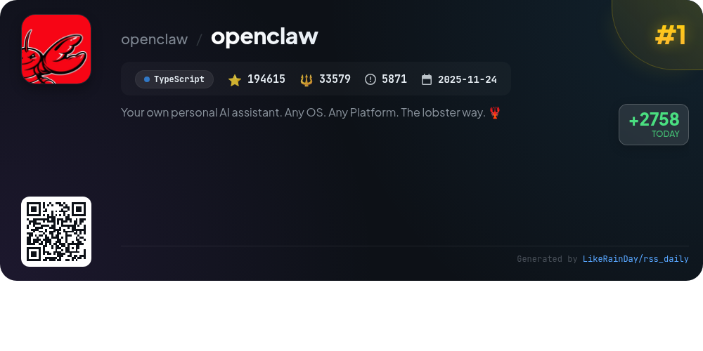
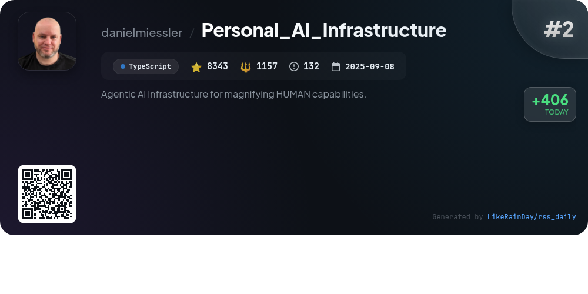
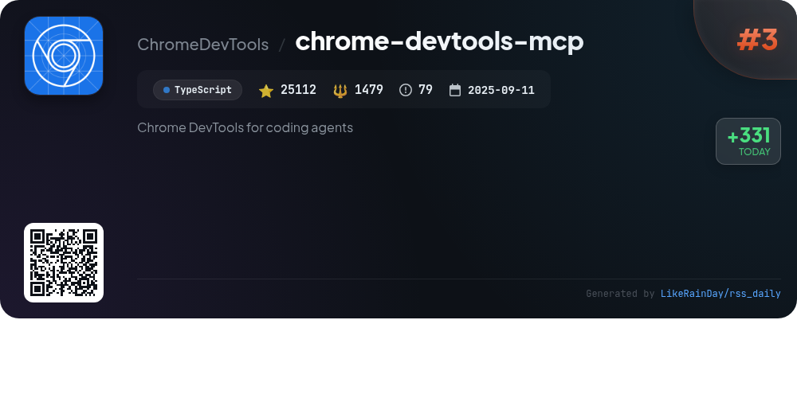
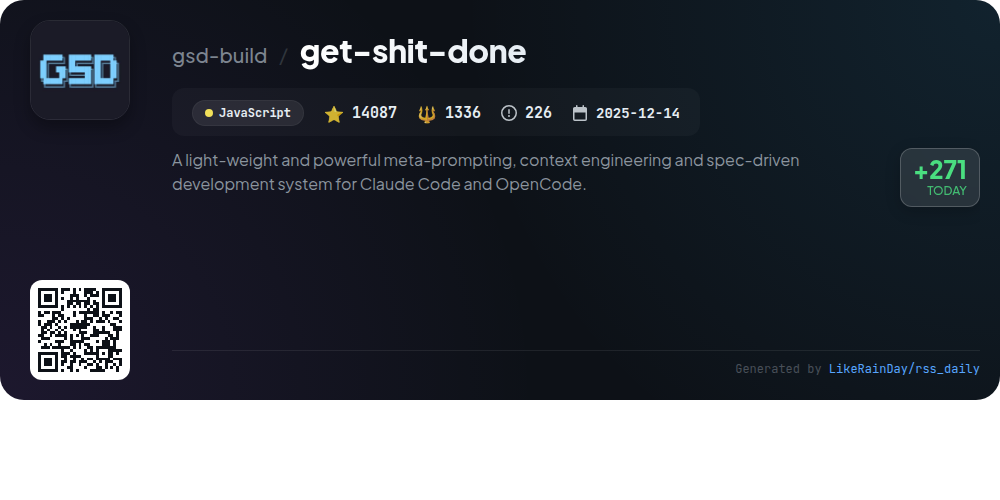
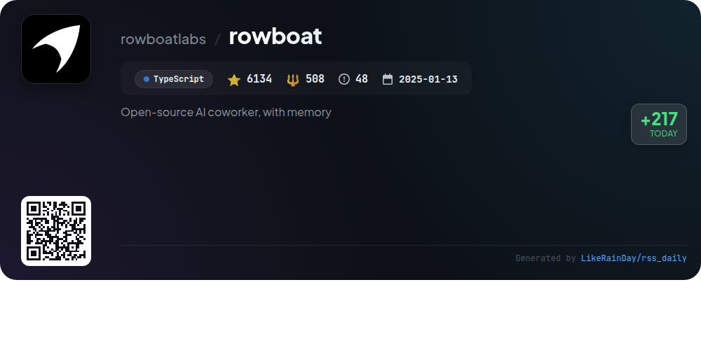
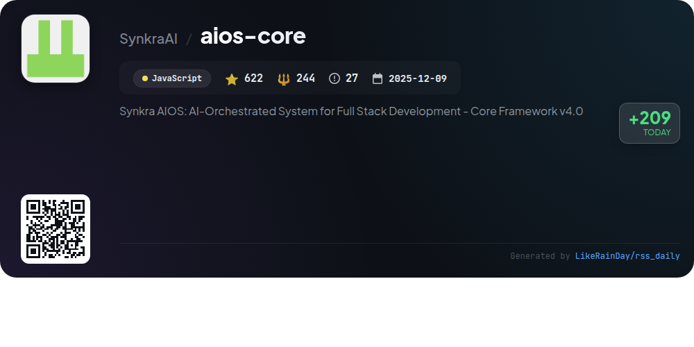
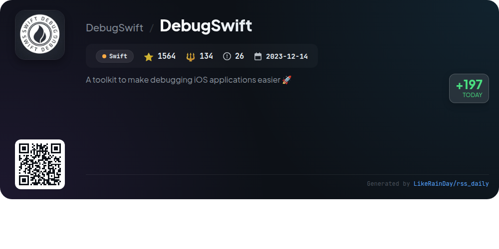
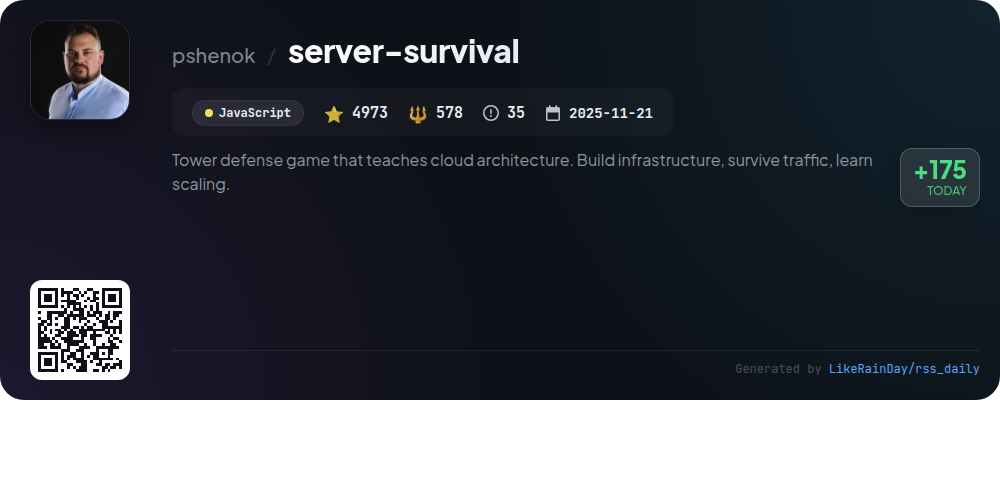
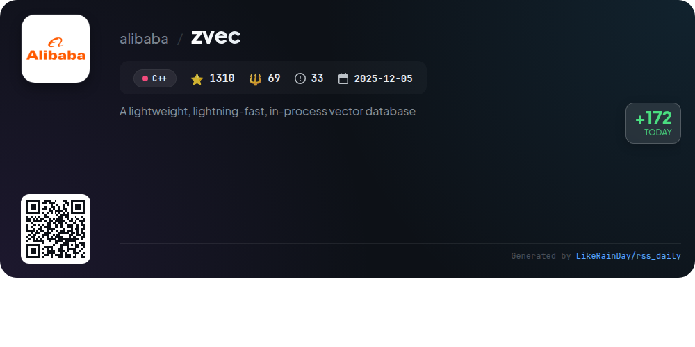
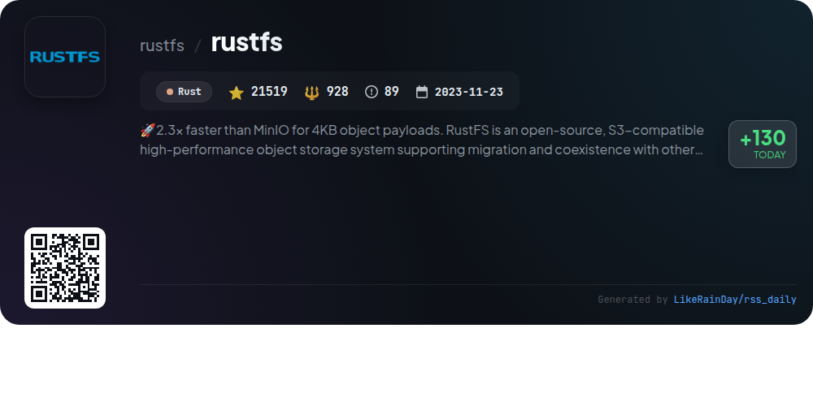

# 📊 🌟 GitHub Trending Daily - 2026-02-15

> > 📅 Daily Picks of GitHub Trending Repositories | Powered by Smart Algorithms

## 📋 Overview

**10** Projects | **278279** ⭐ | **40012** 🍴

**Top Languages:** `TypeScript` (4) · `JavaScript` (3) · `Swift` (1)

**Updated:** 2026-02-15 02:52 UTC

**Categories:**

- 🌟 Daily Top 10 (10 items)

---

## 🌟 Daily Top 10

### 1. [openclaw](https://github.com/openclaw/openclaw)

> 🤖 **Why Recommend**  
> *OpenClaw is a versatile personal AI assistant designed for any device and platform, allowing seamless interaction across popular messaging channels like WhatsApp, Telegram, Slack, and Discord. Key features include a local-first Gateway for session management, multi-channel inbox support, and voice activation capabilities on macOS, iOS, and Android. Users can utilize advanced tools such as a live Canvas, browser controls, and automated workflows. The setup process is guided by an onboarding wizard, ensuring a smooth installation experience. OpenClaw prioritizes privacy and security, making it an ideal choice for personal AI assistance.*

- ⭐ 194615 stars
- 💻 TypeScript
- 📅 Updated: 2026-02-15

### 2. [Personal_AI_Infrastructure](https://github.com/danielmiessler/Personal_AI_Infrastructure)

> 🤖 **Why Recommend**  
> *Personal_AI_Infrastructure (PAI) is an open-source platform designed to enhance human capabilities through personalized AI. With over 8,340 stars on GitHub, PAI uses TypeScript to create a system that learns from user interactions, capturing goals, preferences, and history for continuous improvement. Core features include a modular architecture with 23 self-contained Packs, a memory system for persistent learning, and customizable workflows. PAI aims to democratize access to advanced AI tools, empowering users from various backgrounds to maximize their potential.*

- ⭐ 8343 stars
- 💻 TypeScript
- 📅 Updated: 2026-02-15

### 3. [chrome-devtools-mcp](https://github.com/ChromeDevTools/chrome-devtools-mcp)

> 🤖 **Why Recommend**  
> *chrome-devtools-mcp is a TypeScript-based tool that enables AI coding agents like Gemini, Claude, and Copilot to control and inspect live Chrome browsers. With over 25,000 stars on GitHub, it offers powerful features such as advanced browser debugging, performance insights through Chrome DevTools, and reliable automation using Puppeteer. Key services include analyzing network requests, taking screenshots, and evaluating scripts. The server connects to Chrome instances for seamless debugging and performance analysis, ensuring enhanced automation capabilities for developers.*

- ⭐ 25112 stars
- 💻 TypeScript
- 📅 Updated: 2026-02-15

### 4. [get-shit-done](https://github.com/gsd-build/get-shit-done)

> 🤖 **Why Recommend**  
> *get-shit-done is a lightweight meta-prompting and context engineering system designed for Claude Code, OpenCode, and Gemini CLI, addressing context rot and ensuring high-quality code generation. Key features include streamlined project initialization, parallel agent orchestration for research and planning, and atomic Git commits for clear versioning. Trusted by engineers at major companies, GSD simplifies the development process by allowing users to specify their requirements, facilitating effective communication with AI, and ensuring reliable outputs.*

- ⭐ 14087 stars
- 💻 JavaScript
- 📅 Updated: 2026-02-15

### 5. [rowboat](https://github.com/rowboatlabs/rowboat)

> 🤖 **Why Recommend**  
> *Rowboat is an open-source AI coworker designed to enhance productivity by creating a long-lived knowledge graph from your work. It connects with Gmail and meeting notes, enabling features like meeting preparation, email drafting, and document generation based on accumulated context. Users can visualize and edit their knowledge graph in Markdown, record voice memos, and automate tasks through background agents. Rowboat is local-first, ensuring privacy and data control. It supports various model setups and can integrate with external tools via the Model Context Protocol (MCP).*

- ⭐ 6134 stars
- 💻 TypeScript
- 📅 Updated: 2026-02-15

### 6. [aios-core](https://github.com/SynkraAI/aios-core)

> 🤖 **Why Recommend**  
> *Synkra AIOS is an AI-Orchestrated System for Full Stack Development, offering a core framework designed for agile, agent-driven development. Key features include a CLI-first approach for execution and automation, real-time observability, and specialized AI agents for roles like analysts, developers, and QA. Innovations such as Agentic Planning and Contextualized Development ensure consistency and comprehensive context in project workflows. The framework supports diverse applications from software development to creative writing, making it versatile for any domain. With 622 stars on GitHub, AIOS emphasizes ease of installation and collaboration.*

- ⭐ 622 stars
- 💻 JavaScript
- 📅 Updated: 2026-02-15

### 7. [DebugSwift](https://github.com/DebugSwift/DebugSwift)

> 🤖 **Why Recommend**  
> *DebugSwift is a powerful toolkit designed to simplify the debugging of iOS applications, supporting iOS 14.0+ and Swift 6.0+. Key features include a Network Inspector for monitoring HTTP and WebSocket traffic, real-time performance metrics, crash reporting, and memory leak detection. It offers customizable app tools, including a view hierarchy inspector and touch indicators, along with a file browser for sandbox exploration. DebugSwift is compatible with Apple Silicon and supports integration with CocoaPods and Swift Package Manager, aimed at optimizing the debugging experience for developers.*

- ⭐ 1564 stars
- 💻 Swift
- 📅 Updated: 2026-02-14

### 8. [server-survival](https://github.com/pshenok/server-survival)

> 🤖 **Why Recommend**  
> *Server Survival is an interactive 3D tower defense game that immerses players in the role of a Cloud Architect. The objective is to build and scale a resilient cloud infrastructure to manage increasing traffic while defending against DDoS attacks. Key features include diverse traffic types, a variety of services like Firewalls, Load Balancers, and Databases, and two game modes: Survival and Sandbox. Players manage budgets, reputation, and service health in a dynamic environment. Learn cloud architecture strategies while enjoying engaging gameplay.*

- ⭐ 4973 stars
- 💻 JavaScript
- 📅 Updated: 2026-02-15

### 9. [zvec](https://github.com/alibaba/zvec)

> 🤖 **Why Recommend**  
> *Zvec is a lightweight, lightning-fast in-process vector database designed for seamless integration into applications. Built on Alibaba's Proxima engine, it supports both dense and sparse vector embeddings, enabling efficient similarity searches across billions of vectors in milliseconds. Key features include hybrid search capabilities, minimal setup with no server requirements, and compatibility with various platforms (Linux, macOS). Zvec is ideal for production workloads, offering exceptional speed and scalability. Join the community for support and updates via Discord and social media.*

- ⭐ 1310 stars
- 💻 C++
- 📅 Updated: 2026-02-15

### 10. [rustfs](https://github.com/rustfs/rustfs)

> 🤖 **Why Recommend**  
> *RustFS is an open-source, high-performance object storage system built in Rust, offering 2.3x faster performance than MinIO for 4KB payloads. It features full S3 compatibility, a distributed architecture, and support for data lakes, AI, and big data workloads. Key highlights include robust security with memory safety, a user-friendly management console, and no telemetry for data sovereignty. Licensed under Apache 2.0, RustFS encourages community contributions and commercial usage. Ideal for scalable deployments, it integrates seamlessly with existing S3-compatible platforms like MinIO and Ceph.*

- ⭐ 21519 stars
- 💻 Rust
- 📅 Updated: 2026-02-15

---

## 📡 RSS Subscription

Subscribe via RSS to get daily trending updates:

- 🔔 [RSS XML] (../../daily-top.xml)
- 🔔 [Daily Report] (../../GITHUB_TODAY.md)
- 🔔 [Daily Top 10](../../daily-top.xml)

---

*⚡ Powered by Smart Trending Algorithm | Generated at 2026-02-15 02:52:24 UTC
