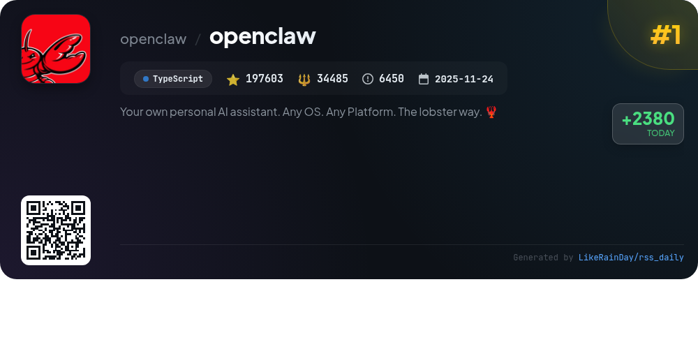
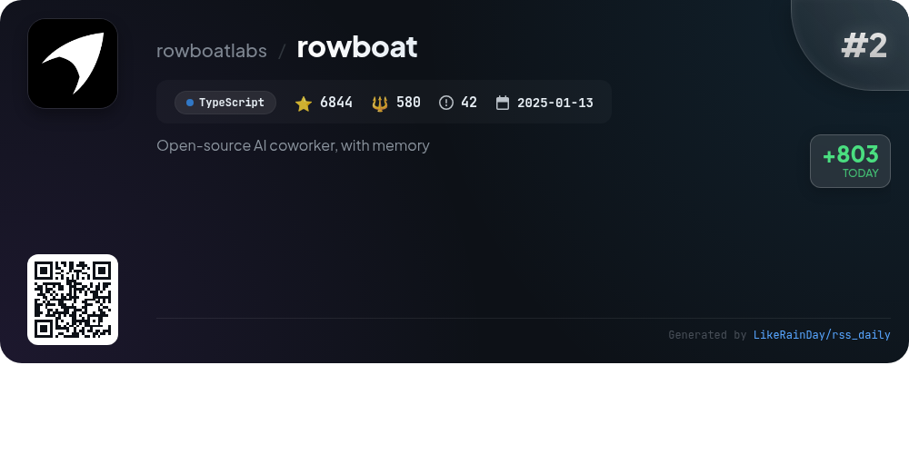
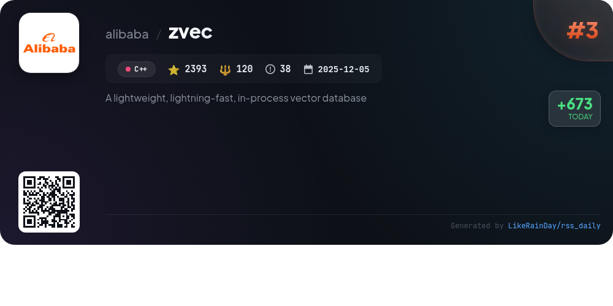
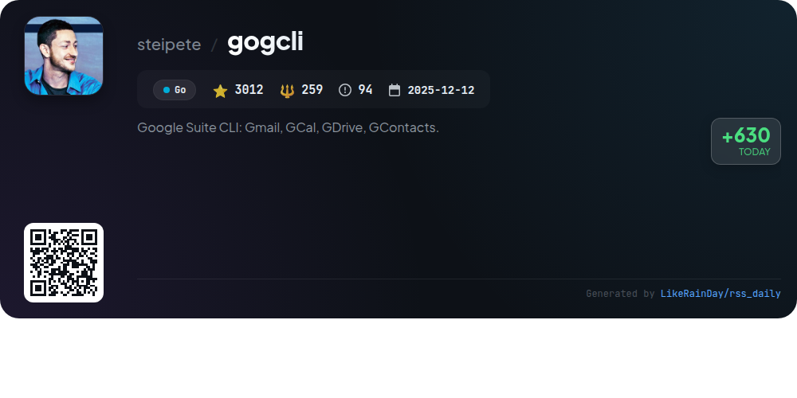
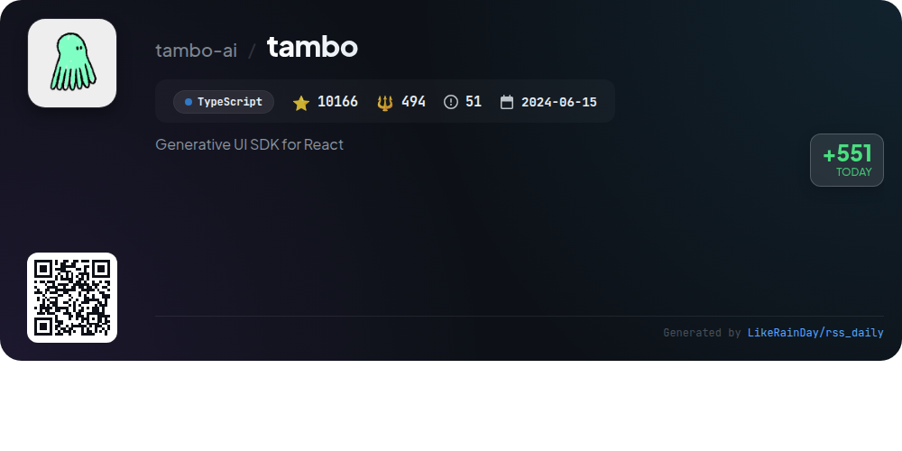
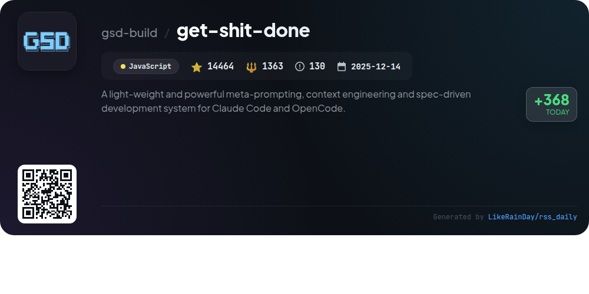
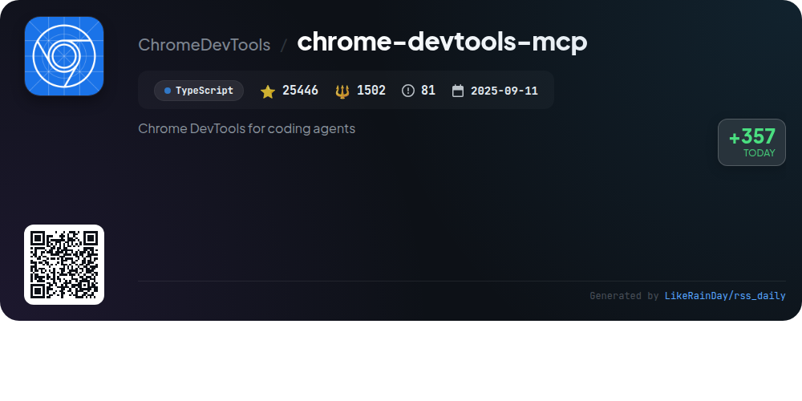
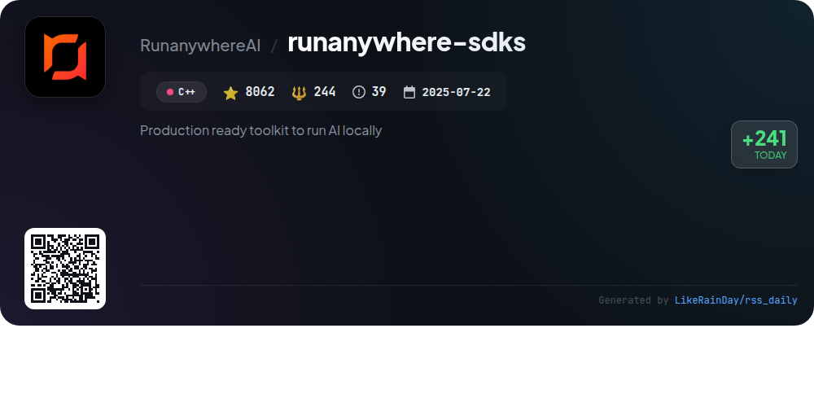
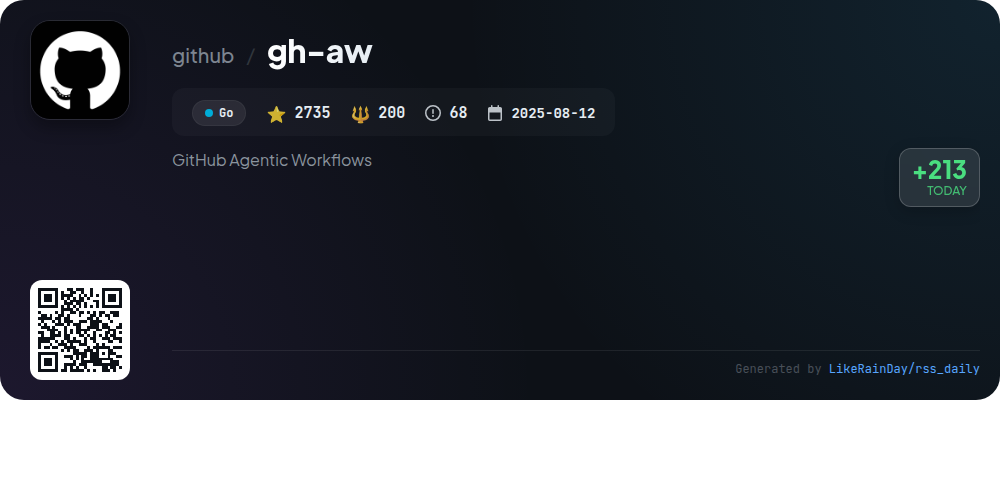
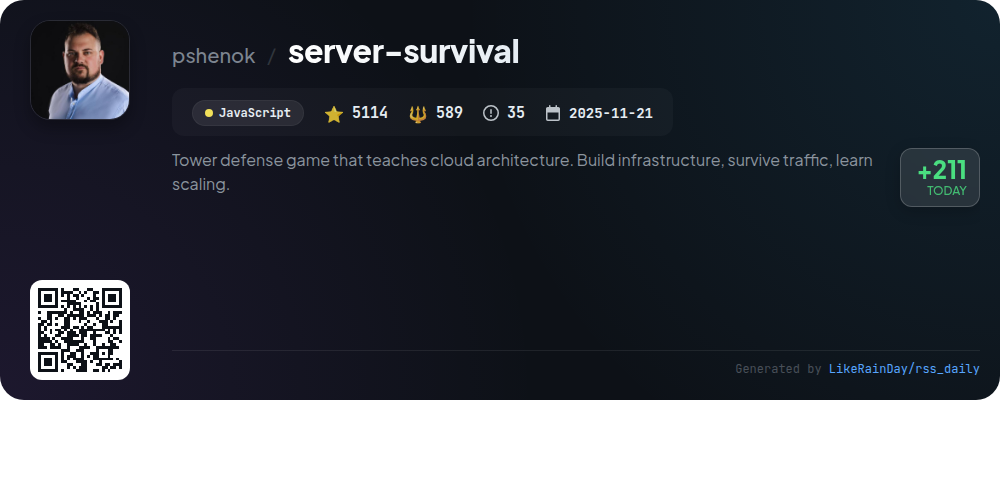

# 📊 🌟 GitHub Trending Daily - 2026-02-16

> > 📅 每日精选 GitHub 热门仓库 | 基于智能算法推荐

## 📋 Overview

**10** 个项目 | **275839** ⭐ | **39836** 🍴

**热门语言:** `TypeScript` (4) · `Go` (2) · `JavaScript` (2)

**更新时间:** 2026-02-16 02:48 UTC

**分类分布:**

- 🌟 每日 Top 10 精选 (10 项)

---

## 🌟 每日 Top 10 精选

### 1. [openclaw](https://github.com/openclaw/openclaw)

> 🤖 **推荐理由**  
> *OpenClaw is a personal AI assistant that integrates seamlessly across multiple platforms, including WhatsApp, Telegram, Slack, Discord, and more. With over 197k stars on GitHub, it features a local-first control plane for managing sessions and tools, multi-channel messaging, voice activation, and an interactive live canvas. Users can navigate a guided onboarding process to set up their assistant easily. Key functionalities include voice wake, multi-agent routing, and first-class tools for automation and interaction, all running on any OS.*

- ⭐ 197603 stars
- 💻 TypeScript
- 📅 Updated: 2026-02-16

### 2. [rowboat](https://github.com/rowboatlabs/rowboat)

> 🤖 **推荐理由**  
> *Rowboat is an open-source AI coworker designed to enhance productivity by building a long-lasting knowledge graph from your work. It integrates with Gmail and meeting notes to remember important context, helping you draft emails, prepare for meetings, and generate documents or presentations based on accumulated knowledge. Rowboat operates locally, ensuring privacy and control over your data. Key features include voice memo recording, background agents for automation, and compatibility with various AI models. Its transparent Markdown storage allows for easy editing and inspection.*

- ⭐ 6844 stars
- 💻 TypeScript
- 📅 Updated: 2026-02-16

### 3. [zvec](https://github.com/alibaba/zvec)

> 🤖 **推荐理由**  
> *Zvec is a lightweight, lightning-fast in-process vector database designed for seamless integration into applications. Built on Alibaba's Proxima engine, it enables low-latency, scalable similarity searches across dense and sparse vectors. Key features include blazing-fast search capabilities, hybrid search combining semantic and structured filters, and the ability to run on various platforms including Linux and macOS. With easy installation via Python and Node.js, Zvec is ideal for production workloads requiring high performance and minimal setup. Join the community for support and updates.*

- ⭐ 2393 stars
- 💻 C++
- 📅 Updated: 2026-02-16

### 4. [gogcli](https://github.com/steipete/gogcli)

> 🤖 **推荐理由**  
> *gogcli is a fast, script-friendly CLI tool for managing Google Suite services, including Gmail, Calendar, Drive, Contacts, Tasks, and more. Key features include email management (search, send, label), calendar event creation (with attendees), file operations in Google Drive, and contact management. It supports multiple accounts, secure credential storage, and JSON output for automation. With over 3,000 stars on GitHub, gogcli offers robust functionality for users needing command-line access to Google Workspace services, enhancing productivity and automation.*

- ⭐ 3012 stars
- 💻 Go
- 📅 Updated: 2026-02-16

### 5. [tambo](https://github.com/tambo-ai/tambo)

> 🤖 **推荐理由**  
> *Tambo is an open-source generative UI SDK for React, enabling developers to create dynamic agents that interact with users through UI components. Key features include seamless integration with LLM providers (OpenAI, Anthropic, etc.), streaming infrastructure for real-time updates, and support for both Tambo Cloud and self-hosted environments. The toolkit simplifies state management, offers MCP integrations, and allows for both generative and interactable components. With robust documentation and a vibrant community, Tambo is designed for building adaptable, user-focused applications.*

- ⭐ 10166 stars
- 💻 TypeScript
- 📅 Updated: 2026-02-16

### 6. [get-shit-done](https://github.com/gsd-build/get-shit-done)

> 🤖 **推荐理由**  
> *Get Shit Done (GSD) is a lightweight, meta-prompting system designed for efficient development using Claude Code, OpenCode, and Gemini CLI. It addresses context rot by maintaining high-quality outputs through structured project management. GSD streamlines the development process with commands for initializing projects, discussing phases, planning, executing, and verifying work. It ensures clean, atomic Git commits and supports parallel execution to enhance productivity. Trusted by engineers from Amazon and Google, it offers a community-driven approach to simplify spec-driven development.*

- ⭐ 14464 stars
- 💻 JavaScript
- 📅 Updated: 2026-02-16

### 7. [chrome-devtools-mcp](https://github.com/ChromeDevTools/chrome-devtools-mcp)

> 🤖 **推荐理由**  
> *The `chrome-devtools-mcp` project enables coding agents like Gemini and Copilot to control and inspect a live Chrome browser. With over 25,000 stars, this TypeScript-based tool serves as a Model-Context-Protocol server, offering advanced browser debugging, reliable automation via Puppeteer, and performance insights through Chrome DevTools. Key features include network request analysis, screenshot capabilities, and detailed performance tracing. The server supports easy integration across various platforms, ensuring seamless interaction with Chrome for enhanced development workflows.*

- ⭐ 25446 stars
- 💻 TypeScript
- 📅 Updated: 2026-02-16

### 8. [runanywhere-sdks](https://github.com/RunanywhereAI/runanywhere-sdks)

> 🤖 **推荐理由**  
> *RunAnywhere is a production-ready toolkit enabling on-device AI across various platforms. It supports local execution of LLMs, speech-to-text, and text-to-speech functionalities, ensuring privacy and fast performance without cloud dependency. Key features include LLM chat (e.g., Llama, Mistral), a full voice assistant pipeline, and vision-language models, all accessible via SDKs for Swift (iOS/macOS), Kotlin (Android), Web, React Native, and Flutter. With over 8,000 stars on GitHub, RunAnywhere stands out for its offline capabilities and ease of integration into applications.*

- ⭐ 8062 stars
- 💻 C++
- 📅 Updated: 2026-02-16

### 9. [gh-aw](https://github.com/github/gh-aw)

> 🤖 **推荐理由**  
> *GitHub Agentic Workflows (gh-aw) enables users to create and execute workflows in natural language markdown via GitHub Actions. Key features include a quick start guide, comprehensive documentation, and a focus on security with guardrails like read-only permissions, input sanitization, and human approval for critical actions. The project supports companion tools like the Agent Workflow Firewall for enhanced security and MCP Gateway for centralized access management. With 2735 stars, it emphasizes safety, automation, and collaboration in repository management.*

- ⭐ 2735 stars
- 💻 Go
- 📅 Updated: 2026-02-16

### 10. [server-survival](https://github.com/pshenok/server-survival)

> 🤖 **推荐理由**  
> *Server Survival is an engaging tower defense game that simulates cloud architecture, allowing players to build and scale resilient infrastructures while managing budget, reputation, and service health. Players face challenges like DDoS attacks and escalating traffic, requiring active intervention to survive. The game features various traffic types and services such as Firewalls, Load Balancers, and Databases, each with unique costs and capacities. With modes like Survival for dynamic challenges and Sandbox for experimentation, players can hone their cloud skills in an interactive environment. Join the community to discuss strategies and share scores!*

- ⭐ 5114 stars
- 💻 JavaScript
- 📅 Updated: 2026-02-16

---

## 📡 RSS订阅

通过 RSS 订阅，第一时间获取每日精选项目：

- 🔔 [RSS 订阅源] (../../daily-top.xml)
- 🔔 [每日简报] (../../GITHUB_TODAY_CN.md)
- 🔔 [每日 Top 10 精选](../../daily-top.xml)

---

*⚡ Powered by Smart Trending Algorithm | Generated at 2026-02-16 02:48:01 UTC
