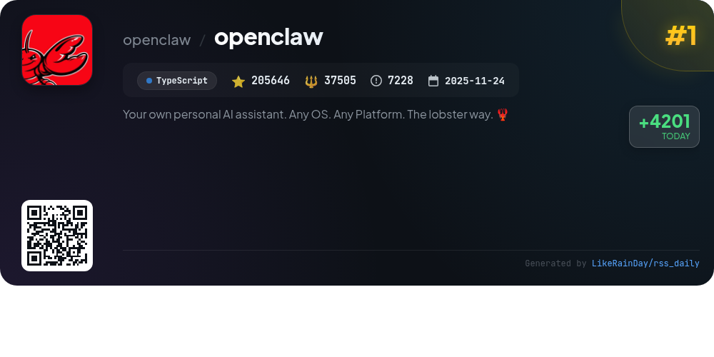
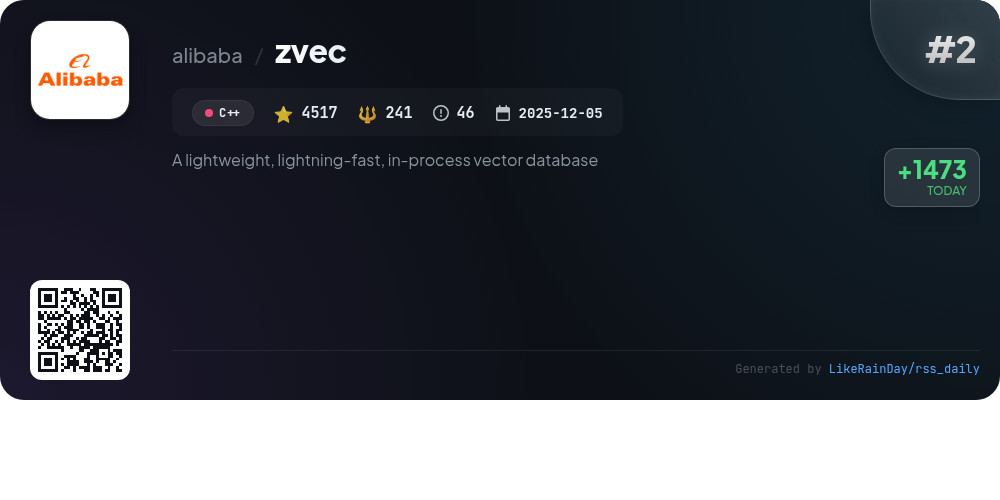
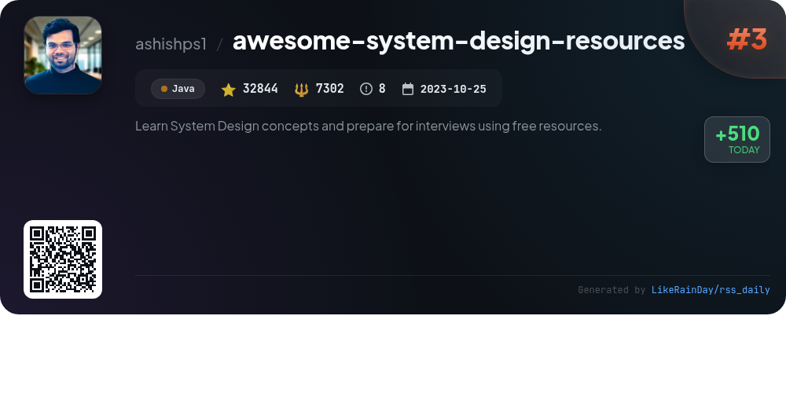
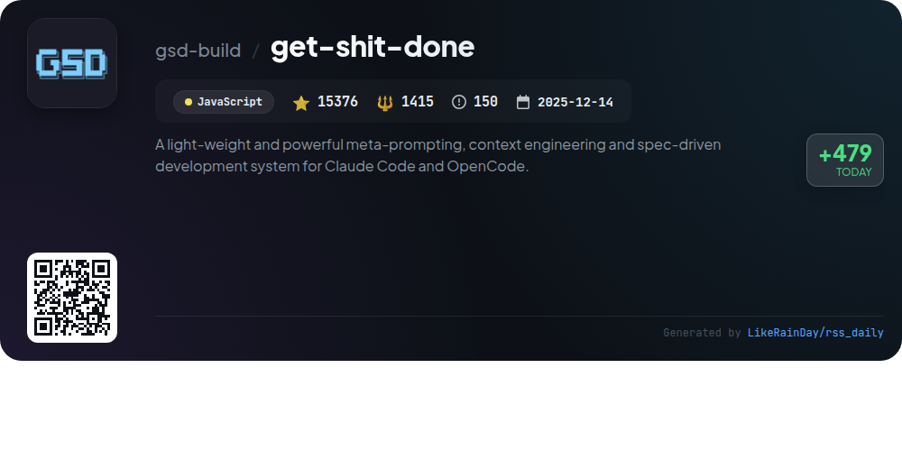
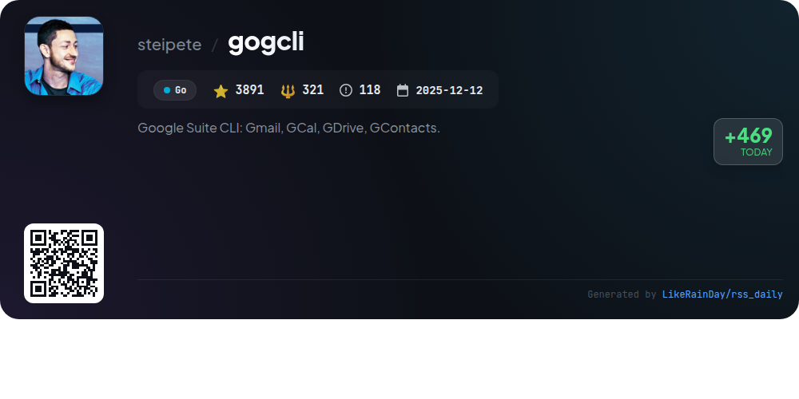
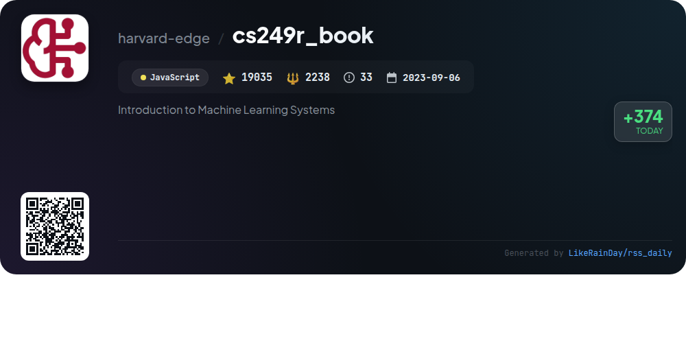
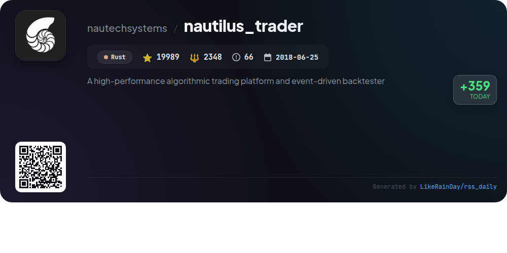
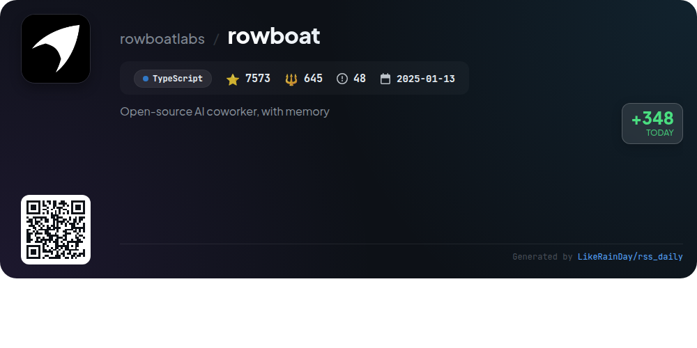
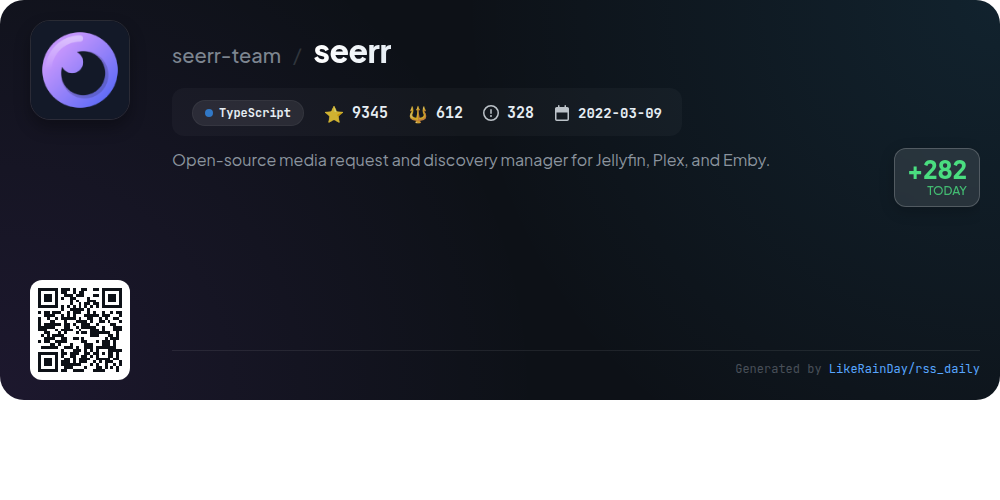
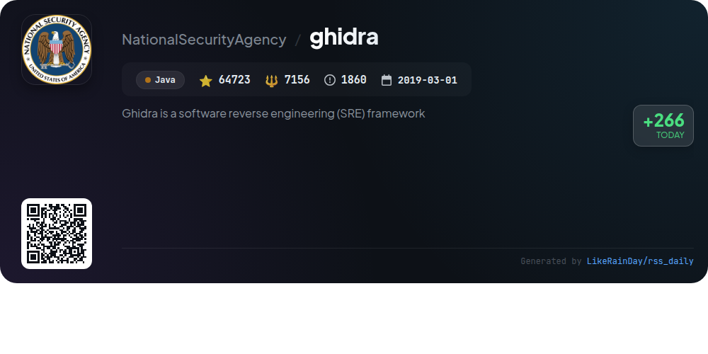

# 📊 🌟 GitHub Trending Daily - 2026-02-18

> > 📅 每日精选 GitHub 热门仓库 | 基于智能算法推荐

## 📋 Overview

**10** 个项目 | **382939** ⭐ | **59783** 🍴

**热门语言:** `TypeScript` (3) · `Java` (2) · `JavaScript` (2)

**更新时间:** 2026-02-18 02:47 UTC

**分类分布:**

- 🌟 每日 Top 10 精选 (10 项)

---

## 🌟 每日 Top 10 精选

### 1. [openclaw](https://github.com/openclaw/openclaw)

> 🤖 **推荐理由**  
> *OpenClaw is a versatile personal AI assistant that operates on any platform and OS, providing seamless integration with various messaging channels like WhatsApp, Telegram, Slack, and Discord. Key features include a local-first Gateway for managing sessions and channels, multi-channel inbox support, voice activation, and a live Canvas for visual interaction. Users can customize their experience with onboarding wizards and various skills. OpenClaw ensures user security with robust DM policies and supports multiple AI models, making it a comprehensive solution for personal assistance.*

- ⭐ 205646 stars
- 💻 TypeScript
- 📅 Updated: 2026-02-18

### 2. [zvec](https://github.com/alibaba/zvec)

> 🤖 **推荐理由**  
> *Zvec is a lightweight, lightning-fast, in-process vector database designed for seamless integration into applications. Built on Alibaba's Proxima engine, it enables low-latency similarity searches for both dense and sparse vectors. Key features include hybrid search capabilities, minimal setup, and support for multi-vector queries. Zvec runs on Linux and macOS, making it versatile for various environments. With over 4,500 stars on GitHub, it is ideal for production workloads, providing exceptional speed and efficiency. Join the community for support and updates.*

- ⭐ 4517 stars
- 💻 C++
- 📅 Updated: 2026-02-18

### 3. [awesome-system-design-resources](https://github.com/ashishps1/awesome-system-design-resources)

> 🤖 **推荐理由**  
> *Awesome System Design Resources is a comprehensive GitHub repository aimed at helping users learn System Design concepts and prepare for interviews with free resources. Key features include in-depth explanations of core concepts like scalability, availability, and reliability, alongside networking and API fundamentals. The project offers practical interview problems, courses, newsletters, and curated articles and papers on distributed systems. With over 32,000 stars, it serves as a valuable resource for beginners and experienced developers alike, enhancing their System Design knowledge and interview readiness.*

- ⭐ 32844 stars
- 💻 Java
- 📅 Updated: 2026-02-18

### 4. [get-shit-done](https://github.com/gsd-build/get-shit-done)

> 🤖 **推荐理由**  
> *Get Shit Done (GSD) is a lightweight, powerful meta-prompting and context engineering system for Claude Code, OpenCode, and Gemini CLI. It addresses context rot, ensuring high-quality outputs by maintaining a fresh context window during development. Key features include streamlined project initialization, phase management (discuss, plan, execute, verify), and automated Git commits for each task. GSD is trusted by engineers at major companies like Amazon and Google, making it ideal for those seeking efficient, spec-driven development without the complexities of traditional workflows.*

- ⭐ 15376 stars
- 💻 JavaScript
- 📅 Updated: 2026-02-18

### 5. [gogcli](https://github.com/steipete/gogcli)

> 🤖 **推荐理由**  
> *gogcli is a powerful CLI tool for managing Google Suite services including Gmail, Calendar, Drive, and more, all from your terminal. Key features include multi-account support, JSON-first output for scripting, email tracking, event creation and management in Calendar, file handling in Drive, and contact management. It emphasizes security with least-privilege authentication, secure credential storage, and auto-refreshing tokens. With over 3,800 stars on GitHub, it's designed for efficiency and automation in a script-friendly environment.*

- ⭐ 3891 stars
- 💻 Go
- 📅 Updated: 2026-02-18

### 6. [cs249r_book](https://github.com/harvard-edge/cs249r_book)

> 🤖 **推荐理由**  
> *The cs249r_book project offers a comprehensive introduction to Machine Learning Systems, emphasizing the principles of AI engineering. With over 19,000 stars, it features an interactive textbook, TinyTorch framework for hands-on ML development, and hardware kits for real-world deployment on devices like Arduino and Raspberry Pi. Users can explore theoretical concepts, build frameworks, and engage in upcoming AI Olympics to benchmark their skills. The project aims to establish AI engineering as a foundational discipline, promoting efficient and reliable AI systems.*

- ⭐ 19035 stars
- 💻 JavaScript
- 📅 Updated: 2026-02-18

### 7. [nautilus_trader](https://github.com/nautechsystems/nautilus_trader)

> 🤖 **推荐理由**  
> *NautilusTrader is a high-performance, open-source algorithmic trading platform developed in Rust, designed for quantitative traders. It features an event-driven backtester for testing automated trading strategies on historical data and supports live deployments without code changes. Key highlights include modular integration with various REST APIs and WebSocket feeds, advanced order types, and support for multiple asset classes (FX, Crypto, Equities). The platform prioritizes performance, reliability, and safety, making it suitable for mission-critical trading environments.*

- ⭐ 19989 stars
- 💻 Rust
- 📅 Updated: 2026-02-18

### 8. [rowboat](https://github.com/rowboatlabs/rowboat)

> 🤖 **推荐理由**  
> *Rowboat is an open-source AI coworker designed to enhance productivity by creating a long-lived knowledge graph from your work, including emails and meeting notes. Key features include drafting documents, meeting preparation, and generating summaries—all while maintaining your data locally in Markdown format. Rowboat supports integrations with Gmail, Granola, and Fireflies, and allows for customizable background tasks. With the Model Context Protocol (MCP), it connects to various external tools, ensuring a flexible and efficient workflow.*

- ⭐ 7573 stars
- 💻 TypeScript
- 📅 Updated: 2026-02-18

### 9. [seerr](https://github.com/seerr-team/seerr)

> 🤖 **推荐理由**  
> *Seerr is an open-source media request and discovery manager designed for Jellyfin, Plex, and Emby, boasting over 9,300 stars on GitHub. Key features include seamless integration with these media servers, support for PostgreSQL and SQLite databases, and a user-friendly request management system. Users can request movies and shows, manage permissions, and receive notifications. The platform is mobile-friendly and supports integration with Sonarr and Radarr for enhanced media management. For installation and documentation, visit https://docs.seerr.dev/getting-started/.*

- ⭐ 9345 stars
- 💻 TypeScript
- 📅 Updated: 2026-02-18

### 10. [ghidra](https://github.com/NationalSecurityAgency/ghidra)

> 🤖 **推荐理由**  
> *Ghidra is a powerful software reverse engineering (SRE) framework developed by the NSA, featuring advanced tools for analyzing compiled code across Windows, macOS, and Linux. Key capabilities include disassembly, decompilation, graphing, and scripting, supporting diverse processor instruction sets and executable formats. Ghidra allows users to create custom scripts and extensions in Java and Python, enhancing its functionality. Designed for scalability in cybersecurity efforts, Ghidra aids analysts in understanding vulnerabilities in systems and networks.*

- ⭐ 64723 stars
- 💻 Java
- 📅 Updated: 2026-02-18

---

## 📡 RSS订阅

通过 RSS 订阅，第一时间获取每日精选项目：

- 🔔 [RSS 订阅源] (../../daily-top.xml)
- 🔔 [每日简报] (../../GITHUB_TODAY_CN.md)
- 🔔 [每日 Top 10 精选](../../daily-top.xml)

---

*⚡ Powered by Smart Trending Algorithm | Generated at 2026-02-18 02:47:07 UTC
