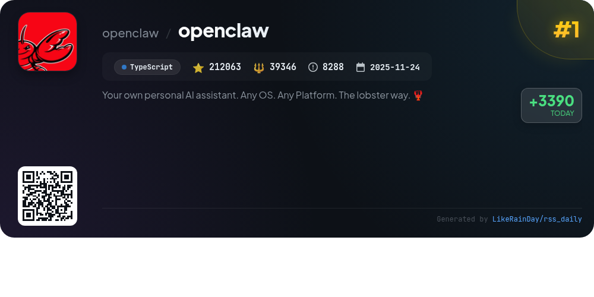
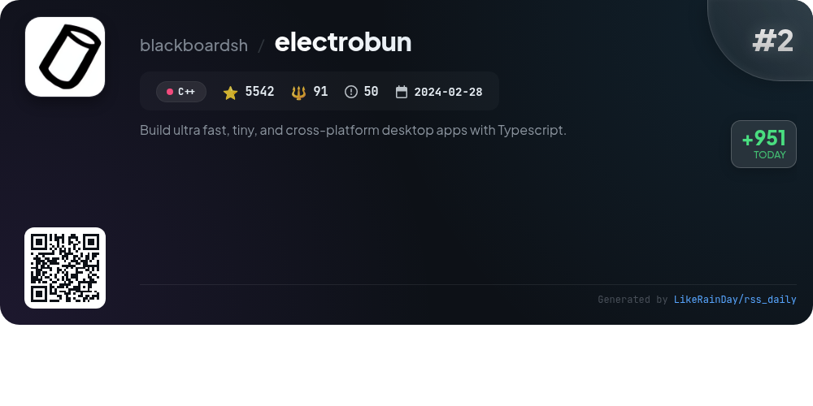
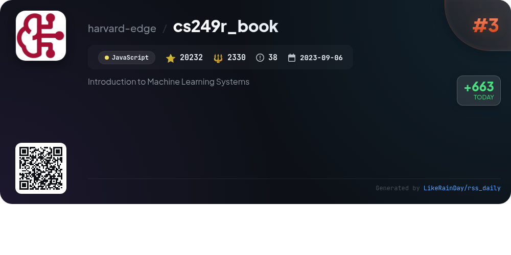
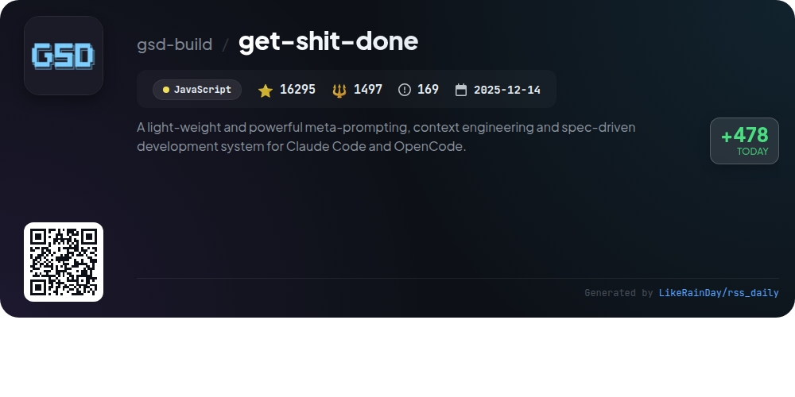
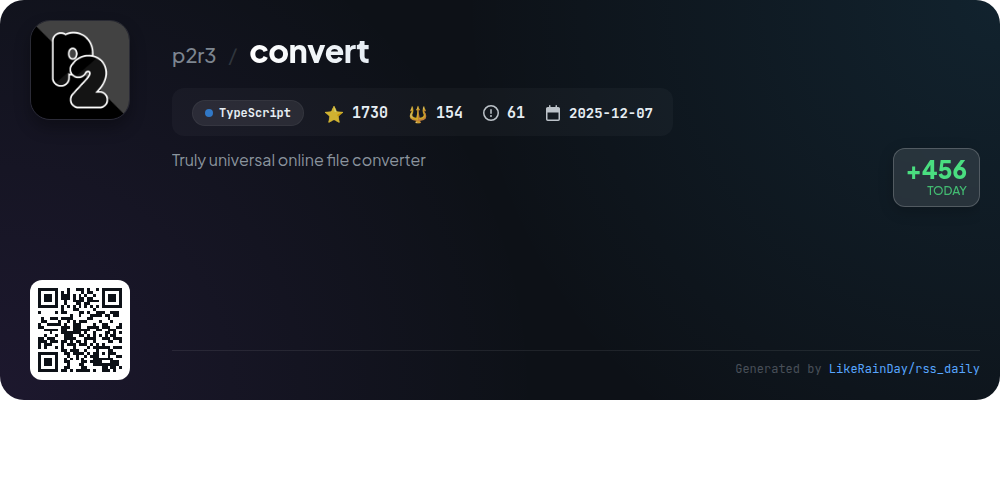
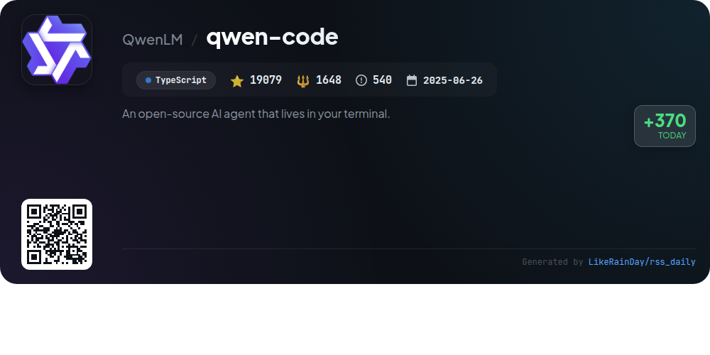
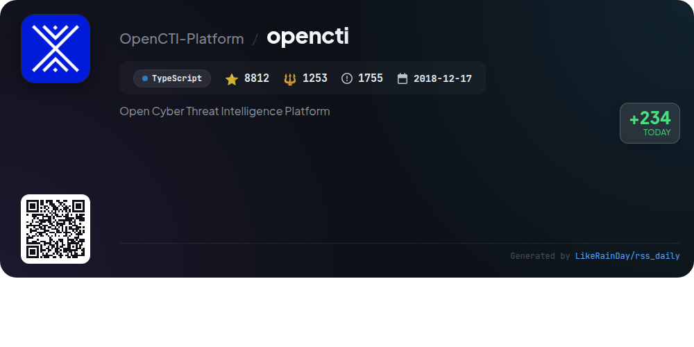
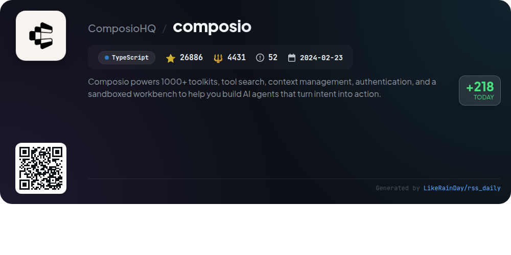
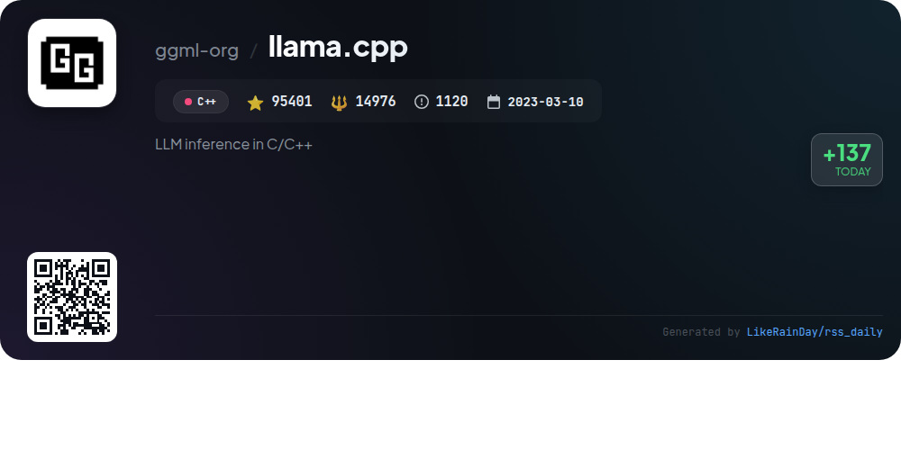

# 📊 🌟 GitHub Trending Daily - 2026-02-20

> > 📅 Daily Picks of GitHub Trending Repositories | Powered by Smart Algorithms

## 📋 Overview

**10** Projects | **407817** ⭐ | **65789** 🍴

**Top Languages:** `TypeScript` (5) · `C++` (3) · `JavaScript` (2)

**Updated:** 2026-02-20 02:41 UTC

**Categories:**

- 🌟 Daily Top 10 (10 items)

---

## 🌟 Daily Top 10

### 1. [openclaw](https://github.com/openclaw/openclaw)

> 🤖 **Why Recommend**  
> *OpenClaw is a versatile personal AI assistant designed for any operating system and platform. It integrates with popular messaging channels like WhatsApp, Telegram, Slack, and Discord, enabling seamless communication. Key features include a local-first gateway for control, multi-channel inbox support, voice wake capabilities, and a live canvas for visual interactions. Users can easily set up through an onboarding wizard, and it supports various AI models for personalized assistance. With a focus on privacy and security, OpenClaw is ideal for those seeking a fast, always-on assistant.*

- ⭐ 212063 stars
- 💻 TypeScript
- 📅 Updated: 2026-02-20

### 2. [electrobun](https://github.com/blackboardsh/electrobun)

> 🤖 **Why Recommend**  
> *Electrobun is a powerful framework for building ultra-fast, tiny, cross-platform desktop applications using TypeScript. With a streamlined workflow, developers can quickly initialize projects and create self-extracting app bundles (~12MB) that support efficient updates (as small as 14KB). Key features include isolation between main and webview processes with easy RPC, and a focus on simplicity in coding and distribution. Notable applications like Audio TTS and Co(lab) showcase its capabilities. Visit electrobun.dev for documentation and resources.*

- ⭐ 5542 stars
- 💻 C++
- 📅 Updated: 2026-02-20

### 3. [cs249r_book](https://github.com/harvard-edge/cs249r_book)

> 🤖 **Why Recommend**  
> *cs249r_book is an open-source educational resource focused on "Machine Learning Systems," emphasizing the engineering of reliable AI systems rather than isolated models. The project includes a comprehensive online textbook, TinyTorch—a framework for building ML systems, and hands-on hardware labs for deployment on devices like Arduino and Raspberry Pi. With over 20,000 stars, it fosters a community-driven approach to learning AI engineering, aiming for 1 million learners by 2030. The content is available in multiple languages, and a hardcopy edition is set for 2026.*

- ⭐ 20232 stars
- 💻 JavaScript
- 📅 Updated: 2026-02-20

### 4. [pyrite64](https://github.com/HailToDodongo/pyrite64)

> 🤖 **Why Recommend**  
> *Pyrite64 is an innovative N64 game engine and editor, built using Libdragon and tiny3d, designed for creating 3D games for real N64 consoles and accurate emulators. Key features include a visual editor, automatic Windows toolchain installation, GLTF model import with material support, HDR+Bloom rendering, and big-texture capabilities. The runtime engine manages scene handling, rendering, and audio, while a Node-Graph editor simplifies scripting. This early-development project emphasizes real hardware compatibility and requires accurate emulators like Ares and gopher64.*

- ⭐ 1777 stars
- 💻 C++
- 📅 Updated: 2026-02-20

### 5. [get-shit-done](https://github.com/gsd-build/get-shit-done)

> 🤖 **Why Recommend**  
> *Get Shit Done (GSD) is a lightweight, powerful meta-prompting and context engineering system designed for Claude Code, OpenCode, and Gemini CLI. It effectively combats context rot, ensuring high-quality code generation through a structured workflow. Key features include streamlined project initialization, phase management, and atomic Git commits, which enhance collaboration and traceability. GSD is trusted by engineers at major companies like Amazon and Google, offering a frictionless development experience with minimal complexity. It supports rapid development across multiple platforms, making it ideal for solo developers and small teams.*

- ⭐ 16295 stars
- 💻 JavaScript
- 📅 Updated: 2026-02-20

### 6. [convert](https://github.com/p2r3/convert)

> 🤖 **Why Recommend**  
> *Convert.to.it is a versatile online file converter that supports a wide range of formats beyond traditional constraints, enabling conversions like AVI to PDF. Designed for privacy, it avoids server uploads, ensuring user data security. The platform features an intuitive interface for easy file uploads and format selections, aiming to deliver reliable outputs even when expectations are not met. With a collaborative approach, users can contribute by suggesting new formats, provided they follow specific guidelines. The project is built in TypeScript and welcomes contributions to expand its capabilities.*

- ⭐ 1730 stars
- 💻 TypeScript
- 📅 Updated: 2026-02-20

### 7. [qwen-code](https://github.com/QwenLM/qwen-code)

> 🤖 **Why Recommend**  
> *Qwen Code is an open-source AI agent designed for terminal use, optimized for code understanding and automation. Key features include multi-protocol support for OpenAI, Anthropic, and Gemini APIs, along with a free tier via Qwen OAuth. It offers a rich agentic workflow with built-in tools and is IDE-friendly, integrating with VS Code, Zed, and JetBrains. Users can operate in interactive or headless modes, and configure via settings.json or environment variables. With over 19,000 stars, Qwen Code is a powerful tool for developers seeking efficiency and enhanced productivity in coding tasks.*

- ⭐ 19079 stars
- 💻 TypeScript
- 📅 Updated: 2026-02-20

### 8. [opencti](https://github.com/OpenCTI-Platform/opencti)

> 🤖 **Why Recommend**  
> *OpenCTI is an open-source Cyber Threat Intelligence Platform designed to manage and visualize cyber threat data. Built with TypeScript, it supports the STIX2 standard for data structuring and offers a user-friendly web application with a GraphQL API. Key features include integration with tools like MISP and MITRE ATT&CK, automated data import/export in various formats, and a dual-edition model (Community and Enterprise). OpenCTI enables organizations to link and analyze technical and non-technical threat information, facilitating informed decision-making.*

- ⭐ 8812 stars
- 💻 TypeScript
- 📅 Updated: 2026-02-20

### 9. [composio](https://github.com/ComposioHQ/composio)

> 🤖 **Why Recommend**  
> *Composio is a powerful SDK that enables the creation of AI agents by leveraging over 1000 toolkits, offering features like tool search, context management, and authentication. It provides seamless integration for both TypeScript and Python, allowing developers to build agents that convert user intent into actionable tasks. Notable highlights include support for major AI frameworks such as OpenAI and Anthropic, and the Rube platform, which connects AI tools to 500+ applications. With 26,886 stars on GitHub, Composio stands out as a versatile solution for AI development.*

- ⭐ 26886 stars
- 💻 TypeScript
- 📅 Updated: 2026-02-20

### 10. [llama.cpp](https://github.com/ggml-org/llama.cpp)

> 🤖 **Why Recommend**  
> *llama.cpp is a high-performance library for large language model (LLM) inference implemented in C/C++. It supports various architectures, including optimized ARM for Apple Silicon and AVX for x86. Key features include extensive model quantization options, a lightweight HTTP server compatible with OpenAI APIs, and multimodal capabilities. Users can easily install via package managers or Docker, run models locally or from Hugging Face, and utilize a command-line interface for streamlined interactions. With over 95,000 stars, it serves as a robust playground for LLM development and experimentation.*

- ⭐ 95401 stars
- 💻 C++
- 📅 Updated: 2026-02-20

---

## 📡 RSS Subscription

Subscribe via RSS to get daily trending updates:

- 🔔 [RSS XML] (../../daily-top.xml)
- 🔔 [Daily Report] (../../GITHUB_TODAY.md)
- 🔔 [Daily Top 10](../../daily-top.xml)

---

*⚡ Powered by Smart Trending Algorithm | Generated at 2026-02-20 02:41:52 UTC
