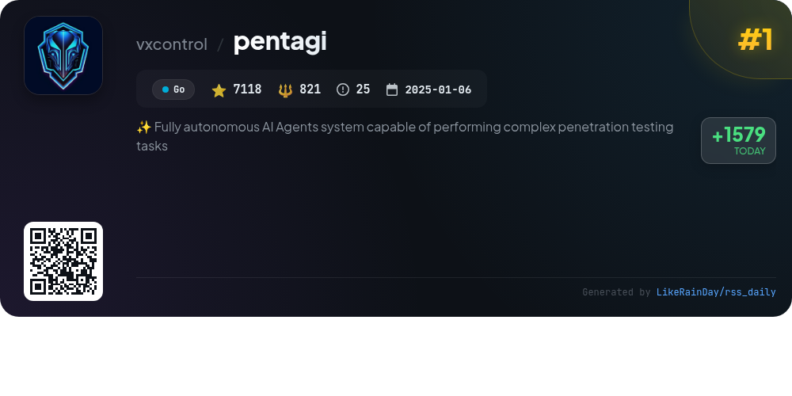
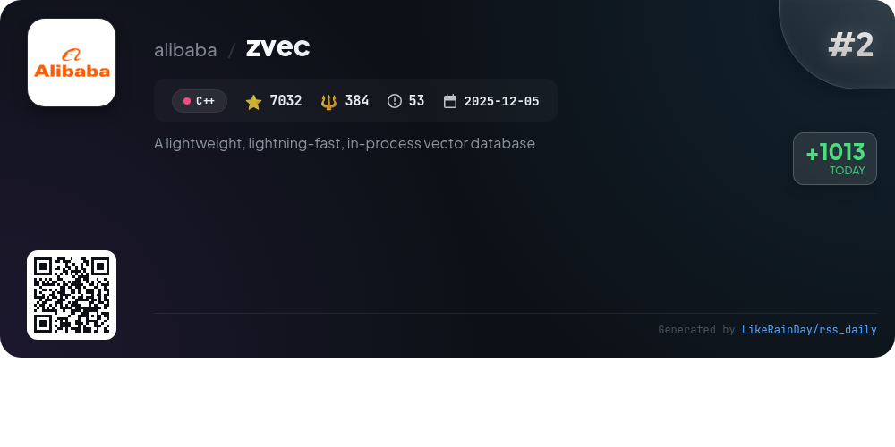
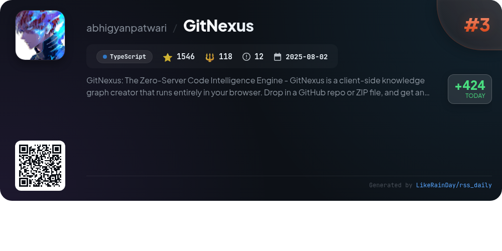
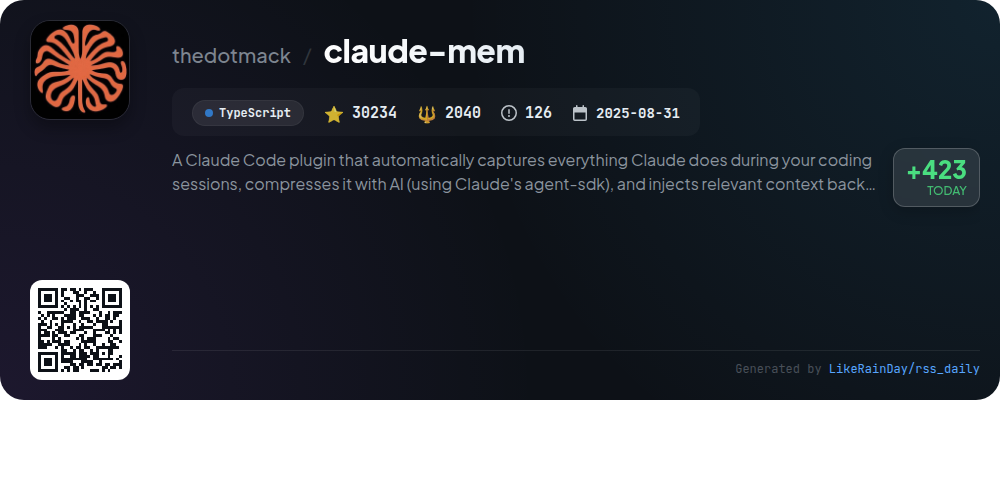
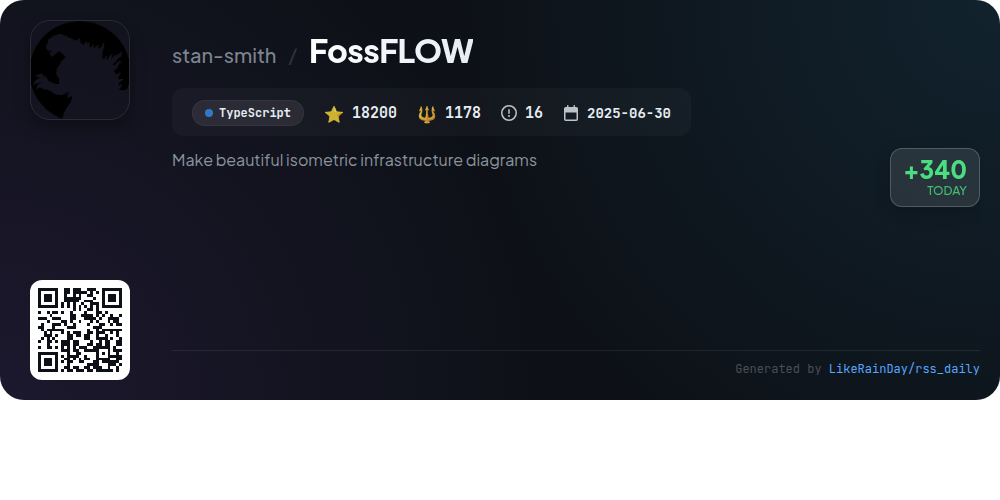
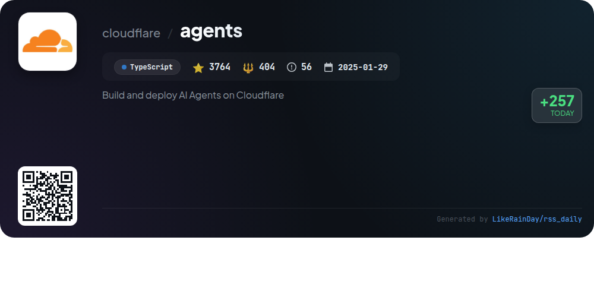
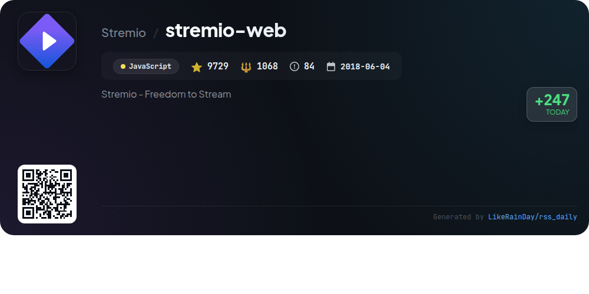
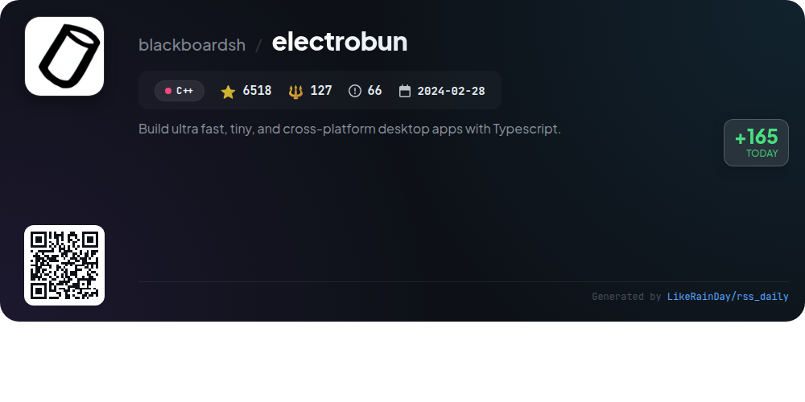
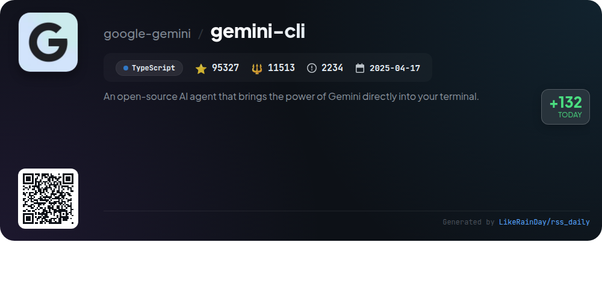
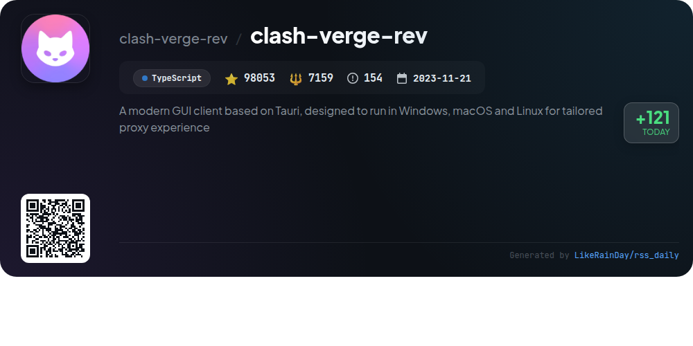

# 📊 🌟 GitHub Trending Daily - 2026-02-23

> > 📅 每日精选 GitHub 热门仓库 | 基于智能算法推荐

## 📋 Overview

**10** 个项目 | **277521** ⭐ | **24812** 🍴

**热门语言:** `TypeScript` (6) · `C++` (2) · `JavaScript` (1)

**更新时间:** 2026-02-23 02:47 UTC

**分类分布:**

- 🌟 每日 Top 10 精选 (10 项)

---

## 🌟 每日 Top 10 精选

### 1. [pentagi](https://github.com/vxcontrol/pentagi)

> 🤖 **推荐理由**  
> *PentAGI is a fully autonomous AI agents system designed for complex penetration testing tasks, utilizing advanced AI technologies. Key features include a secure Docker environment, a suite of 20+ professional security tools, a smart memory system for long-term knowledge retention, and comprehensive APIs for integration. The system supports multiple LLM providers, ensuring flexibility and scalability. With detailed reporting, real-time monitoring via Grafana, and a modern web UI, PentAGI streamlines penetration testing for security professionals, researchers, and ethical hackers.*

- ⭐ 7118 stars
- 💻 Go
- 📅 Updated: 2026-02-23

### 2. [zvec](https://github.com/alibaba/zvec)

> 🤖 **推荐理由**  
> *Zvec is a lightweight, in-process vector database designed for high-performance similarity searches. Built on Alibaba's Proxima engine, it offers lightning-fast querying of billions of vectors with minimal setup. Key features include support for both dense and sparse vectors, hybrid search capabilities, and seamless integration into applications across various platforms (Linux, macOS). With a simple installation process for Python and Node.js, Zvec ensures efficient performance for demanding workloads while maintaining a user-friendly interface. Join the community for support and updates.*

- ⭐ 7032 stars
- 💻 C++
- 📅 Updated: 2026-02-23

### 3. [GitNexus](https://github.com/abhigyanpatwari/GitNexus)

> 🤖 **推荐理由**  
> *GitNexus is a zero-server code intelligence engine that creates a client-side knowledge graph from your codebase, running entirely in the browser. Users can analyze GitHub repositories or ZIP files to generate interactive graphs, enabling efficient code exploration. Key features include a Web UI for quick chats and visual exploration, a CLI with a Model Context Protocol (MCP) for deep integration with AI agents, and tools for impact analysis, change detection, and multi-file renaming. GitNexus supports multiple languages and prioritizes privacy, processing everything locally or in-browser.*

- ⭐ 1546 stars
- 💻 TypeScript
- 📅 Updated: 2026-02-23

### 4. [claude-mem](https://github.com/thedotmack/claude-mem)

> 🤖 **推荐理由**  
> *Claude-Mem is a TypeScript plugin for Claude Code that enhances coding sessions by automatically capturing activities, generating AI-compressed summaries, and maintaining contextual continuity across sessions. Key features include persistent memory, skill-based search, a web viewer UI, and privacy controls. With automatic operation and citations for past observations, users can efficiently manage project context. Additionally, it offers integration with OpenClaw gateways for seamless setup. This tool is designed to optimize workflow and knowledge retention in programming environments.*

- ⭐ 30234 stars
- 💻 TypeScript
- 📅 Updated: 2026-02-23

### 5. [FossFLOW](https://github.com/stan-smith/FossFLOW)

> 🤖 **推荐理由**  
> *FossFLOW is a powerful open-source Progressive Web App (PWA) designed for creating stunning isometric infrastructure diagrams. Built with TypeScript and React, it features an intuitive drag-and-drop interface, allowing users to easily add and connect components. Key highlights include offline support, session and JSON-based storage options, and a Docker deployment option for persistent storage. FossFLOW promotes collaboration with a welcoming contribution guide. With over 18,200 stars, it stands out as a popular choice for diagramming needs in the tech community.*

- ⭐ 18200 stars
- 💻 TypeScript
- 📅 Updated: 2026-02-23

### 6. [agents](https://github.com/cloudflare/agents)

> 🤖 **推荐理由**  
> *Cloudflare Agents is a TypeScript-based framework that enables the creation and deployment of stateful AI agents on Cloudflare, utilizing Durable Objects. With 3,764 stars, it provides features such as persistent state synchronization, callable methods via RPC, real-time WebSocket communication, scheduling for tasks, and AI chat capabilities. Agents can hibernate when idle, allowing for scalable, cost-effective solutions. Additional services include workflows, email routing, and SQL queries. The project supports integrations with React and vanilla JavaScript, making it versatile for various applications.*

- ⭐ 3764 stars
- 💻 TypeScript
- 📅 Updated: 2026-02-23

### 7. [stremio-web](https://github.com/Stremio/stremio-web)

> 🤖 **推荐理由**  
> *Stremio is a modern media center that empowers users to discover, watch, and organize video content seamlessly through easily installable addons. With a focus on user experience, it provides a comprehensive platform for video entertainment. Key features include a user-friendly interface, extensive content discovery options, and support for Docker deployment. Built with JavaScript, the project has garnered significant community interest, reflected in its 9729 stars on GitHub. Stremio is open-source under the GPLv2 license, encouraging collaboration and enhancement.*

- ⭐ 9729 stars
- 💻 JavaScript
- 📅 Updated: 2026-02-23

### 8. [electrobun](https://github.com/blackboardsh/electrobun)

> 🤖 **推荐理由**  
> *Electrobun is a powerful framework for creating ultra-fast, lightweight, cross-platform desktop applications using TypeScript. It simplifies the development process by enabling developers to write TypeScript for both the main process and webviews, ensuring a seamless RPC communication. Key features include small self-extracting app bundles (~12MB) and efficient updates as small as 14KB. Electrobun provides a complete development workflow with quick setup through templates, making it easy to start coding in minutes. Notable applications built with Electrobun include Audio TTS and Co(lab).*

- ⭐ 6518 stars
- 💻 C++
- 📅 Updated: 2026-02-23

### 9. [gemini-cli](https://github.com/google-gemini/gemini-cli)

> 🤖 **推荐理由**  
> *Gemini CLI is an open-source AI agent that integrates Gemini's capabilities into your terminal, designed for developers. It offers a free tier with 60 requests/min and features powerful Gemini 3 models with a 1M token context window. Key functionalities include code understanding and generation, automation of operational tasks, Google Search grounding, and extensibility via Model Context Protocol (MCP). Integration with GitHub workflows allows for automated code reviews and issue triaging. Installation is straightforward via npm or Homebrew, making it accessible for all users.*

- ⭐ 95327 stars
- 💻 TypeScript
- 📅 Updated: 2026-02-23

### 10. [clash-verge-rev](https://github.com/clash-verge-rev/clash-verge-rev)

> 🤖 **推荐理由**  
> *Clash Verge Rev is a modern GUI client built on Tauri, providing a tailored proxy experience across Windows, macOS, and Linux. With over 98,000 stars, it features a user-friendly interface with customizable themes and advanced configuration management. Key functionalities include support for Clash.Meta, system proxy management, visual node editing, and WebDav backup. The project emphasizes high performance, offering 12-hour customer support and competitive pricing for VPN services, including unique features like QUIC protocol support for enhanced speed.*

- ⭐ 98053 stars
- 💻 TypeScript
- 📅 Updated: 2026-02-23

---

## 📡 RSS订阅

通过 RSS 订阅，第一时间获取每日精选项目：

- 🔔 [RSS 订阅源] (../../daily-top.xml)
- 🔔 [每日简报] (../../GITHUB_TODAY_CN.md)
- 🔔 [每日 Top 10 精选](../../daily-top.xml)

---

*⚡ Powered by Smart Trending Algorithm | Generated at 2026-02-23 02:47:26 UTC
