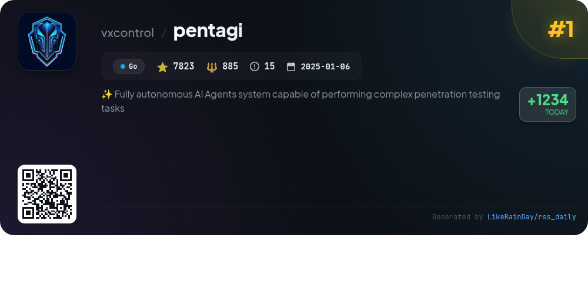
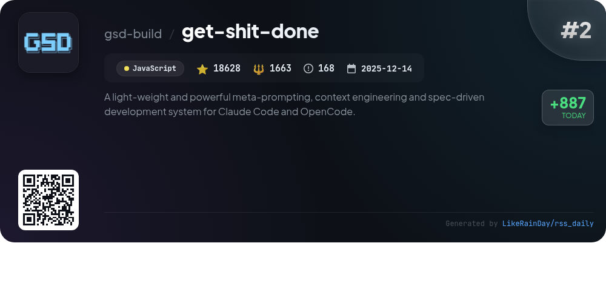
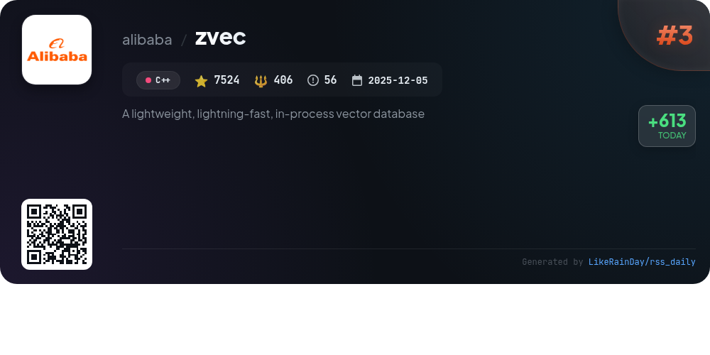
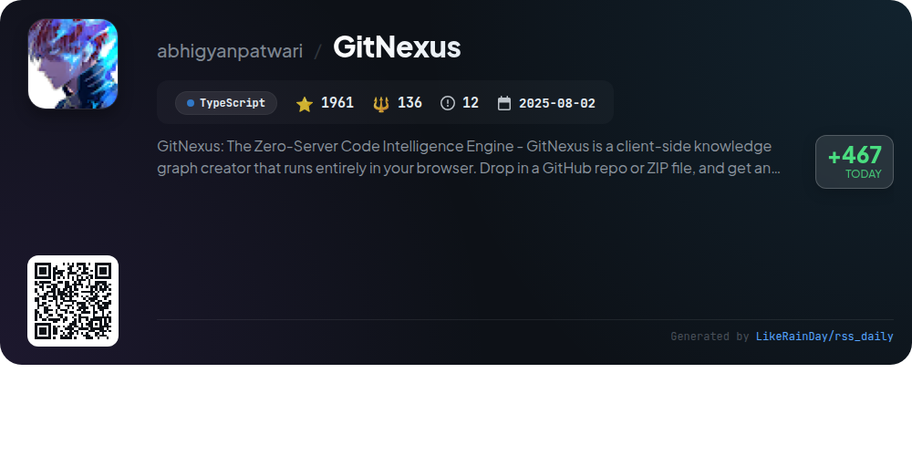
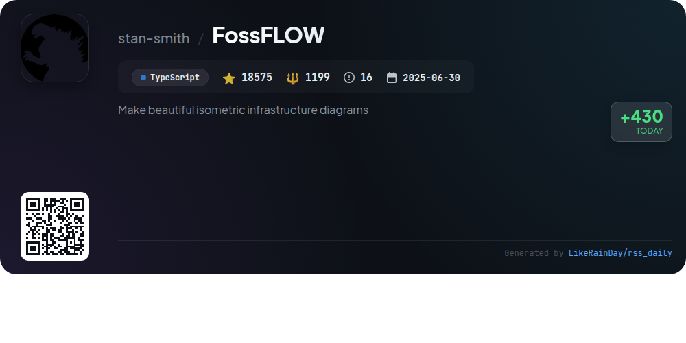
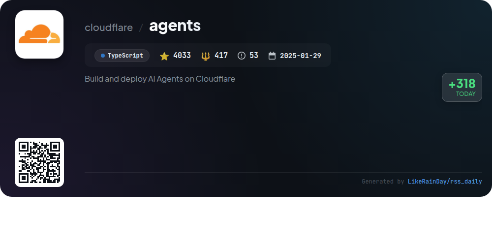
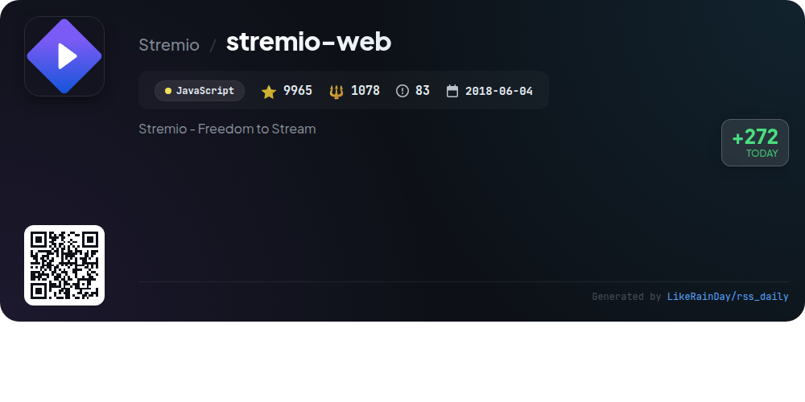
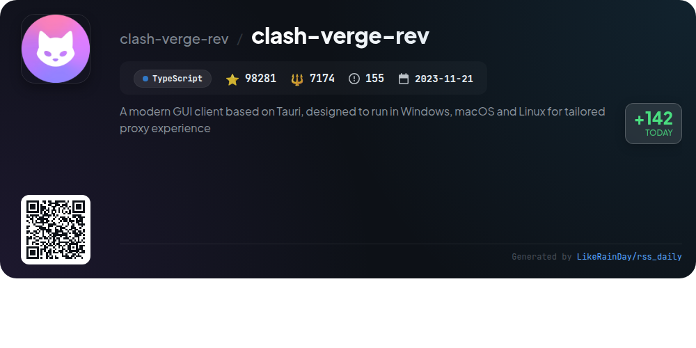
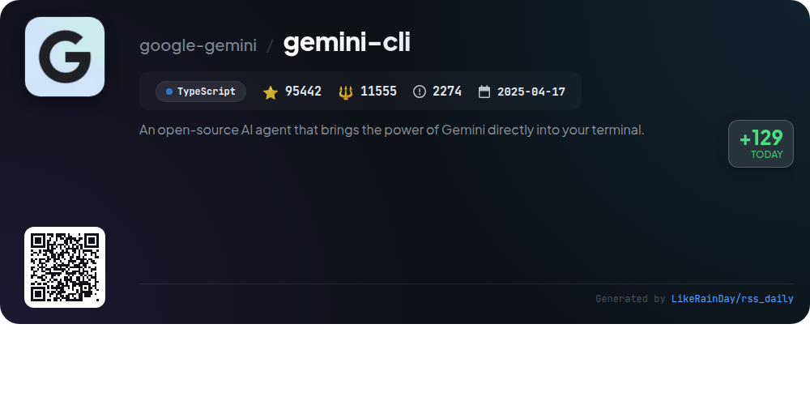

# 📊 🌟 GitHub Trending Daily - 2026-02-24

> > 📅 每日精选 GitHub 热门仓库 | 基于智能算法推荐

## 📋 Overview

**10** 个项目 | **295780** ⭐ | **27041** 🍴

**热门语言:** `TypeScript` (6) · `JavaScript` (2) · `C++` (1)

**更新时间:** 2026-02-24 02:46 UTC

**分类分布:**

- 🌟 每日 Top 10 精选 (10 项)

---

## 🌟 每日 Top 10 精选

### 1. [pentagi](https://github.com/vxcontrol/pentagi)

> 🤖 **推荐理由**  
> *PentAGI is a fully autonomous AI agents system designed for complex penetration testing, built with Go and boasting over 7,800 stars on GitHub. Key features include a secure Docker environment, a suite of 20+ professional security tools, a smart memory system for storing research findings, and comprehensive monitoring through Grafana and Prometheus. It integrates advanced search APIs and supports multiple LLM providers for flexible deployment. With a modern web UI and robust REST/GraphQL APIs, PentAGI streamlines automated security testing for professionals and researchers.*

- ⭐ 7823 stars
- 💻 Go
- 📅 Updated: 2026-02-24

### 2. [get-shit-done](https://github.com/gsd-build/get-shit-done)

> 🤖 **推荐理由**  
> *get-shit-done (GSD) is a lightweight, meta-prompting and context engineering system for Claude Code, OpenCode, Gemini CLI, and Codex, designed to combat context rot in AI-driven development. With over 18,600 stars, it streamlines the spec-driven development process through a series of structured commands: initialize projects, discuss and plan phases, execute tasks in parallel, and verify results—all while maintaining a fresh context. GSD facilitates atomic commits, ensuring clarity in version control, and is trusted by engineers at top tech companies. It enhances productivity by allowing users to focus on their vision without the complexities of traditional workflows.*

- ⭐ 18628 stars
- 💻 JavaScript
- 📅 Updated: 2026-02-24

### 3. [zvec](https://github.com/alibaba/zvec)

> 🤖 **推荐理由**  
> *Zvec is a lightweight, in-process vector database designed for high-performance similarity search, capable of handling billions of vectors in milliseconds. Built on Alibaba's Proxima engine, it supports both dense and sparse vectors, offers hybrid search capabilities, and requires minimal setup. Zvec can be easily integrated into applications across various platforms, including Linux and macOS. Key features include rapid installation, multi-vector query support, and exceptional scalability, making it ideal for demanding production workloads. Join the community for updates and support.*

- ⭐ 7524 stars
- 💻 C++
- 📅 Updated: 2026-02-24

### 4. [GitNexus](https://github.com/abhigyanpatwari/GitNexus)

> 🤖 **推荐理由**  
> *GitNexus is a client-side code intelligence engine that creates interactive knowledge graphs from GitHub repositories or ZIP files, all within the browser. Key features include a powerful CLI for local indexing, a browser-based UI for quick exploration, and integration with AI agents like Cursor and Claude Code. It offers tools for impact analysis, context retrieval, and documentation generation. With a focus on privacy, all operations occur locally, ensuring code security. GitNexus transforms code understanding through its precomputed relational intelligence, enhancing development efficiency.*

- ⭐ 1961 stars
- 💻 TypeScript
- 📅 Updated: 2026-02-24

### 5. [FossFLOW](https://github.com/stan-smith/FossFLOW)

> 🤖 **推荐理由**  
> *FossFLOW is an open-source Progressive Web App (PWA) designed for creating stunning isometric diagrams, built with React and the Isoflow library. It offers offline support, session and JSON file storage options, and an intuitive drag-and-drop interface for adding and connecting components. Key features include quick saving, auto-save functionality, and Docker support for easy deployment. With 18,575 stars on GitHub, FossFLOW is a valuable tool for visualizing infrastructure and network designs, inviting community contributions and continuous improvement.*

- ⭐ 18575 stars
- 💻 TypeScript
- 📅 Updated: 2026-02-24

### 6. [oh-my-opencode](https://github.com/code-yeongyu/oh-my-opencode)

> 🤖 **推荐理由**  
> *Oh My OpenCode is a powerful, free, and open-source agent harness designed for seamless orchestration of multiple AI models in software development. Key features include the `ultrawork` command for streamlined task execution, Discipline Agents for parallel processing, and a unique Hash-Anchored Edit Tool to ensure code accuracy. Integrated tools like LSP, AST-Grep, and built-in MCPs enhance productivity, while Prometheus aids in strategic planning. With over 33,500 stars on GitHub, it's a favored choice among developers seeking efficient, multi-model workflows.*

- ⭐ 33548 stars
- 💻 TypeScript
- 📅 Updated: 2026-02-24

### 7. [agents](https://github.com/cloudflare/agents)

> 🤖 **推荐理由**  
> *The Cloudflare Agents project enables the creation and deployment of stateful AI agents using TypeScript and Cloudflare Durable Objects. With over 4,000 stars, it offers persistent state management, real-time communication via WebSockets, and callable methods for seamless integration. Key features include scheduling, AI chat support, multi-channel communication, and SQL integration. The SDK supports both React and vanilla JavaScript environments, making it versatile for various applications. Extensive documentation and examples are provided for easy onboarding.*

- ⭐ 4033 stars
- 💻 TypeScript
- 📅 Updated: 2026-02-24

### 8. [stremio-web](https://github.com/Stremio/stremio-web)

> 🤖 **推荐理由**  
> *Stremio is a modern media center that empowers users to discover, watch, and organize video content seamlessly through easy-to-install addons. With over 9,965 stars on GitHub, it offers a user-friendly interface and features like a content discovery board and detailed metadata views. The project supports development with Node.js and pnpm, and can be easily run in production using Docker. Stremio is open-source, licensed under GPLv2, making it a versatile solution for video entertainment. Explore more at the [GitHub Page](https://stremio.github.io/stremio-web/development).*

- ⭐ 9965 stars
- 💻 JavaScript
- 📅 Updated: 2026-02-24

### 9. [clash-verge-rev](https://github.com/clash-verge-rev/clash-verge-rev)

> 🤖 **推荐理由**  
> *Clash Verge Rev is a modern GUI client built on Tauri, designed for Windows, macOS, and Linux, offering a tailored proxy experience. Key features include a sleek, customizable interface with theme support, configuration management, and enhanced proxy capabilities like TUN mode and WebDav backups. It integrates the powerful Clash.Meta core, ensuring high performance and security. With over 98,000 stars on GitHub, it provides extensive language support and a dedicated community, making it an ideal choice for users seeking a reliable proxy solution.*

- ⭐ 98281 stars
- 💻 TypeScript
- 📅 Updated: 2026-02-24

### 10. [gemini-cli](https://github.com/google-gemini/gemini-cli)

> 🤖 **推荐理由**  
> *Gemini CLI is an open-source AI agent that integrates the power of Gemini into your terminal, offering developers streamlined access to advanced AI capabilities. With features like powerful Gemini 3 models, automated code reviews, and built-in tools for Google Search and file operations, it enhances productivity. Users can enjoy a free tier of 60 requests/min and 1,000 requests/day, along with extensibility through the Model Context Protocol (MCP). Designed for terminal use, it supports various authentication methods and GitHub integration for enhanced workflows.*

- ⭐ 95442 stars
- 💻 TypeScript
- 📅 Updated: 2026-02-24

---

## 📡 RSS订阅

通过 RSS 订阅，第一时间获取每日精选项目：

- 🔔 [RSS 订阅源] (../../daily-top.xml)
- 🔔 [每日简报] (../../GITHUB_TODAY_CN.md)
- 🔔 [每日 Top 10 精选](../../daily-top.xml)

---

*⚡ Powered by Smart Trending Algorithm | Generated at 2026-02-24 02:46:10 UTC
