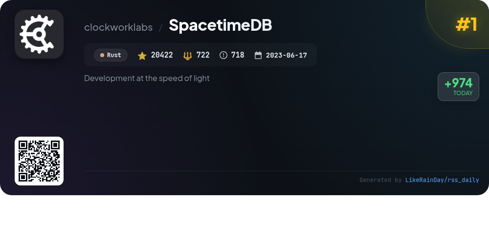
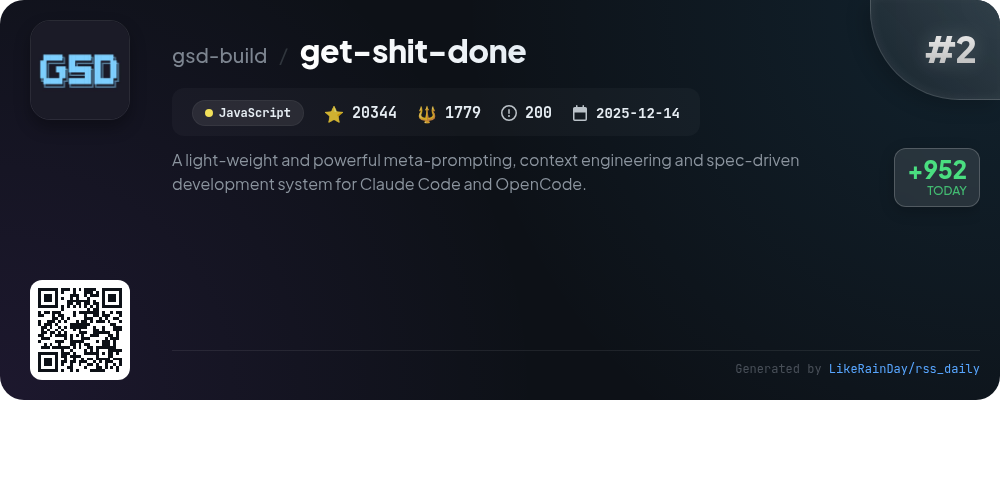
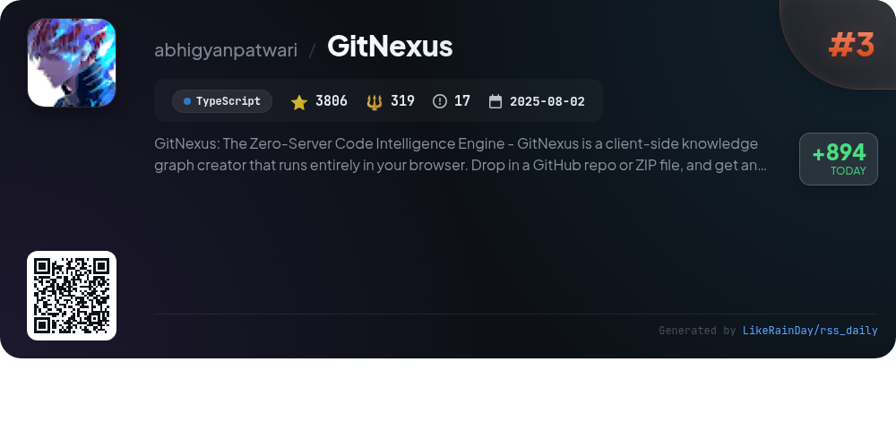
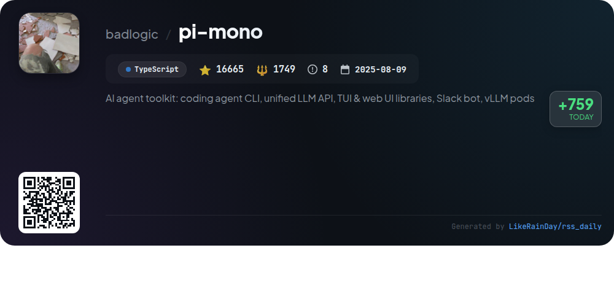
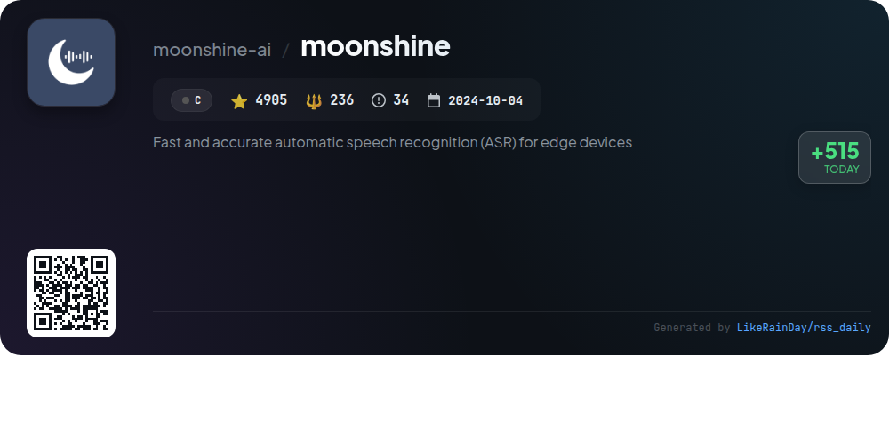
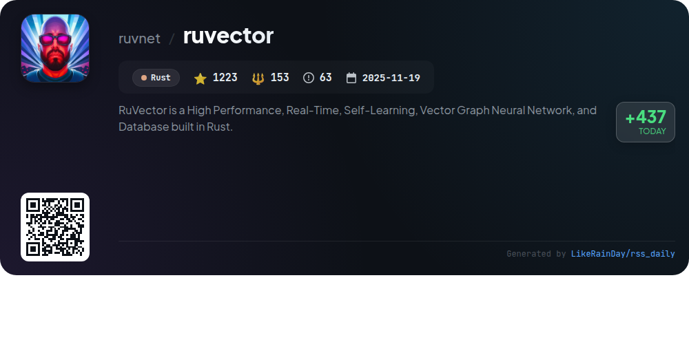
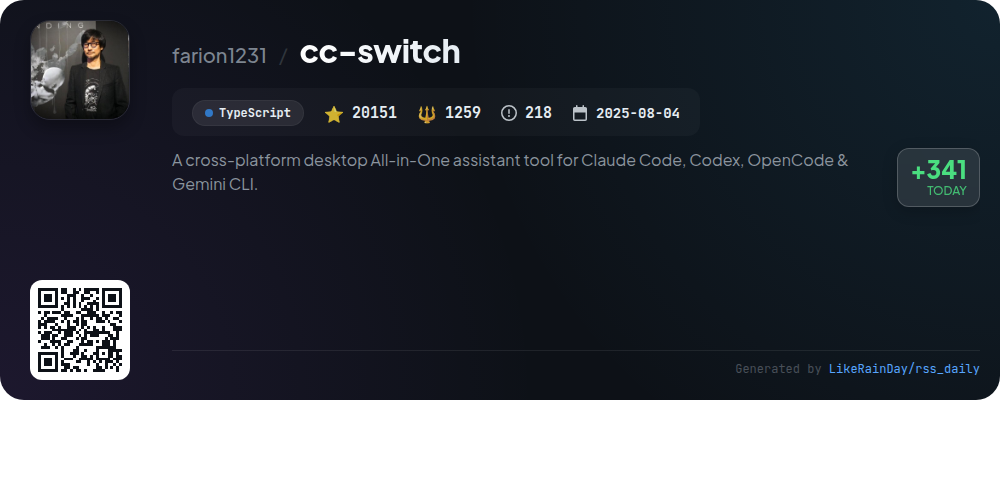
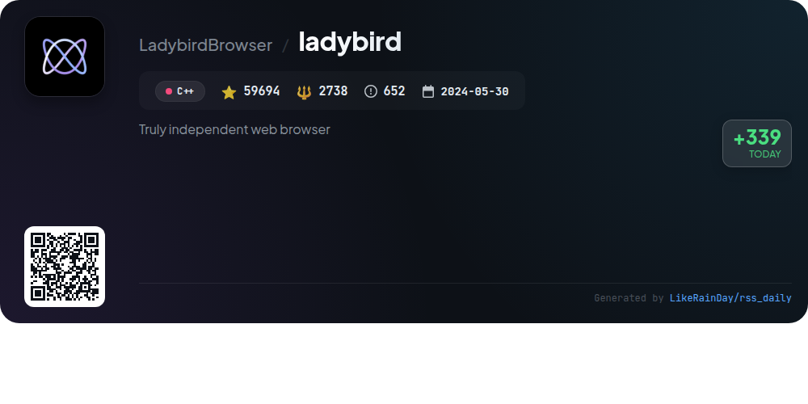
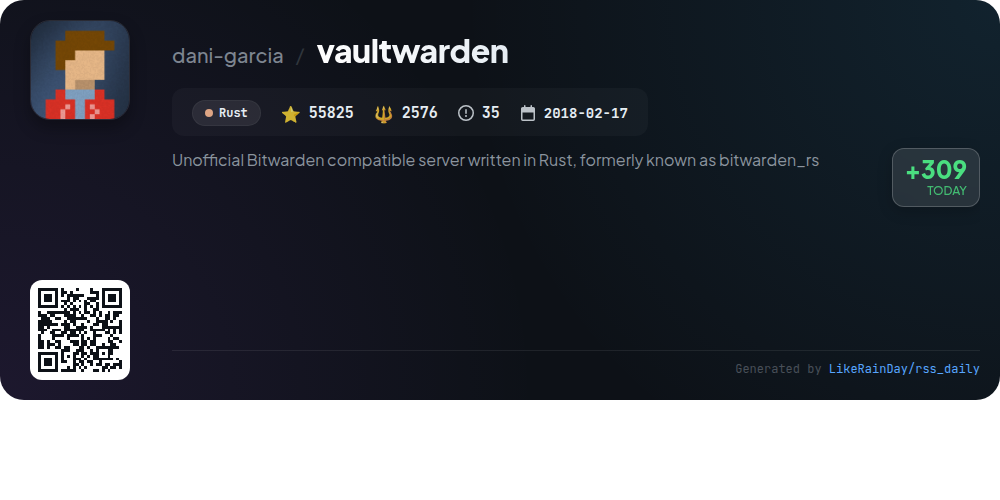
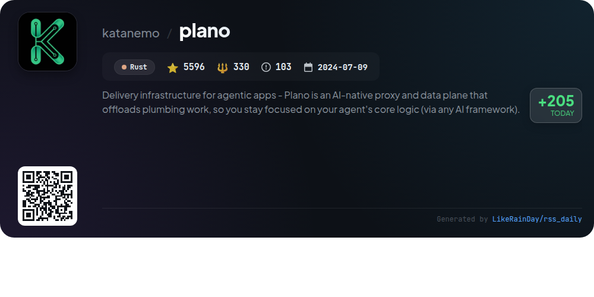

# 📊 🌟 GitHub Trending Daily - 2026-02-26

> > 📅 Daily Picks of GitHub Trending Repositories | Powered by Smart Algorithms

## 📋 Overview

**10** Projects | **208631** ⭐ | **11861** 🍴

**Top Languages:** `Rust` (4) · `TypeScript` (3) · `C++` (1)

**Updated:** 2026-02-26 02:40 UTC

**Categories:**

- 🌟 Daily Top 10 (10 items)

---

## 🌟 Daily Top 10

### 1. [SpacetimeDB](https://github.com/clockworklabs/SpacetimeDB)

> 🤖 **Why Recommend**  
> *SpacetimeDB is a high-performance relational database system built in Rust, designed for real-time applications like games and collaboration tools. It enables developers to upload application logic directly into the database through stored procedures called "modules," eliminating the need for intermediary servers. Key features include in-memory state management for low latency, support for multiple programming languages (Rust, C#, TypeScript), and seamless installation via CLI or Docker. With 20,422 stars on GitHub, SpacetimeDB is optimized for speed, making it ideal for applications requiring instant data processing.*

- ⭐ 20422 stars
- 💻 Rust
- 📅 Updated: 2026-02-26

### 2. [get-shit-done](https://github.com/gsd-build/get-shit-done)

> 🤖 **Why Recommend**  
> *get-shit-done is a lightweight meta-prompting and context engineering system designed for Claude Code, OpenCode, Gemini CLI, and Codex. It addresses context rot, ensuring high-quality code generation. Key features include streamlined project initialization, phase-based execution, automated verification, and atomic Git commits, enhancing project management and reliability. GSD is trusted by engineers from Amazon, Google, and Shopify, making it an effective tool for developers who want to efficiently build and deliver software without complex workflows.*

- ⭐ 20344 stars
- 💻 JavaScript
- 📅 Updated: 2026-02-26

### 3. [GitNexus](https://github.com/abhigyanpatwari/GitNexus)

> 🤖 **Why Recommend**  
> *GitNexus is a zero-server code intelligence engine that creates a client-side knowledge graph for GitHub repositories or ZIP files, enhancing code exploration. Key features include a web UI for interactive graph exploration and a CLI with a Model Context Protocol (MCP) for deep integration with AI agents like Cursor and Claude Code. It provides comprehensive insights into code relationships, dependencies, and execution flows, enabling efficient impact analysis and refactoring. With support for multiple languages and a focus on privacy, GitNexus transforms code understanding by precomputing structure for reliable AI interactions.*

- ⭐ 3806 stars
- 💻 TypeScript
- 📅 Updated: 2026-02-26

### 4. [pi-mono](https://github.com/badlogic/pi-mono)

> 🤖 **Why Recommend**  
> *pi-mono is an AI agent toolkit designed for building and managing AI agents and LLM deployments. Key features include a unified LLM API for multiple providers, an interactive coding agent CLI, Slack bot integration, and TUI/web UI libraries for creating AI chat interfaces. The project offers tools for tool calling and state management, alongside a CLI for managing vLLM deployments on GPU pods. With 16,665 stars on GitHub, pi-mono is a robust solution for developers looking to leverage AI capabilities in their applications.*

- ⭐ 16665 stars
- 💻 TypeScript
- 📅 Updated: 2026-02-26

### 5. [moonshine](https://github.com/moonshine-ai/moonshine)

> 🤖 **Why Recommend**  
> *Moonshine Voice is an open-source automatic speech recognition (ASR) toolkit designed for real-time voice applications on edge devices. It operates entirely on-device for speed and privacy, eliminating the need for accounts or API keys. Notable features include low-latency responses, support for multiple languages, and high-level APIs for tasks like transcription and intent recognition. Moonshine's models outperform Whisper's in accuracy and efficiency, especially for live speech. The library is cross-platform, supporting Python, iOS, Android, and more, making it accessible for developers to integrate voice interfaces seamlessly.*

- ⭐ 4905 stars
- 💻 C
- 📅 Updated: 2026-02-26

### 6. [ruvector](https://github.com/ruvnet/ruvector)

> 🤖 **Why Recommend**  
> *RuVector is a high-performance, real-time, self-learning vector graph neural network and database implemented in Rust. It supports advanced features like local LLM execution, dynamic graph queries, and self-booting microservices. RuVector learns from every query, optimizing search results over time. Key capabilities include cryptographically secure audit trails, offline operation, sublinear solvers, and the ability to run in various environments (browsers, IoT). It integrates seamlessly with AI orchestration platforms, making it ideal for complex data-driven applications.*

- ⭐ 1223 stars
- 💻 Rust
- 📅 Updated: 2026-02-26

### 7. [cc-switch](https://github.com/farion1231/cc-switch)

> 🤖 **Why Recommend**  
> *cc-switch is a cross-platform desktop assistant tool for managing Claude Code, Codex, and Gemini CLI, built with TypeScript and Tauri. It boasts over 20,000 stars and features a user-friendly interface, SQLite data management, and multi-language support (English, Chinese, Japanese). Key functionalities include provider management, API switching, skills management, and customizable prompts. The tool integrates multiple AI services and offers a range of sponsored API relay service options, ensuring users have efficient access to advanced AI coding capabilities.*

- ⭐ 20151 stars
- 💻 TypeScript
- 📅 Updated: 2026-02-26

### 8. [ladybird](https://github.com/LadybirdBrowser/ladybird)

> 🤖 **Why Recommend**  
> *Ladybird is an independent web browser currently in pre-alpha, designed for developers. It features a multi-process architecture for enhanced security, with separate processes for UI, rendering, image decoding, and network requests. Core components include LibWeb for rendering, LibJS for JavaScript, and LibCrypto for security. Ladybird supports multiple platforms, including Linux, macOS, and Windows (WSL2). The project welcomes contributions and offers comprehensive documentation for setup and development. Join the community on Discord to participate in discussions.*

- ⭐ 59694 stars
- 💻 C++
- 📅 Updated: 2026-02-26

### 9. [vaultwarden](https://github.com/dani-garcia/vaultwarden)

> 🤖 **Why Recommend**  
> *Vaultwarden is an unofficial, lightweight server implementation of the Bitwarden Client API, written in Rust, ideal for self-hosting. With over 55,800 stars on GitHub, it offers features such as a Personal Vault, Send functionality, multi-factor authentication, and organization management, including password sharing and event logs. Vaultwarden supports Docker deployment for easy installation and provides an admin backend for management. It is suitable for individuals, families, and small organizations seeking a resource-efficient alternative to the official Bitwarden server.*

- ⭐ 55825 stars
- 💻 Rust
- 📅 Updated: 2026-02-26

### 10. [plano](https://github.com/katanemo/plano)

> 🤖 **Why Recommend**  
> *Plano is an AI-native proxy and data plane designed for agentic applications, streamlining the delivery process by handling orchestration, model management, and observability. Key features include low-latency agent orchestration, flexible model routing, zero-code capture of agentic signals, and built-in moderation hooks. Built on Rust and Envoy, Plano allows developers to focus on core application logic while providing automatic tracing and the ability to integrate any AI framework. With comprehensive documentation and community support, Plano enhances the speed and safety of deploying agentic solutions.*

- ⭐ 5596 stars
- 💻 Rust
- 📅 Updated: 2026-02-26

---

## 📡 RSS Subscription

Subscribe via RSS to get daily trending updates:

- 🔔 [RSS XML] (../../daily-top.xml)
- 🔔 [Daily Report] (../../GITHUB_TODAY.md)
- 🔔 [Daily Top 10](../../daily-top.xml)

---

*⚡ Powered by Smart Trending Algorithm | Generated at 2026-02-26 02:40:56 UTC
