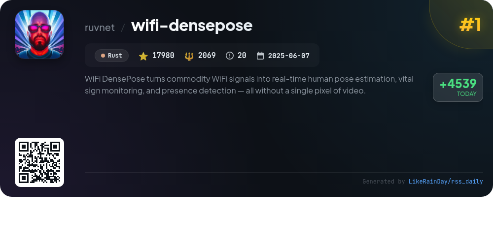
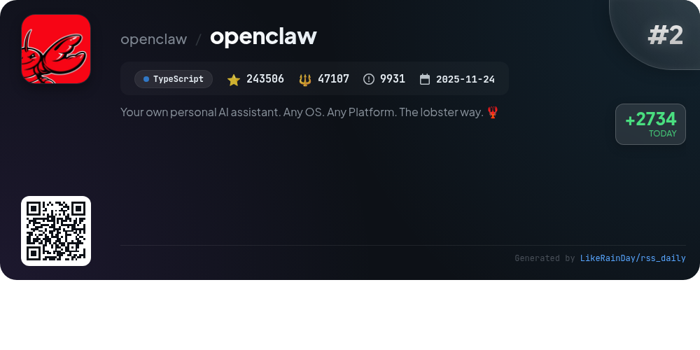
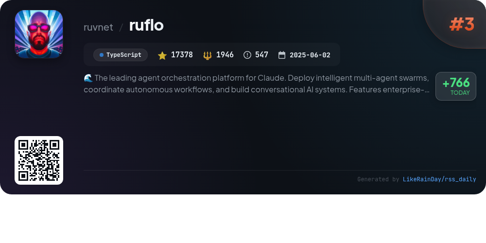
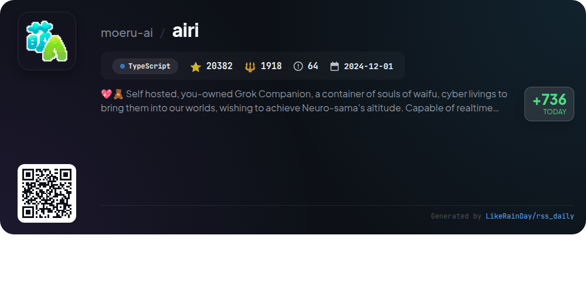
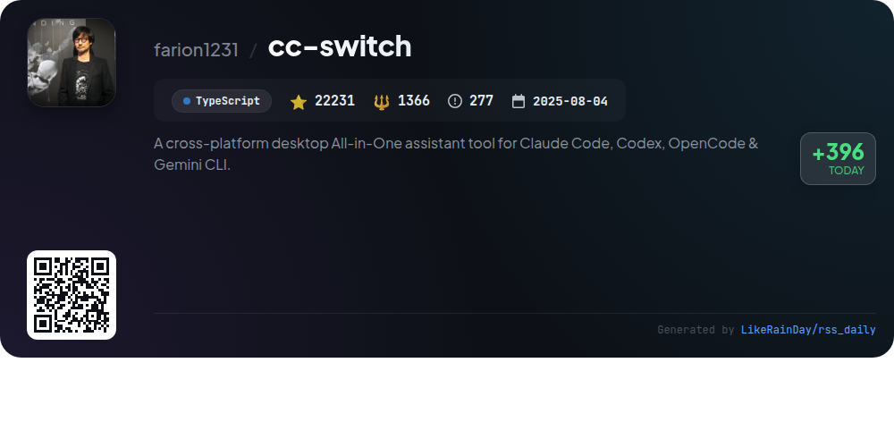
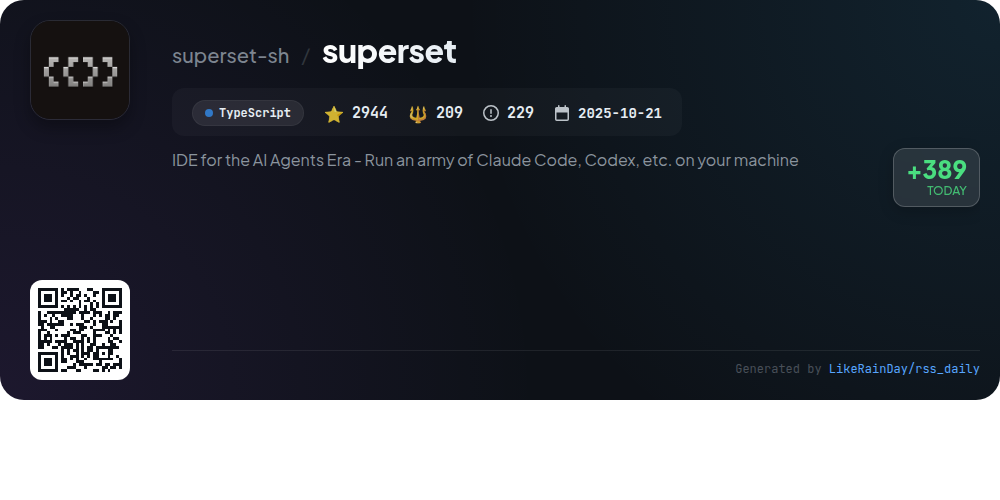
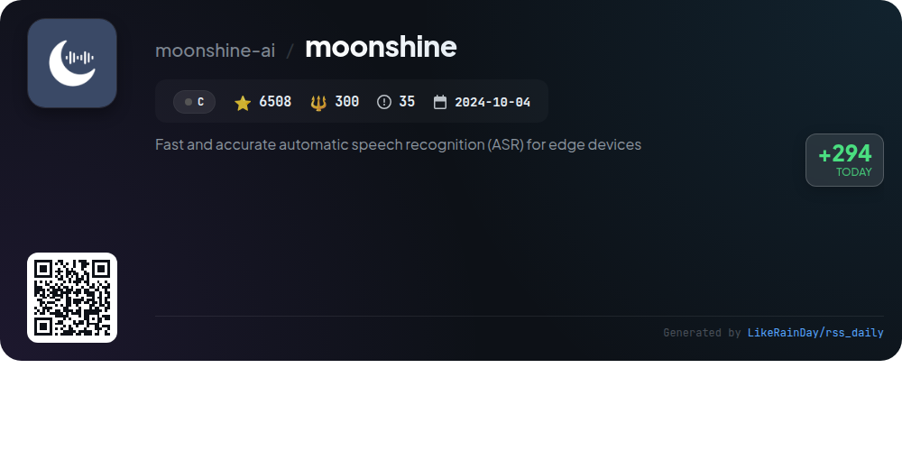
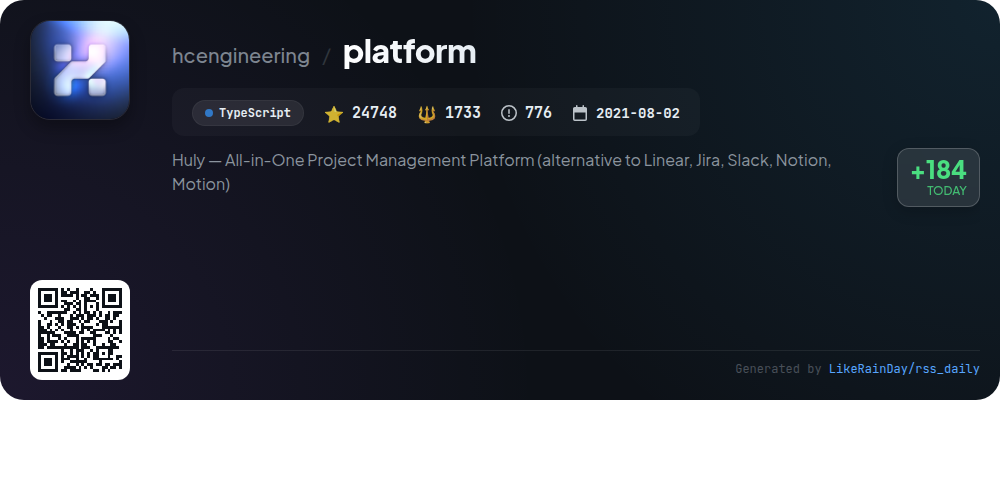
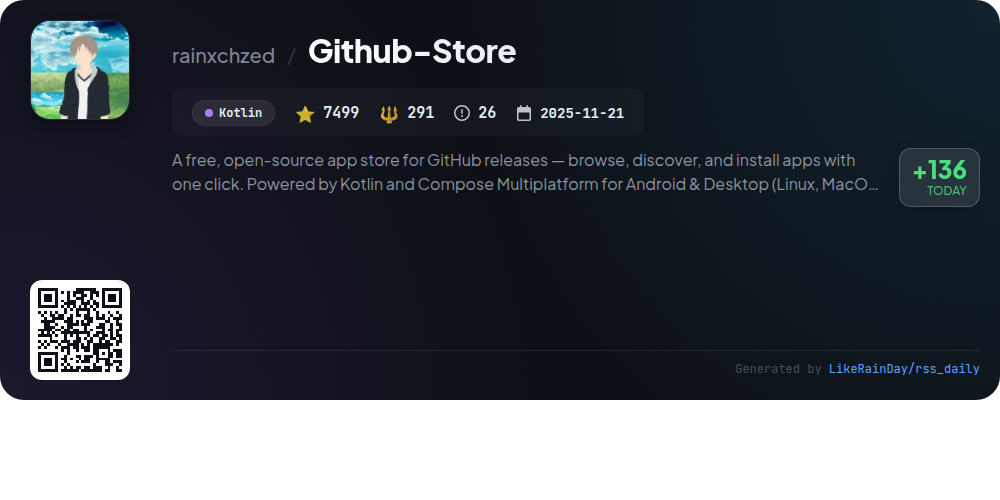
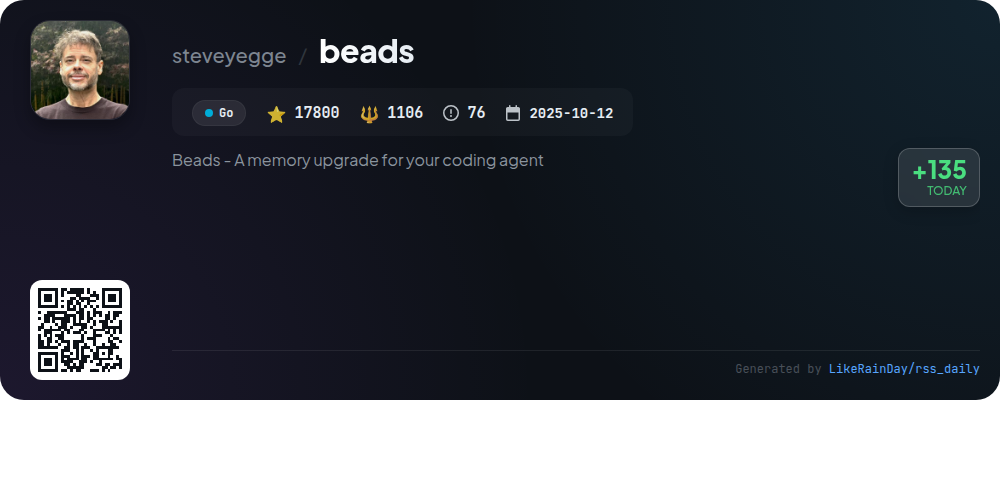

# 📊 🌟 GitHub Trending Daily - 2026-03-02

> > 📅 每日精选 GitHub 热门仓库 | 基于智能算法推荐

## 📋 Overview

**10** 个项目 | **380976** ⭐ | **58045** 🍴

**热门语言:** `TypeScript` (6) · `C` (1) · `Kotlin` (1)

**更新时间:** 2026-03-02 02:42 UTC

**分类分布:**

- 🌟 每日 Top 10 精选 (10 项)

---

## 🌟 每日 Top 10 精选

### 1. [wifi-densepose](https://github.com/ruvnet/wifi-densepose)

> 🤖 **推荐理由**  
> *WiFi DensePose transforms commodity WiFi signals into real-time human pose estimation, vital sign monitoring, and presence detection without cameras. Leveraging Channel State Information (CSI), it analyzes signal disturbances to reconstruct body positions and monitor vital signs like breathing and heartbeat. Key features include multi-person tracking, through-wall sensing, and disaster response capabilities. Built in Rust for performance, it supports Docker deployment and offers a guided installer for easy setup. Ideal for healthcare, security, and smart environments, it prioritizes privacy by using only radio waves.*

- ⭐ 17980 stars
- 💻 Rust
- 📅 Updated: 2026-03-02

### 2. [openclaw](https://github.com/openclaw/openclaw)

> 🤖 **推荐理由**  
> *OpenClaw is a personal AI assistant designed for various platforms, allowing seamless integration across messaging services like WhatsApp, Telegram, Discord, and more. With features such as a local-first gateway, multi-channel inbox, and voice wake capabilities, it provides a fast and always-on experience. Users can control the assistant via a command line interface or companion apps on macOS, iOS, and Android. Additional tools include a live canvas, automation via cron jobs, and a skills registry, making it versatile for personal and professional use.*

- ⭐ 243506 stars
- 💻 TypeScript
- 📅 Updated: 2026-03-02

### 3. [ruflo](https://github.com/ruvnet/ruflo)

> 🤖 **推荐理由**  
> *Ruflo is a leading agent orchestration platform for Claude, enabling the deployment of intelligent multi-agent swarms and autonomous workflows for building conversational AI systems. Key features include enterprise-grade architecture, 60+ specialized agents, coordinated swarm operation, fault-tolerant consensus, and native integration with Claude Code. It employs self-learning mechanisms via the Reasoning Bank, supports various LLMs, and offers a robust security framework against threats. With 17,378 stars, Ruflo is designed for scalable and efficient AI development.*

- ⭐ 17378 stars
- 💻 TypeScript
- 📅 Updated: 2026-03-02

### 4. [airi](https://github.com/moeru-ai/airi)

> 🤖 **推荐理由**  
> *Project AIRI is a self-hosted AI companion that brings virtual characters, inspired by Neuro-sama, to life. It supports real-time voice chat and can play popular games like Minecraft and Factorio. Compatible with web, macOS, and Windows, AIRI leverages modern web technologies for enhanced performance. Key features include speech recognition, voice synthesis, and support for VRM and Live2D models. The project also encourages community contributions and offers various sub-projects to extend its capabilities, aiming to empower users with their own digital companions.*

- ⭐ 20382 stars
- 💻 TypeScript
- 📅 Updated: 2026-03-02

### 5. [cc-switch](https://github.com/farion1231/cc-switch)

> 🤖 **推荐理由**  
> *cc-switch is a cross-platform desktop assistant tool designed for Claude Code, Codex, and Gemini CLI, featuring a sleek UI and powerful management capabilities. Key features include seamless provider switching, integrated skills and prompts management, and support for AWS Bedrock. The app utilizes a dual-layer SQLite and JSON architecture for data storage and offers auto-launch on startup, environment variable conflict detection, and robust API endpoint speed testing. It supports multiple languages and includes extensive customization options, making it ideal for optimizing AI coding workflows.*

- ⭐ 22231 stars
- 💻 TypeScript
- 📅 Updated: 2026-03-02

### 6. [superset](https://github.com/superset-sh/superset)

> 🤖 **推荐理由**  
> *Superset is a powerful IDE designed for the AI Agents Era, enabling users to run multiple CLI coding agents like Claude Code and OpenAI Codex simultaneously. Key features include parallel execution, task isolation using git worktrees, comprehensive agent monitoring, and a built-in diff viewer for quick change reviews. Superset simplifies development workflows by allowing users to automate environment setups and switch contexts effortlessly. Compatible with any CLI agent, it enhances productivity by minimizing context switching and centralizing agent management.*

- ⭐ 2944 stars
- 💻 TypeScript
- 📅 Updated: 2026-03-02

### 7. [moonshine](https://github.com/moonshine-ai/moonshine)

> 🤖 **推荐理由**  
> *Moonshine is an open-source automatic speech recognition (ASR) toolkit designed for real-time voice applications on edge devices. It operates entirely on-device, ensuring fast and private performance without the need for accounts or API keys. Key features include low-latency processing optimized for live streaming, support for multiple languages, and high-level APIs for tasks like transcription and intent recognition. Moonshine outperforms Whisper models in accuracy and response time, making it ideal for developers aiming to create efficient voice interfaces across platforms including Python, iOS, Android, and Raspberry Pi.*

- ⭐ 6508 stars
- 💻 C
- 📅 Updated: 2026-03-02

### 8. [platform](https://github.com/hcengineering/platform)

> 🤖 **推荐理由**  
> *Huly — All-in-One Project Management Platform (alternative to Linear, Jira, Slack, Notion, Motion). popular project, actively maintained, recently updated*

- ⭐ 24748 stars
- 🍴 1733 forks
- 💻 TypeScript
- 📅 Updated: 2026-03-02

### 9. [Github-Store](https://github.com/rainxchzed/Github-Store)

> 🤖 **推荐理由**  
> *GitHub Store is a free, open-source app store for GitHub releases, built with Kotlin and Compose Multiplatform, supporting Android and Desktop (Linux, macOS, Windows). With 7,499 stars, it simplifies the discovery and installation of open-source apps by automatically detecting installable binaries and offering one-click installation. Key features include smart discovery of trending apps, a rich detail screen with version info and release notes, and cross-platform support for seamless user experience. The app tracks installations and updates, ensuring users always access the latest releases effortlessly.*

- ⭐ 7499 stars
- 💻 Kotlin
- 📅 Updated: 2026-03-02

### 10. [beads](https://github.com/steveyegge/beads)

> 🤖 **推荐理由**  
> *Beads is a distributed, git-backed graph issue tracker designed for AI agents, providing a structured memory system to enhance coding workflows. Key features include a Dolt-powered SQL database for version control, dependency tracking for tasks, and hash-based IDs to prevent merge conflicts in multi-agent environments. It supports hierarchical task IDs and offers commands for task creation, updates, and management. Beads is compatible with macOS, Linux, Windows, and FreeBSD, making it a versatile tool for developers seeking improved task tracking and collaboration within projects.*

- ⭐ 17800 stars
- 💻 Go
- 📅 Updated: 2026-03-02

---

## 📡 RSS订阅

通过 RSS 订阅，第一时间获取每日精选项目：

- 🔔 [RSS 订阅源] (../../daily-top.xml)
- 🔔 [每日简报] (../../GITHUB_TODAY_CN.md)
- 🔔 [每日 Top 10 精选](../../daily-top.xml)

---

*⚡ Powered by Smart Trending Algorithm | Generated at 2026-03-02 02:42:22 UTC
