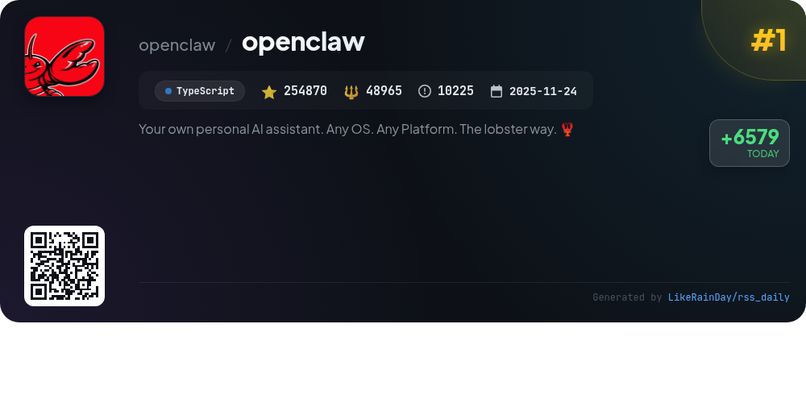
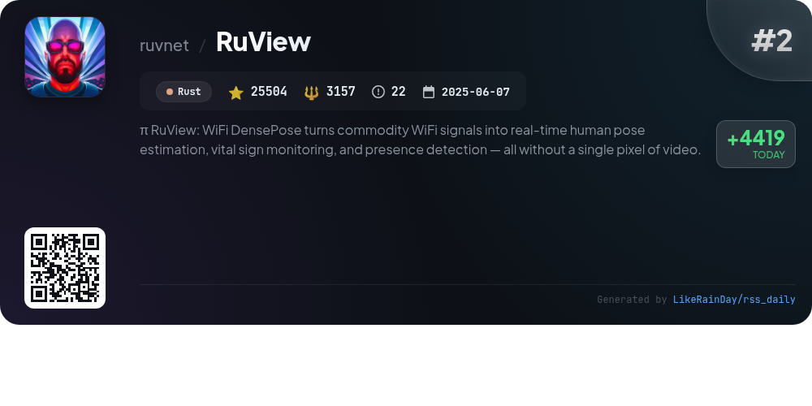
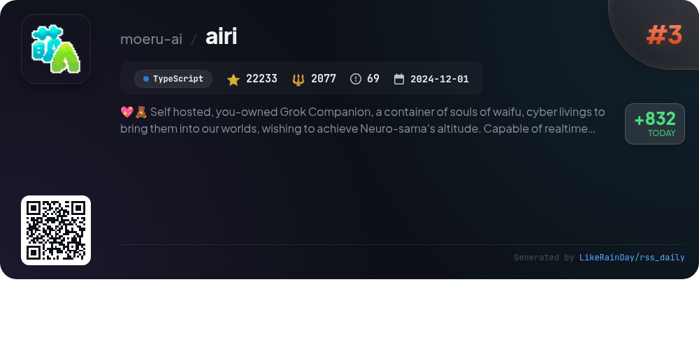
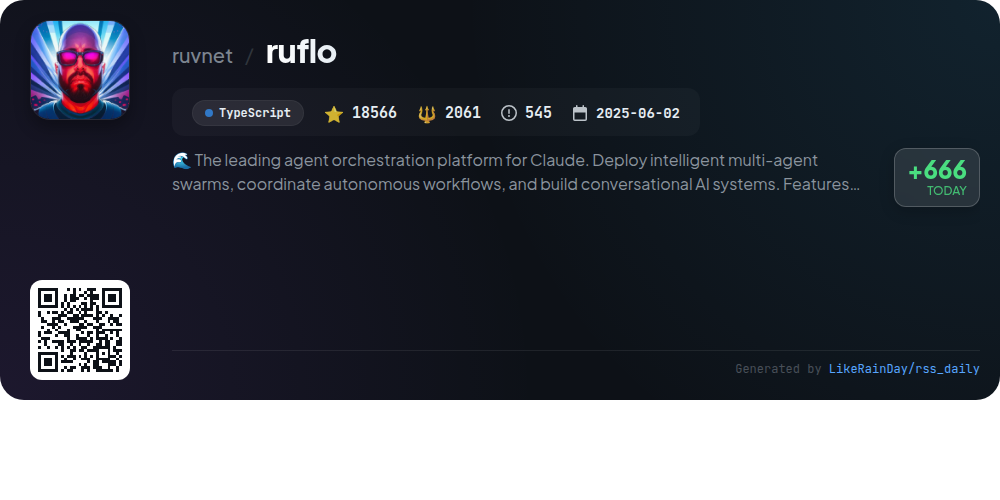
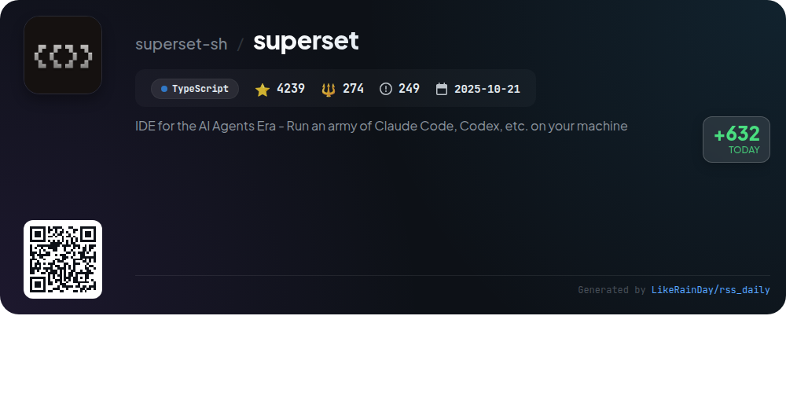
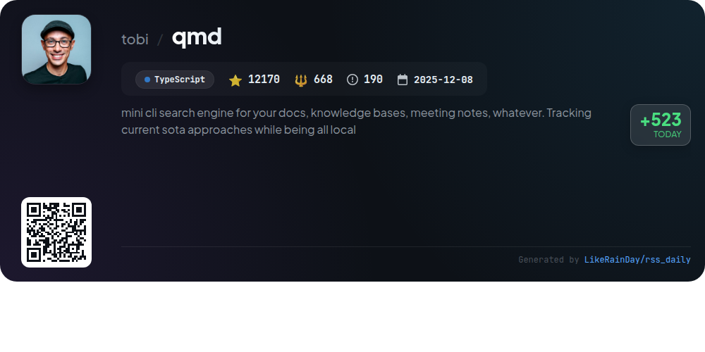
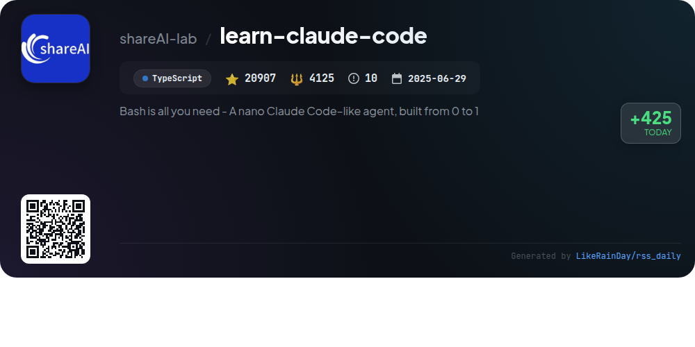
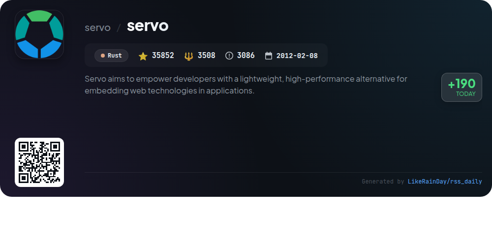
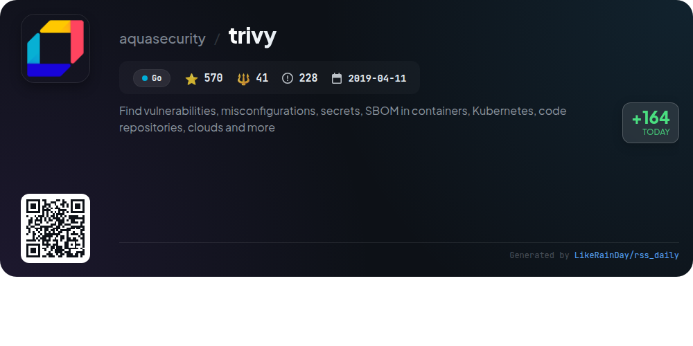

# 📊 🌟 GitHub Trending Daily - 2026-03-04

> > 📅 Daily Picks of GitHub Trending Repositories | Powered by Smart Algorithms

## 📋 Overview

**10** Projects | **404894** ⭐ | **66424** 🍴

**Top Languages:** `TypeScript` (6) · `Rust` (2) · `Go` (2)

**Updated:** 2026-03-04 02:37 UTC

**Categories:**

- 🌟 Daily Top 10 (10 items)

---

## 🌟 Daily Top 10

### 1. [openclaw](https://github.com/openclaw/openclaw)

> 🤖 **Why Recommend**  
> *OpenClaw is a versatile personal AI assistant available on any OS and platform, designed to integrate seamlessly with popular messaging services like WhatsApp, Telegram, Slack, and Discord. Key features include a local-first gateway, multi-channel inbox, and voice wake capabilities. Users can interact through a command-line interface or companion apps for macOS, iOS, and Android. With an onboarding wizard for setup, OpenClaw emphasizes user privacy and security, making it a powerful tool for personalized assistance across various devices and channels.*

- ⭐ 254870 stars
- 💻 TypeScript
- 📅 Updated: 2026-03-04

### 2. [RuView](https://github.com/ruvnet/RuView)

> 🤖 **Why Recommend**  
> *RuView is an innovative project that utilizes WiFi DensePose technology to enable real-time human pose estimation, vital sign monitoring, and presence detection without cameras or wearables. Key features include privacy-first tracking through WiFi signals, multi-person detection, and functionality through walls, making it ideal for healthcare, disaster response, and smart building applications. The system operates on low-cost hardware like the ESP32-S3 and integrates edge intelligence with fast processing (54K fps) to deliver vital insights instantly.*

- ⭐ 25504 stars
- 💻 Rust
- 📅 Updated: 2026-03-04

### 3. [airi](https://github.com/moeru-ai/airi)

> 🤖 **Why Recommend**  
> *AIRI is a self-hosted, user-owned virtual companion project inspired by Neuro-sama, designed to bring AI waifus and cyber beings into everyday life. Key features include real-time voice chat, support for popular games like Minecraft and Factorio, and compatibility across web, macOS, and Windows platforms. Built with TypeScript, AIRI leverages advanced web technologies for performance and flexibility. The project actively encourages community contributions and offers a range of tools for developers, including memory systems and graphics support, making it an innovative solution for interactive AI experiences.*

- ⭐ 22233 stars
- 💻 TypeScript
- 📅 Updated: 2026-03-04

### 4. [ruflo](https://github.com/ruvnet/ruflo)

> 🤖 **Why Recommend**  
> *Ruflo is an advanced agent orchestration platform for Claude, facilitating the deployment of intelligent multi-agent swarms and autonomous workflows. Key features include enterprise-grade architecture, 60+ specialized agents for tasks like coding and testing, and a robust security framework against vulnerabilities. Ruflo integrates seamlessly with various LLMs, offering intelligent routing for optimal task execution. Its self-learning capabilities enhance performance over time, while a decentralized plugin system allows for extensibility. Ideal for complex AI-driven projects, Ruflo streamlines collaboration and boosts efficiency.*

- ⭐ 18566 stars
- 💻 TypeScript
- 📅 Updated: 2026-03-04

### 5. [superset](https://github.com/superset-sh/superset)

> 🤖 **Why Recommend**  
> *Superset is an innovative IDE designed for the AI Agents Era, enabling users to run multiple CLI coding agents like Claude Code and OpenAI Codex simultaneously. Key features include parallel execution, worktree isolation, agent monitoring, and a built-in diff viewer, all aimed at enhancing productivity. The tool supports any CLI agent, making it versatile for diverse workflows. With a focus on minimizing context switching and automating environment setups, Superset empowers developers to streamline their coding processes and improve efficiency.*

- ⭐ 4239 stars
- 💻 TypeScript
- 📅 Updated: 2026-03-04

### 6. [qmd](https://github.com/tobi/qmd)

> 🤖 **Why Recommend**  
> *QMD (Query Markup Documents) is a powerful local CLI search engine designed for indexing and searching markdown documents, meeting notes, and knowledge bases. It employs advanced techniques like BM25 full-text search, vector semantic search, and LLM re-ranking to deliver precise search results. With features such as context management for enhanced relevance, hybrid search capabilities, and an MCP server for integration with AI agents, QMD streamlines information retrieval. Ideal for personal and professional use, it supports seamless collection management and various output formats for flexibility.*

- ⭐ 12170 stars
- 💻 TypeScript
- 📅 Updated: 2026-03-04

### 7. [learn-claude-code](https://github.com/shareAI-lab/learn-claude-code)

> 🤖 **Why Recommend**  
> *Learn Claude Code is a TypeScript-based project that teaches the fundamentals of building a nano Claude Code-like agent from scratch. With 12 progressive sessions, it introduces essential mechanisms such as tool handling, task management, and team collaboration, all centered around a core agent loop. Key features include background task execution, persistent task graphs, and isolated work environments for subagents. The project also offers an interactive web platform for visual learning and a CLI and SDK for embedding agent capabilities in applications. License: MIT.*

- ⭐ 20907 stars
- 💻 TypeScript
- 📅 Updated: 2026-03-04

### 8. [servo](https://github.com/servo/servo)

> 🤖 **Why Recommend**  
> *Servo is a high-performance web browser engine prototype developed in Rust, designed for embedding web technologies into applications. It supports multiple platforms, including macOS, Linux, Windows, Android, and OpenHarmony. Key features include a lightweight architecture, extensive documentation through the Servo Book, and active community engagement via GitHub Issues and Zulip. The project encourages contributions and provides detailed build instructions for various environments, making it accessible for developers looking to enhance their applications with modern web capabilities.*

- ⭐ 35852 stars
- 💻 Rust
- 📅 Updated: 2026-03-04

### 9. [trivy](https://github.com/aquasecurity/trivy)

> 🤖 **Why Recommend**  
> *Trivy is a powerful open-source security scanner designed to identify vulnerabilities, misconfigurations, and secrets across a variety of targets, including container images, Kubernetes, and code repositories. Key features include scanning for OS packages, known vulnerabilities (CVEs), Infrastructure as Code (IaC) issues, and sensitive information. Trivy supports multiple programming languages and integrates with popular platforms like GitHub Actions and Kubernetes. With over 570 stars, it's a robust tool for enhancing security in cloud-native environments. For more details, visit the Trivy documentation.*

- ⭐ 570 stars
- 💻 Go
- 📅 Updated: 2026-03-04

### 10. [xiaohongshu-mcp](https://github.com/xpzouying/xiaohongshu-mcp)

> 🤖 **Why Recommend**  
> *xiaohongshu-mcp is an open-source Go project with nearly 10,000 stars, designed for automating operations on xiaohongshu.com. Key features include user login management, content publishing (text, images, and videos), content searching, and retrieving user profiles and post details. It supports local and HTTP image uploads, with a focus on stability and ease of use. The project also allows integration with various AI clients via the Model Context Protocol (MCP), making it accessible for developers and non-technical users alike. Contributions are directed towards charitable donations, emphasizing community support.*

- ⭐ 9983 stars
- 💻 Go
- 📅 Updated: 2026-03-04

---

## 📡 RSS Subscription

Subscribe via RSS to get daily trending updates:

- 🔔 [RSS XML] (../../daily-top.xml)
- 🔔 [Daily Report] (../../GITHUB_TODAY.md)
- 🔔 [Daily Top 10](../../daily-top.xml)

---

*⚡ Powered by Smart Trending Algorithm | Generated at 2026-03-04 02:37:13 UTC
