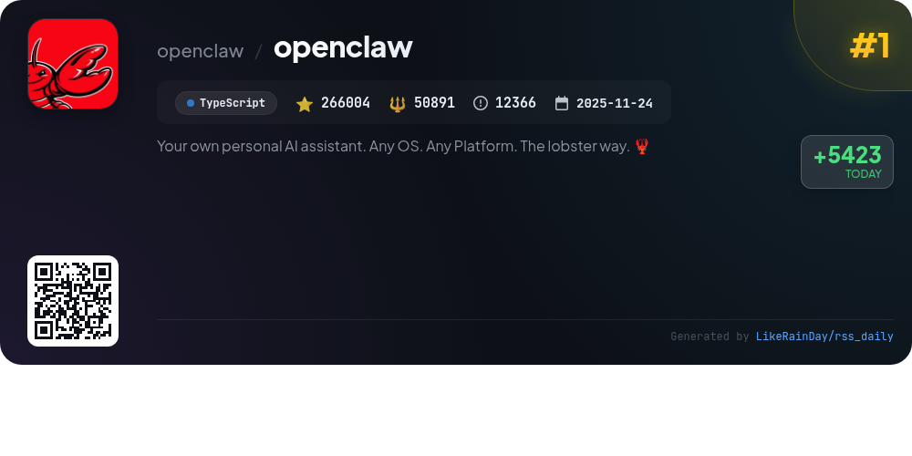
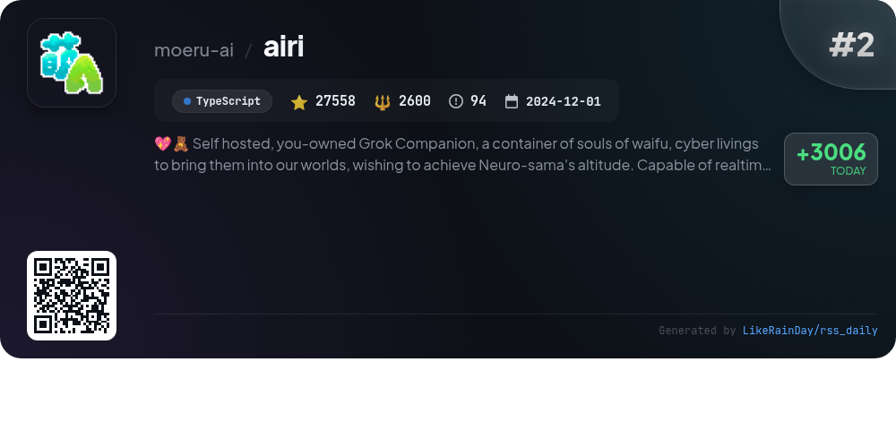
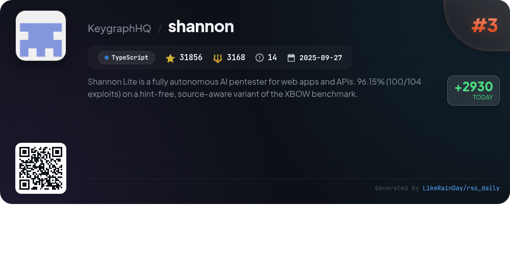
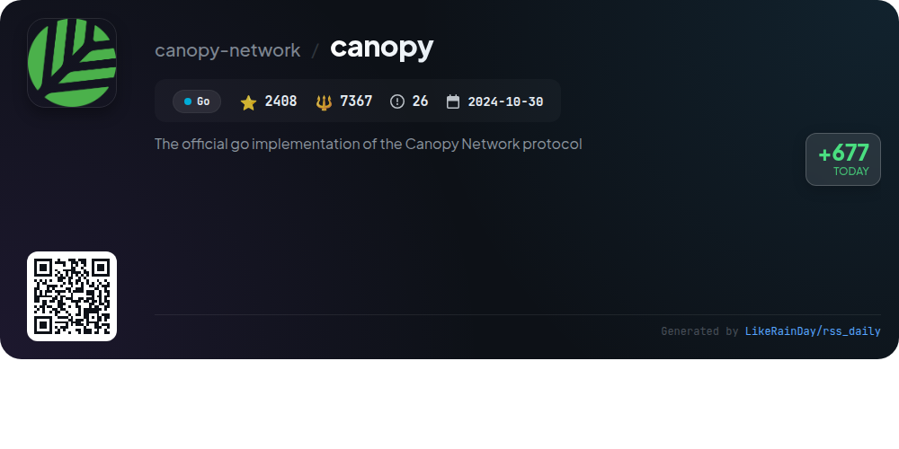
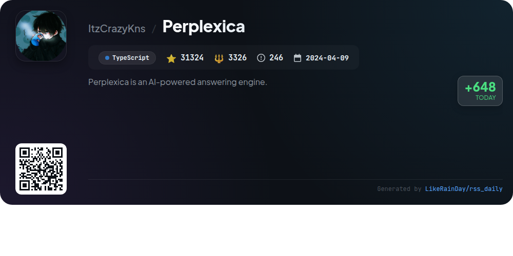
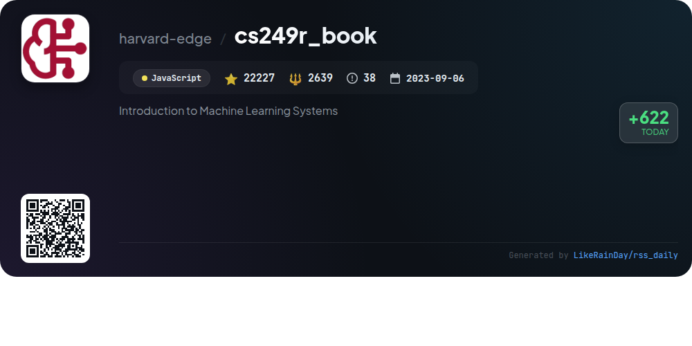
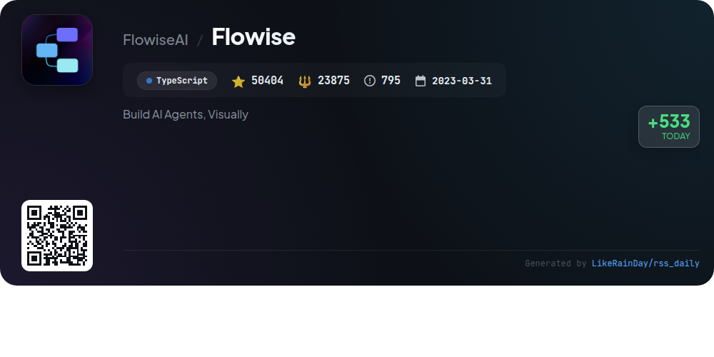
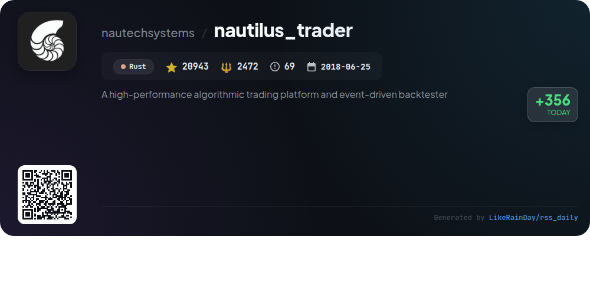
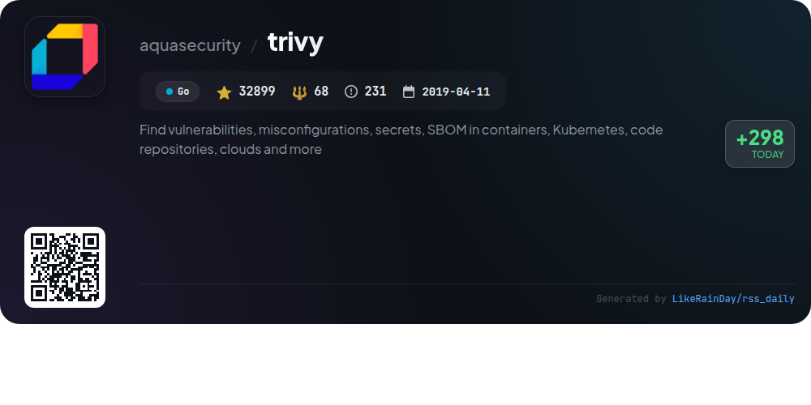
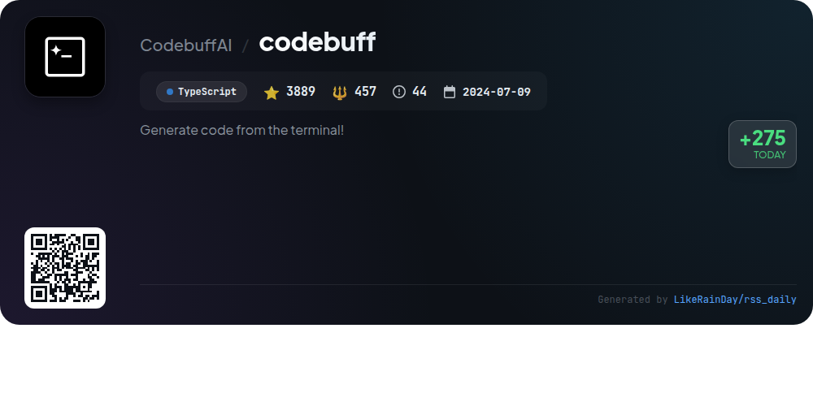

# 📊 🌟 GitHub Trending Daily - 2026-03-06

> > 📅 每日精选 GitHub 热门仓库 | 基于智能算法推荐

## 📋 Overview

**10** 个项目 | **489512** ⭐ | **96863** 🍴

**热门语言:** `TypeScript` (6) · `Go` (2) · `JavaScript` (1)

**更新时间:** 2026-03-06 02:37 UTC

**分类分布:**

- 🌟 每日 Top 10 精选 (10 项)

---

## 🌟 每日 Top 10 精选

### 1. [openclaw](https://github.com/openclaw/openclaw)

> 🤖 **推荐理由**  
> *OpenClaw is a personal AI assistant that operates on any platform, providing a seamless experience across various messaging channels such as WhatsApp, Telegram, Discord, and more. With features like voice wake functionality, a live canvas for interaction, and multi-agent routing, it allows for efficient management of tasks and communication. The onboarding wizard simplifies setup, and it supports various tools for automation and interaction. OpenClaw is built with a focus on security, ensuring private and reliable operation on personal devices.*

- ⭐ 266004 stars
- 💻 TypeScript
- 📅 Updated: 2026-03-06

### 2. [airi](https://github.com/moeru-ai/airi)

> 🤖 **推荐理由**  
> *AIRI is a self-hosted, open-source digital companion designed to recreate Neuro-sama, featuring real-time voice chat and the ability to play games like Minecraft and Factorio. Compatible with web, macOS, and Windows, it supports advanced interactions using modern web technologies. Core features include speech recognition, voice synthesis, and VRM/Live2D model support for animated characters. With a focus on user ownership of their digital experiences, AIRI enables seamless gaming and social interactions, making it a versatile platform for developers and users alike.*

- ⭐ 27558 stars
- 💻 TypeScript
- 📅 Updated: 2026-03-06

### 3. [shannon](https://github.com/KeygraphHQ/shannon)

> 🤖 **推荐理由**  
> *Shannon Lite is an autonomous AI pentester by Keygraph, designed for web applications and APIs. It achieves a 96.15% success rate on the XBOW benchmark. Key features include fully automated penetration testing, proof-of-concept exploits, and OWASP vulnerability coverage (Injection, XSS, SSRF, Authentication). Shannon analyzes source code for attack vectors, executes real exploits, and generates actionable reports. Available in AGPL-3.0 for local testing, Shannon Pro offers a comprehensive AppSec platform with CI/CD integration, static analysis, and enhanced dynamic testing capabilities.*

- ⭐ 31856 stars
- 💻 TypeScript
- 📅 Updated: 2026-03-06

### 4. [canopy](https://github.com/canopy-network/canopy)

> 🤖 **推荐理由**  
> *Canopy is the official Go implementation of the Canopy Network protocol, designed for building decentralized blockchains through a recursive framework. Key features include a Byzantine Fault Tolerant (BFT) consensus mechanism, a robust peer-to-peer networking system, and efficient state management through a Finite State Machine (FSM). Currently in Betanet, Canopy offers a comprehensive documentation and testing environment. Contributions are encouraged via its open-source platform. For more details, visit [canopynetwork.org](https://canopynetwork.org).*

- ⭐ 2408 stars
- 💻 Go
- 📅 Updated: 2026-03-06

### 5. [Perplexica](https://github.com/ItzCrazyKns/Perplexica)

> 🤖 **推荐理由**  
> *Perplexica is a privacy-focused AI answering engine that operates on your hardware, offering seamless integration with local LLMs (Ollama) and cloud providers (OpenAI, Claude, Groq). Key features include smart search modes for quick and in-depth answers, support for diverse sources including web and academic content, and the ability to upload files for analysis. With widgets for relevant information, intelligent search suggestions, and a rich discovery feature for trending articles, Perplexica enhances your search experience while ensuring complete privacy. The project has gained significant traction, boasting over 31,000 stars on GitHub.*

- ⭐ 31324 stars
- 💻 TypeScript
- 📅 Updated: 2026-03-06

### 6. [cs249r_book](https://github.com/harvard-edge/cs249r_book)

> 🤖 **推荐理由**  
> *The cs249r_book project is an open-source resource for learning AI engineering principles, focusing on designing, building, and evaluating machine learning systems. It includes a comprehensive textbook, the TinyTorch framework for hands-on coding, and hardware kits for deploying projects on devices like Arduino and Raspberry Pi. The initiative aims to establish AI engineering as a foundational discipline, connecting theory with practical applications. With over 22,000 stars, it encourages community engagement and contributions to enhance AI education globally.*

- ⭐ 22227 stars
- 💻 JavaScript
- 📅 Updated: 2026-03-06

### 7. [Flowise](https://github.com/FlowiseAI/Flowise)

> 🤖 **推荐理由**  
> *Flowise is a powerful platform for building AI agents visually, utilizing TypeScript. With over 50,000 stars on GitHub, it features a user-friendly interface and supports Docker deployments. Key components include a Node.js backend, a React frontend, and third-party integration nodes. Users can self-host on multiple cloud providers or opt for Flowise Cloud. The project offers comprehensive documentation and active community support through Discord. With seamless installation and setup, Flowise is ideal for developers looking to create and manage AI workflows efficiently.*

- ⭐ 50404 stars
- 💻 TypeScript
- 📅 Updated: 2026-03-06

### 8. [nautilus_trader](https://github.com/nautechsystems/nautilus_trader)

> 🤖 **推荐理由**  
> *NautilusTrader is a high-performance, open-source algorithmic trading platform built in Rust, designed for quantitative traders. It offers a robust event-driven backtester and enables seamless deployment of strategies from backtesting to live trading. Key features include high-frequency trading support across various asset classes, modular API integrations, advanced order types, and customizable components. The platform prioritizes performance and safety, utilizing Rust's capabilities for reliability. It provides a Python-native environment, ensuring consistency in trading strategies and facilitating AI training for trading agents.*

- ⭐ 20943 stars
- 💻 Rust
- 📅 Updated: 2026-03-06

### 9. [trivy](https://github.com/aquasecurity/trivy)

> 🤖 **推荐理由**  
> *Trivy is an open-source security scanner that identifies vulnerabilities, misconfigurations, and sensitive information across various targets such as container images, filesystems, Git repositories, virtual machine images, and Kubernetes. It detects known vulnerabilities (CVEs), OS packages, IaC issues, and software licenses, supporting multiple programming languages and platforms. With over 32,000 stars on GitHub, Trivy integrates with popular tools like GitHub Actions and Kubernetes operators, making it a versatile solution for enhancing security in cloud-native environments. For more information, visit the Trivy documentation.*

- ⭐ 32899 stars
- 💻 Go
- 📅 Updated: 2026-03-06

### 10. [codebuff](https://github.com/CodebuffAI/codebuff)

> 🤖 **推荐理由**  
> *Codebuff is an open-source AI coding assistant that enables developers to edit their codebases using natural language commands. With a unique multi-agent architecture, it leverages specialized agents for file selection, planning, editing, and reviewing, ensuring accurate and context-aware modifications. Users can easily install it via CLI and create custom agents for tailored workflows. Codebuff supports various AI models through OpenRouter and offers an SDK for integration into applications. With 3,889 stars, it stands out as a powerful tool for enhancing coding efficiency.*

- ⭐ 3889 stars
- 💻 TypeScript
- 📅 Updated: 2026-03-06

---

## 📡 RSS订阅

通过 RSS 订阅，第一时间获取每日精选项目：

- 🔔 [RSS 订阅源] (../../daily-top.xml)
- 🔔 [每日简报] (../../GITHUB_TODAY_CN.md)
- 🔔 [每日 Top 10 精选](../../daily-top.xml)

---

*⚡ Powered by Smart Trending Algorithm | Generated at 2026-03-06 02:37:56 UTC
