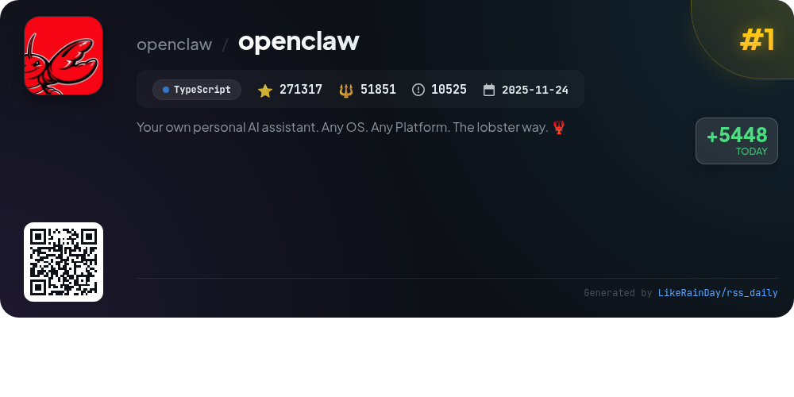
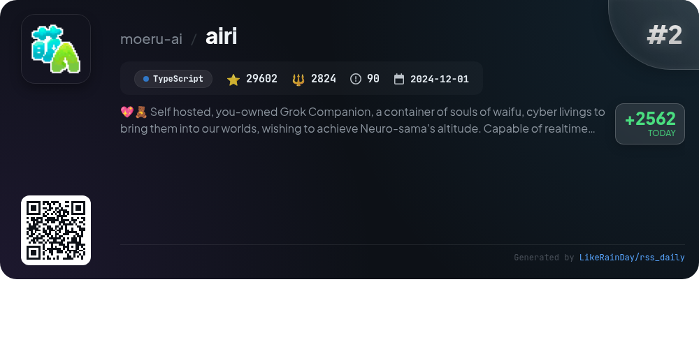
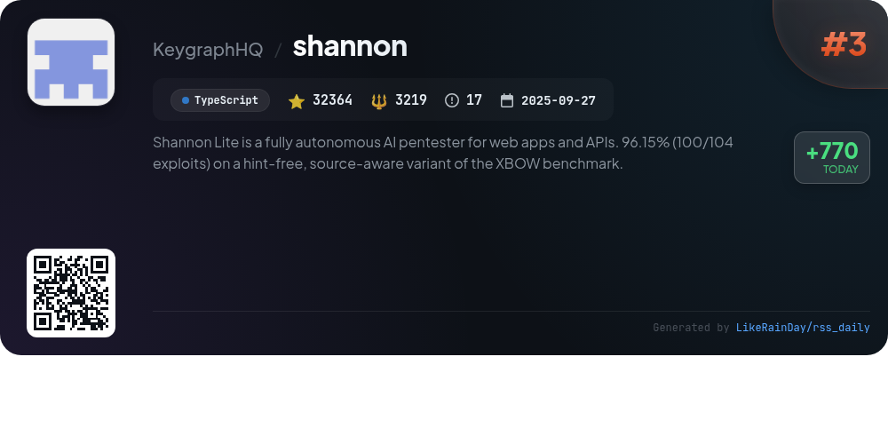
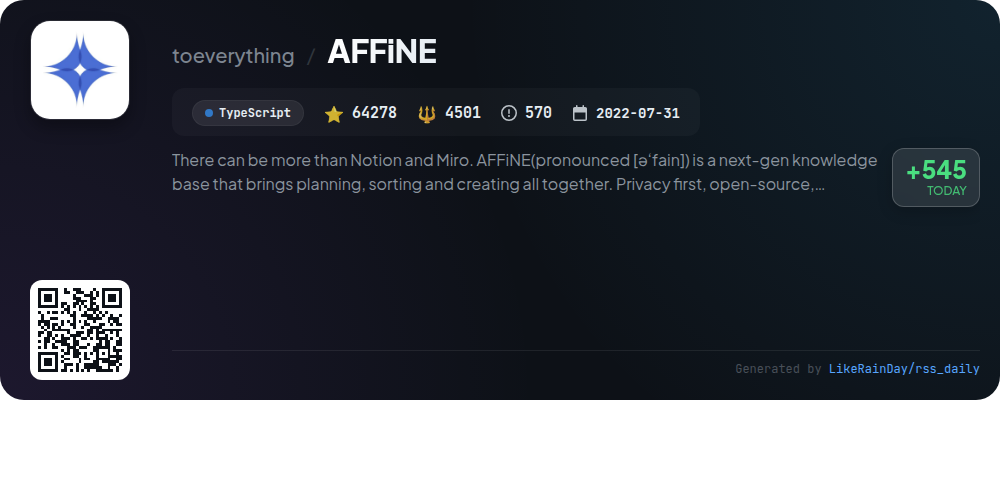
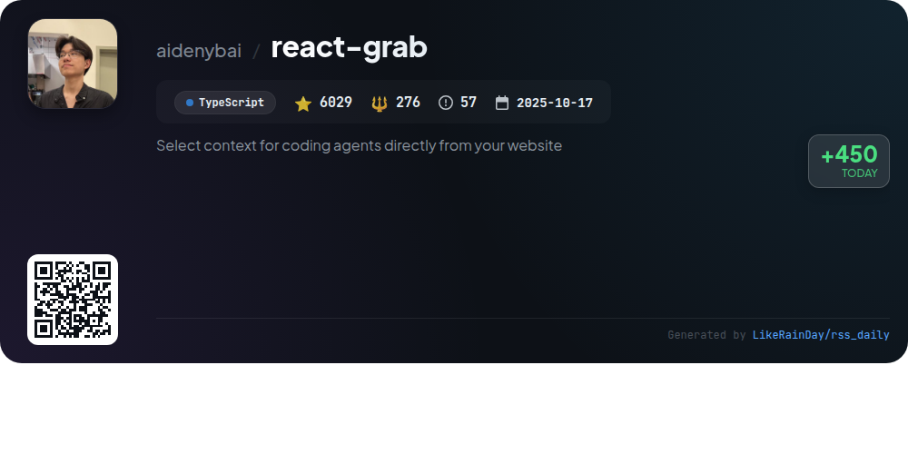
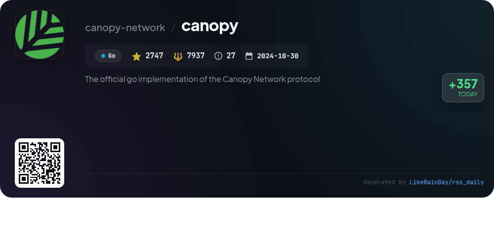
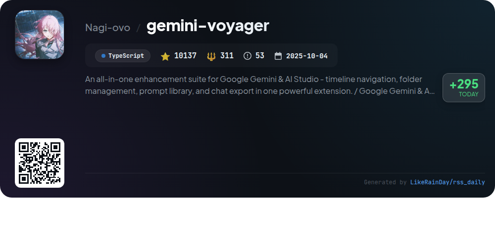
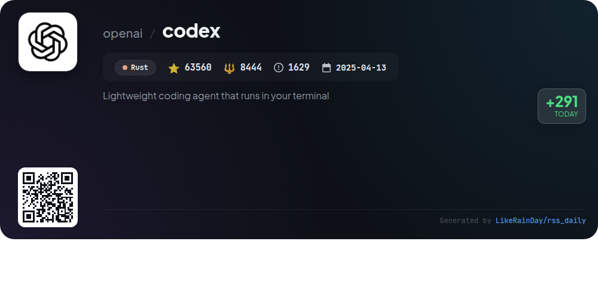
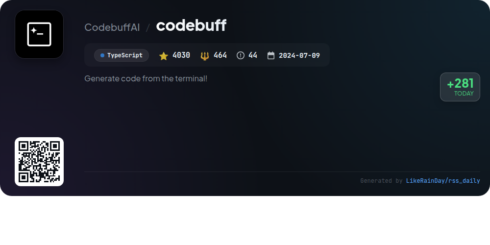
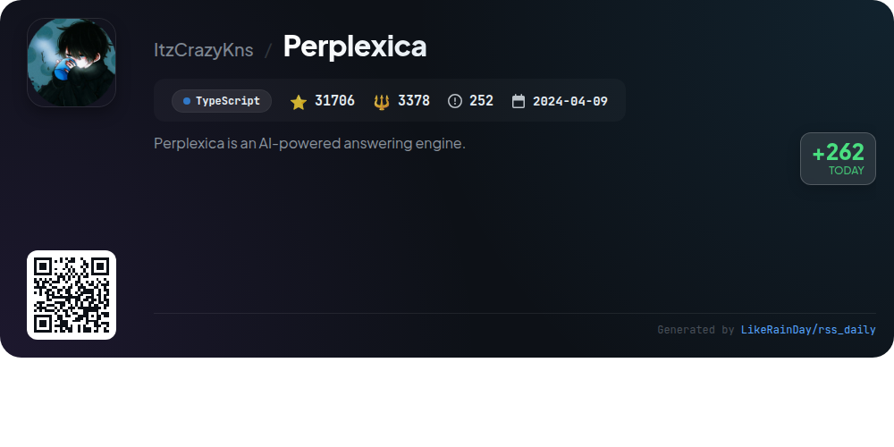

# 📊 🌟 GitHub Trending Daily - 2026-03-07

> > 📅 Daily Picks of GitHub Trending Repositories | Powered by Smart Algorithms

## 📋 Overview

**10** Projects | **515770** ⭐ | **83205** 🍴

**Top Languages:** `TypeScript` (8) · `Go` (1) · `Rust` (1)

**Updated:** 2026-03-07 02:31 UTC

**Categories:**

- 🌟 Daily Top 10 (10 items)

---

## 🌟 Daily Top 10

### 1. [openclaw](https://github.com/openclaw/openclaw)

> 🤖 **Why Recommend**  
> *OpenClaw is a versatile personal AI assistant that operates across various platforms, including macOS, iOS, Android, and numerous messaging services like WhatsApp, Telegram, and Discord. It features a local-first architecture with multi-channel support, enabling seamless communication through a unified inbox. Key highlights include voice activation, a live Canvas for visual tasks, and a CLI onboarding wizard for easy setup. The platform also offers extensive customization through skills and tools, ensuring a tailored user experience. OpenClaw is open-source and community-driven, fostering collaboration and innovation.*

- ⭐ 271317 stars
- 💻 TypeScript
- 📅 Updated: 2026-03-07

### 2. [airi](https://github.com/moeru-ai/airi)

> 🤖 **Why Recommend**  
> *AIRI is a self-hosted AI companion project designed to recreate Neuro-sama, offering a unique blend of interactive experiences with virtual characters (waifus). It supports real-time voice chat and gameplay in popular titles like Minecraft and Factorio. Built with TypeScript, it functions across web, macOS, and Windows platforms. Key features include audio input/output, VRM and Live2D model animations, and a memory system for enhanced interaction. AIRI empowers users to own their digital companions and enables a variety of integrations, making it a versatile tool for developers and gamers alike.*

- ⭐ 29602 stars
- 💻 TypeScript
- 📅 Updated: 2026-03-07

### 3. [shannon](https://github.com/KeygraphHQ/shannon)

> 🤖 **Why Recommend**  
> *Shannon Lite is an autonomous AI pentester designed for web applications and APIs, achieving 96.15% effectiveness on the XBOW benchmark. It combines source code analysis with live exploitation to identify vulnerabilities like injection attacks and XSS, generating comprehensive reports with reproducible proofs of concept. Key features include fully automated operation, parallel processing, and integration with tools like Nmap and Subfinder. Shannon Lite is ideal for local testing, while Shannon Pro offers a complete AppSec platform with CI/CD integration and advanced security testing capabilities.*

- ⭐ 32364 stars
- 💻 TypeScript
- 📅 Updated: 2026-03-07

### 4. [AFFiNE](https://github.com/toeverything/AFFiNE)

> 🤖 **Why Recommend**  
> *AFFiNE is a next-gen, open-source knowledge base that combines planning, creation, and organization in a privacy-focused, local-first environment. With over 64,000 stars on GitHub, it offers a seamless canvas for rich text, sticky notes, and multi-view databases. Key features include real-time collaboration, multimodal AI integration for enhanced creativity, and self-hosting capabilities. AFFiNE serves as a versatile alternative to Notion and Miro, making it ideal for creative minds seeking a unified platform for documentation, project management, and brainstorming.*

- ⭐ 64278 stars
- 💻 TypeScript
- 📅 Updated: 2026-03-07

### 5. [react-grab](https://github.com/aidenybai/react-grab)

> 🤖 **Why Recommend**  
> *Select context for coding agents directly from your website. popular project, actively maintained, recently updated*

- ⭐ 6029 stars
- 🍴 276 forks
- 💻 TypeScript
- 📅 Updated: 2026-03-07

### 6. [canopy](https://github.com/canopy-network/canopy)

> 🤖 **Why Recommend**  
> *Canopy is the official Go implementation of the Canopy Network protocol, designed to facilitate a peer-to-peer blockchain ecosystem. With 2,747 stars on GitHub, it offers a recursive framework for building interconnected blockchains, enhancing utility and security. Core features include a Byzantine Fault Tolerant consensus mechanism, a Finite State Machine for transaction logic, and secure peer-to-peer networking. The project is currently in Betanet phase, with comprehensive documentation available. Contributions are encouraged from the community. For more details, visit [canopynetwork.org](https://canopynetwork.org).*

- ⭐ 2747 stars
- 💻 Go
- 📅 Updated: 2026-03-07

### 7. [gemini-voyager](https://github.com/Nagi-ovo/gemini-voyager)

> 🤖 **Why Recommend**  
> *Gemini Voyager is a comprehensive enhancement suite for Google Gemini and AI Studio, boasting over 10,000 stars on GitHub. Key features include elegant timeline navigation, folder management for organizing chats, a prompt vault for saving and reusing prompts, and versatile chat export options (JSON, Markdown, PDF). Additional capabilities like cloud sync, Mermaid rendering, and bulk deletion enhance user experience. Designed for researchers and developers, it transforms Gemini into a more structured and productive platform, making conversations accessible and organized.*

- ⭐ 10137 stars
- 💻 TypeScript
- 📅 Updated: 2026-03-07

### 8. [codex](https://github.com/openai/codex)

> 🤖 **Why Recommend**  
> *Codex is a lightweight coding agent by OpenAI that runs locally in your terminal, designed for seamless integration into your development workflow. With over 63,560 stars on GitHub, it can be installed globally via npm or Homebrew. Key features include local execution, support for IDEs like VS Code, and a desktop app experience. Users can enhance functionality by signing in with their ChatGPT account for additional plan benefits. Comprehensive documentation and open-source contributions are available, making Codex a versatile tool for developers.*

- ⭐ 63560 stars
- 💻 Rust
- 📅 Updated: 2026-03-07

### 9. [codebuff](https://github.com/CodebuffAI/codebuff)

> 🤖 **Why Recommend**  
> *Codebuff is an open-source AI coding assistant that allows users to generate and edit code through natural language commands directly from the terminal. With over 4,000 stars, it leverages a multi-agent system, including File Picker, Planner, Editor, and Reviewer Agents, to ensure accurate modifications across codebases. Users can install it via `npm install -g codebuff` and easily ask for tasks like fixing vulnerabilities or adding features. Codebuff also supports custom agent creation and integration through its SDK, offering flexibility in workflows and model usage.*

- ⭐ 4030 stars
- 💻 TypeScript
- 📅 Updated: 2026-03-07

### 10. [Perplexica](https://github.com/ItzCrazyKns/Perplexica)

> 🤖 **Why Recommend**  
> *Perplexica is a privacy-focused AI answering engine that combines knowledge from the internet with support for local and cloud-based LLMs, including OpenAI and Claude. Key features include smart search modes, source selection, image and video search, and document uploads. Users can choose from various AI providers, utilize widgets for quick information, and access a history of searches. Perplexica runs on your hardware, ensuring complete privacy, and is actively developed with community input. Join the Discord for updates and feedback.*

- ⭐ 31706 stars
- 💻 TypeScript
- 📅 Updated: 2026-03-07

---

## 📡 RSS Subscription

Subscribe via RSS to get daily trending updates:

- 🔔 [RSS XML] (../../daily-top.xml)
- 🔔 [Daily Report] (../../GITHUB_TODAY.md)
- 🔔 [Daily Top 10](../../daily-top.xml)

---

*⚡ Powered by Smart Trending Algorithm | Generated at 2026-03-07 02:31:37 UTC
