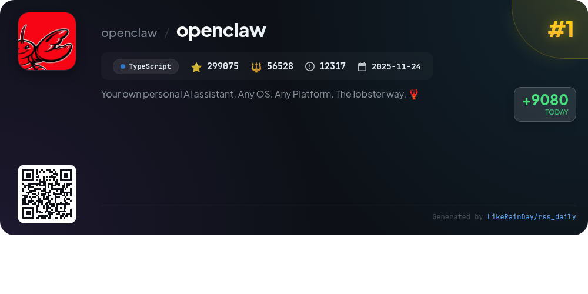
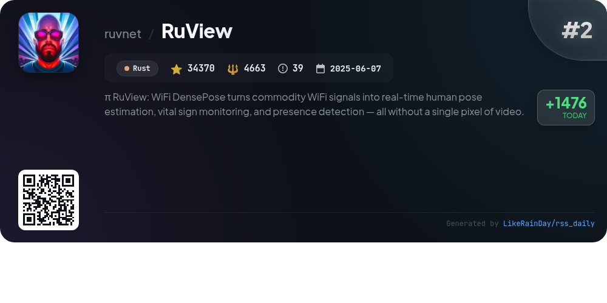
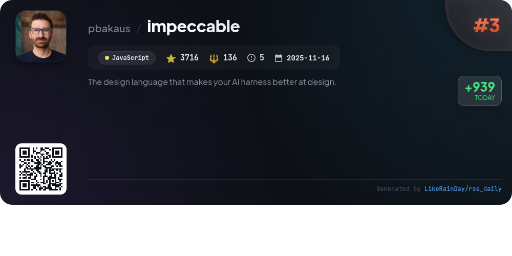
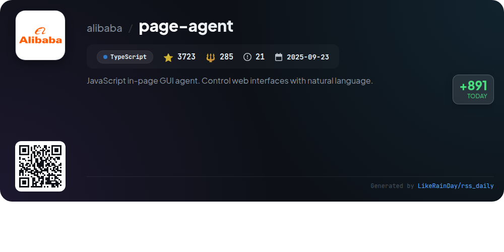
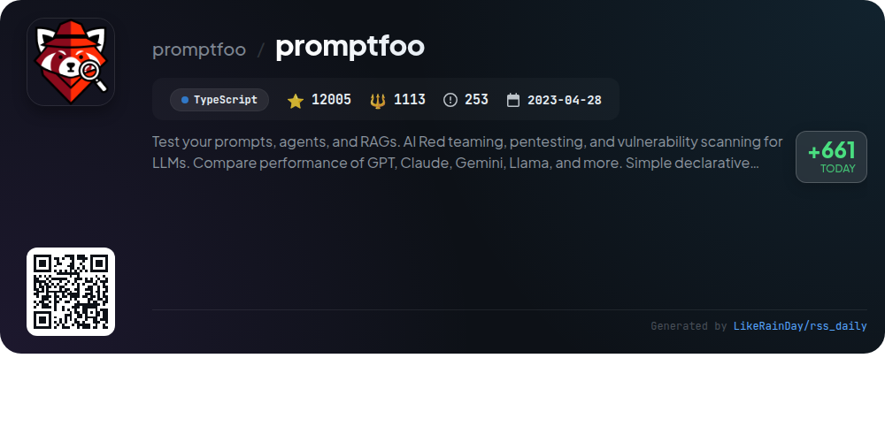
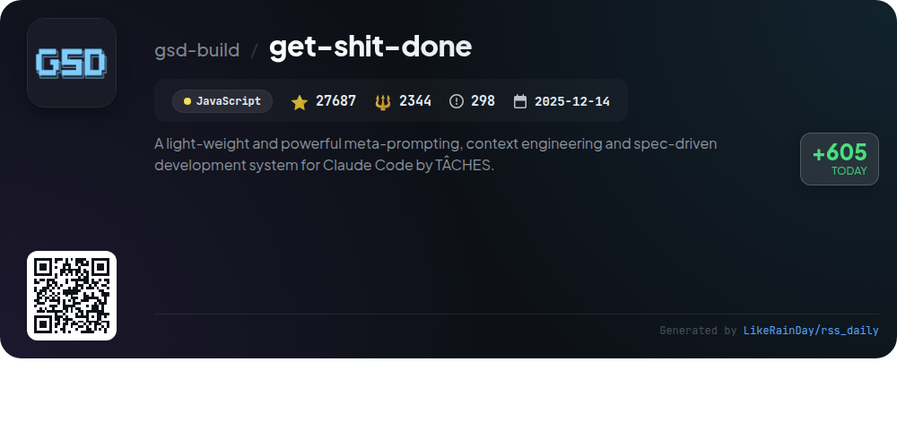
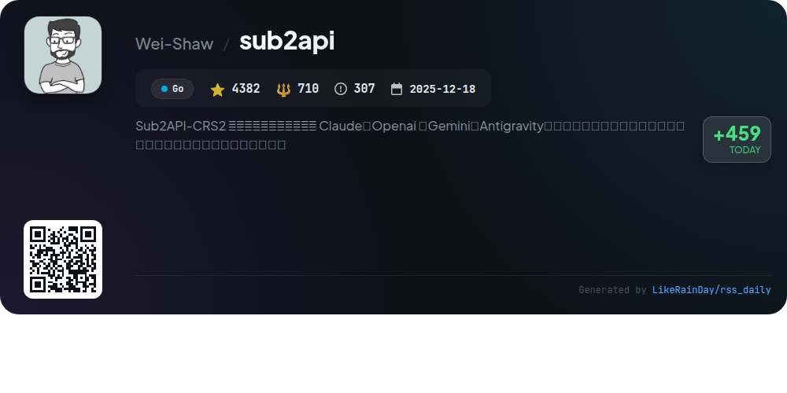
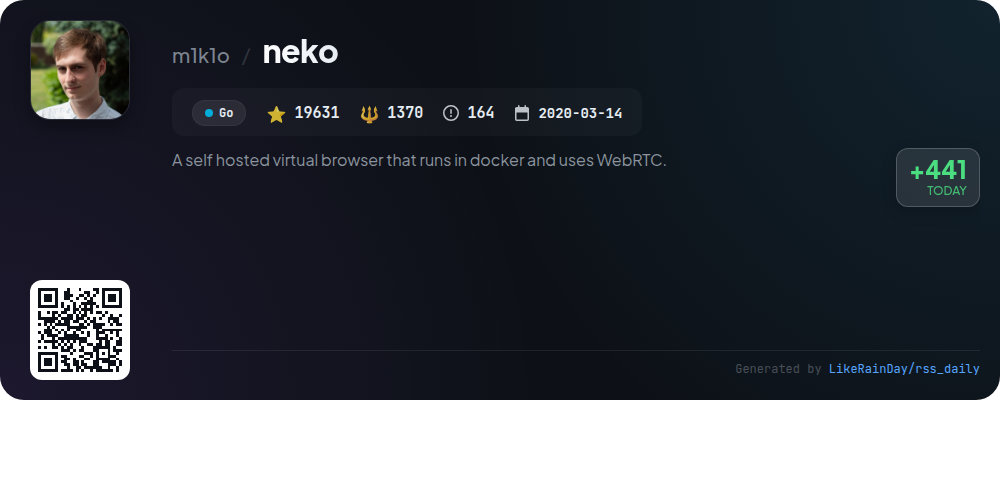
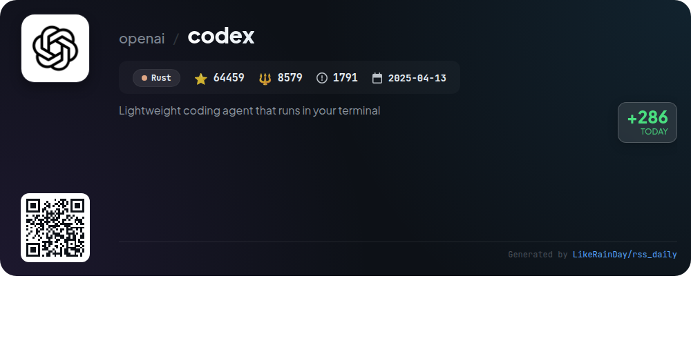
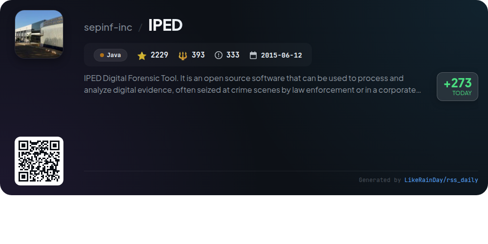

# 📊 🌟 GitHub Trending Daily - 2026-03-11

> > 📅 Daily Picks of GitHub Trending Repositories | Powered by Smart Algorithms

## 📋 Overview

**10** Projects | **471277** ⭐ | **76121** 🍴

**Top Languages:** `TypeScript` (3) · `JavaScript` (2) · `Go` (2)

**Updated:** 2026-03-11 02:36 UTC

**Categories:**

- 🌟 Daily Top 10 (10 items)

---

## 🌟 Daily Top 10

### 1. [openclaw](https://github.com/openclaw/openclaw)

> 🤖 **Why Recommend**  
> *OpenClaw is a personal AI assistant designed to run on your devices across various platforms, including macOS, iOS, and Android. With support for multiple messaging channels like WhatsApp, Telegram, Discord, and Google Chat, it offers a seamless experience for communication. Key features include a local-first control gateway, multi-agent routing, voice activation, and a live canvas for interactive tasks. The onboarding wizard simplifies setup, while companion apps enhance functionality. OpenClaw prioritizes user privacy and security, making it an ideal choice for a personal assistant.*

- ⭐ 299075 stars
- 💻 TypeScript
- 📅 Updated: 2026-03-11

### 2. [RuView](https://github.com/ruvnet/RuView)

> 🤖 **Why Recommend**  
> *RuView is a cutting-edge edge AI system that leverages WiFi signals for real-time human pose estimation, vital sign monitoring, and presence detection without using cameras. Built on Rust, it utilizes Channel State Information (CSI) to analyze body movements and vital signs, achieving high accuracy with low-cost hardware like ESP32 chips. Key features include privacy-first operation, self-learning capabilities, and multi-person tracking through walls. With a Docker-ready setup, it supports diverse applications from healthcare to disaster response, making ordinary environments smarter and more aware.*

- ⭐ 34370 stars
- 💻 Rust
- 📅 Updated: 2026-03-11

### 3. [impeccable](https://github.com/pbakaus/impeccable)

> 🤖 **Why Recommend**  
> *Impeccable is a JavaScript design language enhancing AI capabilities for frontend design, featuring 3716 stars on GitHub. It builds on Anthropic's frontend-design skill, offering 7 domain-specific references and 17 commands for tasks like auditing, reviewing, and polishing designs. Key highlights include curated anti-patterns to avoid common design pitfalls, such as overused fonts and poor color contrasts. Impeccable supports various tools like Cursor, Claude Code, Gemini CLI, and Codex CLI. For a quick start, visit impeccable.style for downloadable bundles.*

- ⭐ 3716 stars
- 💻 JavaScript
- 📅 Updated: 2026-03-11

### 4. [page-agent](https://github.com/alibaba/page-agent)

> 🤖 **Why Recommend**  
> *JavaScript in-page GUI agent. Control web interfaces with natural language.. popular project, actively maintained, recently updated*

- ⭐ 3723 stars
- 🍴 285 forks
- 💻 TypeScript
- 📅 Updated: 2026-03-11

### 5. [promptfoo](https://github.com/promptfoo/promptfoo)

> 🤖 **Why Recommend**  
> *Promptfoo is an open-source CLI and library for evaluating and securing large language model (LLM) applications. With features like automated prompt testing, red teaming for vulnerability scanning, and side-by-side model comparisons (including OpenAI, Claude, and Llama), it empowers developers to enhance AI app security. The tool supports CI/CD integration, enabling automated checks and code scanning for LLM-related issues. Designed for privacy and flexibility, Promptfoo runs evaluations locally, ensuring prompts remain confidential. Join the growing community and streamline your AI development with Promptfoo.*

- ⭐ 12005 stars
- 💻 TypeScript
- 📅 Updated: 2026-03-11

### 6. [get-shit-done](https://github.com/gsd-build/get-shit-done)

> 🤖 **Why Recommend**  
> *get-shit-done is a lightweight meta-prompting and context engineering system designed for Claude Code, OpenCode, Gemini CLI, and Codex. It effectively combats context rot, ensuring consistent code quality as tasks are executed. Key features include streamlined project initialization, phase discussions, planning, execution in parallel waves, and automated verification. Trusted by engineers from top companies like Amazon and Google, it simplifies development without enterprise complexity, making it ideal for individuals and small teams. Users can install it easily with `npx get-shit-done-cc@latest`.*

- ⭐ 27687 stars
- 💻 JavaScript
- 📅 Updated: 2026-03-11

### 7. [sub2api](https://github.com/Wei-Shaw/sub2api)

> 🤖 **Why Recommend**  
> *Sub2API is an open-source AI API gateway platform enabling efficient subscription quota management for services like Claude, OpenAI, Gemini, and Antigravity. Key features include multi-account management, API key distribution, precise billing, smart scheduling, concurrency control, and an admin dashboard for monitoring. Built using Go and Vue, it supports PostgreSQL and Redis for data management. The platform allows users to share and optimize API costs seamlessly, making it ideal for teams and developers seeking a unified access solution.*

- ⭐ 4382 stars
- 💻 Go
- 📅 Updated: 2026-03-11

### 8. [neko](https://github.com/m1k1o/neko)

> 🤖 **Why Recommend**  
> *Neko is a self-hosted virtual browser running in Docker, leveraging WebRTC technology for secure and private internet access. With over 19,600 stars, it enables users to browse, run applications, and collaborate in a shared environment. Key features include multi-user access, making it ideal for watch parties, interactive presentations, and team collaborations. Neko supports various browsers and Linux applications, ensuring flexibility. It offers a persistent, throwaway browsing experience while maintaining privacy. Comprehensive documentation and a community for support are available.*

- ⭐ 19631 stars
- 💻 Go
- 📅 Updated: 2026-03-11

### 9. [codex](https://github.com/openai/codex)

> 🤖 **Why Recommend**  
> *Codex is a lightweight coding agent from OpenAI that operates directly in your terminal. It can be installed globally via npm or Homebrew, offering seamless integration into your coding workflow. Key features include local execution, IDE support (like VS Code), and a desktop app experience. Additionally, Codex can be accessed through the Codex Web platform for cloud-based usage. Users can sign in with their ChatGPT accounts to enhance functionality, making Codex a versatile tool for developers. The project is open-source and actively maintained.*

- ⭐ 64459 stars
- 💻 Rust
- 📅 Updated: 2026-03-11

### 10. [IPED](https://github.com/sepinf-inc/IPED)

> 🤖 **Why Recommend**  
> *IPED is an open-source digital forensic tool developed in Java, designed for processing and analyzing digital evidence in law enforcement and corporate investigations. Key features include command-line batch processing, multi-platform support, and high-performance data handling (up to 400GB/h). It supports various disk image formats and offers extensive analysis tools, such as hash deduplication, file categorization, regex searches, and multimedia analysis. IPED also includes advanced capabilities like audio transcription, face recognition, and a web API for remote case management.*

- ⭐ 2229 stars
- 💻 Java
- 📅 Updated: 2026-03-11

---

## 📡 RSS Subscription

Subscribe via RSS to get daily trending updates:

- 🔔 [RSS XML] (../../daily-top.xml)
- 🔔 [Daily Report] (../../GITHUB_TODAY.md)
- 🔔 [Daily Top 10](../../daily-top.xml)

---

*⚡ Powered by Smart Trending Algorithm | Generated at 2026-03-11 02:36:09 UTC
