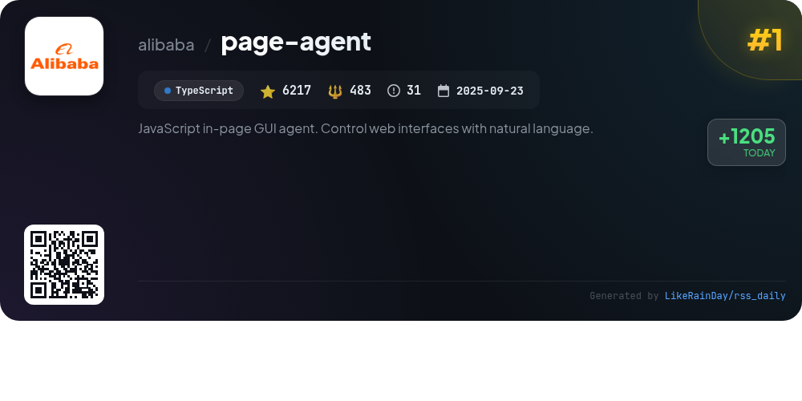
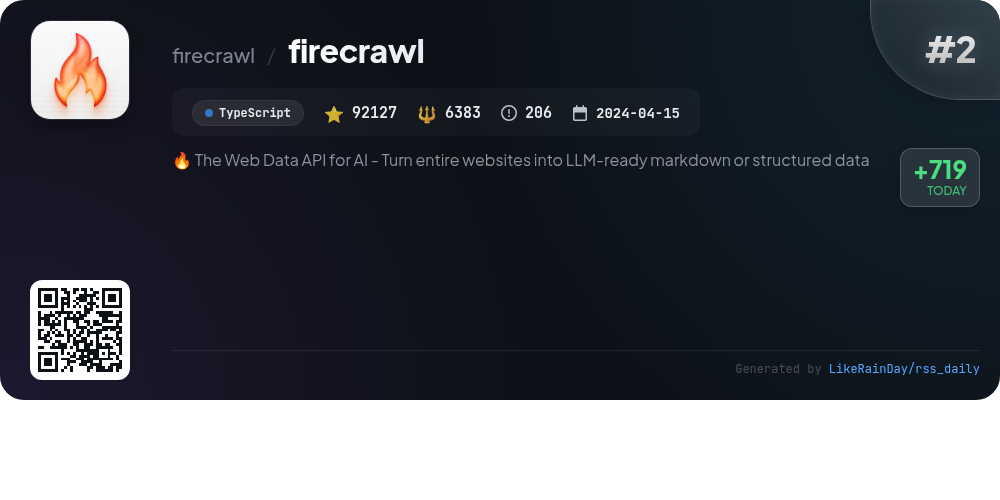
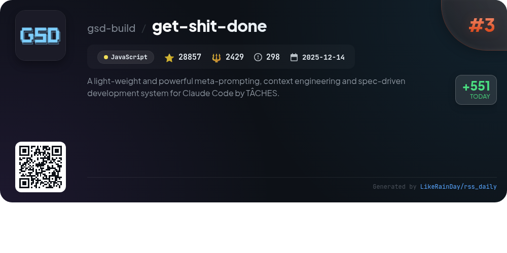
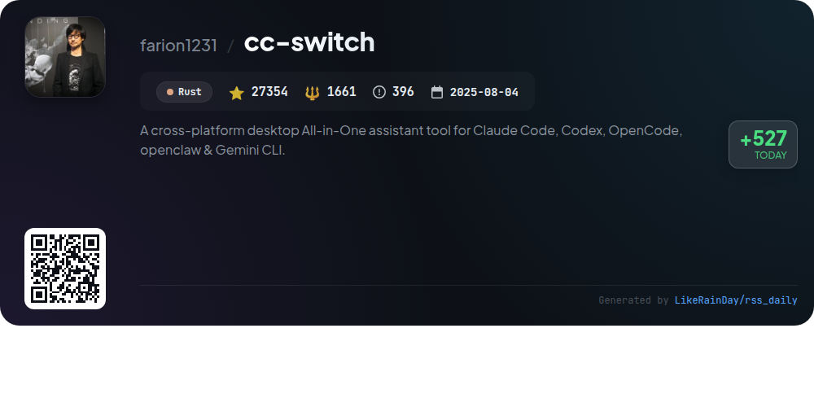
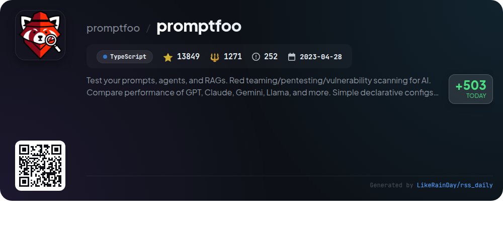
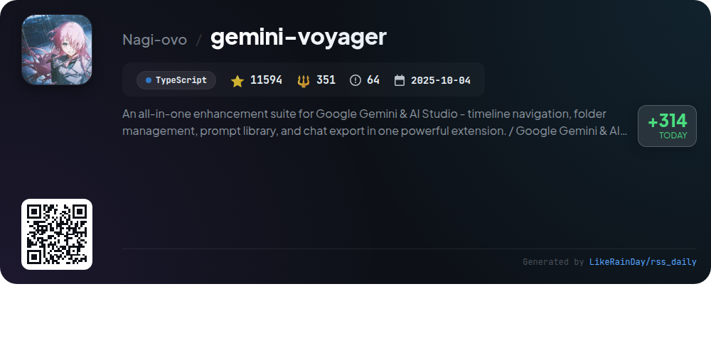
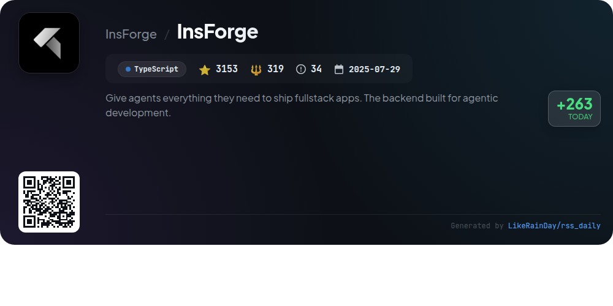
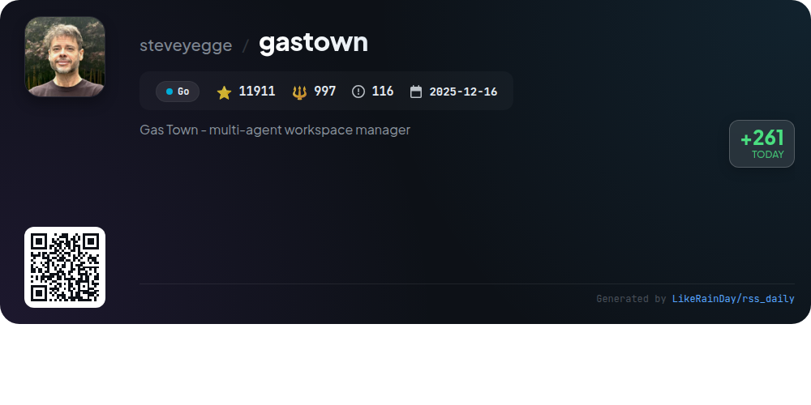
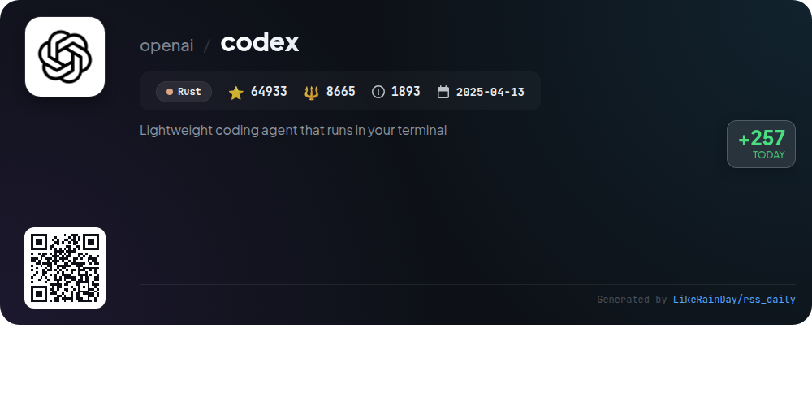
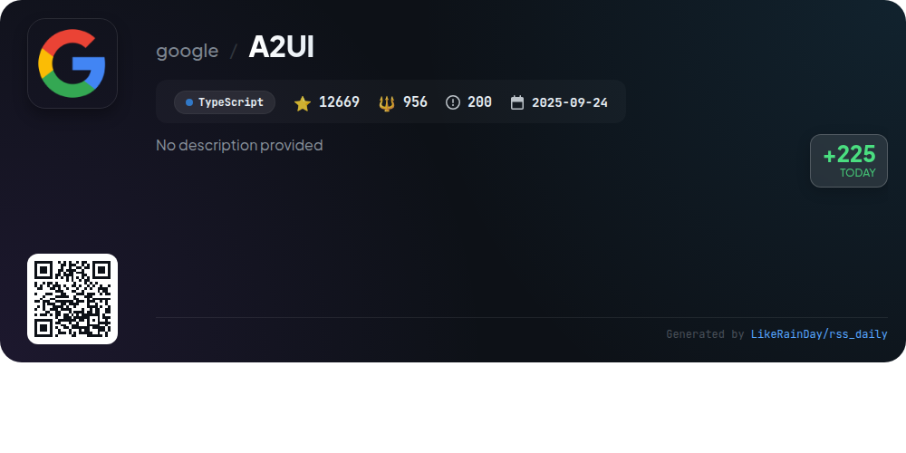

# 📊 🌟 GitHub Trending Daily - 2026-03-13

> > 📅 每日精选 GitHub 热门仓库 | 基于智能算法推荐

## 📋 Overview

**10** 个项目 | **272664** ⭐ | **23515** 🍴

**热门语言:** `TypeScript` (6) · `Rust` (2) · `JavaScript` (1)

**更新时间:** 2026-03-13 02:40 UTC

**分类分布:**

- 🌟 每日 Top 10 精选 (10 项)

---

## 🌟 每日 Top 10 精选

### 1. [page-agent](https://github.com/alibaba/page-agent)

> 🤖 **推荐理由**  
> *JavaScript in-page GUI agent. Control web interfaces with natural language.. popular project, actively maintained, recently updated*

- ⭐ 6217 stars
- 🍴 483 forks
- 💻 TypeScript
- 📅 Updated: 2026-03-13

### 2. [firecrawl](https://github.com/firecrawl/firecrawl)

> 🤖 **推荐理由**  
> *Firecrawl is a powerful API designed to convert entire websites into LLM-ready markdown or structured data, enhancing AI applications with real-time web context. Core features include LLM-ready output in various formats, industry-leading reliability, proxy handling, and dynamic content scraping. It supports batch processing, change tracking, and media parsing, enabling users to automate data extraction and web browsing securely. With robust SDKs in Python, Node.js, and Java, plus integrations with AI tools, Firecrawl streamlines web data extraction for diverse applications.*

- ⭐ 92127 stars
- 💻 TypeScript
- 📅 Updated: 2026-03-13

### 3. [get-shit-done](https://github.com/gsd-build/get-shit-done)

> 🤖 **推荐理由**  
> *get-shit-done is a lightweight, powerful meta-prompting and context engineering system designed for Claude Code, OpenCode, Gemini CLI, and Codex. With over 28,000 stars on GitHub, it effectively addresses context rot, ensuring high-quality outputs as it utilizes advanced context management, XML prompt formatting, and multi-agent orchestration. Key features include streamlined project initialization, phase-based planning, parallel execution, and automated verification. Trusted by engineers at major companies, GSD simplifies spec-driven development, allowing users to transform ideas into reliable code efficiently.*

- ⭐ 28857 stars
- 💻 JavaScript
- 📅 Updated: 2026-03-13

### 4. [cc-switch](https://github.com/farion1231/cc-switch)

> 🤖 **推荐理由**  
> *CC Switch is a cross-platform desktop tool that simplifies management of multiple AI CLI tools, including Claude Code, Codex, Gemini CLI, OpenCode, and OpenClaw. With over 27,000 stars on GitHub, it provides a unified interface for quick provider switching without manual edits, featuring 50+ built-in presets, cloud sync options, and a system tray for instant access. Key functionalities include unified MCP & Skills management, a usage dashboard, and session tracking. Built with Rust and Tauri, CC Switch supports Windows, macOS, and Linux, making AI development more efficient.*

- ⭐ 27354 stars
- 💻 Rust
- 📅 Updated: 2026-03-13

### 5. [promptfoo](https://github.com/promptfoo/promptfoo)

> 🤖 **推荐理由**  
> *Promptfoo is a powerful CLI and library designed for testing and securing AI applications. It enables automated evaluations of prompts, red teaming for vulnerability scanning, and side-by-side comparisons of various LLM models like GPT and Claude. With simple declarative configurations, it integrates seamlessly into CI/CD pipelines and allows for code scanning to identify LLM-related security issues. Key features include local execution for privacy, flexibility with any LLM API, and a focus on developer efficiency. Open-source and community-driven, Promptfoo empowers developers to create secure, reliable AI applications.*

- ⭐ 13849 stars
- 💻 TypeScript
- 📅 Updated: 2026-03-13

### 6. [gemini-voyager](https://github.com/Nagi-ovo/gemini-voyager)

> 🤖 **推荐理由**  
> *Gemini Voyager is a comprehensive enhancement suite for Google Gemini and AI Studio, featuring an elegant timeline for navigation, robust folder management, and a versatile prompt vault. Key highlights include chat export to various formats, cloud sync with Google Drive, and personalized visual effects for an enriched user experience. Designed for efficiency, it supports bulk actions and offers tools like Mermaid rendering and Markdown fixes. With over 11,500 stars on GitHub, it stands out as an essential tool for organizing AI conversations and improving productivity.*

- ⭐ 11594 stars
- 💻 TypeScript
- 📅 Updated: 2026-03-13

### 7. [InsForge](https://github.com/InsForge/InsForge)

> 🤖 **推荐理由**  
> *InsForge is a powerful backend development platform designed for AI coding agents, enabling seamless fullstack app deployment. It provides a semantic layer that simplifies interactions with backend primitives such as authentication, databases, storage, and serverless edge functions. Key features include context fetching, configuration of backend services, and inspection of backend states. With support for PostgreSQL and an OpenAI-compatible model gateway, InsForge caters to modern development needs. Easy setup via Docker and cloud hosting options make it accessible for developers.*

- ⭐ 3153 stars
- 💻 TypeScript
- 📅 Updated: 2026-03-13

### 8. [gastown](https://github.com/steveyegge/gastown)

> 🤖 **推荐理由**  
> *Gas Town is a multi-agent workspace manager designed for seamless coordination of Claude Code agents. With persistent work tracking using git-backed hooks, it eliminates context loss on agent restarts. Key features include the Mayor as an AI coordinator, project Rigs, and Polecats as worker agents that maintain persistent identity. It supports scaling to 20-30 agents, simplifying manual coordination with built-in mailboxes and tracking units called Convoys. The system integrates Beads for structured issue tracking, providing a robust solution for complex workflows.*

- ⭐ 11911 stars
- 💻 Go
- 📅 Updated: 2026-03-13

### 9. [codex](https://github.com/openai/codex)

> 🤖 **推荐理由**  
> *Codex is a lightweight coding agent by OpenAI that runs locally in your terminal, designed to enhance coding efficiency. With over 64,000 stars on GitHub, it supports installation via npm or Homebrew. Users can integrate Codex into popular IDEs like VS Code or use it as a desktop app. The CLI allows for easy access to coding assistance, with options for signing in via a ChatGPT account or using an API key. Comprehensive documentation and contribution guidelines are available to support user engagement and development.*

- ⭐ 64933 stars
- 💻 Rust
- 📅 Updated: 2026-03-13

### 10. [A2UI](https://github.com/google/A2UI)

> 🤖 **推荐理由**  
> *A2UI is an open-source framework enabling agents to generate rich, interactive UIs using a declarative JSON format. Currently in public preview (v0.8), it prioritizes security by allowing agents to request only pre-approved UI components. A2UI is framework-agnostic, facilitating cross-platform UI rendering, and supports incremental updates for responsive interactions. Key use cases include dynamic data collection and adaptive workflows. The project invites collaboration to enhance its capabilities, with plans for more renderers and improved specifications.*

- ⭐ 12669 stars
- 💻 TypeScript
- 📅 Updated: 2026-03-13

---

## 📡 RSS订阅

通过 RSS 订阅，第一时间获取每日精选项目：

- 🔔 [RSS 订阅源] (../../daily-top.xml)
- 🔔 [每日简报] (../../GITHUB_TODAY_CN.md)
- 🔔 [每日 Top 10 精选](../../daily-top.xml)

---

*⚡ Powered by Smart Trending Algorithm | Generated at 2026-03-13 02:40:48 UTC
