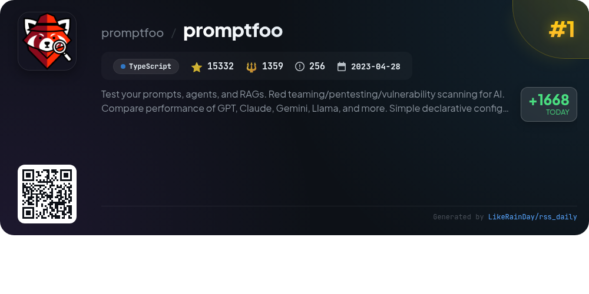
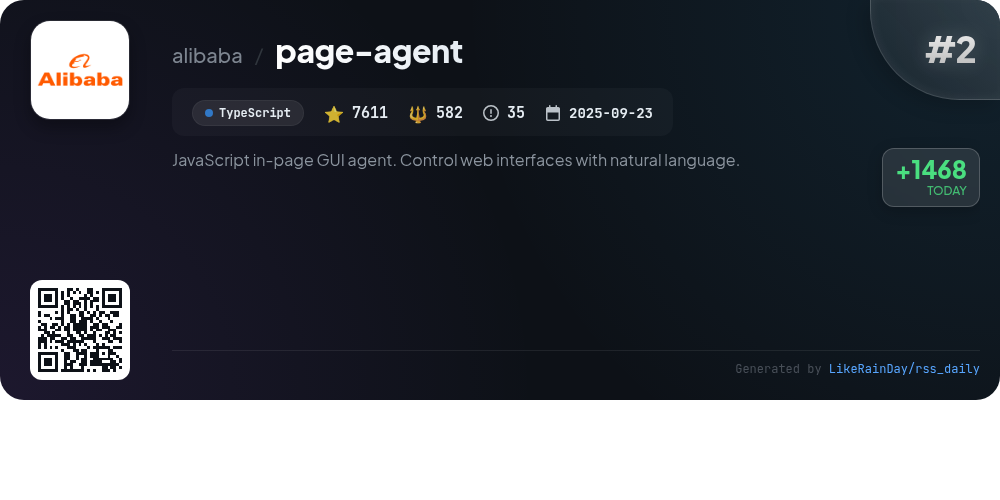
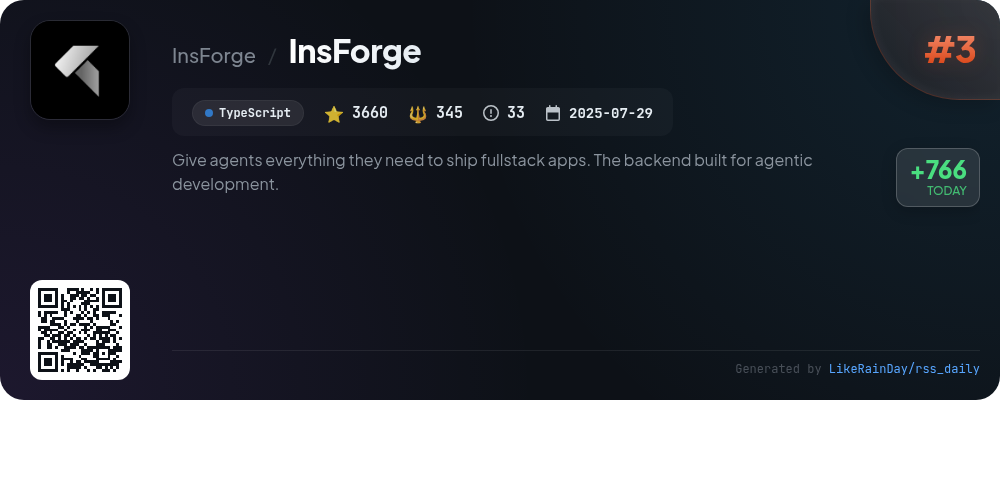
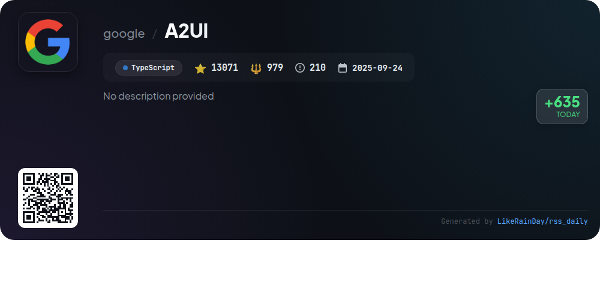
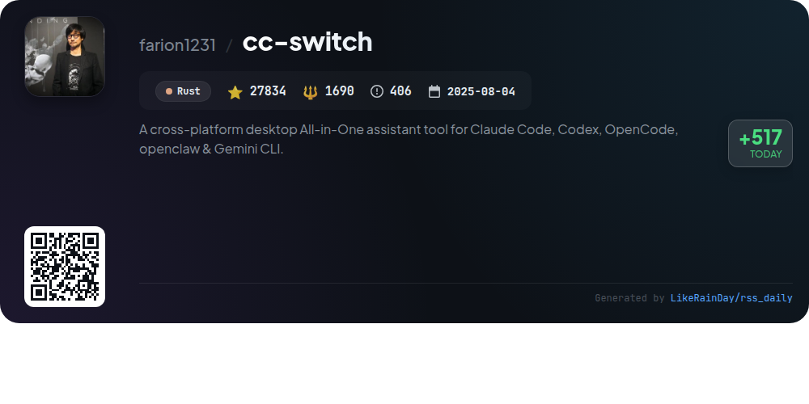
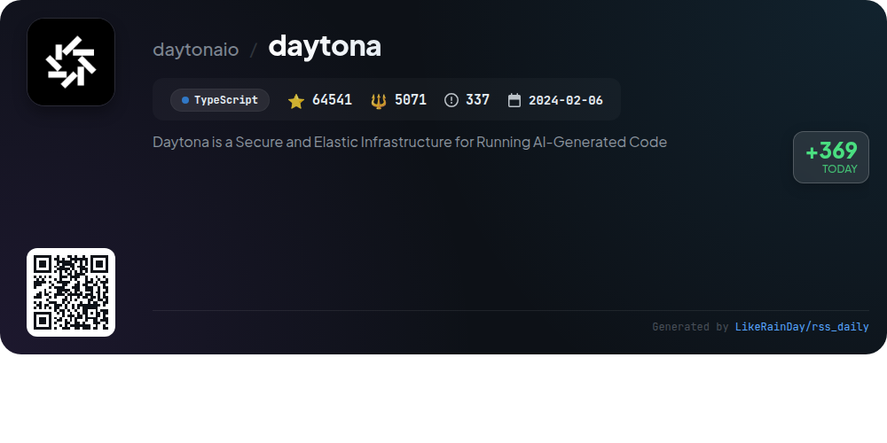
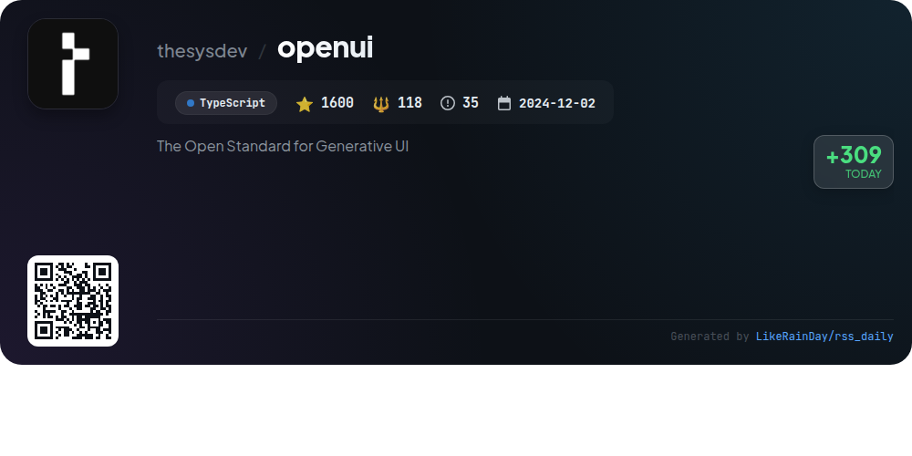
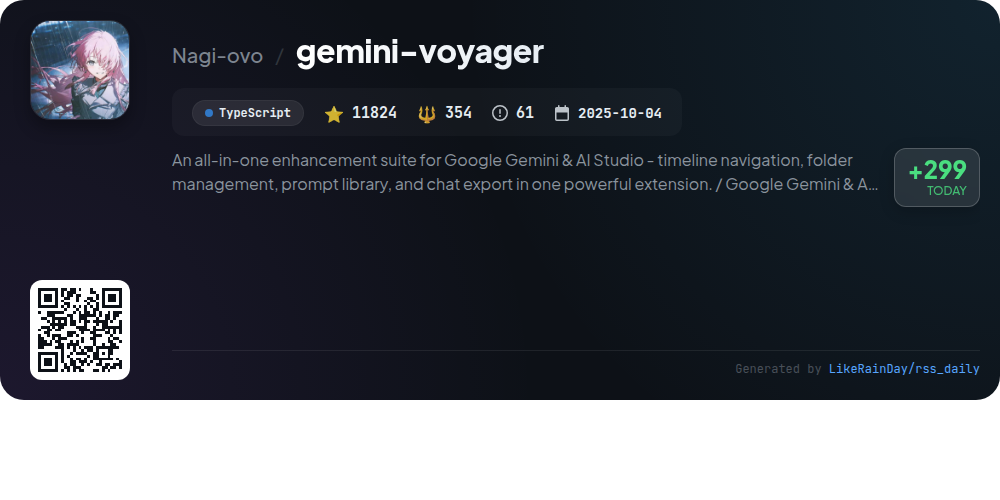
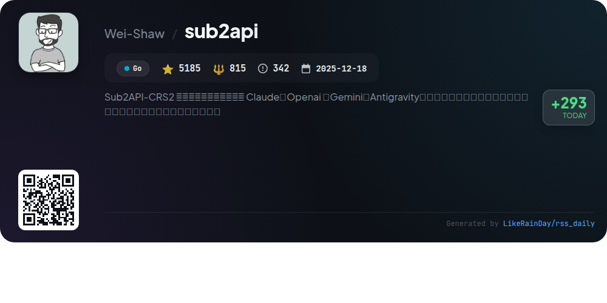
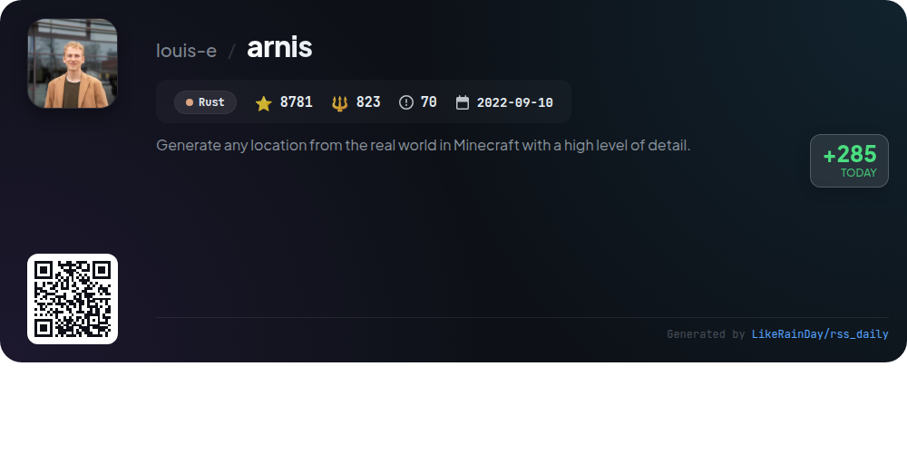

# 📊 🌟 GitHub Trending Daily - 2026-03-14

> > 📅 Daily Picks of GitHub Trending Repositories | Powered by Smart Algorithms

## 📋 Overview

**10** Projects | **159439** ⭐ | **12136** 🍴

**Top Languages:** `TypeScript` (7) · `Rust` (2) · `Go` (1)

**Updated:** 2026-03-14 02:38 UTC

**Categories:**

- 🌟 Daily Top 10 (10 items)

---

## 🌟 Daily Top 10

### 1. [promptfoo](https://github.com/promptfoo/promptfoo)

> 🤖 **Why Recommend**  
> *Promptfoo is a powerful CLI tool and library designed for evaluating and securing AI applications. It enables users to test prompts and models across various LLM providers like GPT, Claude, and Llama, facilitating automated evaluations and red teaming for vulnerability scanning. With simple declarative configurations, it integrates seamlessly into CI/CD pipelines, allowing for code scanning and compliance checks. Designed for developers, it runs evaluations locally, ensuring privacy while providing actionable insights and performance comparisons. Open source and community-driven, Promptfoo fosters secure and reliable AI development.*

- ⭐ 15332 stars
- 💻 TypeScript
- 📅 Updated: 2026-03-14

### 2. [page-agent](https://github.com/alibaba/page-agent)

> 🤖 **Why Recommend**  
> *JavaScript in-page GUI agent. Control web interfaces with natural language.. popular project, actively maintained, recently updated*

- ⭐ 7611 stars
- 🍴 582 forks
- 💻 TypeScript
- 📅 Updated: 2026-03-14

### 3. [InsForge](https://github.com/InsForge/InsForge)

> 🤖 **Why Recommend**  
> *InsForge is a backend development platform designed for AI coding agents, providing essential tools for creating fullstack applications. Key features include a semantic layer for backend context engineering, enabling agents to fetch documentation, configure primitives, and inspect backend states. Core services encompass user authentication, a Postgres database, S3-compatible storage, a model gateway for LLM APIs, edge functions, and site deployment. With a community-driven approach, InsForge simplifies backend operations for developers using TypeScript.*

- ⭐ 3660 stars
- 💻 TypeScript
- 📅 Updated: 2026-03-14

### 4. [A2UI](https://github.com/google/A2UI)

> 🤖 **Why Recommend**  
> *A2UI is an open-source project designed to enable agents to generate rich, interactive user interfaces through a secure, declarative JSON format. With over 13,000 stars, it allows for framework-agnostic rendering across platforms, ensuring safety by using pre-approved UI components. Key features include incremental updates for responsive designs, dynamic data collection forms, and adaptive workflows. Currently in public preview (v0.8), A2UI invites collaboration to finalize specifications and expand renderer support, enhancing the future of agent-driven UI development.*

- ⭐ 13071 stars
- 💻 TypeScript
- 📅 Updated: 2026-03-14

### 5. [cc-switch](https://github.com/farion1231/cc-switch)

> 🤖 **Why Recommend**  
> *cc-switch is a cross-platform desktop assistant tool designed to manage five AI CLI tools: Claude Code, Codex, Gemini CLI, OpenCode, and OpenClaw. With over 27,000 stars on GitHub, it simplifies API provider management through a visual interface, eliminating manual configuration edits. Key features include 50+ provider presets, unified management of MCP and Skills, quick-switching from the system tray, and cloud sync capabilities. Built with Rust and Tauri, it supports Windows, macOS, and Linux, ensuring seamless integration and efficient workflow for developers.*

- ⭐ 27834 stars
- 💻 Rust
- 📅 Updated: 2026-03-14

### 6. [daytona](https://github.com/daytonaio/daytona)

> 🤖 **Why Recommend**  
> *Daytona is a Secure and Elastic Infrastructure for Running AI-Generated Code. popular project, actively maintained, recently updated*

- ⭐ 64541 stars
- 🍴 5071 forks
- 💻 TypeScript
- 📅 Updated: 2026-03-14

### 7. [openui](https://github.com/thesysdev/openui)

> 🤖 **Why Recommend**  
> *OpenUI is a full-stack Generative UI framework that utilizes OpenUI Lang, a compact, streaming-first language for structured UI generation. With built-in component libraries for charts, forms, and more, it offers up to 67% greater token efficiency than JSON. Core features include prompt generation from component libraries, a streaming renderer for progressive UI updates, and ready-to-use chat interfaces. The project simplifies app development with a robust CLI and provides a foundation for assistants and interactive products. Visit [openui.com](https://openui.com) for documentation and examples.*

- ⭐ 1600 stars
- 💻 TypeScript
- 📅 Updated: 2026-03-14

### 8. [gemini-voyager](https://github.com/Nagi-ovo/gemini-voyager)

> 🤖 **Why Recommend**  
> *Gemini Voyager is a powerful enhancement suite for Google Gemini & AI Studio, featuring comprehensive tools for timeline navigation, folder management, a prompt library, and chat export. Key highlights include organized chat folders, cloud sync, and visual effects, alongside exclusive functions like timeline navigation for easy message access, export options in various formats, and tools for managing conversations efficiently. With over 11,800 stars, it provides a structured and personalized experience for users looking to optimize their AI interactions.*

- ⭐ 11824 stars
- 💻 TypeScript
- 📅 Updated: 2026-03-14

### 9. [sub2api](https://github.com/Wei-Shaw/sub2api)

> 🤖 **Why Recommend**  
> *Sub2API is an open-source AI API gateway designed for efficient management and distribution of subscription quotas from various AI services like Claude, OpenAI, and Gemini. It features multi-account management, API key generation, precise billing, smart scheduling, and concurrency control. The platform offers an admin dashboard for monitoring and management, supporting seamless integration with tools such as Docker and PostgreSQL. With over 5,000 stars on GitHub, Sub2API streamlines API access and cost-sharing, making it ideal for developers and teams looking to optimize their AI service usage.*

- ⭐ 5185 stars
- 💻 Go
- 📅 Updated: 2026-03-14

### 10. [arnis](https://github.com/louis-e/arnis)

> 🤖 **Why Recommend**  
> *Arnis is an open-source project that allows users to generate highly detailed Minecraft worlds based on real-world locations, utilizing geographic data from OpenStreetMap and elevation data for accurate terrain and architecture representation. Compatible with Minecraft Java Edition (1.17+) and Bedrock Edition, Arnis supports large-scale data processing and offers customization options for world generation. Users can easily select areas on a map and initiate generation through a user-friendly GUI. The project emphasizes modularity, performance, and cross-platform support, welcoming community contributions.*

- ⭐ 8781 stars
- 💻 Rust
- 📅 Updated: 2026-03-14

---

## 📡 RSS Subscription

Subscribe via RSS to get daily trending updates:

- 🔔 [RSS XML] (../../daily-top.xml)
- 🔔 [Daily Report] (../../GITHUB_TODAY.md)
- 🔔 [Daily Top 10](../../daily-top.xml)

---

*⚡ Powered by Smart Trending Algorithm | Generated at 2026-03-14 02:38:23 UTC
