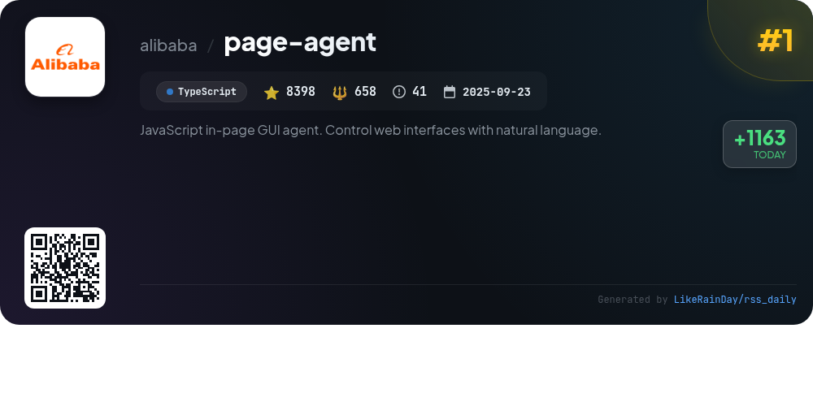
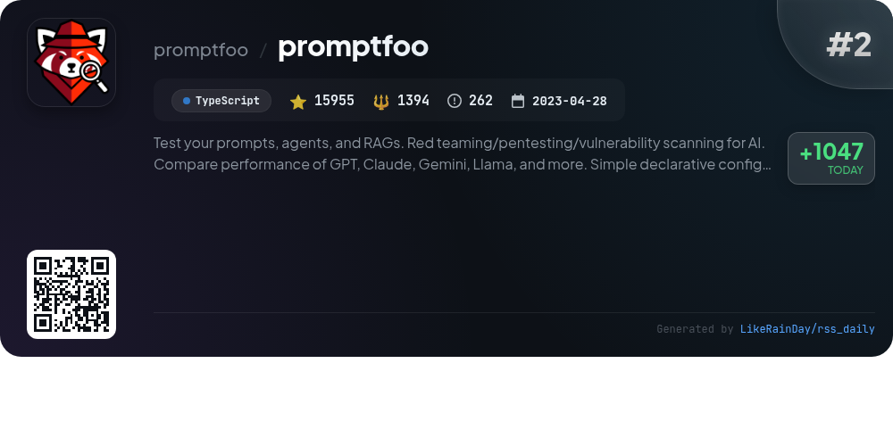
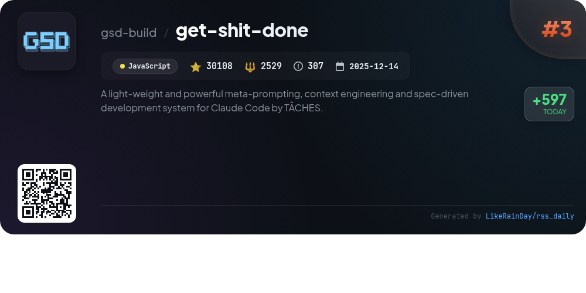
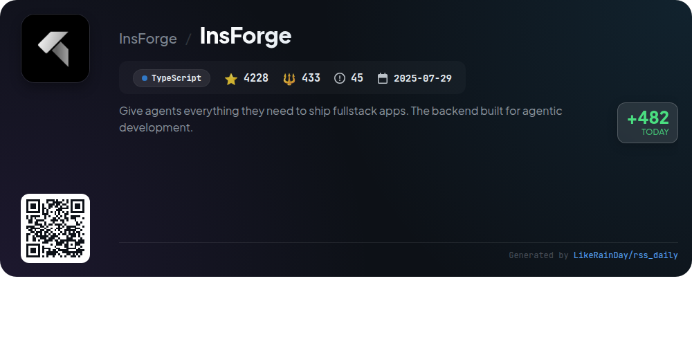
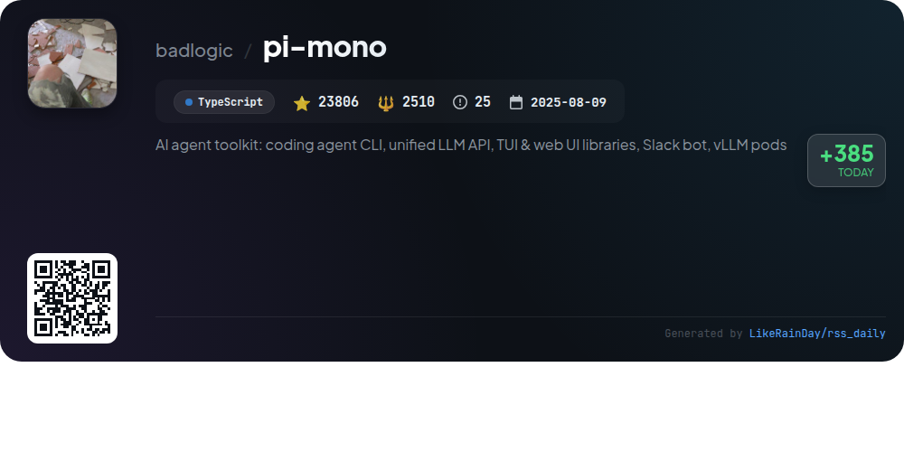
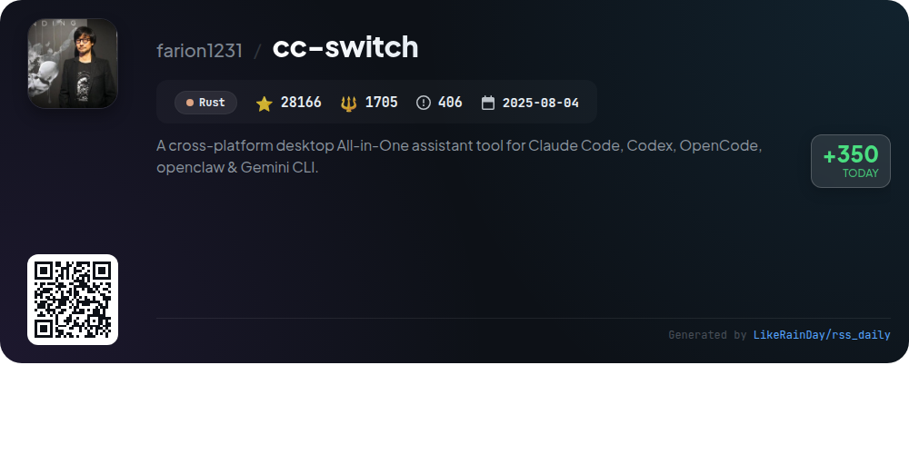
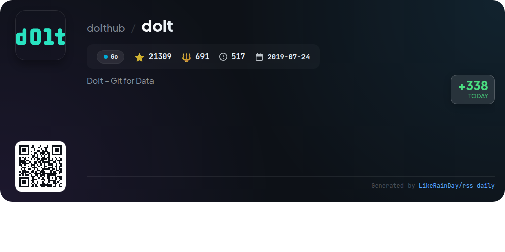
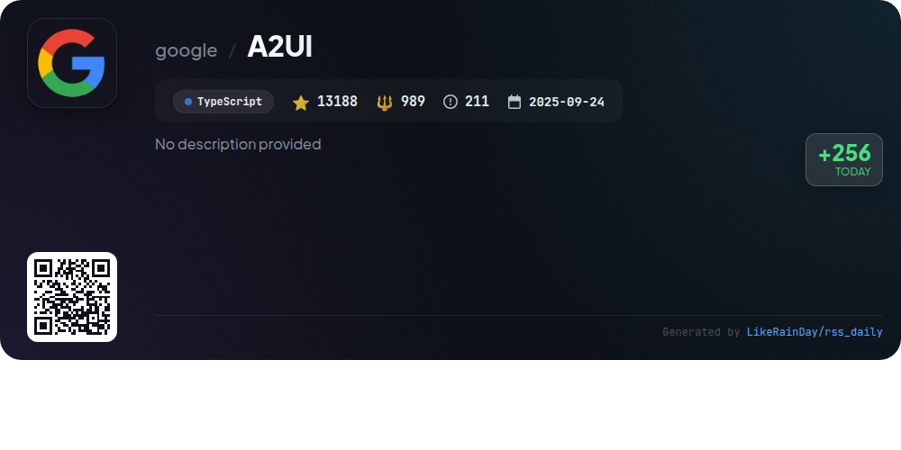
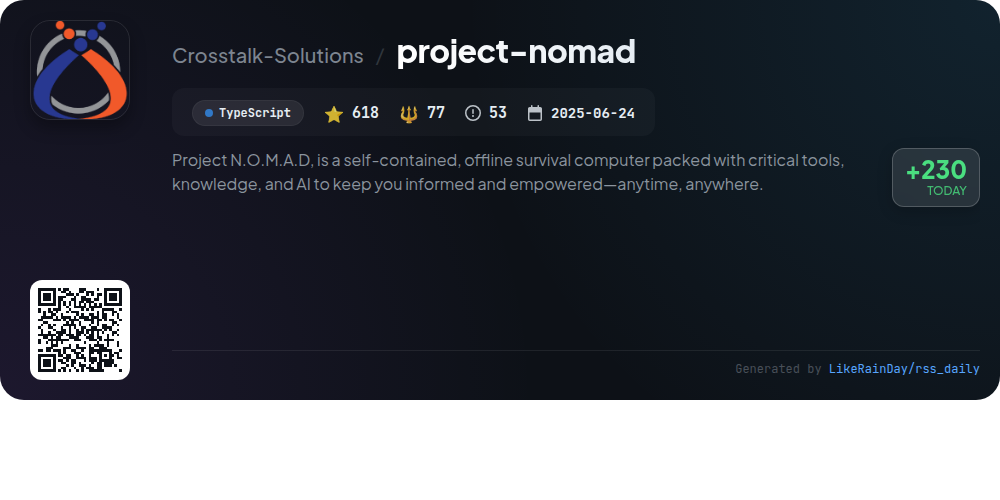
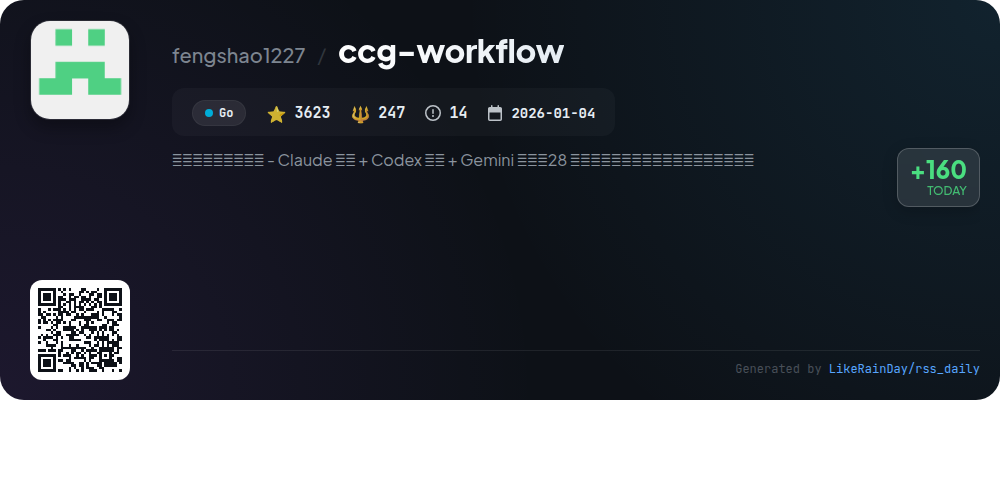

# 📊 🌟 GitHub Trending Daily - 2026-03-15

> > 📅 每日精选 GitHub 热门仓库 | 基于智能算法推荐

## 📋 Overview

**10** 个项目 | **149399** ⭐ | **11233** 🍴

**热门语言:** `TypeScript` (6) · `Go` (2) · `JavaScript` (1)

**更新时间:** 2026-03-15 02:58 UTC

**分类分布:**

- 🌟 每日 Top 10 精选 (10 项)

---

## 🌟 每日 Top 10 精选

### 1. [page-agent](https://github.com/alibaba/page-agent)

> 🤖 **推荐理由**  
> *JavaScript in-page GUI agent. Control web interfaces with natural language.. popular project, actively maintained, recently updated*

- ⭐ 8398 stars
- 🍴 658 forks
- 💻 TypeScript
- 📅 Updated: 2026-03-15

### 2. [promptfoo](https://github.com/promptfoo/promptfoo)

> 🤖 **推荐理由**  
> *Promptfoo is a powerful CLI and library designed for evaluating and red-teaming LLM applications. It enables users to test prompts, perform automated evaluations, and conduct vulnerability scans to ensure secure AI applications. With support for major LLM providers like OpenAI and Anthropic, users can compare model performance side-by-side. Promptfoo integrates seamlessly with CI/CD workflows and allows for local evaluations, safeguarding privacy. Its developer-friendly features and open-source nature make it a valuable tool for optimizing AI reliability and security.*

- ⭐ 15955 stars
- 💻 TypeScript
- 📅 Updated: 2026-03-15

### 3. [get-shit-done](https://github.com/gsd-build/get-shit-done)

> 🤖 **推荐理由**  
> *Get Shit Done (GSD) is a lightweight meta-prompting and context engineering system designed for efficient development with Claude Code, OpenCode, Gemini CLI, and Codex. With over 30,000 stars on GitHub, GSD addresses "context rot" by enabling users to define projects through structured commands. Key features include project initialization, phased planning, execution in parallel waves, and automated verification. It supports multiple runtimes, ensuring high-quality code generation while maintaining clarity and organization. GSD is trusted by engineers at major companies like Amazon and Google.*

- ⭐ 30108 stars
- 💻 JavaScript
- 📅 Updated: 2026-03-15

### 4. [InsForge](https://github.com/InsForge/InsForge)

> 🤖 **推荐理由**  
> *InsForge is a backend development platform designed for AI coding agents, enabling seamless fullstack app deployment. It offers core services like user authentication, a Postgres database, S3-compatible storage, and serverless edge functions. The platform's semantic layer allows agents to fetch, configure, and inspect backend primitives effortlessly. With over 4,200 stars, InsForge supports both cloud-hosted and self-hosted setups via Docker. Comprehensive documentation and community support are available for users seeking assistance.*

- ⭐ 4228 stars
- 💻 TypeScript
- 📅 Updated: 2026-03-15

### 5. [pi-mono](https://github.com/badlogic/pi-mono)

> 🤖 **推荐理由**  
> *pi-mono is an AI agent toolkit that simplifies the development and management of AI agents and LLM deployments. Key features include a unified API for multiple LLM providers, an interactive coding agent CLI, a Slack bot for message delegation, and libraries for TUI and web UI components. Additionally, it offers tools for managing vLLM deployments on GPU pods. With over 23,800 stars, pi-mono is designed for developers looking to integrate advanced AI capabilities into their applications efficiently. Contributions and community support are encouraged.*

- ⭐ 23806 stars
- 💻 TypeScript
- 📅 Updated: 2026-03-15

### 6. [cc-switch](https://github.com/farion1231/cc-switch)

> 🤖 **推荐理由**  
> *CC Switch is a cross-platform desktop assistant tool designed to manage AI CLI tools like Claude Code, Codex, Gemini CLI, OpenCode, and OpenClaw. With over 28,000 stars on GitHub, it offers a unified interface, eliminating the need for manual configuration edits. Key features include 50+ built-in provider presets, unified MCP and Skills management, instant switching from a system tray, and cloud sync capabilities. Built with Rust and Tauri, it ensures a reliable user experience across Windows, macOS, and Linux, making AI-powered coding more efficient and accessible.*

- ⭐ 28166 stars
- 💻 Rust
- 📅 Updated: 2026-03-15

### 7. [dolt](https://github.com/dolthub/dolt)

> 🤖 **推荐理由**  
> *Dolt – Git for Data. popular project, actively maintained, recently updated*

- ⭐ 21309 stars
- 🍴 691 forks
- 💻 Go
- 📅 Updated: 2026-03-15

### 8. [A2UI](https://github.com/google/A2UI)

> 🤖 **推荐理由**  
> *A2UI is an open-source framework designed for agents to generate rich, interactive user interfaces using a secure, declarative JSON format. With 13,188 stars, it ensures safety by allowing clients to render only pre-approved components, fostering cross-platform compatibility. A2UI supports dynamic data collection, adaptive workflows, and remote sub-agent interactions, making it versatile for various applications. Currently in early public preview (v0.8), it aims to stabilize specifications and expand renderer support for frameworks like React and SwiftUI. Contributions are welcome to enhance the ecosystem.*

- ⭐ 13188 stars
- 💻 TypeScript
- 📅 Updated: 2026-03-15

### 9. [project-nomad](https://github.com/Crosstalk-Solutions/project-nomad)

> 🤖 **推荐理由**  
> *Project N.O.M.A.D, is a self-contained, offline survival computer packed with critical tools, knowledge, and AI to keep you informed and empowered—a. recently updated*

- ⭐ 618 stars
- 🍴 77 forks
- 💻 TypeScript
- 📅 Updated: 2026-03-15

### 10. [ccg-workflow](https://github.com/fengshao1227/ccg-workflow)

> 🤖 **推荐理由**  
> *ccg-workflow is a multi-model collaboration development system integrating Claude, Codex, and Gemini, streamlining the development process with 27 commands for planning, execution, and code review. Key features include zero-config model routing, security through patch reviews, and spec-driven development using OPSX to clarify requirements. The system supports both frontend and backend tasks, allowing seamless collaboration across models. With installation via a single command, it offers an efficient setup for developers looking to enhance their workflows.*

- ⭐ 3623 stars
- 💻 Go
- 📅 Updated: 2026-03-15

---

## 📡 RSS订阅

通过 RSS 订阅，第一时间获取每日精选项目：

- 🔔 [RSS 订阅源] (../../daily-top.xml)
- 🔔 [每日简报] (../../GITHUB_TODAY_CN.md)
- 🔔 [每日 Top 10 精选](../../daily-top.xml)

---

*⚡ Powered by Smart Trending Algorithm | Generated at 2026-03-15 02:58:42 UTC
