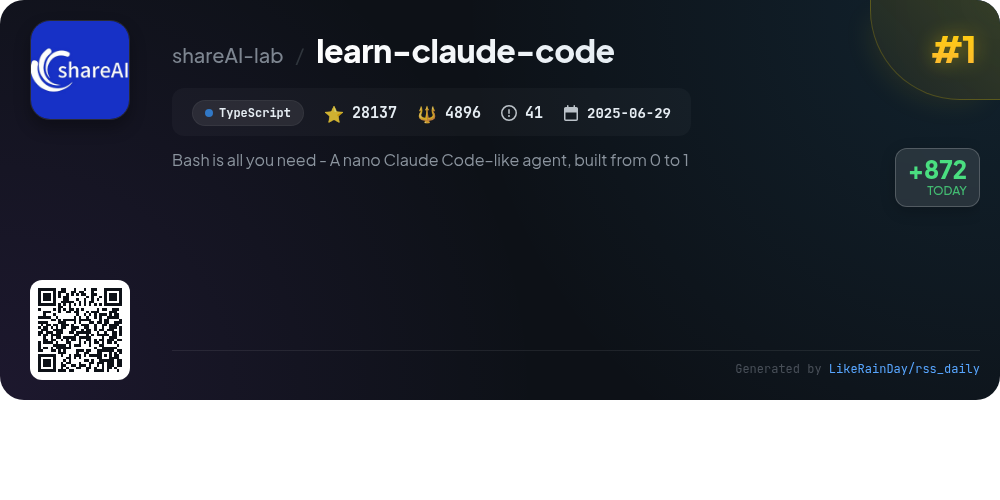
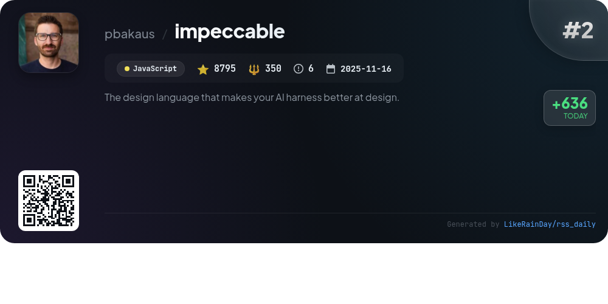
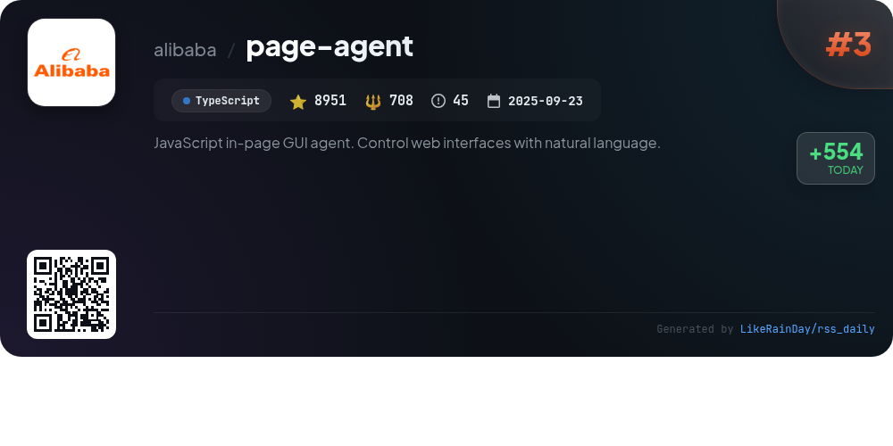
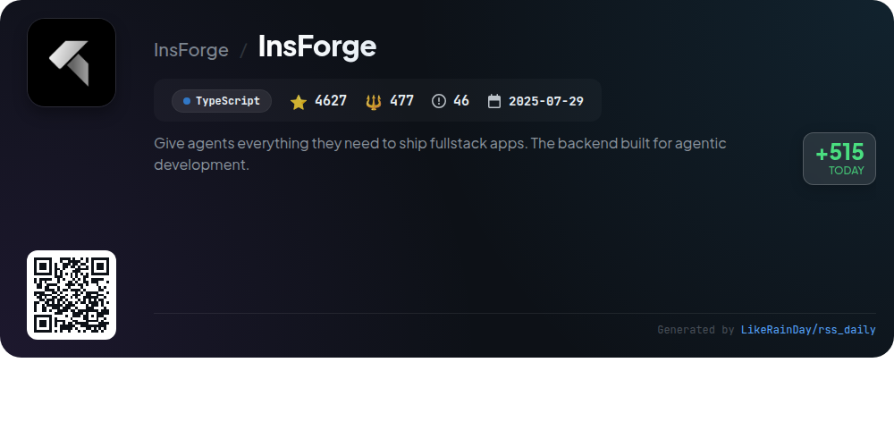
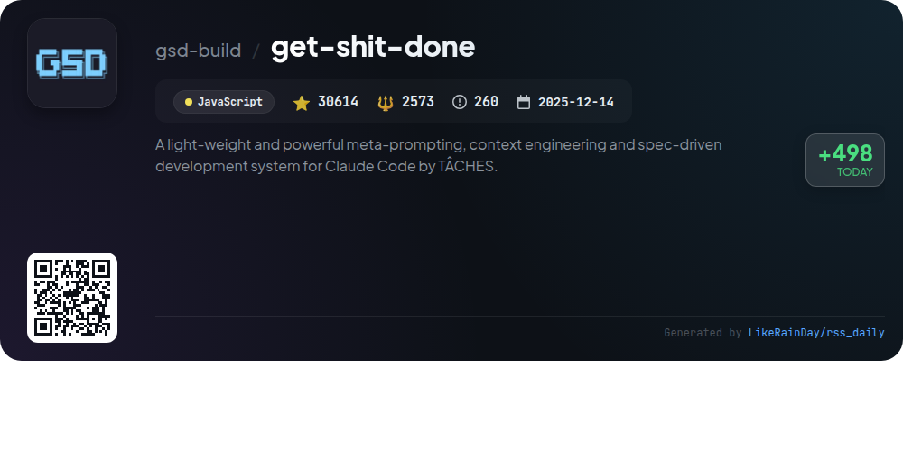
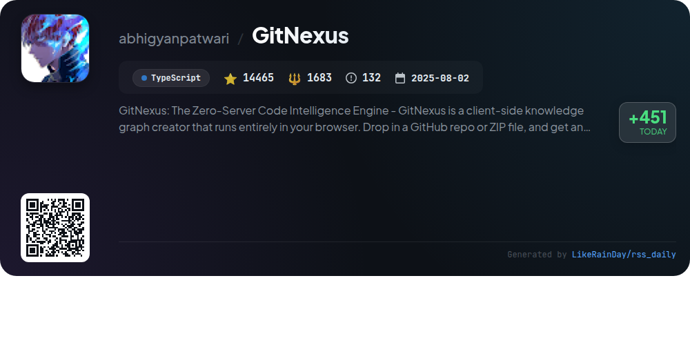
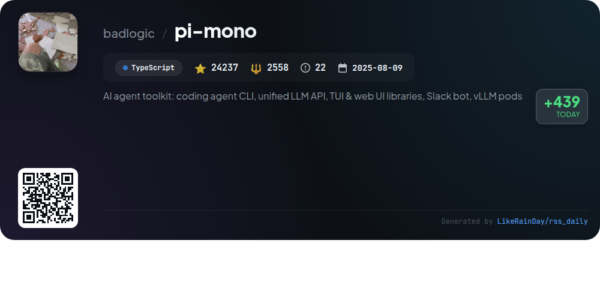
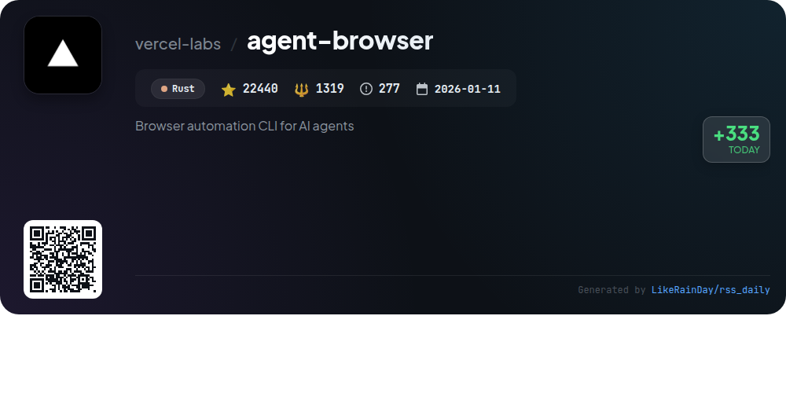
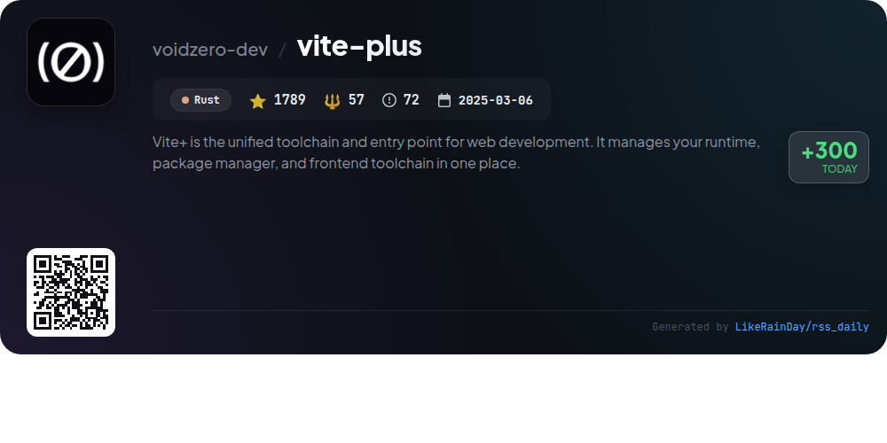
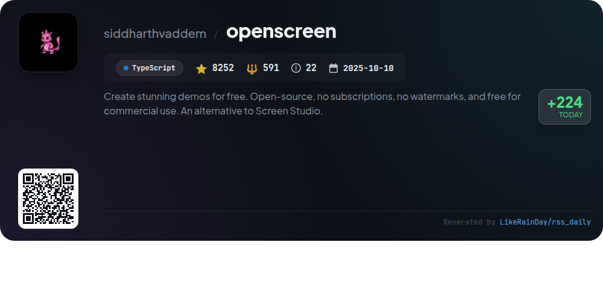

# 📊 🌟 GitHub Trending Daily - 2026-03-16

> > 📅 Daily Picks of GitHub Trending Repositories | Powered by Smart Algorithms

## 📋 Overview

**10** Projects | **152307** ⭐ | **15212** 🍴

**Top Languages:** `TypeScript` (6) · `Rust` (2) · `JavaScript` (2)

**Updated:** 2026-03-16 02:59 UTC

**Categories:**

- 🌟 Daily Top 10 (10 items)

---

## 🌟 Daily Top 10

### 1. [learn-claude-code](https://github.com/shareAI-lab/learn-claude-code)

> 🤖 **Why Recommend**  
> *Learn Claude Code is a TypeScript project that guides users in building a nano AI agent from scratch. It features a structured learning path through 12 progressive sessions, each introducing new mechanisms like tool handling, autonomous tasking, and team collaboration. The core agent loop allows for message processing and tool execution while maintaining a clean context. Additional services include a web platform for interactive learning and the Kode agent CLI/SDK for practical implementation. The project is designed for educational purposes, focusing on agent development fundamentals.*

- ⭐ 28137 stars
- 💻 TypeScript
- 📅 Updated: 2026-03-16

### 2. [impeccable](https://github.com/pbakaus/impeccable)

> 🤖 **Why Recommend**  
> *Impeccable is a powerful design language aimed at enhancing frontend design for AI systems. It features an expanded skill set with 7 domain-specific references and offers 17 commands for tasks like auditing, critiquing, and polishing designs. The project addresses common design pitfalls with curated anti-patterns, ensuring better UI practices. Users can quickly implement Impeccable by downloading bundles from impeccable.style, making it compatible with various AI tools like Cursor and Claude Code. With over 8,795 stars, it stands out as a valuable resource for developers seeking superior design guidance.*

- ⭐ 8795 stars
- 💻 JavaScript
- 📅 Updated: 2026-03-16

### 3. [page-agent](https://github.com/alibaba/page-agent)

> 🤖 **Why Recommend**  
> *JavaScript in-page GUI agent. Control web interfaces with natural language.. popular project, actively maintained, recently updated*

- ⭐ 8951 stars
- 🍴 708 forks
- 💻 TypeScript
- 📅 Updated: 2026-03-16

### 4. [InsForge](https://github.com/InsForge/InsForge)

> 🤖 **Why Recommend**  
> *InsForge is a robust backend development platform designed for AI coding agents, facilitating the creation of fullstack applications. Key features include a semantic layer for backend primitives (databases, authentication, storage, and functions), enabling agents to understand and manipulate backend systems seamlessly. The platform supports essential services like PostgreSQL databases, S3-compatible storage, and serverless edge functions. With over 4,600 stars on GitHub, InsForge offers both cloud-hosted and self-hosted options, making it accessible for diverse development needs.*

- ⭐ 4627 stars
- 💻 TypeScript
- 📅 Updated: 2026-03-16

### 5. [get-shit-done](https://github.com/gsd-build/get-shit-done)

> 🤖 **Why Recommend**  
> *get-shit-done (GSD) is a lightweight, powerful system for meta-prompting, context engineering, and spec-driven development tailored for Claude Code, OpenCode, Codex, and more. It effectively combats context rot, ensuring consistent quality in AI-generated code. Key features include a streamlined workflow for project initialization, phase discussion, planning, execution, and verification, all while maintaining fresh contexts. Trusted by engineers at major tech firms, GSD enhances productivity by automating complex tasks with minimal overhead, making it ideal for individual developers and small teams.*

- ⭐ 30614 stars
- 💻 JavaScript
- 📅 Updated: 2026-03-16

### 6. [GitNexus](https://github.com/abhigyanpatwari/GitNexus)

> 🤖 **Why Recommend**  
> *GitNexus is a client-side knowledge graph engine for code analysis, running entirely in-browser. Users can drop in GitHub repos or ZIP files to generate interactive knowledge graphs, enhancing code exploration and AI agent integration. Key features include a CLI for deep indexing, enabling powerful tools for impact analysis, process tracing, and multi-repo support. The Web UI offers an intuitive graph explorer and AI chat without server dependencies. GitNexus ensures privacy and efficiency by processing everything locally, making it ideal for developers seeking robust code intelligence.*

- ⭐ 14465 stars
- 💻 TypeScript
- 📅 Updated: 2026-03-16

### 7. [pi-mono](https://github.com/badlogic/pi-mono)

> 🤖 **Why Recommend**  
> *pi-mono is an AI agent toolkit built in TypeScript, featuring a unified multi-provider LLM API, an interactive coding agent CLI, and various UI libraries for terminal and web applications. Key components include the Slack bot for message delegation, a runtime for agent state management, and tools for managing vLLM deployments on GPU pods. With over 24,200 stars, it provides versatile solutions for building and deploying AI agents, making it a valuable resource for developers looking to leverage AI capabilities in their projects.*

- ⭐ 24237 stars
- 💻 TypeScript
- 📅 Updated: 2026-03-16

### 8. [agent-browser](https://github.com/vercel-labs/agent-browser)

> 🤖 **Why Recommend**  
> *Browser automation CLI for AI agents. popular project, actively maintained, recently updated*

- ⭐ 22440 stars
- 🍴 1319 forks
- 💻 Rust
- 📅 Updated: 2026-03-16

### 9. [vite-plus](https://github.com/voidzero-dev/vite-plus)

> 🤖 **Why Recommend**  
> *Vite+ is a unified toolchain for web development, seamlessly integrating runtime management, package handling, and a robust frontend stack. Key features include dependency management with automatic package detection, a fast ESM dev server, and comprehensive commands for building, testing, and linting—all from a single configuration file. With commands like `vp create`, `vp migrate`, and cache-aware task execution, Vite+ simplifies the development lifecycle. Fully open-source under the MIT license, it enhances productivity across Vite's ecosystem, making it an essential tool for modern web developers.*

- ⭐ 1789 stars
- 💻 Rust
- 📅 Updated: 2026-03-16

### 10. [openscreen](https://github.com/siddharthvaddem/openscreen)

> 🤖 **Why Recommend**  
> *OpenScreen is a free, open-source tool for creating product demos and walkthroughs, serving as a simplified alternative to Screen Studio. With over 8,250 stars on GitHub, it allows users to record their screens, add customizable zooms, capture microphone and system audio, and incorporate annotations. Users can trim clips, adjust speeds, and choose various backgrounds. OpenScreen is fully free for personal and commercial use, with no subscriptions or watermarks. Built with TypeScript, Electron, and React, it welcomes community contributions while still in beta.*

- ⭐ 8252 stars
- 💻 TypeScript
- 📅 Updated: 2026-03-16

---

## 📡 RSS Subscription

Subscribe via RSS to get daily trending updates:

- 🔔 [RSS XML] (../../daily-top.xml)
- 🔔 [Daily Report] (../../GITHUB_TODAY.md)
- 🔔 [Daily Top 10](../../daily-top.xml)

---

*⚡ Powered by Smart Trending Algorithm | Generated at 2026-03-16 02:59:12 UTC
