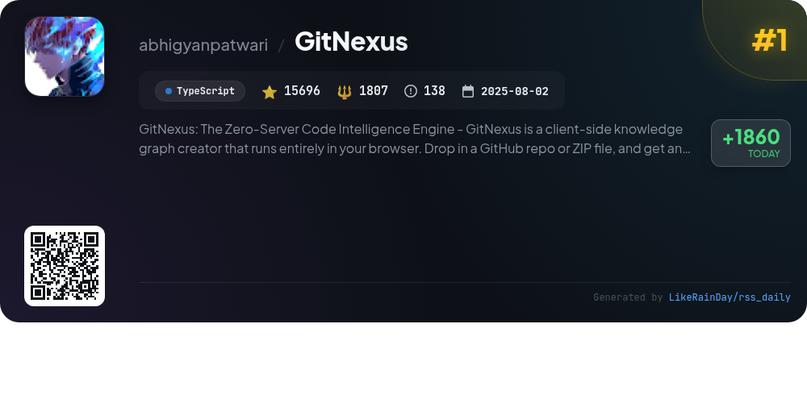
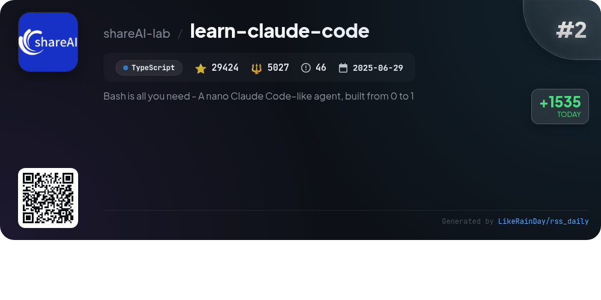
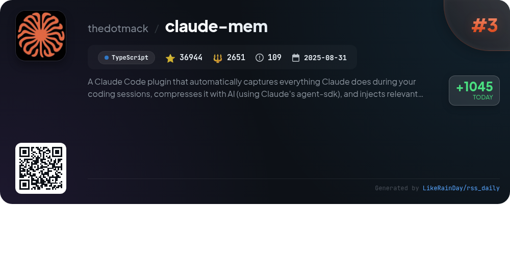
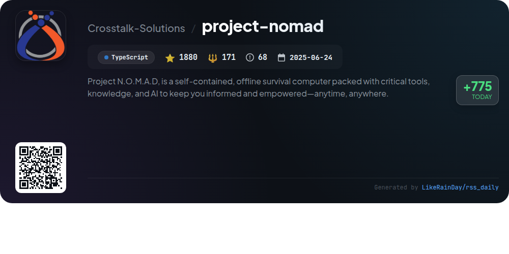
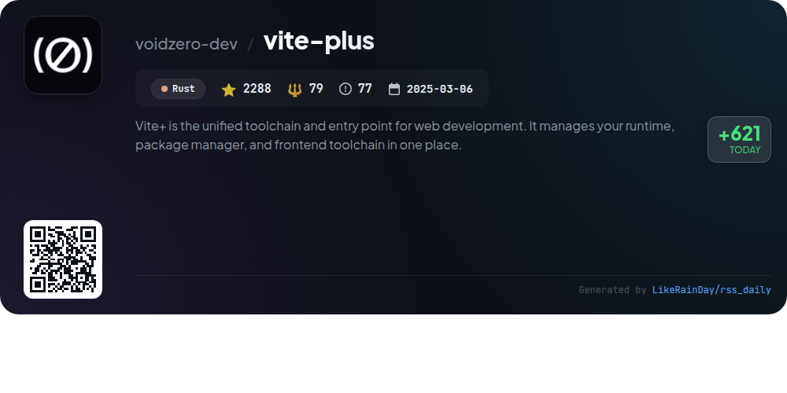
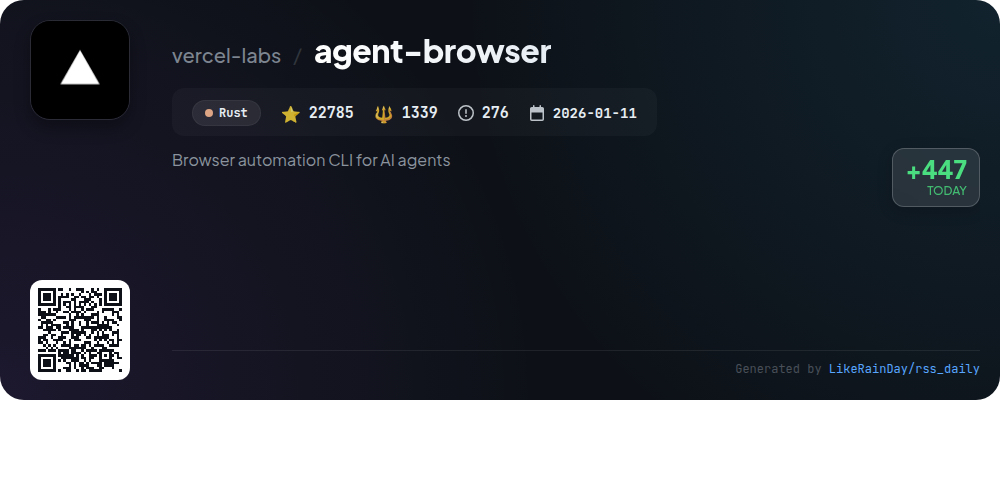
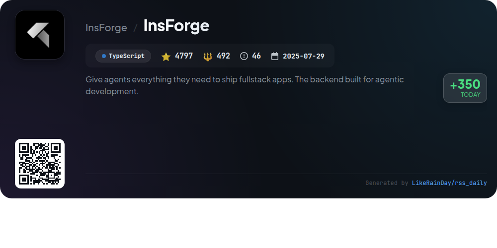
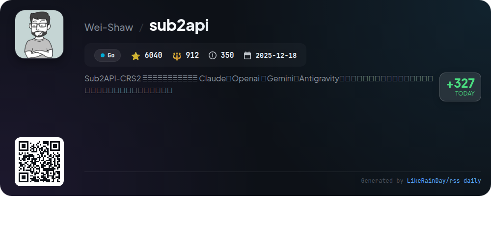
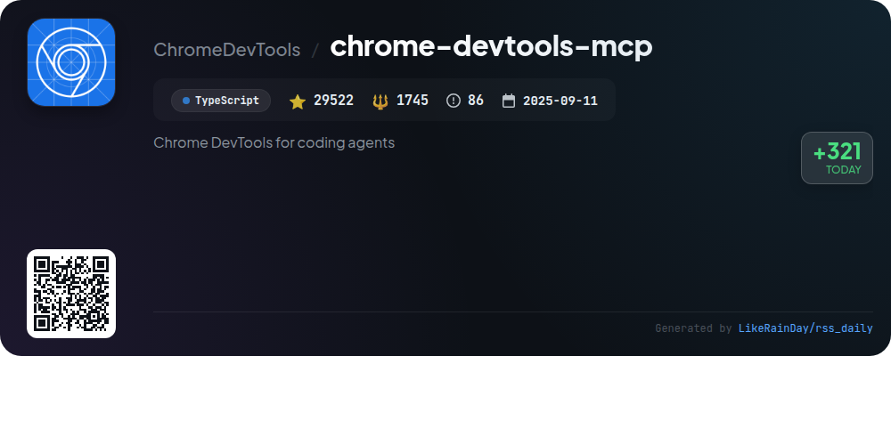
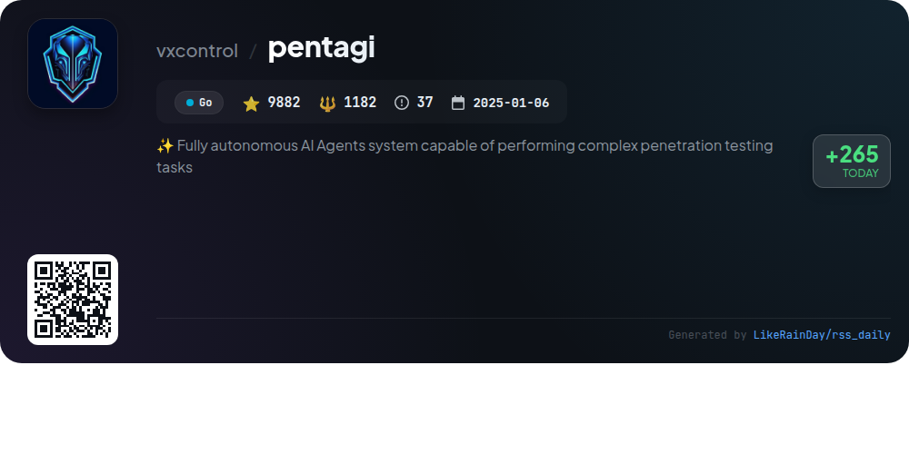

# 📊 🌟 GitHub Trending Daily - 2026-03-17

> > 📅 每日精选 GitHub 热门仓库 | 基于智能算法推荐

## 📋 Overview

**10** 个项目 | **159258** ⭐ | **15405** 🍴

**热门语言:** `TypeScript` (6) · `Rust` (2) · `Go` (2)

**更新时间:** 2026-03-17 02:42 UTC

**分类分布:**

- 🌟 每日 Top 10 精选 (10 项)

---

## 🌟 每日 Top 10 精选

### 1. [GitNexus](https://github.com/abhigyanpatwari/GitNexus)

> 🤖 **推荐理由**  
> *GitNexus is a zero-server code intelligence engine that creates client-side knowledge graphs directly in your browser. Users can index GitHub repositories or ZIP files to visualize relationships, dependencies, and execution flows with an interactive graph. Key features include a powerful CLI for deep analysis and a browser-based UI for quick exploration. GitNexus enhances AI agent performance by precomputing code structure, providing reliable context and insights. It supports various languages, ensuring comprehensive project understanding while maintaining privacy and security.*

- ⭐ 15696 stars
- 💻 TypeScript
- 📅 Updated: 2026-03-17

### 2. [learn-claude-code](https://github.com/shareAI-lab/learn-claude-code)

> 🤖 **推荐理由**  
> *Learn Claude Code is a TypeScript project designed to build a nano Claude Code-like agent from the ground up. It features a minimal agent loop that integrates tool usage and planning across 12 progressive sessions, each introducing a unique mechanism for enhanced functionality. Key highlights include task decomposition, background operations, team collaboration through JSONL mailboxes, and worktree isolation. An interactive web platform provides visualizations and documentation in multiple languages. The project serves as a foundational learning resource for developing AI coding agents, with capabilities for CLI and SDK integration.*

- ⭐ 29424 stars
- 💻 TypeScript
- 📅 Updated: 2026-03-17

### 3. [claude-mem](https://github.com/thedotmack/claude-mem)

> 🤖 **推荐理由**  
> *Claude-Mem is a TypeScript plugin for Claude Code that enhances coding sessions by automatically capturing and compressing context for future use. Key features include persistent memory that survives across sessions, skill-based search for project history, and a web viewer for real-time memory streaming. It supports fine-grained context configuration and automatic operation, ensuring seamless integration. Additional functionalities like privacy control, citation referencing, and experimental beta features enhance user experience, making coding more efficient and context-aware.*

- ⭐ 36944 stars
- 💻 TypeScript
- 📅 Updated: 2026-03-17

### 4. [project-nomad](https://github.com/Crosstalk-Solutions/project-nomad)

> 🤖 **推荐理由**  
> *Project N.O.M.A.D, is a self-contained, offline survival computer packed with critical tools, knowledge, and AI to keep you informed and empowered—a. popular project, actively maintained, recently updated*

- ⭐ 1880 stars
- 🍴 171 forks
- 💻 TypeScript
- 📅 Updated: 2026-03-17

### 5. [vite-plus](https://github.com/voidzero-dev/vite-plus)

> 🤖 **推荐理由**  
> *Vite+ is a unified toolchain for web development, combining runtime and package management with a zero-config setup. It integrates essential tools like Vite, Vitest, and Oxlint, allowing developers to create, develop, check, test, build, and manage monorepo tasks seamlessly. Key features include `vp env` for Node.js management, `vp dev` for fast development servers, and `vp build` for production-ready applications. Fully open-source under the MIT license, Vite+ simplifies the development lifecycle, making it easy to scaffold new projects or migrate existing ones efficiently.*

- ⭐ 2288 stars
- 💻 Rust
- 📅 Updated: 2026-03-17

### 6. [agent-browser](https://github.com/vercel-labs/agent-browser)

> 🤖 **推荐理由**  
> *Browser automation CLI for AI agents. popular project, actively maintained, recently updated*

- ⭐ 22785 stars
- 🍴 1339 forks
- 💻 Rust
- 📅 Updated: 2026-03-17

### 7. [InsForge](https://github.com/InsForge/InsForge)

> 🤖 **推荐理由**  
> *InsForge is a TypeScript-based backend platform designed for AI coding agents, streamlining the development of full-stack applications. It features a semantic layer that connects agents to backend primitives including authentication, PostgreSQL databases, S3-compatible storage, and serverless edge functions. Key highlights include easy configuration and inspection of backend states, along with seamless integration capabilities. Users can set up InsForge via Docker or deploy it on cloud platforms like Railway and Zeabur, making it versatile for various development environments.*

- ⭐ 4797 stars
- 💻 TypeScript
- 📅 Updated: 2026-03-17

### 8. [sub2api](https://github.com/Wei-Shaw/sub2api)

> 🤖 **推荐理由**  
> *Sub2API is an open-source AI API gateway platform that streamlines the management of API quotas from services like Claude, OpenAI, and Gemini. Key features include multi-account management, API key distribution, precise billing, and smart scheduling. The platform supports concurrency control and rate limiting, all managed through an intuitive admin dashboard. Users can also leverage the PinCC relay service for hassle-free access to AI models. Built with Go and Vue, Sub2API offers deployment options via Docker and a one-click installation script, making it accessible for developers and teams alike.*

- ⭐ 6040 stars
- 💻 Go
- 📅 Updated: 2026-03-17

### 9. [chrome-devtools-mcp](https://github.com/ChromeDevTools/chrome-devtools-mcp)

> 🤖 **推荐理由**  
> *Chrome DevTools MCP is a TypeScript-based tool enabling AI coding agents like Gemini and Copilot to control and inspect a live Chrome browser. With over 29,500 stars on GitHub, it offers features such as performance insights through tracing, advanced debugging capabilities, and reliable automation using Puppeteer. Users can analyze network requests, take screenshots, and access the browser console. The server connects to Chrome, allowing seamless interaction for automation and debugging, while maintaining user privacy and data security.*

- ⭐ 29522 stars
- 💻 TypeScript
- 📅 Updated: 2026-03-17

### 10. [pentagi](https://github.com/vxcontrol/pentagi)

> 🤖 **推荐理由**  
> *PentAGI is a fully autonomous AI agent system designed for complex penetration testing tasks. It features a suite of 20+ professional security tools, operates in a secure Docker environment, and employs advanced AI for intelligent task planning and execution. Key highlights include a smart memory system for storing results, a knowledge graph for contextual understanding, and comprehensive APIs for automation. The system supports multiple LLM providers and offers detailed reporting, logging, and monitoring capabilities, making it an invaluable tool for security professionals and researchers.*

- ⭐ 9882 stars
- 💻 Go
- 📅 Updated: 2026-03-17

---

## 📡 RSS订阅

通过 RSS 订阅，第一时间获取每日精选项目：

- 🔔 [RSS 订阅源] (../../daily-top.xml)
- 🔔 [每日简报] (../../GITHUB_TODAY_CN.md)
- 🔔 [每日 Top 10 精选](../../daily-top.xml)

---

*⚡ Powered by Smart Trending Algorithm | Generated at 2026-03-17 02:42:55 UTC
