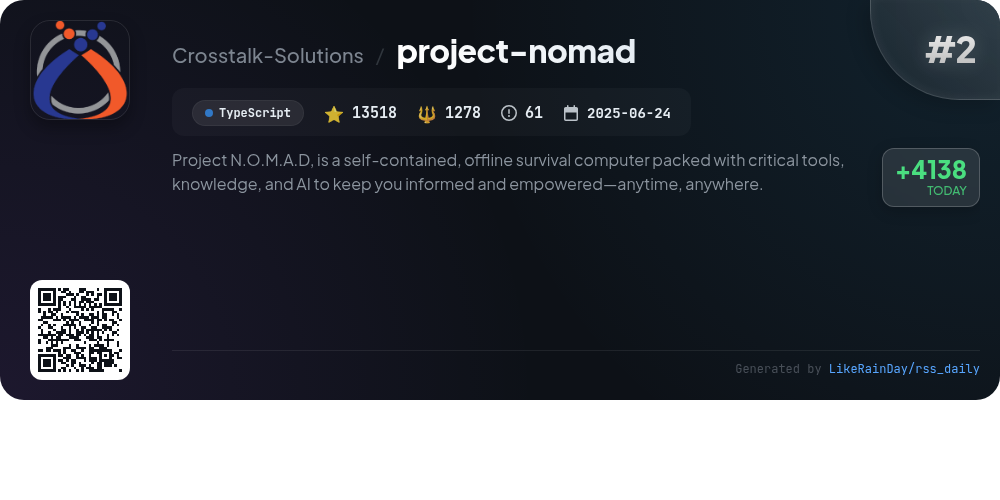
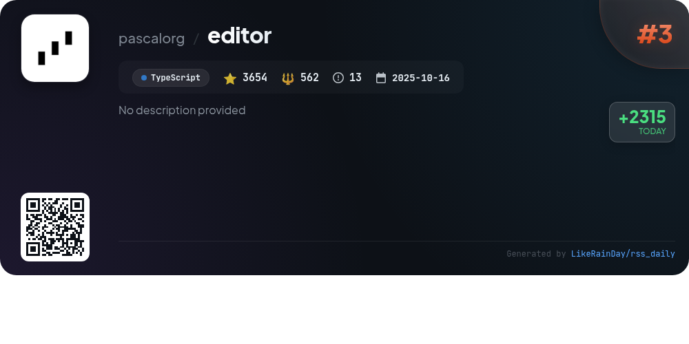
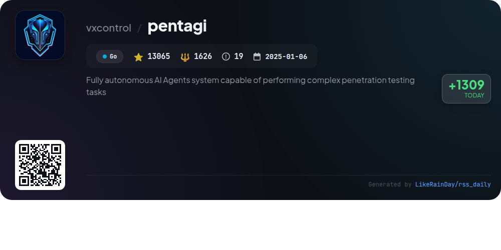
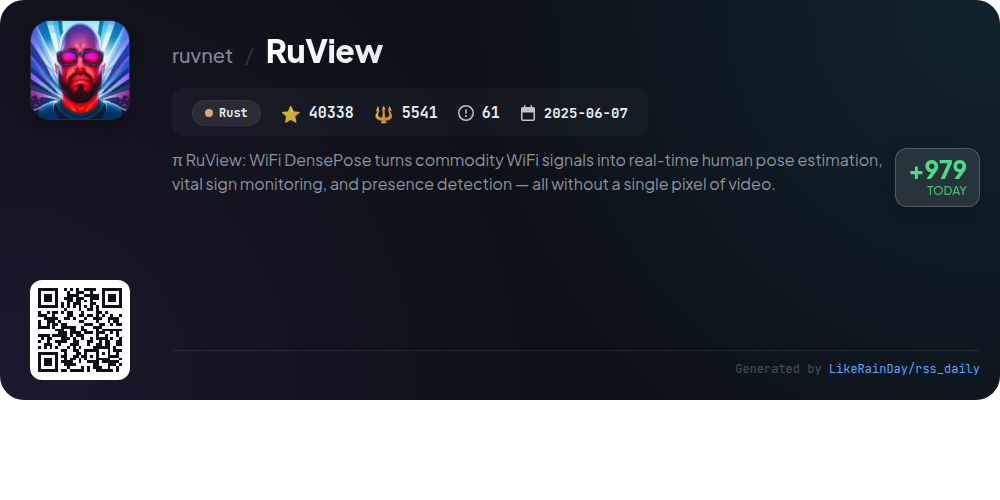
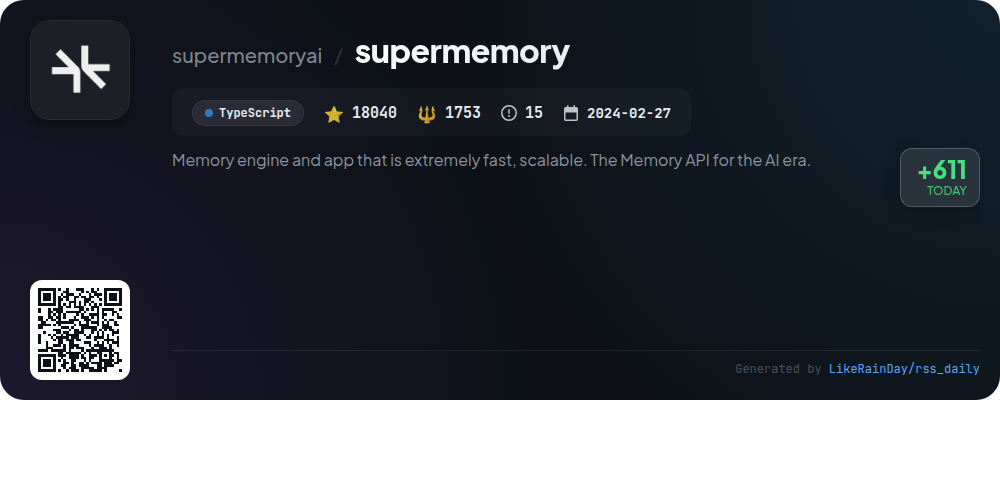
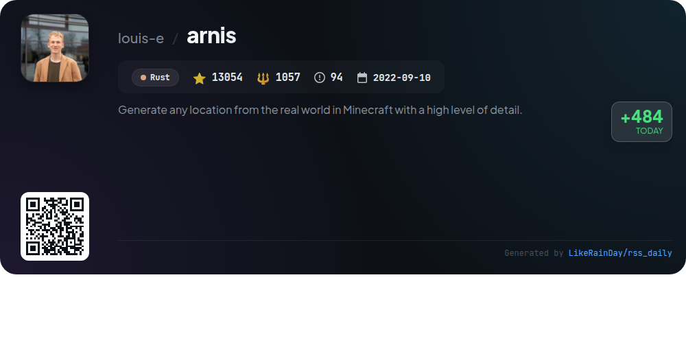
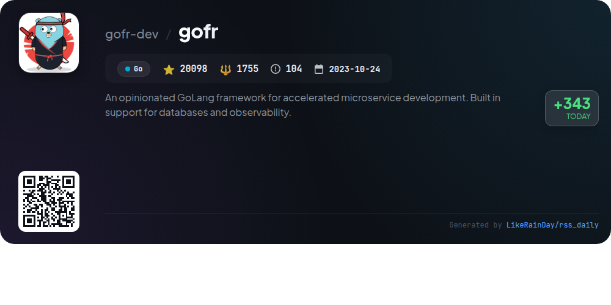
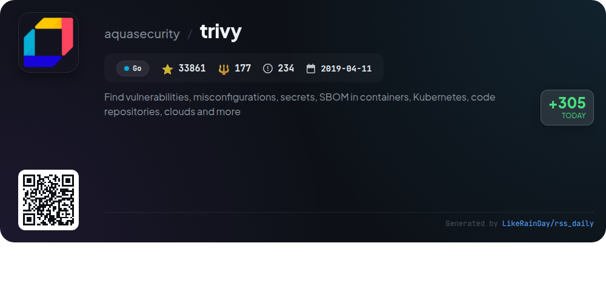
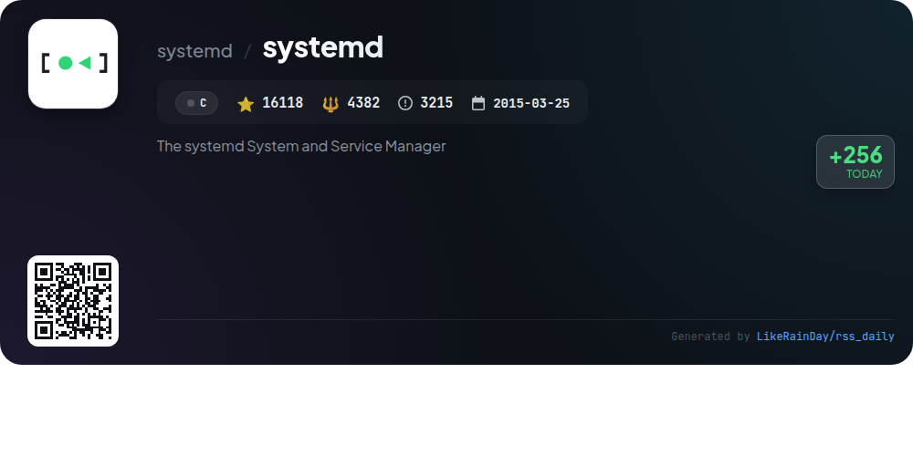

# 📊 🌟 GitHub Trending Daily - 2026-03-24

> > 📅 每日精选 GitHub 热门仓库 | 基于智能算法推荐

## 📋 Overview

**10** 个项目 | **273969** ⭐ | **31454** 🍴

**热门语言:** `Go` (3) · `TypeScript` (3) · `Rust` (2)

**更新时间:** 2026-03-24 02:42 UTC

**分类分布:**

- 🌟 每日 Top 10 精选 (10 项)

---

## 🌟 每日 Top 10 精选

### 1. [everything-claude-code](https://github.com/affaan-m/everything-claude-code)

> 🤖 **推荐理由**  
> *Everything Claude Code is a comprehensive performance optimization system for AI agents, supporting Claude Code, Codex, Cursor, and more. It offers a robust set of features including skills, instincts, memory optimization, and continuous learning. Key highlights include 28 specialized agents, 119 skills, and 60 commands for efficient workflows. The project is community-driven, with extensive documentation, cross-platform support, and advanced security auditing via AgentShield. Recognized as an Anthropic Hackathon winner, it boasts over 102,000 stars on GitHub.*

- ⭐ 102223 stars
- 💻 JavaScript
- 📅 Updated: 2026-03-24

### 2. [project-nomad](https://github.com/Crosstalk-Solutions/project-nomad)

> 🤖 **推荐理由**  
> *Project N.O.M.A.D, is a self-contained, offline survival computer packed with critical tools, knowledge, and AI to keep you informed and empowered—a. popular project, actively maintained, recently updated*

- ⭐ 13518 stars
- 🍴 1278 forks
- 💻 TypeScript
- 📅 Updated: 2026-03-24

### 3. [editor](https://github.com/pascalorg/editor)

> 🤖 **推荐理由**  
> *Pascal Editor is a sophisticated 3D building editor built with React Three Fiber and WebGPU. It features a modular architecture with a Turborepo monorepo, including core packages for state management, schema definitions, and 3D rendering. Key functionalities include interactive tools for selecting and manipulating nodes in a hierarchical scene, alongside advanced geometry generation systems. The editor utilizes Zustand for state management, supports undo/redo operations, and offers a spatial grid manager for precise placement validation, making it ideal for detailed 3D scene creation and editing.*

- ⭐ 3654 stars
- 💻 TypeScript
- 📅 Updated: 2026-03-24

### 4. [pentagi](https://github.com/vxcontrol/pentagi)

> 🤖 **推荐理由**  
> *Pentagi is a fully autonomous AI agents system designed for complex penetration testing tasks, leveraging cutting-edge AI technology. Key features include a suite of 20+ professional pentesting tools, secure operations in Docker containers, a smart memory system for result storage, and knowledge graph integration for enhanced context understanding. The platform supports various LLM providers, offers REST and GraphQL APIs, and provides detailed reporting and monitoring capabilities. With over 13,000 stars on GitHub, it serves as a powerful tool for security professionals and researchers.*

- ⭐ 13065 stars
- 💻 Go
- 📅 Updated: 2026-03-24

### 5. [RuView](https://github.com/ruvnet/RuView)

> 🤖 **推荐理由**  
> *RuView is an advanced edge AI system that leverages WiFi signals for real-time human pose estimation, vital sign monitoring, and presence detection, without the need for cameras or wearables. Built on Rust, it processes Channel State Information (CSI) to accurately reconstruct body positions and detect breathing and heart rates, achieving over 54,000 frames per second. Key features include multi-person tracking, through-wall sensing, and self-learning capabilities, enabling deployments in various environments from healthcare to disaster response. The system is designed for low-cost, low-power hardware like ESP32 nodes.*

- ⭐ 40338 stars
- 💻 Rust
- 📅 Updated: 2026-03-24

### 6. [supermemory](https://github.com/supermemoryai/supermemory)

> 🤖 **推荐理由**  
> *Supermemory is a high-performance memory engine and API designed for AI applications, offering persistent context across conversations. It excels in extracting facts, managing user profiles, and integrating seamlessly with external services like Google Drive and Notion. Key features include hybrid search combining retrieval-augmented generation (RAG) with memory, automatic forgetting of outdated information, and multi-modal document processing. With over 18,000 stars on GitHub, Supermemory is the top choice for AI memory solutions, providing a comprehensive context stack for developers and users alike.*

- ⭐ 18040 stars
- 💻 TypeScript
- 📅 Updated: 2026-03-24

### 7. [arnis](https://github.com/louis-e/arnis)

> 🤖 **推荐理由**  
> *Arnis is an open-source project that enables users to generate detailed Minecraft worlds based on real-world locations. Supporting both Java (1.17+) and Bedrock Editions, it utilizes geospatial data from OpenStreetMap and elevation data to create accurate terrain and architecture representations. With over 13,000 stars, it features a user-friendly GUI for easy map selection and generation, customizable settings, and cross-platform support. Additionally, users can access the web-based MapSmith for mobile and larger map generation. Comprehensive documentation and community contributions are encouraged.*

- ⭐ 13054 stars
- 💻 Rust
- 📅 Updated: 2026-03-24

### 8. [gofr](https://github.com/gofr-dev/gofr)

> 🤖 **推荐理由**  
> *GoFr is an opinionated GoLang framework designed for accelerated microservice development, boasting built-in support for databases and observability. Key features include a simple API syntax, REST standards, configuration management, inbuilt authentication middleware, gRPC support, and observability tools (logs, traces, metrics). It also offers HTTP services with circuit breaker support, Pub/Sub systems, health checks, database migrations, and cron jobs. With over 20,000 stars, GoFr simplifies Kubernetes deployment while ensuring robust performance and maintainability.*

- ⭐ 20098 stars
- 💻 Go
- 📅 Updated: 2026-03-24

### 9. [trivy](https://github.com/aquasecurity/trivy)

> 🤖 **推荐理由**  
> *Trivy is an open-source security scanner designed to identify vulnerabilities, misconfigurations, secrets, and software bill of materials (SBOM) across various targets, including container images, Kubernetes, and code repositories. With over 33,000 stars on GitHub, it supports multiple programming languages and platforms. Key features include scanning for OS packages, known vulnerabilities (CVEs), IaC issues, and sensitive information. Trivy integrates seamlessly with popular tools like GitHub Actions and Kubernetes, making it a versatile choice for enhancing security in DevOps workflows. For more details, visit the Trivy documentation.*

- ⭐ 33861 stars
- 💻 Go
- 📅 Updated: 2026-03-24

### 10. [systemd](https://github.com/systemd/systemd)

> 🤖 **推荐理由**  
> *systemd is a powerful system and service manager for Linux, designed to streamline the boot process and manage system services. Key features include parallel service startup, on-demand service activation, and dependency-based service control. It supports advanced logging through the journal, improved service monitoring, and socket-based activation. With over 16,000 stars on GitHub, systemd emphasizes stability and security, featuring a bug bounty program and extensive documentation. Developers can contribute via GitHub, mailing lists, and IRC channels, ensuring a collaborative development environment.*

- ⭐ 16118 stars
- 💻 C
- 📅 Updated: 2026-03-24

---

## 📡 RSS订阅

通过 RSS 订阅，第一时间获取每日精选项目：

- 🔔 [RSS 订阅源] (../../daily-top.xml)
- 🔔 [每日简报] (../../GITHUB_TODAY_CN.md)
- 🔔 [每日 Top 10 精选](../../daily-top.xml)

---

*⚡ Powered by Smart Trending Algorithm | Generated at 2026-03-24 02:42:17 UTC
