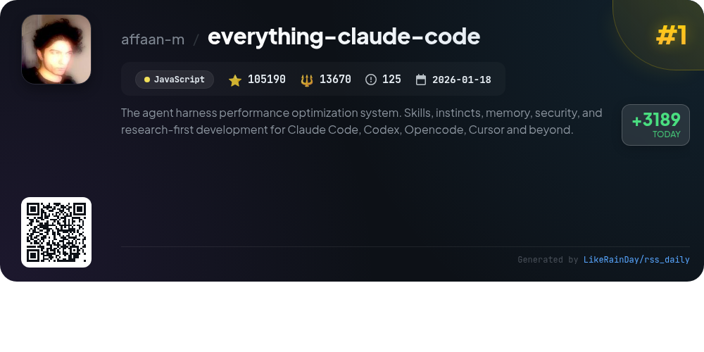
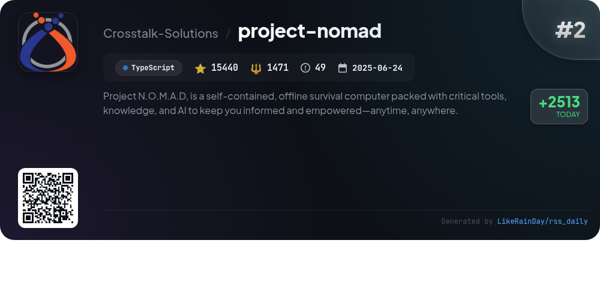
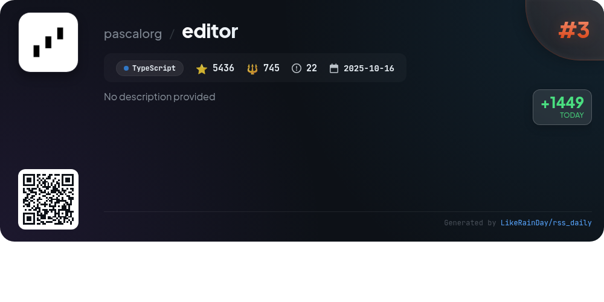
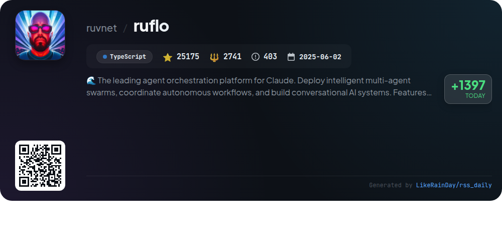
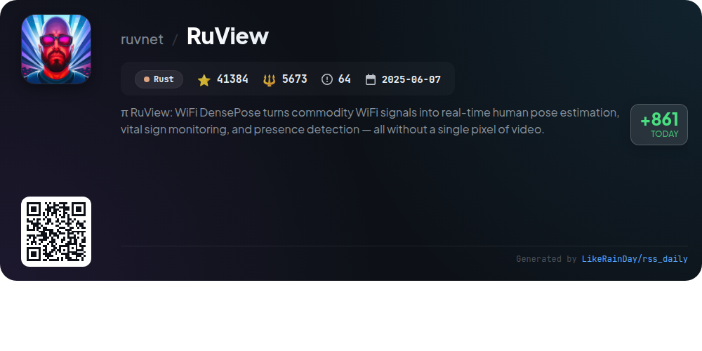
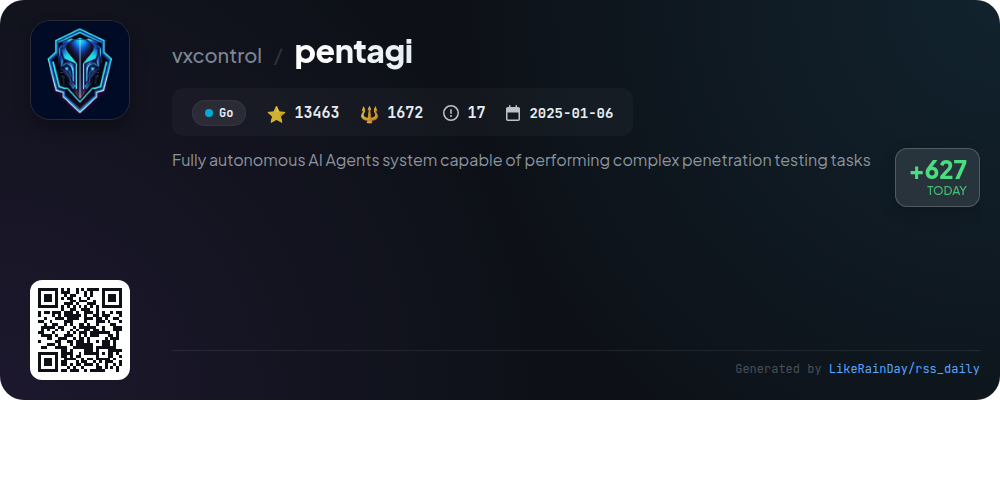
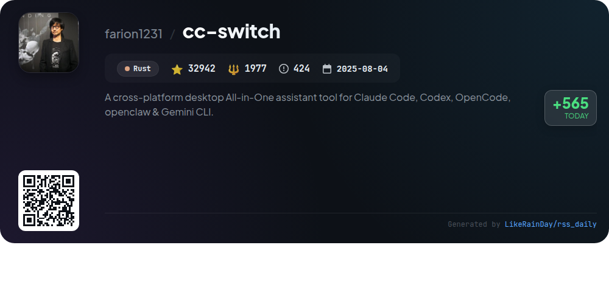
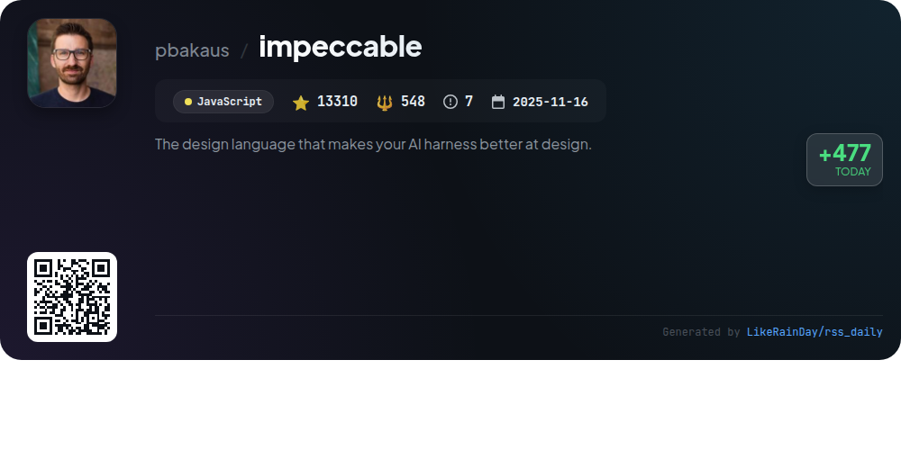
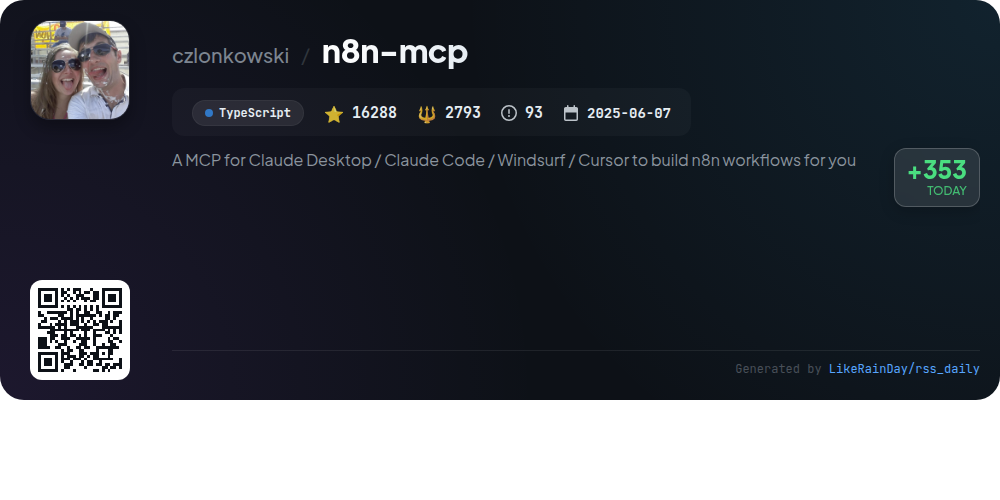
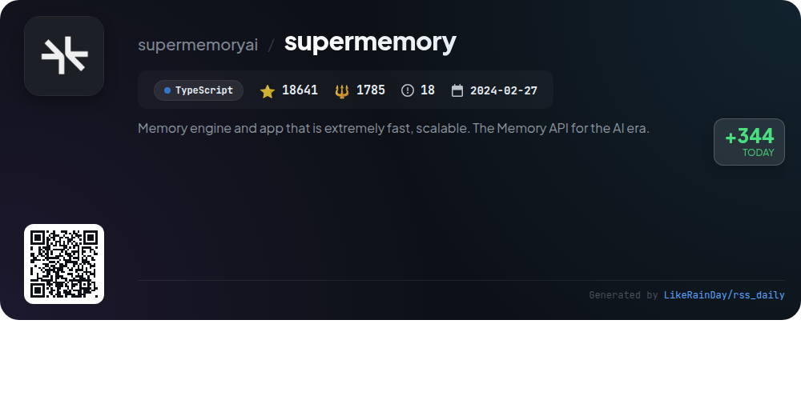

# 📊 🌟 GitHub Trending Daily - 2026-03-25

> > 📅 每日精选 GitHub 热门仓库 | 基于智能算法推荐

## 📋 Overview

**10** 个项目 | **287269** ⭐ | **33075** 🍴

**热门语言:** `TypeScript` (5) · `JavaScript` (2) · `Rust` (2)

**更新时间:** 2026-03-25 02:47 UTC

**分类分布:**

- 🌟 每日 Top 10 精选 (10 项)

---

## 🌟 每日 Top 10 精选

### 1. [everything-claude-code](https://github.com/affaan-m/everything-claude-code)

> 🤖 **推荐理由**  
> *The Everything Claude Code project is a comprehensive performance optimization system for AI agents, integrating skills, instincts, memory optimization, continuous learning, and security scanning. It supports multiple platforms including Claude Code, Codex, Cursor, and OpenCode, enabling seamless development across various environments. Key features include 28 specialized agents, 125 skills, and 60 commands for tasks like code review, security audits, and TDD. Recognized as an Anthropic Hackathon winner, it emphasizes research-first development and is built for real-world applications.*

- ⭐ 105190 stars
- 💻 JavaScript
- 📅 Updated: 2026-03-25

### 2. [project-nomad](https://github.com/Crosstalk-Solutions/project-nomad)

> 🤖 **推荐理由**  
> *Project N.O.M.A.D, is a self-contained, offline survival computer packed with critical tools, knowledge, and AI to keep you informed and empowered—a. popular project, actively maintained, recently updated*

- ⭐ 15440 stars
- 🍴 1471 forks
- 💻 TypeScript
- 📅 Updated: 2026-03-25

### 3. [editor](https://github.com/pascalorg/editor)

> 🤖 **推荐理由**  
> *Pascal Editor is a 3D building editor developed with React Three Fiber and WebGPU, featuring a modular architecture in a Turborepo monorepo. It consists of three main packages: a core package for schema definitions and state management, a viewer for 3D rendering, and an editor application with UI components and tools. Key highlights include node-based scene management, real-time editing capabilities, and an event-driven architecture. The editor supports various tools for wall and item placement, selection management, and custom camera controls, providing a comprehensive environment for 3D modeling.*

- ⭐ 5436 stars
- 💻 TypeScript
- 📅 Updated: 2026-03-25

### 4. [ruflo](https://github.com/ruvnet/ruflo)

> 🤖 **推荐理由**  
> *RuFlo is an advanced agent orchestration platform for Claude, enabling the deployment of intelligent multi-agent swarms and seamless coordination of autonomous workflows. Key features include 60+ specialized agents, enterprise-grade architecture, self-learning capabilities via SONA, HNSW indexing for rapid vector search, and robust security measures against threats and vulnerabilities. RuFlo integrates with various LLM providers, supports RAG, and offers an extensible plugin system, making it ideal for building conversational AI systems and optimizing complex software engineering tasks.*

- ⭐ 25175 stars
- 💻 TypeScript
- 📅 Updated: 2026-03-25

### 5. [RuView](https://github.com/ruvnet/RuView)

> 🤖 **推荐理由**  
> *RuView is an innovative edge AI system that utilizes WiFi signals for real-time human pose estimation, vital sign monitoring, and presence detection, all without cameras or wearables. Key features include self-learning capabilities, allowing the system to adapt to its environment without labeled data, and the ability to operate on low-cost hardware like the ESP32. It offers privacy-first tracking through walls, multiple-person detection, and vital sign analysis (breathing and heart rate). Built on Rust, RuView ensures high performance, with up to 54,000 frames per second processing speed. Ideal for healthcare, retail, and safety applications, it combines advanced signal processing with AI to transform ordinary spaces into intelligent environments.*

- ⭐ 41384 stars
- 💻 Rust
- 📅 Updated: 2026-03-25

### 6. [pentagi](https://github.com/vxcontrol/pentagi)

> 🤖 **推荐理由**  
> *Pentagi is a cutting-edge, fully autonomous AI agents system designed for advanced penetration testing. Built with Go, it streamlines complex security assessments by automating various testing tasks, significantly enhancing efficiency and accuracy. Key features include customizable agent configurations, real-time vulnerability detection, and comprehensive reporting capabilities. With over 13,463 stars, Pentagi is gaining recognition for its ability to adapt to diverse environments and provide robust security solutions, making it an essential tool for cybersecurity professionals.*

- ⭐ 13463 stars
- 💻 Go
- 📅 Updated: 2026-03-25

### 7. [cc-switch](https://github.com/farion1231/cc-switch)

> 🤖 **推荐理由**  
> *CC Switch is a cross-platform desktop assistant tool designed to manage multiple AI CLI tools, including Claude Code, Codex, Gemini CLI, OpenCode, and OpenClaw, all from a single interface. Key features include over 50 provider presets for easy switching, unified management of MCP and Skills, and quick access via system tray. It supports cloud syncing, has built-in utilities for enhanced functionality, and is built using Rust and Tauri for seamless performance across Windows, macOS, and Linux. With 32,942 stars, it offers a comprehensive solution for AI development workflows.*

- ⭐ 32942 stars
- 💻 Rust
- 📅 Updated: 2026-03-25

### 8. [impeccable](https://github.com/pbakaus/impeccable)

> 🤖 **推荐理由**  
> *Impeccable is a JavaScript-based design language that enhances AI capabilities in frontend design. With over 13,000 stars, it offers 20 commands for auditing, reviewing, and polishing designs, along with 7 domain-specific reference files covering typography, color, spatial design, and more. Impeccable also includes curated anti-patterns to avoid common design pitfalls. Users can quickly start by downloading bundles from impeccable.style, making it a robust tool for improving UI/UX across various platforms like Cursor, Claude Code, and Gemini CLI.*

- ⭐ 13310 stars
- 💻 JavaScript
- 📅 Updated: 2026-03-25

### 9. [n8n-mcp](https://github.com/czlonkowski/n8n-mcp)

> 🤖 **推荐理由**  
> *n8n-mcp is a Model Context Protocol server designed to enhance AI assistants like Claude with in-depth access to n8n's workflow automation capabilities. With support for over 1,084 nodes (537 core, 547 community), it provides comprehensive documentation, node properties, and real-world examples. Key features include smart node search, configuration validation, and a library of 2,709 workflow templates. Users can quickly deploy n8n-mcp via hosted services or self-hosting options like Docker. This project empowers developers to create and validate workflows efficiently, ensuring optimal automation performance.*

- ⭐ 16288 stars
- 💻 TypeScript
- 📅 Updated: 2026-03-25

### 10. [supermemory](https://github.com/supermemoryai/supermemory)

> 🤖 **推荐理由**  
> *Supermemory is a high-performance memory engine and API designed for AI applications, enabling persistent memory across conversations. It excels in AI benchmarks, offering features like automatic fact extraction, user profile maintenance, hybrid search (combining memory and retrieval-augmented generation), and real-time connectors for platforms like Google Drive and Notion. The system also processes various file types and manages contradictions while auto-forgetting expired information. Supermemory simplifies integration for developers with a unified API, making it ideal for building smarter AI tools.*

- ⭐ 18641 stars
- 💻 TypeScript
- 📅 Updated: 2026-03-25

---

## 📡 RSS订阅

通过 RSS 订阅，第一时间获取每日精选项目：

- 🔔 [RSS 订阅源] (../../daily-top.xml)
- 🔔 [每日简报] (../../GITHUB_TODAY_CN.md)
- 🔔 [每日 Top 10 精选](../../daily-top.xml)

---

*⚡ Powered by Smart Trending Algorithm | Generated at 2026-03-25 02:47:49 UTC
