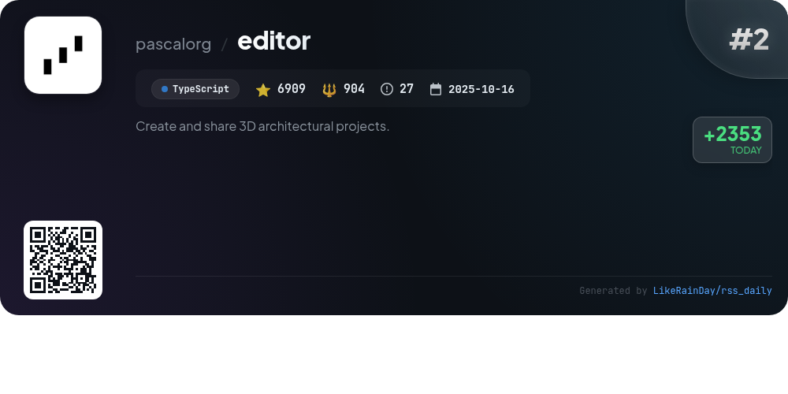
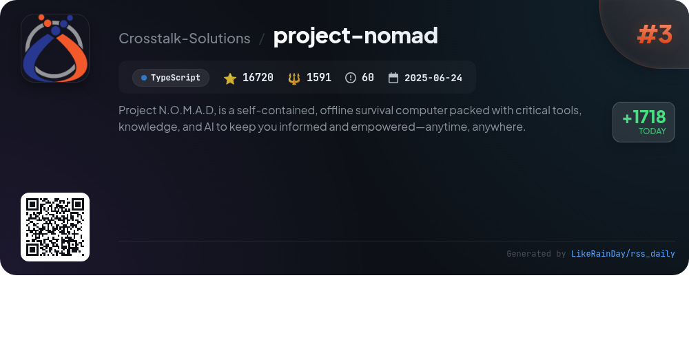
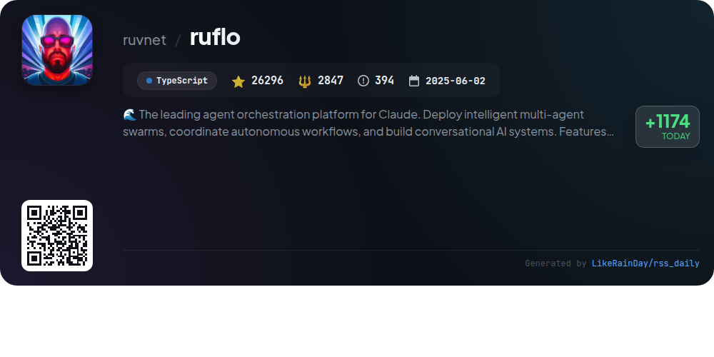
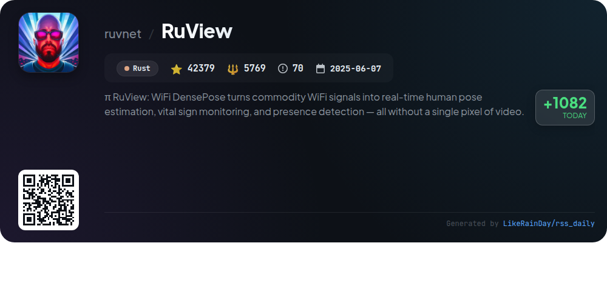
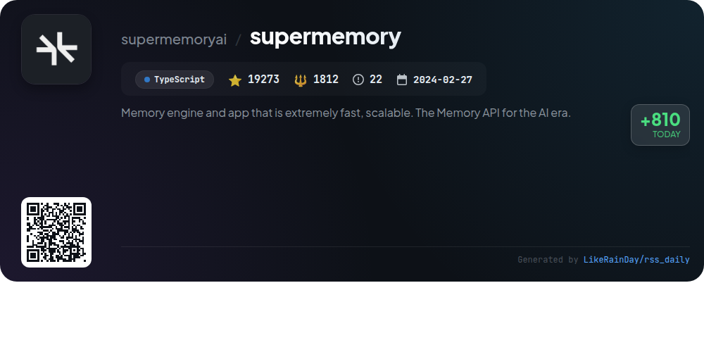
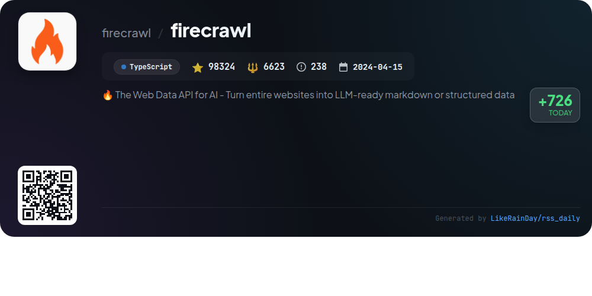
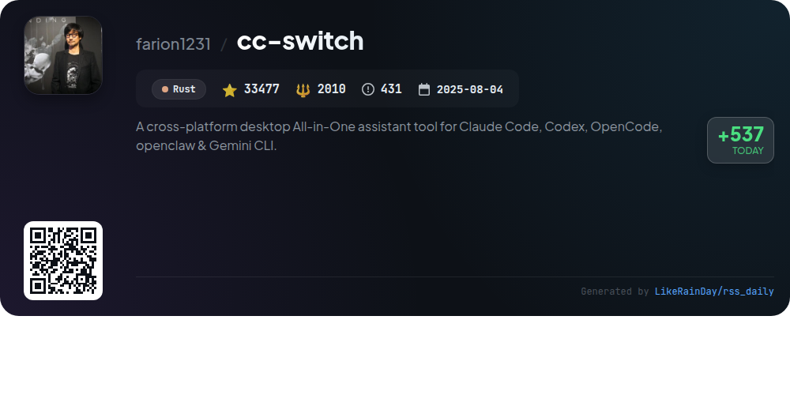
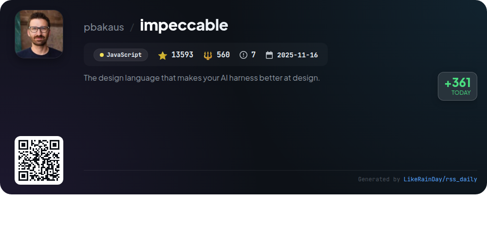

# 📊 🌟 GitHub Trending Daily - 2026-03-26

> > 📅 Daily Picks of GitHub Trending Repositories | Powered by Smart Algorithms

## 📋 Overview

**10** Projects | **383851** ⭐ | **38537** 🍴

**Top Languages:** `TypeScript` (6) · `Rust` (2) · `JavaScript` (2)

**Updated:** 2026-03-26 02:54 UTC

**Categories:**

- 🌟 Daily Top 10 (10 items)

---

## 🌟 Daily Top 10

### 1. [everything-claude-code](https://github.com/affaan-m/everything-claude-code)

> 🤖 **Why Recommend**  
> *Everything Claude Code is a powerful performance optimization system for AI agents, designed to enhance skills, instincts, memory, security, and continuous learning. With over 108,000 stars, it supports multiple platforms, including Claude Code, Codex, and OpenCode. Key features include 28 specialized agents, 125 skills, and 60 commands for tasks like code review, end-to-end testing, and security scanning. This Anthropic hackathon-winning project also offers extensive guides for setup and usage, ensuring robust development practices across various languages and workflows.*

- ⭐ 108264 stars
- 💻 JavaScript
- 📅 Updated: 2026-03-26

### 2. [editor](https://github.com/pascalorg/editor)

> 🤖 **Why Recommend**  
> *Pascal Editor is a sophisticated 3D architectural project editor built with React Three Fiber and WebGPU, enabling users to create and share detailed building designs. It features a modular monorepo architecture with core packages for state management, 3D rendering, and UI components. Key functionalities include a custom selection manager, interactive editing tools (e.g., wall and item placement), and a robust event bus for inter-component communication. The application leverages Zustand for state management and offers an intuitive user experience through a seamless development setup and advanced geometry generation systems.*

- ⭐ 6909 stars
- 💻 TypeScript
- 📅 Updated: 2026-03-26

### 3. [project-nomad](https://github.com/Crosstalk-Solutions/project-nomad)

> 🤖 **Why Recommend**  
> *Project N.O.M.A.D, is a self-contained, offline survival computer packed with critical tools, knowledge, and AI to keep you informed and empowered—a. popular project, actively maintained, recently updated*

- ⭐ 16720 stars
- 🍴 1591 forks
- 💻 TypeScript
- 📅 Updated: 2026-03-26

### 4. [ruflo](https://github.com/ruvnet/ruflo)

> 🤖 **Why Recommend**  
> *RuFlo is a cutting-edge agent orchestration platform for Claude, designed for deploying intelligent multi-agent swarms and coordinating autonomous workflows. Key features include over 100 specialized agents, enterprise-grade architecture, real-time learning through ReasoningBank, and HNSW indexing for fast vector search. It seamlessly integrates with various LLM providers like Claude and GPT, supports adaptive routing, and ensures robust security with AIDefence. With a powerful CLI and extensive plugin ecosystem, RuFlo enhances collaborative AI system development, making it ideal for complex software engineering tasks.*

- ⭐ 26296 stars
- 💻 TypeScript
- 📅 Updated: 2026-03-26

### 5. [RuView](https://github.com/ruvnet/RuView)

> 🤖 **Why Recommend**  
> *RuView is an edge AI system that utilizes WiFi signals for real-time human pose estimation, vital sign monitoring, and presence detection without cameras or wearables. It leverages Channel State Information (CSI) to reconstruct body positions, breathing rates, and heart rates, operating entirely on low-cost ESP32 hardware. Key features include privacy-first monitoring, self-learning capabilities, and multi-person tracking through walls. With a robust architecture based on RuVector, RuView continuously adapts to its environment, making it suitable for diverse applications like healthcare and disaster response.*

- ⭐ 42379 stars
- 💻 Rust
- 📅 Updated: 2026-03-26

### 6. [supermemory](https://github.com/supermemoryai/supermemory)

> 🤖 **Why Recommend**  
> *Supermemory is a high-performance memory engine and API designed for AI applications, enabling them to retain and utilize context across conversations. It excels in extracting facts, managing user profiles, and providing hybrid search capabilities that combine retrieval-augmented generation (RAG) with personalized context. Key features include automatic memory management (forgetting and updating), support for multi-modal data, and seamless integration with platforms like Google Drive and Notion. With over 19,000 stars, Supermemory leads in major AI memory benchmarks, offering a comprehensive solution for developers and users alike.*

- ⭐ 19273 stars
- 💻 TypeScript
- 📅 Updated: 2026-03-26

### 7. [firecrawl](https://github.com/firecrawl/firecrawl)

> 🤖 **Why Recommend**  
> *Firecrawl is a powerful Web Data API that transforms entire websites into LLM-ready markdown or structured data, enhancing AI applications with real-time web context. Key features include reliable scraping of dynamic content, customizable crawling parameters, and media parsing. It supports batch processing, change tracking, and various output formats such as JSON, HTML, and markdown. Additionally, Firecrawl offers an intuitive agent for autonomous data gathering and integrates seamlessly with AI coding tools. Sign up at firecrawl.dev to start leveraging its capabilities.*

- ⭐ 98324 stars
- 💻 TypeScript
- 📅 Updated: 2026-03-26

### 8. [cc-switch](https://github.com/farion1231/cc-switch)

> 🤖 **Why Recommend**  
> *CC Switch is a cross-platform desktop assistant tool that simplifies managing multiple AI CLI tools, including Claude Code, Codex, Gemini CLI, OpenCode, and OpenClaw. Key features include a unified interface for seamless switching between over 50 provider presets, no manual config editing, and centralized management of MCP and Skills. It supports cloud synchronization and offers a user-friendly system tray for quick access. Built with Tauri in Rust, CC Switch ensures reliable data handling and enhanced productivity for developers using AI tools, making it an essential resource for modern coding workflows.*

- ⭐ 33477 stars
- 💻 Rust
- 📅 Updated: 2026-03-26

### 9. [impeccable](https://github.com/pbakaus/impeccable)

> 🤖 **Why Recommend**  
> *Impeccable is a design language toolkit for enhancing AI-driven frontend design, offering 13,593 stars on GitHub. It provides a comprehensive skillset with 20 commands for auditing, polishing, and improving user experience. Key features include domain-specific references on typography, color, spatial, motion, interaction, responsive design, and UX writing, along with curated anti-patterns to avoid common design mistakes. Installation can be done via [impeccable.style](https://impeccable.style), and it supports various AI tools like Cursor and Claude Code.*

- ⭐ 13593 stars
- 💻 JavaScript
- 📅 Updated: 2026-03-26

### 10. [dexter](https://github.com/virattt/dexter)

> 🤖 **Why Recommend**  
> *Dexter is an autonomous financial research agent designed to analyze complex financial questions using real-time market data. Key features include intelligent task planning that breaks down queries, autonomous execution of data-gathering tasks, and self-validation for accuracy. It supports integration with financial datasets and can be interacted with via WhatsApp. Built-in safety measures prevent runaway processes. With over 18,000 stars on GitHub, Dexter empowers users to derive data-backed insights efficiently, making advanced financial research accessible and systematic.*

- ⭐ 18616 stars
- 💻 TypeScript
- 📅 Updated: 2026-03-26

---

## 📡 RSS Subscription

Subscribe via RSS to get daily trending updates:

- 🔔 [RSS XML] (../../daily-top.xml)
- 🔔 [Daily Report] (../../GITHUB_TODAY.md)
- 🔔 [Daily Top 10](../../daily-top.xml)

---

*⚡ Powered by Smart Trending Algorithm | Generated at 2026-03-26 02:54:53 UTC
