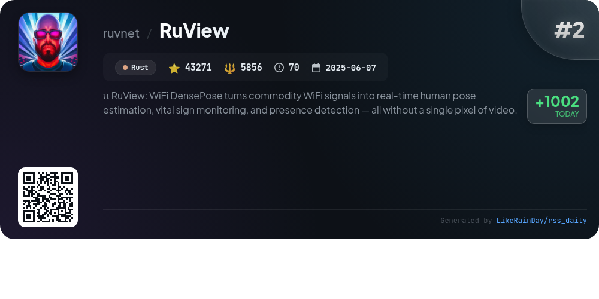
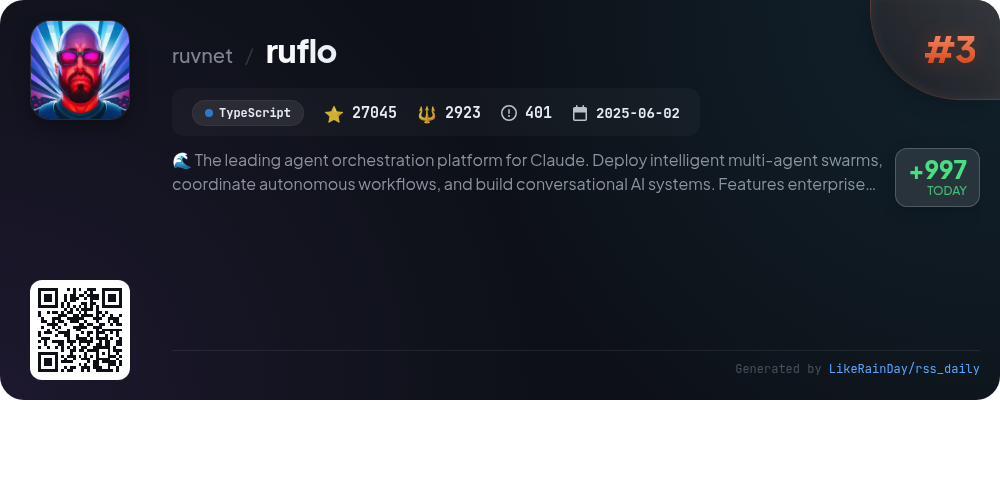
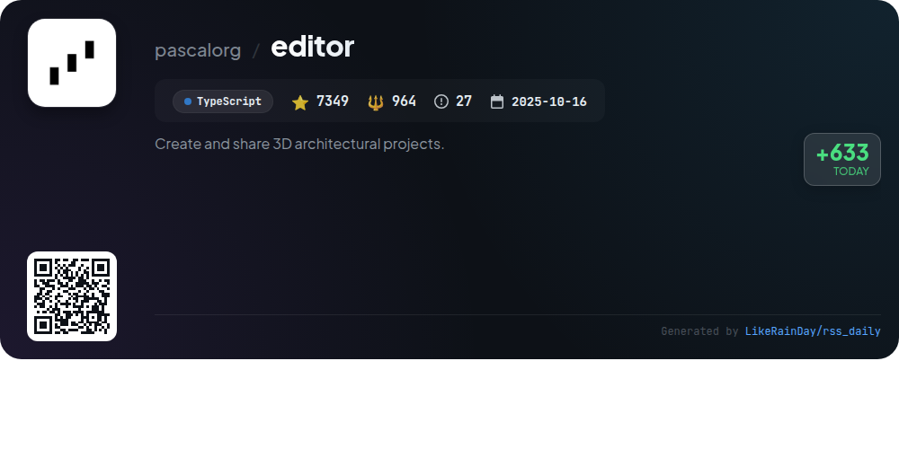
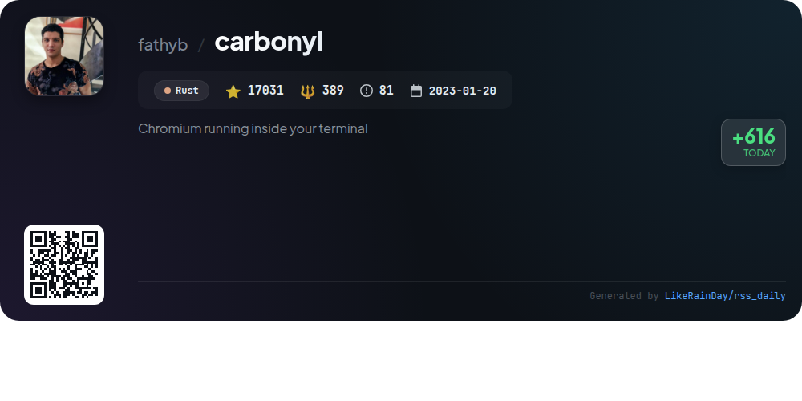
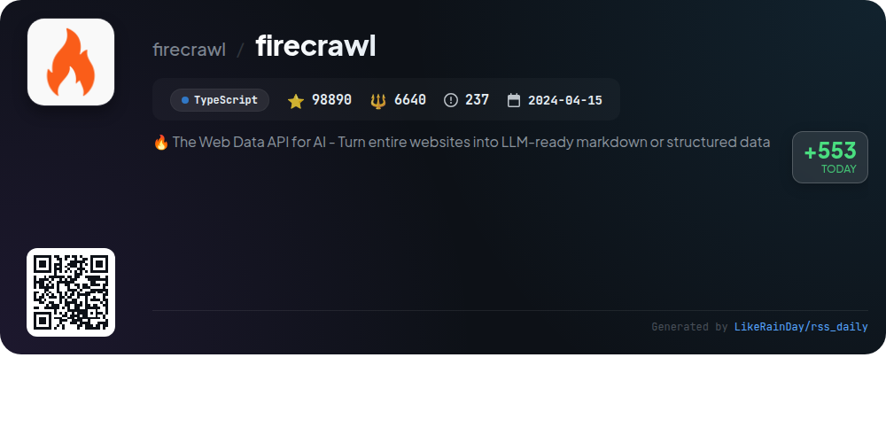
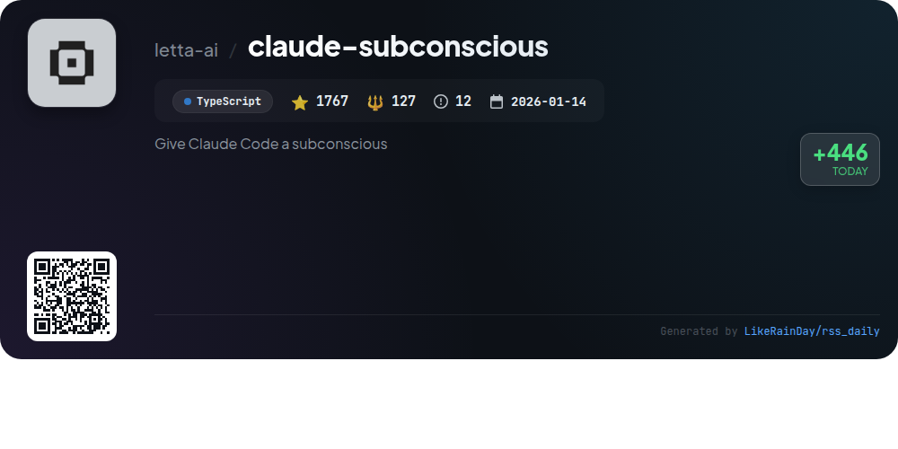
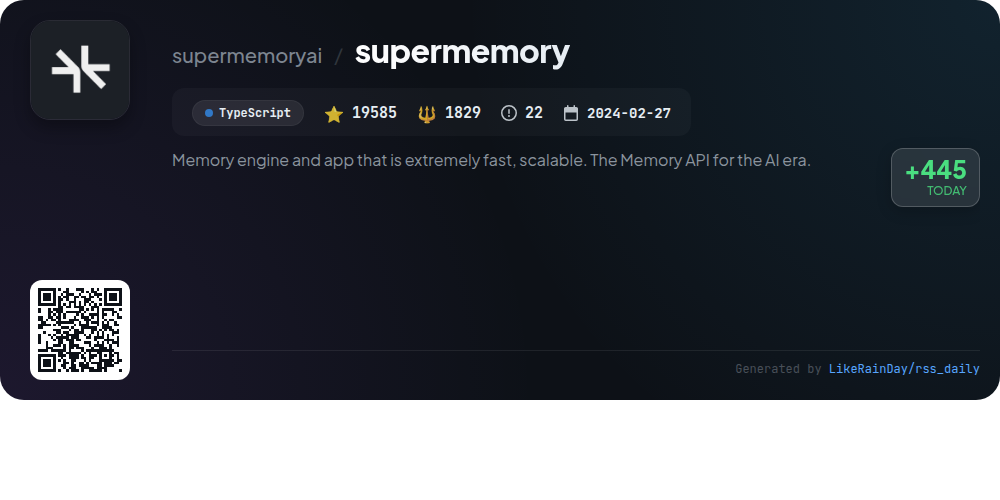
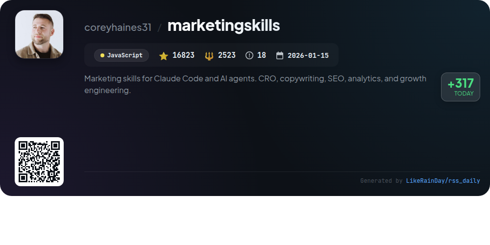

# 📊 🌟 GitHub Trending Daily - 2026-03-27

> > 📅 每日精选 GitHub 热门仓库 | 基于智能算法推荐

## 📋 Overview

**10** 个项目 | **355056** ⭐ | **36518** 🍴

**热门语言:** `TypeScript` (6) · `Rust` (2) · `JavaScript` (2)

**更新时间:** 2026-03-27 02:56 UTC

**分类分布:**

- 🌟 每日 Top 10 精选 (10 项)

---

## 🌟 每日 Top 10 精选

### 1. [everything-claude-code](https://github.com/affaan-m/everything-claude-code)

> 🤖 **推荐理由**  
> *Everything Claude Code is a robust performance optimization system for AI agents, including Claude Code, Codex, and Cursor. It features a comprehensive suite of 28 agents and 125 skills, facilitating tasks like code review, test-driven development, and security scanning. The system emphasizes continuous learning, memory optimization, and security-first development. Recent updates include selective installation, multi-language support, and enhanced orchestration capabilities. With over 110,000 stars, it is a community-driven project designed for real-world applications.*

- ⭐ 110515 stars
- 💻 JavaScript
- 📅 Updated: 2026-03-27

### 2. [RuView](https://github.com/ruvnet/RuView)

> 🤖 **推荐理由**  
> *RuView is an edge AI system that leverages WiFi signals for real-time human pose estimation, vital sign monitoring, and presence detection without using cameras or wearables. Key features include multi-person tracking, through-wall capabilities, and privacy-first design, all enabled by a low-cost ESP32 sensor mesh. The system utilizes advanced signal processing algorithms and self-learning techniques to continuously improve its accuracy. With a focus on real-time performance, RuView offers robust applications in healthcare, security, and smart building environments.*

- ⭐ 43271 stars
- 💻 Rust
- 📅 Updated: 2026-03-27

### 3. [ruflo](https://github.com/ruvnet/ruflo)

> 🤖 **推荐理由**  
> *RuFlo is a leading agent orchestration platform designed for Claude, enabling the deployment of intelligent multi-agent swarms to coordinate autonomous workflows and build conversational AI systems. Key features include enterprise-grade architecture, distributed swarm intelligence, Reinforcement Learning (RL) integration, and native support for Claude Code. With over 27,000 stars on GitHub, RuFlo allows for seamless integration with various LLMs, including Claude and OpenAI, while ensuring security with built-in protections against prompt injection and memory management.*

- ⭐ 27045 stars
- 💻 TypeScript
- 📅 Updated: 2026-03-27

### 4. [editor](https://github.com/pascalorg/editor)

> 🤖 **推荐理由**  
> *Pascal Editor is a powerful 3D architectural project editor built with React Three Fiber and WebGPU, allowing users to create and share detailed building designs. With over 7,300 stars on GitHub, it features a sophisticated monorepo architecture, including packages for core functionalities and 3D rendering. Key highlights include an intuitive UI, tools for wall and item placement, a robust state management system using Zustand, and advanced geometry generation capabilities. Users can leverage an event bus for inter-component communication and enjoy features like undo/redo functionality and customizable camera controls.*

- ⭐ 7349 stars
- 💻 TypeScript
- 📅 Updated: 2026-03-27

### 5. [carbonyl](https://github.com/fathyb/carbonyl)

> 🤖 **推荐理由**  
> *Carbonyl is a terminal-based browser built on Chromium, designed for speed and efficiency. With support for modern web APIs like WebGL and video playback, it boasts a minimal startup time of under one second, maintains 60 FPS, and uses 0% CPU while idle. It operates without a window server, making it suitable for safe-mode consoles and SSH usage. Carbonyl is easy to install via Docker or npm and supports Linux and macOS. Its lightweight design outperforms alternatives like Browsh, making it ideal for terminal users seeking a full-featured web experience.*

- ⭐ 17031 stars
- 💻 Rust
- 📅 Updated: 2026-03-27

### 6. [oh-my-claudecode](https://github.com/Yeachan-Heo/oh-my-claudecode)

> 🤖 **推荐理由**  
> *oh-my-claudecode is a TypeScript-based multi-agent orchestration tool designed for Claude Code, offering a teams-first approach with zero configuration. Key features include a natural language interface, automatic parallelization of tasks, and persistent execution until jobs are verified complete. The project supports intelligent orchestration with 32 specialized agents, real-time visibility via HUD, and custom skills for reusability. Users can leverage various modes, including Team orchestration and CLI workers, to optimize workflows and improve development efficiency.*

- ⭐ 12780 stars
- 💻 TypeScript
- 📅 Updated: 2026-03-27

### 7. [firecrawl](https://github.com/firecrawl/firecrawl)

> 🤖 **推荐理由**  
> *Firecrawl is a powerful web data API designed to transform entire websites into LLM-ready markdown or structured data. With over 98,890 stars on GitHub, it excels in delivering reliable outputs, supporting real-time context for AI applications. Key features include handling dynamic content, batch processing, media parsing, and customizable scraping options. Firecrawl also offers interactive capabilities, enabling users to automate clicks and data extraction. Users can easily integrate the API via SDKs in Python, Node.js, and Java, making it a versatile tool for developers and businesses alike.*

- ⭐ 98890 stars
- 💻 TypeScript
- 📅 Updated: 2026-03-27

### 8. [claude-subconscious](https://github.com/letta-ai/claude-subconscious)

> 🤖 **推荐理由**  
> *Claude Subconscious is an experimental TypeScript plugin that enhances Claude Code by providing a background agent powered by Letta's memory system. With 1,767 stars, it observes coding sessions, reads codebases, and builds persistent memory across projects. Key features include proactive guidance, session continuity, and real-time context updates without blocking workflows. It supports multiple projects with shared memory and integrates various tools for web searching and file reading. Ideal for developers seeking a memory-first, intelligent coding assistant.*

- ⭐ 1767 stars
- 💻 TypeScript
- 📅 Updated: 2026-03-27

### 9. [supermemory](https://github.com/supermemoryai/supermemory)

> 🤖 **推荐理由**  
> *Supermemory is a high-performance memory engine and context layer for AI, designed to enhance user interactions by enabling persistent memory across conversations. Key features include automatic fact extraction, user profile maintenance, hybrid search combining memory and retrieval-augmented generation (RAG), and real-time data synchronization with popular platforms like Google Drive and GitHub. It supports multi-modal content processing and offers a comprehensive API for seamless integration. Supermemory excels in major AI memory benchmarks, making it a leading choice for developers and users seeking intelligent, context-aware AI solutions.*

- ⭐ 19585 stars
- 💻 TypeScript
- 📅 Updated: 2026-03-27

### 10. [marketingskills](https://github.com/coreyhaines31/marketingskills)

> 🤖 **推荐理由**  
> *The **marketingskills** project provides a suite of AI agent skills tailored for marketing tasks, including conversion optimization, copywriting, SEO, analytics, and growth engineering. Designed for technical marketers, it integrates with platforms like Claude Code and OpenAI Codex. Key features include a modular skill structure, enabling agents to handle diverse marketing activities efficiently. Users can install skills via CLI or plugins, and the project encourages contributions. For personalized assistance, Corey's agency, Conversion Factory, and learning resources like Swipe Files are available.*

- ⭐ 16823 stars
- 💻 JavaScript
- 📅 Updated: 2026-03-27

---

## 📡 RSS订阅

通过 RSS 订阅，第一时间获取每日精选项目：

- 🔔 [RSS 订阅源] (../../daily-top.xml)
- 🔔 [每日简报] (../../GITHUB_TODAY_CN.md)
- 🔔 [每日 Top 10 精选](../../daily-top.xml)

---

*⚡ Powered by Smart Trending Algorithm | Generated at 2026-03-27 02:56:50 UTC
