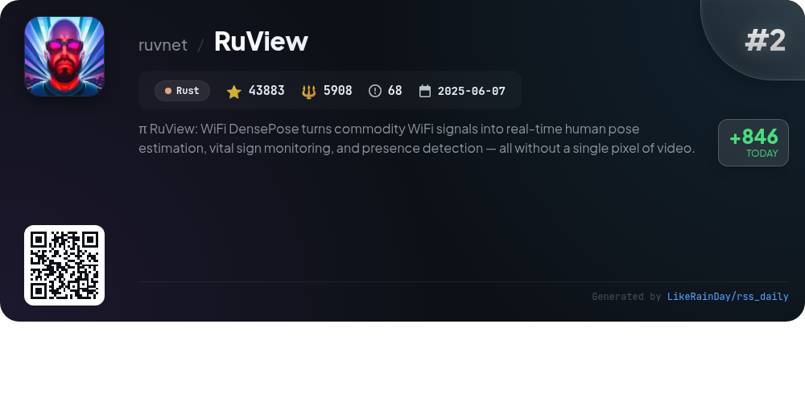
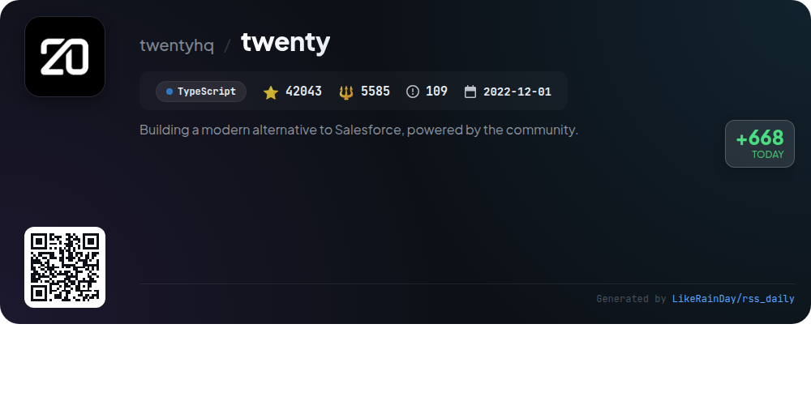
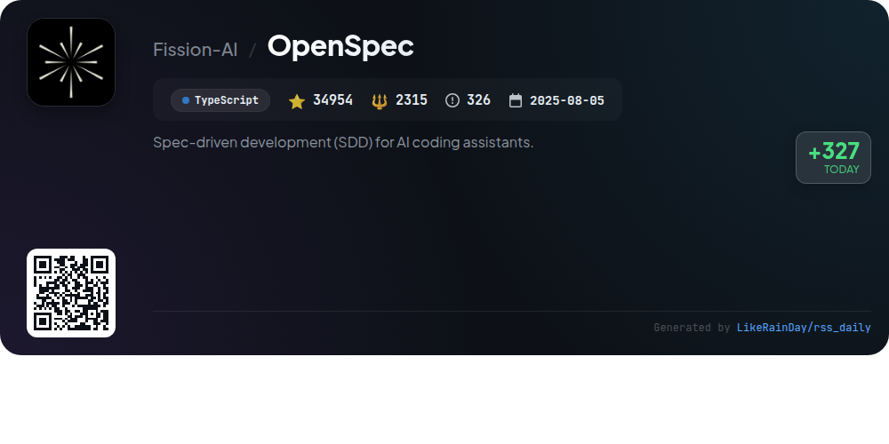
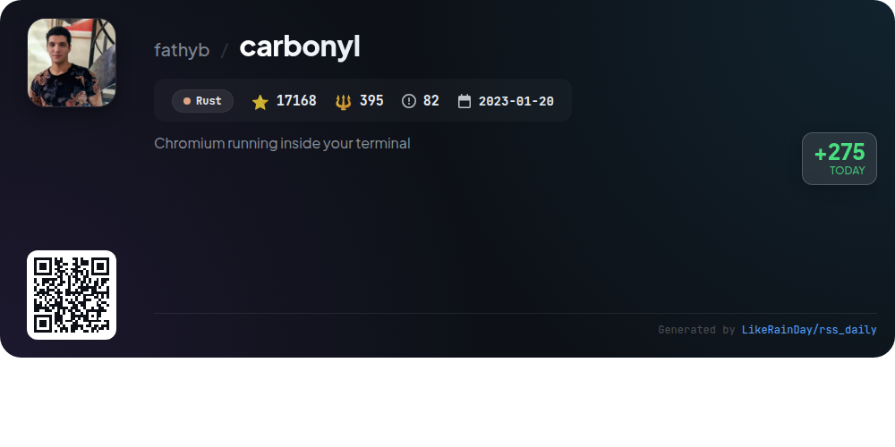
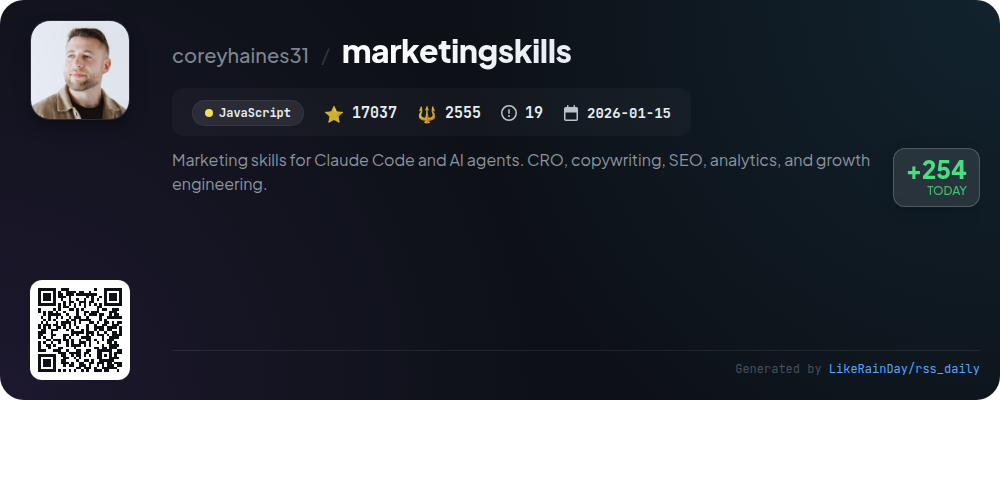
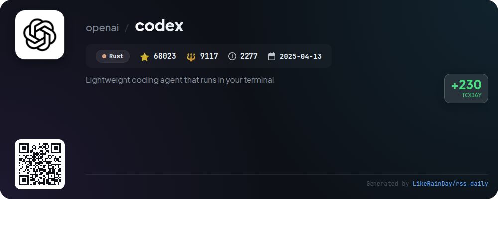
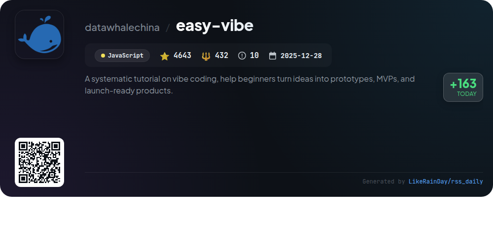
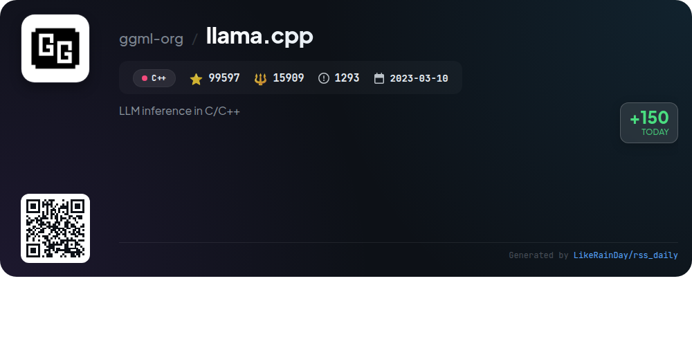

# 📊 🌟 GitHub Trending Daily - 2026-03-28

> > 📅 每日精选 GitHub 热门仓库 | 基于智能算法推荐

## 📋 Overview

**10** 个项目 | **361088** ⭐ | **45510** 🍴

**热门语言:** `TypeScript` (4) · `Rust` (3) · `JavaScript` (2)

**更新时间:** 2026-03-28 02:47 UTC

**分类分布:**

- 🌟 每日 Top 10 精选 (10 项)

---

## 🌟 每日 Top 10 精选

### 1. [oh-my-claudecode](https://github.com/Yeachan-Heo/oh-my-claudecode)

> 🤖 **推荐理由**  
> *oh-my-claudecode is a TypeScript-based multi-agent orchestration tool designed for Claude Code, offering a seamless, teams-first experience. With over 14,000 stars, it features zero configuration, intelligent task distribution, and a natural language interface for effortless command execution. Key functionalities include team orchestration, real-time visibility, smart model routing, and persistent execution. Users can leverage CLI workers, deep interviews for project clarity, and custom skills for efficient problem-solving. Ideal for collaborative development, it optimizes costs and enhances productivity.*

- ⭐ 14020 stars
- 💻 TypeScript
- 📅 Updated: 2026-03-28

### 2. [RuView](https://github.com/ruvnet/RuView)

> 🤖 **推荐理由**  
> *RuView is an innovative edge AI system that transforms WiFi signals into real-time human pose estimation, vital sign monitoring, and presence detection without cameras. Key features include multi-person tracking, breathing and heart rate detection, and through-wall capabilities, all powered by the robust RuVector backend. The system operates on low-cost hardware like the ESP32-S3, enabling local analysis and adaptation to environments. With a focus on privacy and adaptability, RuView provides a versatile solution for applications in healthcare, security, and smart environments.*

- ⭐ 43883 stars
- 💻 Rust
- 📅 Updated: 2026-03-28

### 3. [dexter](https://github.com/virattt/dexter)

> 🤖 **推荐理由**  
> *Dexter is an autonomous financial research agent that intelligently analyzes complex financial queries and generates structured research plans using real-time market data. Key features include intelligent task planning, autonomous execution of data-gathering tools, self-validation of results, and built-in safety mechanisms to prevent runaway tasks. Users can interact with Dexter via WhatsApp, making financial research accessible and streamlined. With robust evaluation tools and debugging capabilities, Dexter is designed for deep financial analysis and continuous learning.*

- ⭐ 19720 stars
- 💻 TypeScript
- 📅 Updated: 2026-03-28

### 4. [twenty](https://github.com/twentyhq/twenty)

> 🤖 **推荐理由**  
> *Twenty is a community-driven, open-source CRM designed as a modern alternative to Salesforce. With over 42,000 stars on GitHub, it offers features like customizable layouts, role-based permissions, and automated workflows. Users can personalize their experience with kanban and table views, integrate emails and calendar events, and customize data models to fit unique needs. Built with TypeScript and leveraging technologies like NestJS and PostgreSQL, Twenty emphasizes affordability and flexibility, fostering a collaborative ecosystem for developers. Join the growing community on Discord or contribute to the project.*

- ⭐ 42043 stars
- 💻 TypeScript
- 📅 Updated: 2026-03-28

### 5. [OpenSpec](https://github.com/Fission-AI/OpenSpec)

> 🤖 **推荐理由**  
> *OpenSpec is a spec-driven development framework for AI coding assistants, designed to streamline collaboration and enhance predictability in coding. With over 34,000 stars on GitHub, it enables teams to align on specifications before implementation, ensuring organized project management. Key features include an artifact-guided workflow, integration with over 20 AI tools via slash commands, and support for iterative development. It provides a dashboard for project oversight and emphasizes fluidity over rigidity, making it suitable for both personal and enterprise projects.*

- ⭐ 34954 stars
- 💻 TypeScript
- 📅 Updated: 2026-03-28

### 6. [carbonyl](https://github.com/fathyb/carbonyl)

> 🤖 **推荐理由**  
> *Carbonyl is a terminal-based browser powered by Chromium, enabling users to access the web with low resource consumption and high performance. With support for various Web APIs, including WebGL and media playback, it runs at 60 FPS and starts in under a second, even in safe-mode consoles or over SSH. Carbonyl is easy to install via Docker or npm and offers binaries for macOS and Linux. Unlike traditional terminal browsers, it natively renders to terminal resolution, making it significantly more efficient. The project is open for contributions, with a focus on enhancing its core capabilities.*

- ⭐ 17168 stars
- 💻 Rust
- 📅 Updated: 2026-03-28

### 7. [marketingskills](https://github.com/coreyhaines31/marketingskills)

> 🤖 **推荐理由**  
> *The **marketingskills** project offers a robust collection of AI agent skills tailored for marketing tasks, including conversion optimization, copywriting, SEO, analytics, and growth engineering. Designed for technical marketers and founders, it supports integration with various AI platforms like Claude Code and OpenAI Codex. Key features include specialized markdown skills that enhance AI capabilities in targeted marketing areas. The project is maintained by Corey Haines, who also provides services through Conversion Factory and offers a companion guide for marketers new to coding. Contributions are welcome.*

- ⭐ 17037 stars
- 💻 JavaScript
- 📅 Updated: 2026-03-28

### 8. [codex](https://github.com/openai/codex)

> 🤖 **推荐理由**  
> *Codex is a lightweight coding agent from OpenAI that operates seamlessly in your terminal, written in Rust and boasting over 68,000 stars on GitHub. Users can easily install it via npm or Homebrew and run it locally with the command `codex`. Codex integrates with popular IDEs and offers a desktop app experience. It also connects with ChatGPT plans for enhanced functionality. Comprehensive documentation and support for API key use are available, making Codex a versatile tool for developers seeking local coding assistance.*

- ⭐ 68023 stars
- 💻 Rust
- 📅 Updated: 2026-03-28

### 9. [easy-vibe](https://github.com/datawhalechina/easy-vibe)

> 🤖 **推荐理由**  
> *Easy-Vibe is a comprehensive tutorial platform designed to help beginners transform ideas into functional prototypes, MVPs, and launch-ready products using AI coding techniques. With over 4,600 stars on GitHub, it features a structured learning path that covers frontend and backend development, AI integration, and practical projects. Key highlights include immersive tutorials, interactive coding environments, and a focus on product validation. Ideal for beginners, product managers, and developers, Easy-Vibe empowers users to build applications effortlessly in the AI era.*

- ⭐ 4643 stars
- 💻 JavaScript
- 📅 Updated: 2026-03-28

### 10. [llama.cpp](https://github.com/ggml-org/llama.cpp)

> 🤖 **推荐理由**  
> *llama.cpp is a C/C++ library for efficient large language model (LLM) inference, boasting nearly 100,000 stars on GitHub. Key features include a dependency-free implementation, advanced quantization options (1.5 to 8-bit), and support for various hardware architectures, including Apple Silicon and NVIDIA GPUs. It offers both a command-line interface and a REST API for seamless integration. Additional highlights include multimodal support, tools for model conversion and hosting, and a range of bindings for multiple programming languages, enhancing accessibility for developers.*

- ⭐ 99597 stars
- 💻 C++
- 📅 Updated: 2026-03-28

---

## 📡 RSS订阅

通过 RSS 订阅，第一时间获取每日精选项目：

- 🔔 [RSS 订阅源] (../../daily-top.xml)
- 🔔 [每日简报] (../../GITHUB_TODAY_CN.md)
- 🔔 [每日 Top 10 精选](../../daily-top.xml)

---

*⚡ Powered by Smart Trending Algorithm | Generated at 2026-03-28 02:47:31 UTC
