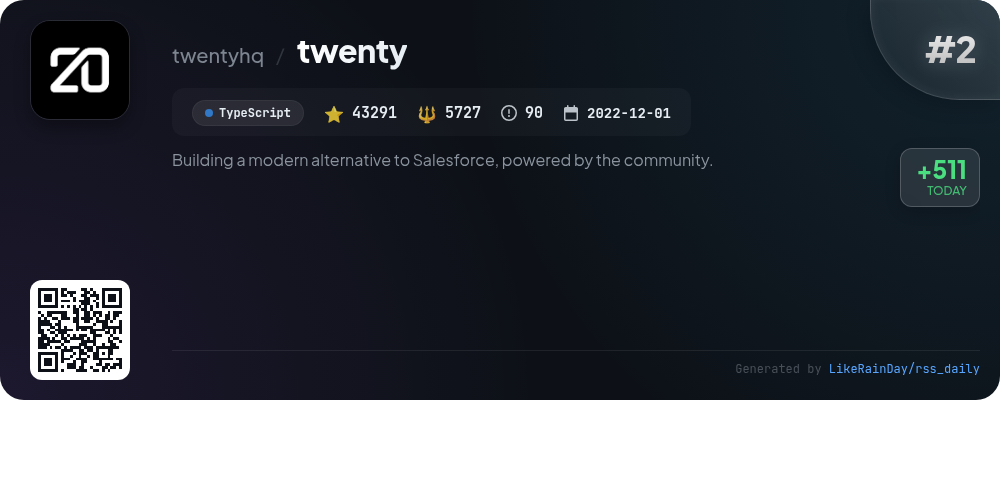
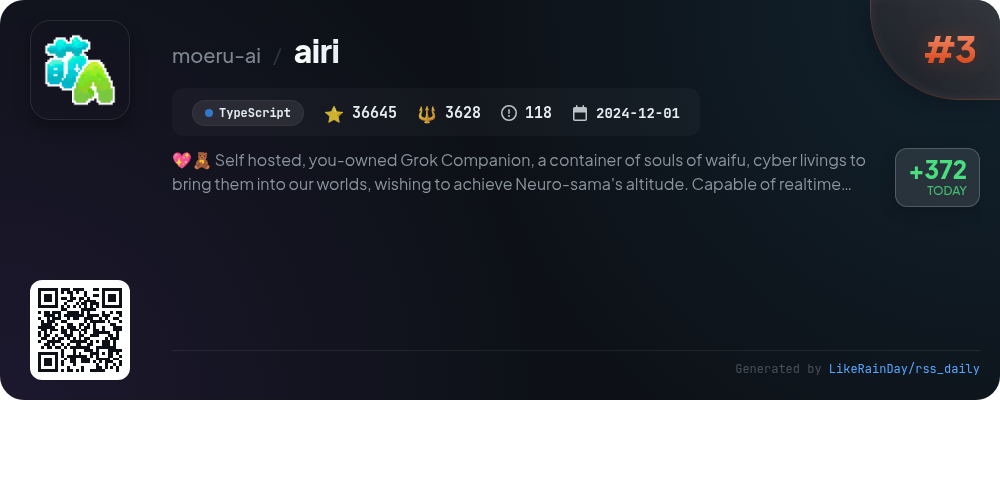
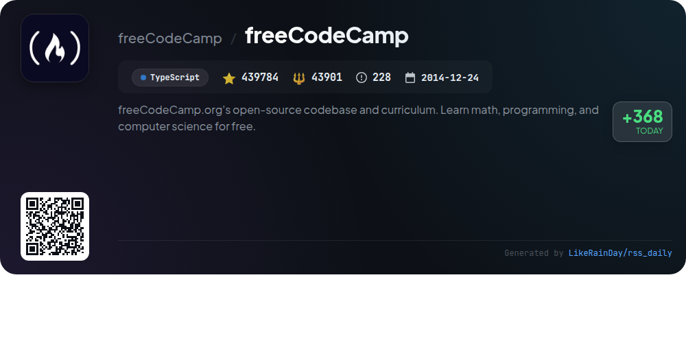
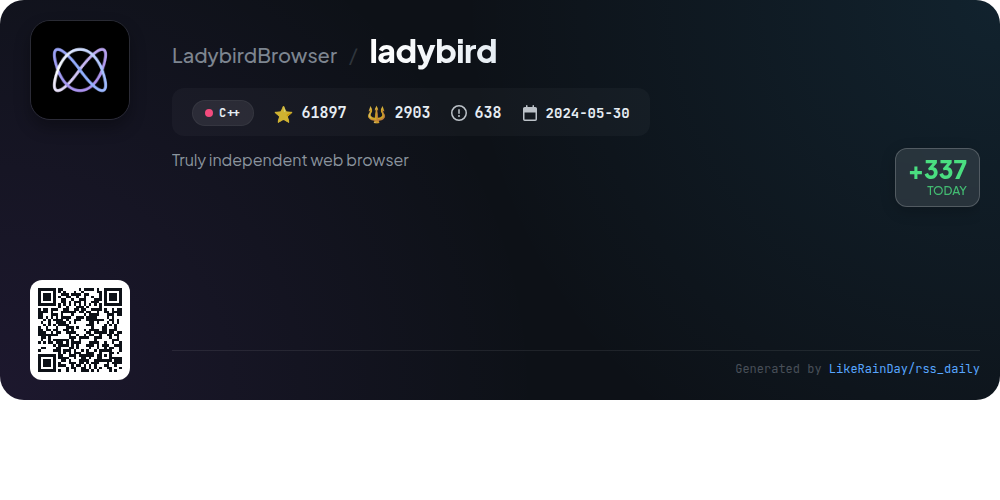
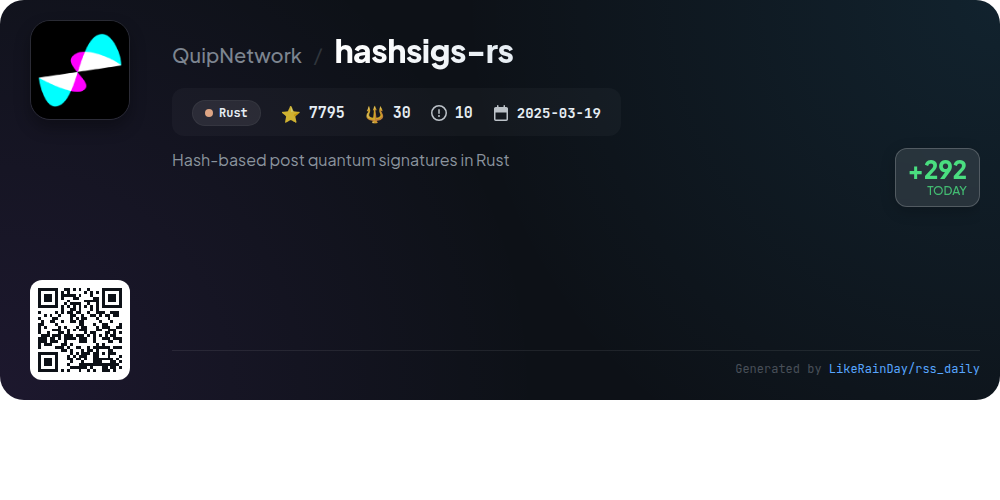
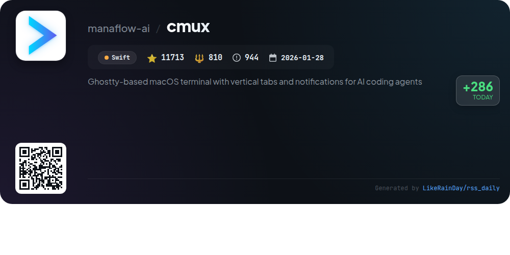
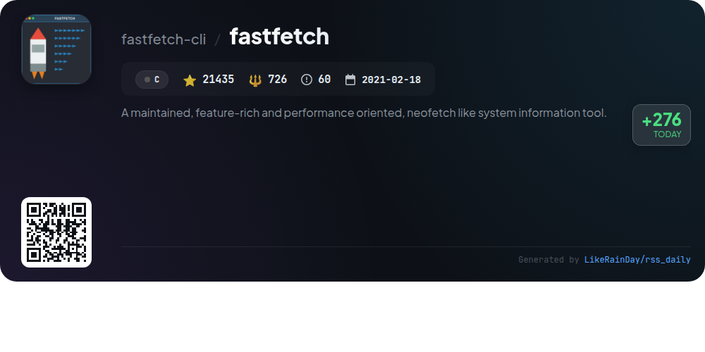
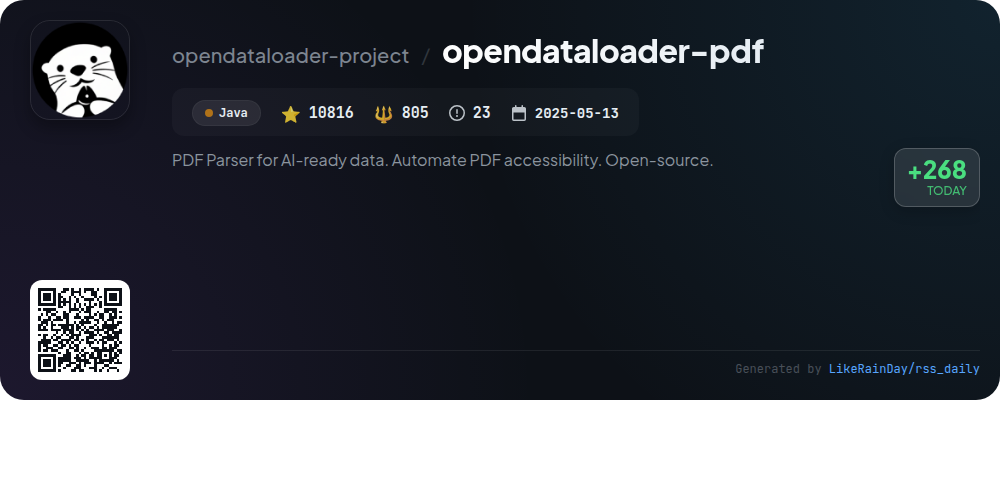
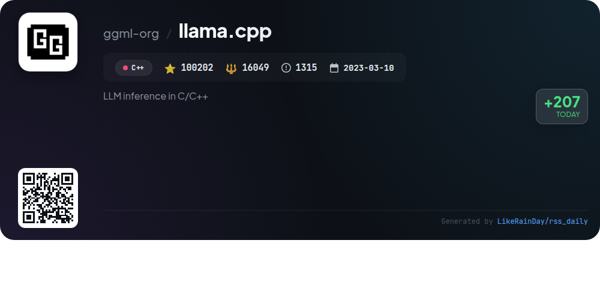

# 📊 🌟 GitHub Trending Daily - 2026-03-31

> > 📅 Daily Picks of GitHub Trending Repositories | Powered by Smart Algorithms

## 📋 Overview

**10** Projects | **736976** ⭐ | **75122** 🍴

**Top Languages:** `TypeScript` (4) · `C++` (2) · `Java` (1)

**Updated:** 2026-03-31 02:55 UTC

**Categories:**

- 🌟 Daily Top 10 (10 items)

---

## 🌟 Daily Top 10

### 1. [TaxHacker](https://github.com/vas3k/TaxHacker)

> 🤖 **Why Recommend**  
> *TaxHacker is a self-hosted AI accounting app designed for freelancers and small businesses, enabling efficient expense and income tracking. Key features include AI-driven analysis of receipts and invoices, automatic currency conversion (including crypto), and customizable categories and fields for tailored data organization. Users can filter and export transaction histories effortlessly. The app prioritizes data privacy with self-hosting capabilities and supports multiple LLM providers. With over 3,398 stars on GitHub, TaxHacker is a robust solution for managing financial data securely and efficiently.*

- ⭐ 3398 stars
- 💻 TypeScript
- 📅 Updated: 2026-03-31

### 2. [twenty](https://github.com/twentyhq/twenty)

> 🤖 **Why Recommend**  
> *Twenty is an open-source CRM designed as a modern alternative to Salesforce, emphasizing community collaboration. Key features include customizable layouts, object and field management, role-based permissions, and workflow automation. Built with TypeScript, it leverages technologies like NestJS, PostgreSQL, and React. With over 43,000 stars, Twenty aims to offer an affordable, user-friendly experience while fostering an ecosystem through plugins. Join the community on Discord, explore the roadmap, and contribute to its development.*

- ⭐ 43291 stars
- 💻 TypeScript
- 📅 Updated: 2026-03-31

### 3. [airi](https://github.com/moeru-ai/airi)

> 🤖 **Why Recommend**  
> *AIRI is a self-hosted AI companion project designed to bring virtual characters, inspired by Neuro-sama, into users' lives. It supports real-time voice chat and gameplay in popular titles like Minecraft and Factorio, available on web, macOS, and Windows. Key features include speech recognition and synthesis, VRM and Live2D model support, and a growing ecosystem of sub-projects for enhanced functionality. With over 36,000 stars on GitHub, AIRI aims to empower users to own their digital companions, leveraging modern web technologies for seamless interaction.*

- ⭐ 36645 stars
- 💻 TypeScript
- 📅 Updated: 2026-03-31

### 4. [freeCodeCamp](https://github.com/freeCodeCamp/freeCodeCamp)

> 🤖 **Why Recommend**  
> *freeCodeCamp is an open-source platform offering a comprehensive curriculum to learn coding, math, and computer science for free. With over 439,000 stars on GitHub, it provides self-paced courses covering full-stack web development, machine learning, and language certifications. Students earn verified certifications by completing interactive lessons and projects. The community offers forums, a YouTube channel, and a Discord server for support and collaboration. Founded as a donor-supported charity, freeCodeCamp has helped over 100,000 individuals launch their tech careers.*

- ⭐ 439784 stars
- 💻 TypeScript
- 📅 Updated: 2026-03-31

### 5. [ladybird](https://github.com/LadybirdBrowser/ladybird)

> 🤖 **Why Recommend**  
> *Ladybird is a truly independent web browser built on a novel engine adhering to web standards. Currently in pre-alpha, it features a multi-process architecture for enhanced security, with separate processes for UI, rendering, image decoding, and network requests. Core libraries are derived from SerenityOS, providing robust web rendering, JavaScript execution, and multimedia support. Ladybird is compatible with Linux, macOS, Windows (via WSL2), and various other UNIX-like systems. Join the development community through Discord for contributions and discussions.*

- ⭐ 61897 stars
- 💻 C++
- 📅 Updated: 2026-03-31

### 6. [hashsigs-rs](https://github.com/QuipNetwork/hashsigs-rs)

> 🤖 **Why Recommend**  
> *hashsigs-rs is a Rust implementation of the WOTS+ (Winternitz One-Time Signature) scheme, designed for post-quantum cryptography. It supports Solana program development, enabling secure signature generation for blockchain applications. Key features include easy building and testing with commands for both library and Solana program, as well as comprehensive test vectors. The project demands Rust 1.70 or higher and Solana CLI tools for development. With over 7,795 stars, it showcases a robust structure with core implementation, Solana integration, and testing support. Licensed under AGPL-3.0.*

- ⭐ 7795 stars
- 💻 Rust
- 📅 Updated: 2026-03-31

### 7. [cmux](https://github.com/manaflow-ai/cmux)

> 🤖 **Why Recommend**  
> *cmux is a Ghostty-based macOS terminal featuring vertical tabs and notifications tailored for AI coding agents, boasting over 11,700 stars on GitHub. Key features include a notification system for agent attention, an in-app browser with a scriptable API, and customizable workspaces with vertical and horizontal tabs. Built with Swift for native performance, cmux supports Ghostty configurations and offers a CLI for automation. Its GPU-accelerated rendering ensures smooth operation, making it an efficient tool for developers managing multiple coding sessions.*

- ⭐ 11713 stars
- 💻 Swift
- 📅 Updated: 2026-03-31

### 8. [fastfetch](https://github.com/fastfetch-cli/fastfetch)

> 🤖 **Why Recommend**  
> *Fastfetch is a performance-oriented system information tool, similar to Neofetch, written in C. It displays system data in a visually appealing manner and is actively maintained with over 21,000 stars on GitHub. Supporting multiple platforms including Linux, macOS, Windows, and various BSDs, it offers extensive customization through JSONC configuration. Key features include module support for various system metrics, a command module for user-defined output, and visually customizable logos. Fastfetch prioritizes speed and accuracy, making it a robust alternative for system information retrieval.*

- ⭐ 21435 stars
- 💻 C
- 📅 Updated: 2026-03-31

### 9. [opendataloader-pdf](https://github.com/opendataloader-project/opendataloader-pdf)

> 🤖 **Why Recommend**  
> *OpenDataLoader PDF is an open-source PDF parser designed for AI-ready data extraction and PDF accessibility automation. It excels in converting PDFs into structured formats like Markdown, JSON, and HTML, achieving #1 benchmark accuracy (0.90 overall) in document parsing. Key features include built-in OCR for scanned PDFs, hybrid processing for complex layouts, and auto-tagging to create Tagged PDFs, compliant with accessibility standards. Available SDKs for Python, Node.js, and Java, the tool is ideal for RAG/LLM pipelines and meets global accessibility regulations.*

- ⭐ 10816 stars
- 💻 Java
- 📅 Updated: 2026-03-31

### 10. [llama.cpp](https://github.com/ggml-org/llama.cpp)

> 🤖 **Why Recommend**  
> *llama.cpp is a high-performance C/C++ library for large language model (LLM) inference, boasting over 100,000 stars on GitHub. Key features include a pure C/C++ implementation with no dependencies, support for various architectures (x86, ARM, RISC-V), and advanced quantization techniques for faster inference. It offers seamless integration with Hugging Face models and includes a user-friendly CLI and API server for local and cloud deployments. Additional highlights include multimodal support, GPU acceleration, and numerous plugins for enhanced functionality.*

- ⭐ 100202 stars
- 💻 C++
- 📅 Updated: 2026-03-31

---

## 📡 RSS Subscription

Subscribe via RSS to get daily trending updates:

- 🔔 [RSS XML] (../../daily-top.xml)
- 🔔 [Daily Report] (../../GITHUB_TODAY.md)
- 🔔 [Daily Top 10](../../daily-top.xml)

---

*⚡ Powered by Smart Trending Algorithm | Generated at 2026-03-31 02:55:52 UTC
