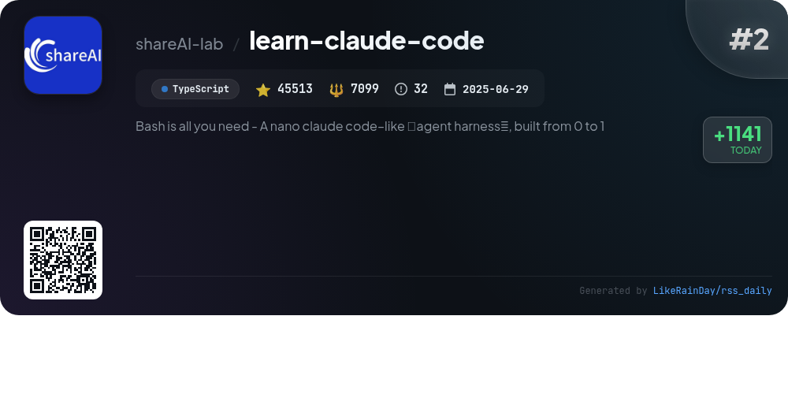
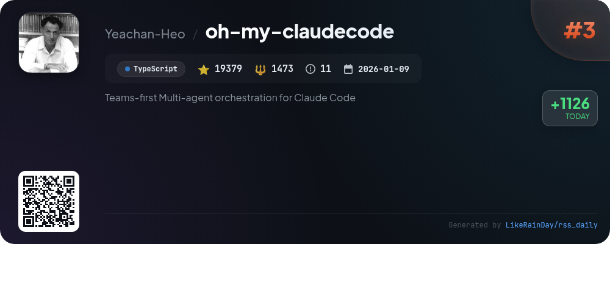
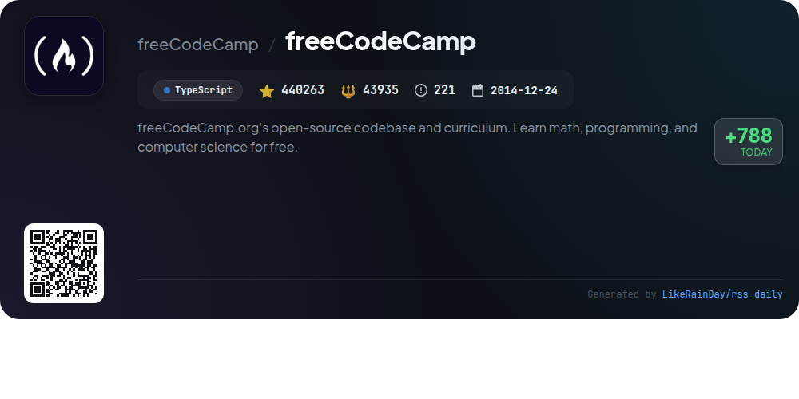
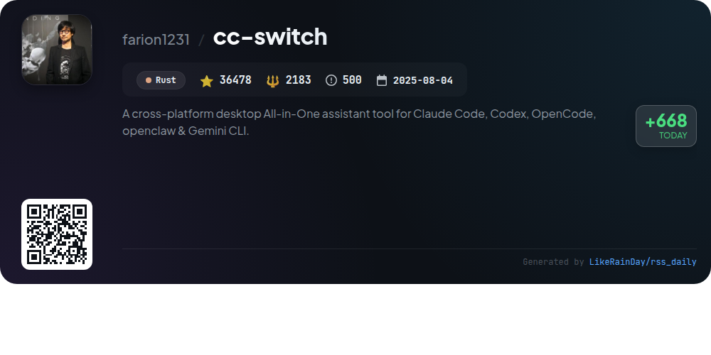
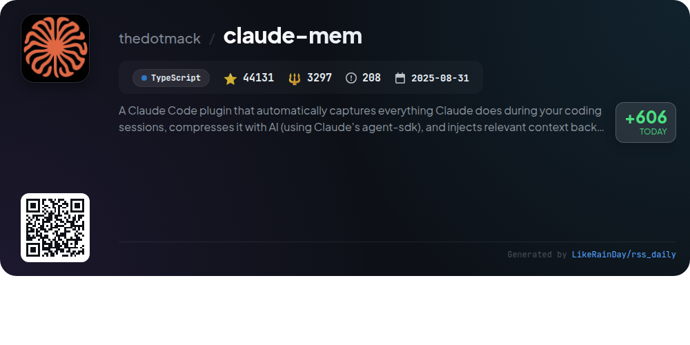
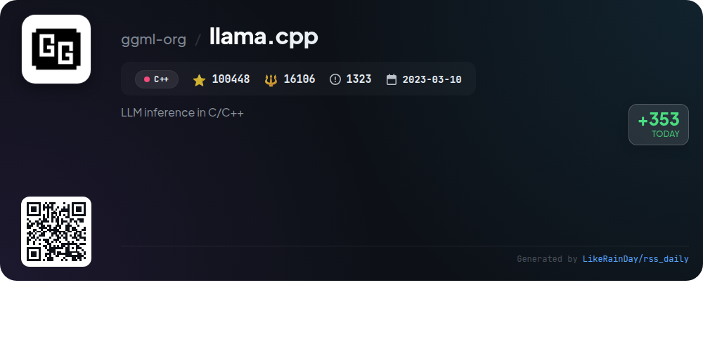
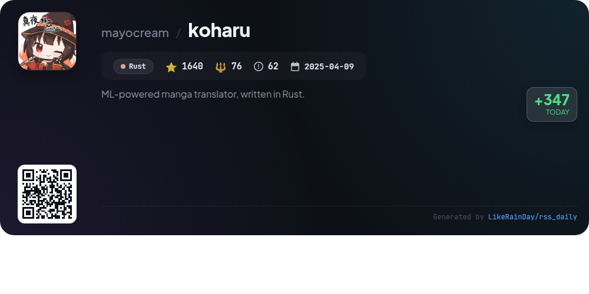
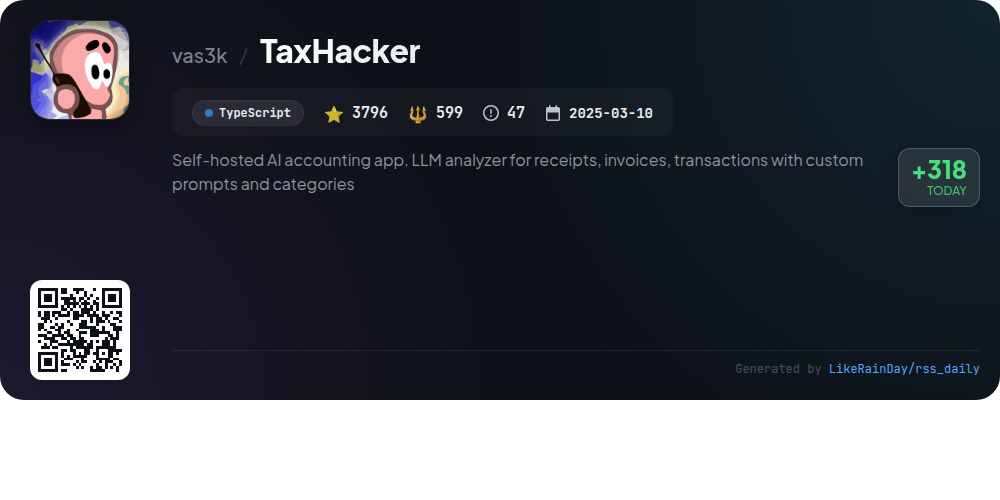
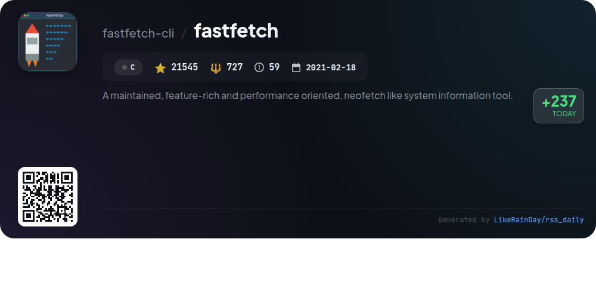

# 📊 🌟 GitHub Trending Daily - 2026-04-01

> > 📅 每日精选 GitHub 热门仓库 | 基于智能算法推荐

## 📋 Overview

**10** 个项目 | **840887** ⭐ | **93195** 🍴

**热门语言:** `TypeScript` (5) · `Rust` (2) · `C++` (1)

**更新时间:** 2026-04-01 03:27 UTC

**分类分布:**

- 🌟 每日 Top 10 精选 (10 项)

---

## 🌟 每日 Top 10 精选

### 1. [everything-claude-code](https://github.com/affaan-m/everything-claude-code)

> 🤖 **推荐理由**  
> *Everything Claude Code is a comprehensive performance optimization system designed for AI agents, including Claude Code, Codex, and Cursor. It offers a suite of features such as skill and instinct management, memory optimization, and security scanning. With 36 agents, 142 skills, and 68 commands, this project supports continuous learning and efficient task orchestration. Notably, it has won the Anthropic hackathon, showcasing its practical applications in real-world scenarios. It emphasizes a research-first development approach, ensuring production-ready solutions.*

- ⭐ 127694 stars
- 💻 JavaScript
- 📅 Updated: 2026-04-01

### 2. [learn-claude-code](https://github.com/shareAI-lab/learn-claude-code)

> 🤖 **推荐理由**  
> *Learn Claude Code is a TypeScript-based project focused on harness engineering for AI agents. With over 45,000 stars, it emphasizes that true agents are neural network models, not mere frameworks or scripted workflows. The repository provides a comprehensive guide to building agent harnesses, covering tools, knowledge management, context management, and team coordination. It includes 12 progressive sessions, each adding a mechanism to enhance agent functionality. The project aims to equip engineers with the skills to create effective environments for intelligent agents across various domains.*

- ⭐ 45513 stars
- 💻 TypeScript
- 📅 Updated: 2026-04-01

### 3. [oh-my-claudecode](https://github.com/Yeachan-Heo/oh-my-claudecode)

> 🤖 **推荐理由**  
> *oh-my-claudecode is a powerful TypeScript-based orchestration tool designed for multi-agent collaboration in Claude Code, offering a zero-learning curve experience. Key features include team-first orchestration, automatic parallel task execution, and natural language interface for seamless interactions. With 32 specialized agents, smart model routing, and persistent execution, it optimizes task management and saves costs. Users can leverage tmux CLI workers for real-time collaboration, and customizable skills enhance reusability. The project is open-source with extensive documentation and community support.*

- ⭐ 19379 stars
- 💻 TypeScript
- 📅 Updated: 2026-04-01

### 4. [freeCodeCamp](https://github.com/freeCodeCamp/freeCodeCamp)

> 🤖 **推荐理由**  
> *freeCodeCamp is an open-source platform providing a comprehensive curriculum for learning programming, math, and computer science for free. With over 440,000 stars on GitHub, it offers certifications in areas like Full-Stack Web Development, JavaScript, and Python. The self-paced learning includes thousands of interactive coding challenges, project requirements for certification, and resources for interview preparation. The community engages through forums, a YouTube channel, and Discord, fostering support and collaboration for learners transitioning into tech careers.*

- ⭐ 440263 stars
- 💻 TypeScript
- 📅 Updated: 2026-04-01

### 5. [cc-switch](https://github.com/farion1231/cc-switch)

> 🤖 **推荐理由**  
> *CC Switch is a cross-platform desktop tool designed for managing multiple AI CLI tools, including Claude Code, Codex, Gemini CLI, OpenCode, and OpenClaw. With over 36,000 stars on GitHub, it offers a unified interface to eliminate manual configuration, supporting 50+ built-in provider presets and seamless provider switching. Key features include cloud sync, a unified MCP and Skills management panel, session history tracking, and system tray quick access. Built with Rust and Tauri, CC Switch enhances productivity for developers leveraging AI in coding workflows.*

- ⭐ 36478 stars
- 💻 Rust
- 📅 Updated: 2026-04-01

### 6. [claude-mem](https://github.com/thedotmack/claude-mem)

> 🤖 **推荐理由**  
> *Claude-Mem is a powerful plugin for Claude Code that enhances coding sessions by automatically capturing and compressing tool usage data, preserving context across sessions. Key features include persistent memory, progressive disclosure for memory retrieval, skill-based search, and a web viewer UI for real-time insights. It offers privacy controls, automatic operation, and citation capabilities for past observations. Claude-Mem is built with TypeScript, ensuring seamless integration and flexibility, making it an essential tool for developers seeking to enhance their productivity and project continuity.*

- ⭐ 44131 stars
- 💻 TypeScript
- 📅 Updated: 2026-04-01

### 7. [llama.cpp](https://github.com/ggml-org/llama.cpp)

> 🤖 **推荐理由**  
> *llama.cpp is a C/C++ library for efficient large language model (LLM) inference, boasting over 100,000 stars on GitHub. Key features include a dependency-free implementation, multi-architecture support (including Apple Silicon, AVX, and RISC-V), and advanced quantization techniques for optimized performance. The project supports a variety of models, including LLaMA and Mistral, and offers tools like a CLI, `llama-server` for HTTP API access, and multimodal capabilities. It integrates with Hugging Face for model management and provides extensive documentation for developers.*

- ⭐ 100448 stars
- 💻 C++
- 📅 Updated: 2026-04-01

### 8. [koharu](https://github.com/mayocream/koharu)

> 🤖 **推荐理由**  
> *Koharu is a Rust-based, ML-powered manga translator with 1,640 stars on GitHub. It automates manga translation using object detection, OCR, inpainting, and LLMs, ensuring a seamless workflow. Key features include automatic speech bubble detection, OCR text recognition, inpainting, and vertical text layout for CJK languages. Koharu supports local and remote LLM backends, GPU acceleration, and exports to layered PSD for easy editing. The application prioritizes user privacy, running models locally by default. Comprehensive documentation and community support are available on Discord.*

- ⭐ 1640 stars
- 💻 Rust
- 📅 Updated: 2026-04-01

### 9. [TaxHacker](https://github.com/vas3k/TaxHacker)

> 🤖 **推荐理由**  
> *TaxHacker is a self-hosted AI accounting app designed for freelancers and small businesses, facilitating automated expense and income tracking. Key features include AI-powered document analysis for receipts and invoices, automatic currency conversion (including crypto), customizable categories and fields, and advanced filtering for transaction management. Users can self-host for data privacy, with easy setup via Docker. The app supports multi-currency transactions and offers extensive customization of AI prompts, making it adaptable to various business needs.*

- ⭐ 3796 stars
- 💻 TypeScript
- 📅 Updated: 2026-04-01

### 10. [fastfetch](https://github.com/fastfetch-cli/fastfetch)

> 🤖 **推荐理由**  
> *Fastfetch is a high-performance, customizable system information tool inspired by Neofetch, written in C. It supports multiple platforms including Linux, macOS, Windows, and various BSDs. Key features include visually appealing output, extensive configurability using JSONC, and the ability to fetch detailed system data with minimal overhead. Fastfetch is actively maintained, faster than alternatives, and offers a range of modules for displaying diverse system information. Installation is straightforward across various package managers, making it accessible for users. With over 21,500 stars on GitHub, it is well-supported by the community.*

- ⭐ 21545 stars
- 💻 C
- 📅 Updated: 2026-04-01

---

## 📡 RSS订阅

通过 RSS 订阅，第一时间获取每日精选项目：

- 🔔 [RSS 订阅源] (../../daily-top.xml)
- 🔔 [每日简报] (../../GITHUB_TODAY_CN.md)
- 🔔 [每日 Top 10 精选](../../daily-top.xml)

---

*⚡ Powered by Smart Trending Algorithm | Generated at 2026-04-01 03:27:06 UTC
