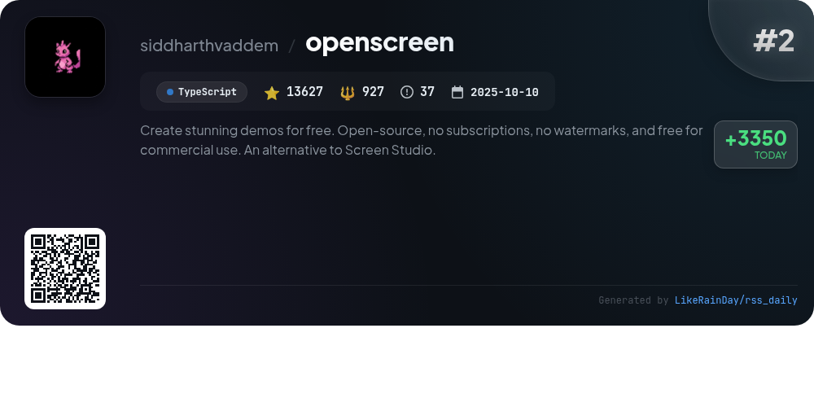
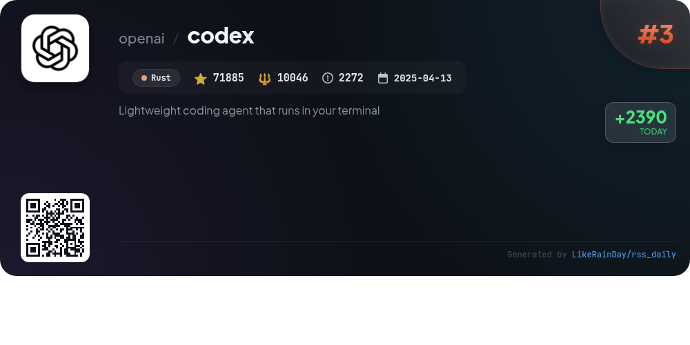
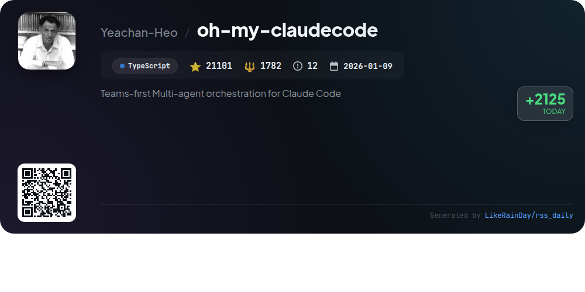
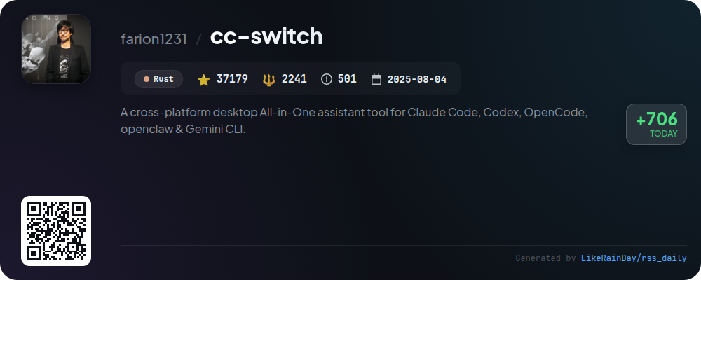
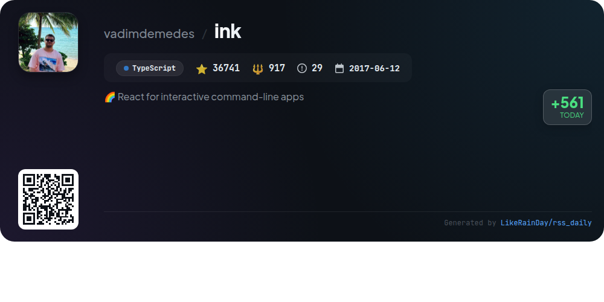
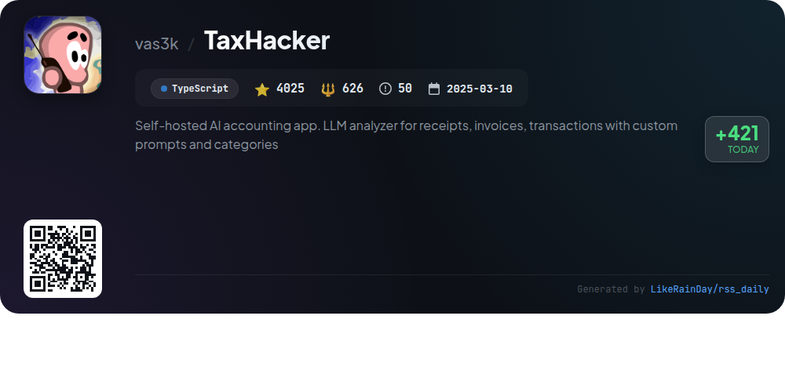
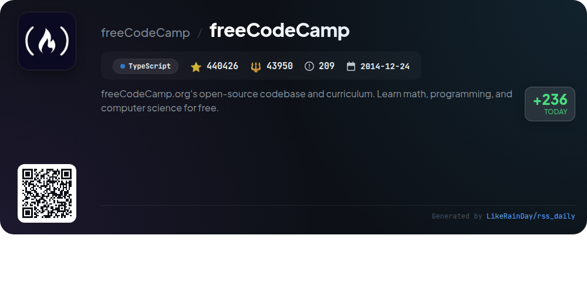
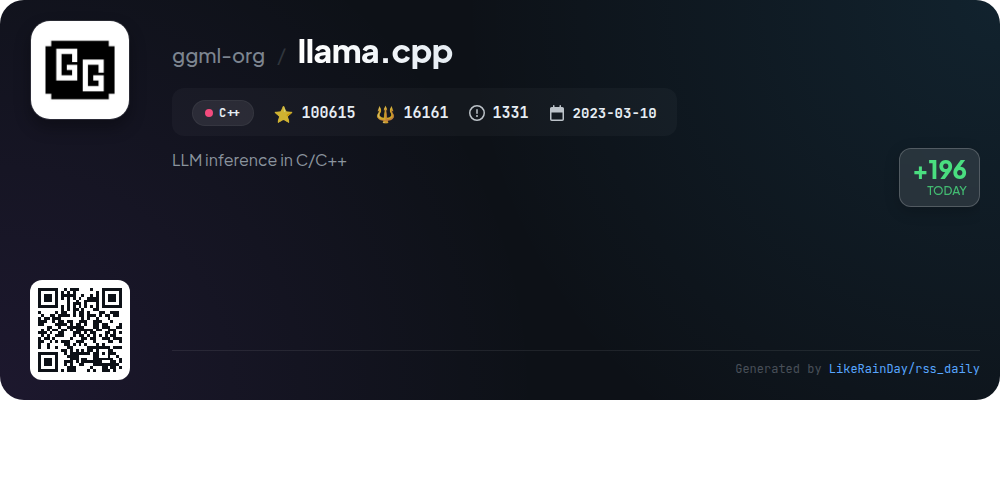
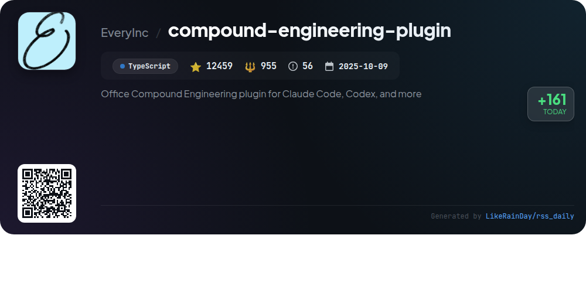

# 📊 🌟 GitHub Trending Daily - 2026-04-02

> > 📅 Daily Picks of GitHub Trending Repositories | Powered by Smart Algorithms

## 📋 Overview

**10** Projects | **869421** ⭐ | **96445** 🍴

**Top Languages:** `TypeScript` (6) · `Rust` (2) · `JavaScript` (1)

**Updated:** 2026-04-02 02:53 UTC

**Categories:**

- 🌟 Daily Top 10 (10 items)

---

## 🌟 Daily Top 10

### 1. [everything-claude-code](https://github.com/affaan-m/everything-claude-code)

> 🤖 **Why Recommend**  
> *Everything Claude Code is a performance optimization system for AI agents, notably supporting Claude Code, Codex, and Cursor. Key features include advanced skills, instincts, memory optimization, continuous learning, and security scanning, making it suitable for production-ready agents. The project, with over 131,000 stars and an Anthropic Hackathon win, offers 36 specialized agents and 150 skills for diverse development workflows. It emphasizes a research-first approach, providing comprehensive guides and cross-platform support, ensuring seamless integration across major IDEs and command-line interfaces.*

- ⭐ 131363 stars
- 💻 JavaScript
- 📅 Updated: 2026-04-02

### 2. [openscreen](https://github.com/siddharthvaddem/openscreen)

> 🤖 **Why Recommend**  
> *OpenScreen is a free, open-source tool for creating product demos and walkthroughs, serving as a simpler alternative to Screen Studio. Key features include screen recording, customizable zooms, audio capture, video cropping, and annotation tools. Users can customize backgrounds, add motion blur, trim clips, and export in various resolutions. OpenScreen is fully free for personal and commercial use, with no watermarks. Built with TypeScript and Electron, it aims to provide essential functionalities without the cost, making it accessible for everyone.*

- ⭐ 13627 stars
- 💻 TypeScript
- 📅 Updated: 2026-04-02

### 3. [codex](https://github.com/openai/codex)

> 🤖 **Why Recommend**  
> *Codex is a lightweight coding agent from OpenAI that operates directly in your terminal, offering a seamless coding experience. Installable via npm or Homebrew, Codex enhances productivity by integrating with popular IDEs like VS Code and providing a desktop app option. Users can leverage Codex's capabilities through their ChatGPT accounts or API keys. With over 71,885 stars on GitHub, Codex supports local execution and cloud-based services, making it a versatile tool for developers. Comprehensive documentation and community contribution guidelines are available.*

- ⭐ 71885 stars
- 💻 Rust
- 📅 Updated: 2026-04-02

### 4. [oh-my-claudecode](https://github.com/Yeachan-Heo/oh-my-claudecode)

> 🤖 **Why Recommend**  
> *oh-my-claudecode is a powerful multi-agent orchestration tool designed for Claude Code users, featuring a zero-learning curve and seamless integration. Key highlights include team-first orchestration, automatic parallelization, and a natural language interface for task management. Users can leverage intelligent routing among 32 specialized agents for various tasks, from code reviews to UI design. With real-time visibility, persistent execution, and customizable skills, it optimizes workflows while saving costs. Ideal for teams, it simplifies complex projects with minimal setup.*

- ⭐ 21101 stars
- 💻 TypeScript
- 📅 Updated: 2026-04-02

### 5. [cc-switch](https://github.com/farion1231/cc-switch)

> 🤖 **Why Recommend**  
> *CC Switch is a cross-platform desktop assistant tool designed to manage multiple CLI tools including Claude Code, Codex, Gemini CLI, OpenCode, and OpenClaw. Key features include a unified interface with over 50 provider presets for easy switching, cloud sync for provider data, and streamlined management of MCP and Skills. It provides system tray quick access, local proxy support, and detailed usage tracking. Built with Rust and Tauri, CC Switch ensures a seamless experience on Windows, macOS, and Linux, making AI-powered coding more efficient and user-friendly.*

- ⭐ 37179 stars
- 💻 Rust
- 📅 Updated: 2026-04-02

### 6. [ink](https://github.com/vadimdemedes/ink)

> 🤖 **Why Recommend**  
> *Ink is a powerful TypeScript library that enables developers to create interactive command-line applications using React components. It leverages Yoga for Flexbox layouts, allowing familiar CSS-like styling. Key features include hooks for user input, paste handling, and lifecycle management, alongside components like `<Text>`, `<Box>`, and `<Static>`. Ink supports screen readers and custom accessibility features, making it user-friendly. With over 36,700 stars on GitHub, it’s widely adopted by projects like GitHub Copilot CLI and Cloudflare's Wrangler, enhancing CLI UI experiences.*

- ⭐ 36741 stars
- 💻 TypeScript
- 📅 Updated: 2026-04-02

### 7. [TaxHacker](https://github.com/vas3k/TaxHacker)

> 🤖 **Why Recommend**  
> *TaxHacker is a self-hosted AI accounting app tailored for freelancers and small businesses. It utilizes LLMs to analyze receipts, invoices, and transactions, automatically extracting key data like amounts and dates, while supporting custom prompts and categories. Key features include multi-currency support with historical conversion rates, customizable transaction organization, advanced filtering, and a self-hosted mode for data privacy. TaxHacker enables efficient expense tracking and tax reporting, making financial management simpler and more automated.*

- ⭐ 4025 stars
- 💻 TypeScript
- 📅 Updated: 2026-04-02

### 8. [freeCodeCamp](https://github.com/freeCodeCamp/freeCodeCamp)

> 🤖 **Why Recommend**  
> *freeCodeCamp is an open-source platform offering free coding education. With over 440,000 stars, it features a full-stack web development and machine learning curriculum, providing interactive coding challenges and certifications in areas like Responsive Web Design, JavaScript, and Python. The community-driven initiative supports learners through forums, a YouTube channel, and a Discord server. FreeCodeCamp also includes resources for job preparation and promotes contributions from volunteers, fostering a collaborative environment for aspiring developers.*

- ⭐ 440426 stars
- 💻 TypeScript
- 📅 Updated: 2026-04-02

### 9. [llama.cpp](https://github.com/ggml-org/llama.cpp)

> 🤖 **Why Recommend**  
> *Llama.cpp is a high-performance C/C++ library for large language model (LLM) inference, boasting over 100,000 stars on GitHub. Key features include dependency-free implementation, optimized support for various hardware (Apple Silicon, AVX, RISC-V), and multiple quantization options for speed and memory efficiency. It offers a user-friendly CLI tool and a REST API for easy model deployment. The project supports numerous LLMs, including LLaMA and Mistral, and integrates seamlessly with Hugging Face for model management and conversion.*

- ⭐ 100615 stars
- 💻 C++
- 📅 Updated: 2026-04-02

### 10. [compound-engineering-plugin](https://github.com/EveryInc/compound-engineering-plugin)

> 🤖 **Why Recommend**  
> *The Compound Engineering plugin enhances AI-driven coding workflows for tools like Claude Code and Codex, boasting over 12,000 stars on GitHub. It emphasizes a philosophy where each engineering unit simplifies future tasks. Key features include commands for ideation, planning, execution, and multi-agent code reviews, enabling a streamlined development cycle. The plugin supports conversions for multiple platforms, ensuring versatility across coding environments. Users can sync personal configurations across various AI coding tools, promoting efficiency and consistency in development practices.*

- ⭐ 12459 stars
- 💻 TypeScript
- 📅 Updated: 2026-04-02

---

## 📡 RSS Subscription

Subscribe via RSS to get daily trending updates:

- 🔔 [RSS XML] (../../daily-top.xml)
- 🔔 [Daily Report] (../../GITHUB_TODAY.md)
- 🔔 [Daily Top 10](../../daily-top.xml)

---

*⚡ Powered by Smart Trending Algorithm | Generated at 2026-04-02 02:53:04 UTC
