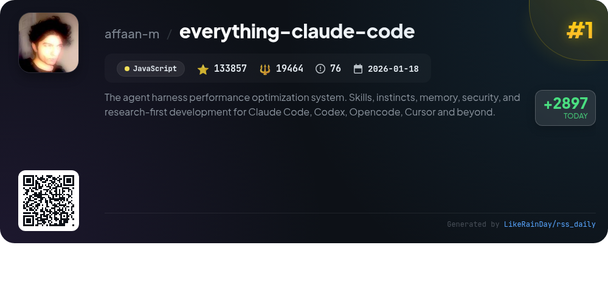
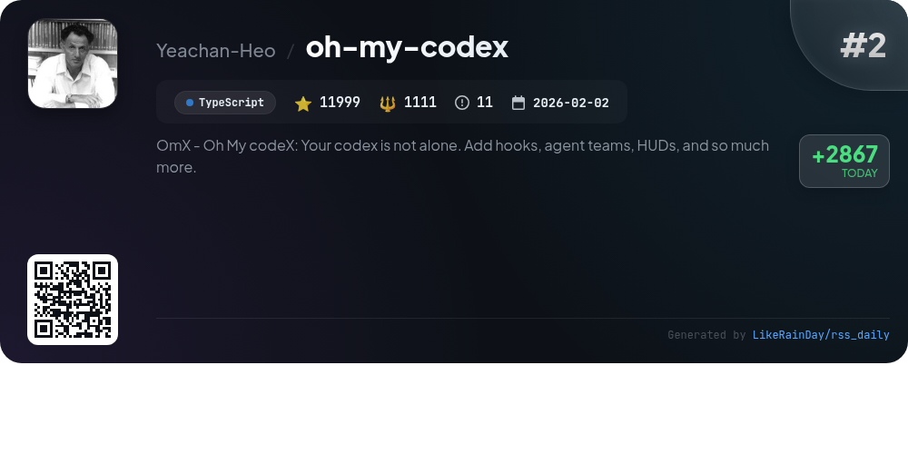
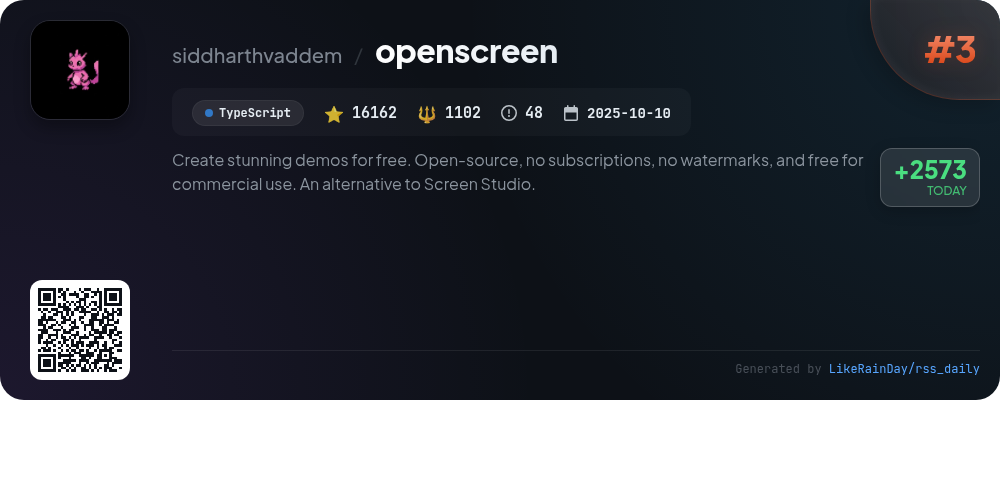
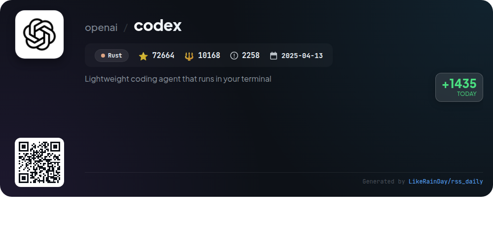
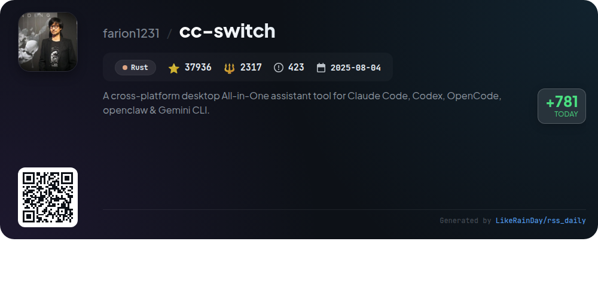
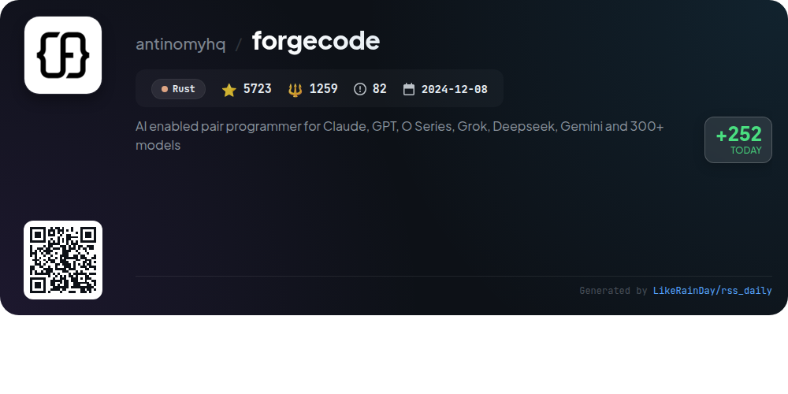
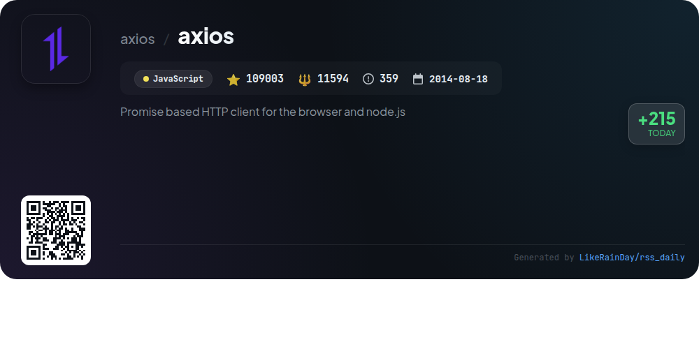
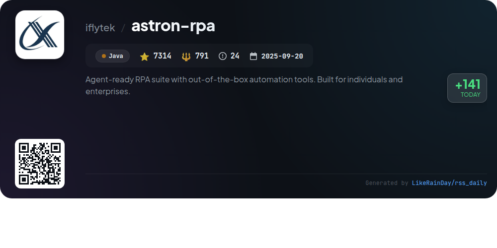
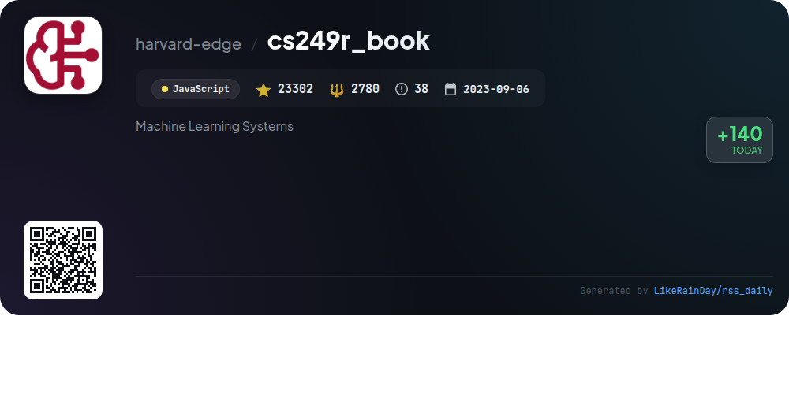
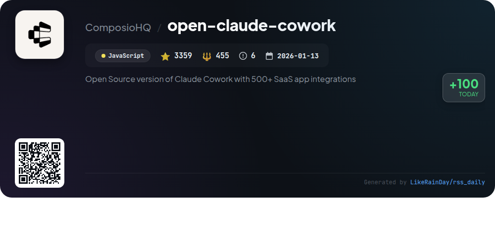

# 📊 🌟 GitHub Trending Daily - 2026-04-03

> > 📅 Daily Picks of GitHub Trending Repositories | Powered by Smart Algorithms

## 📋 Overview

**10** Projects | **421319** ⭐ | **51041** 🍴

**Top Languages:** `JavaScript` (4) · `Rust` (3) · `TypeScript` (2)

**Updated:** 2026-04-03 02:54 UTC

**Categories:**

- 🌟 Daily Top 10 (10 items)

---

## 🌟 Daily Top 10

### 1. [everything-claude-code](https://github.com/affaan-m/everything-claude-code)

> 🤖 **Why Recommend**  
> *Everything Claude Code is a performance optimization system designed for AI agents like Claude Code, Codex, and Cursor. With over 130,000 stars, it offers features such as skills, instincts, memory optimization, security scanning, and continuous learning. The project includes 38 agents and 156 skills for various tasks, from code review to market research. It supports multiple languages and integrates smoothly with major IDEs. The system emphasizes a research-first development approach, ensuring production-ready agents and robust security measures.*

- ⭐ 133857 stars
- 💻 JavaScript
- 📅 Updated: 2026-04-03

### 2. [oh-my-codex](https://github.com/Yeachan-Heo/oh-my-codex)

> 🤖 **Why Recommend**  
> *oh-my-codex (OMX) is a TypeScript-based workflow layer designed to enhance the OpenAI Codex CLI experience. With over 11,999 stars, it allows users to initiate stronger Codex sessions and streamline project workflows. Key features include role-specific commands like `$deep-interview`, `$ralplan`, `$team`, and `$ralph` for task management, as well as durable state tracking in `.omx/`. OMX is ideal for users seeking improved task routing, project guidance, and collaboration in complex coding tasks. Comprehensive documentation and community support are available.*

- ⭐ 11999 stars
- 💻 TypeScript
- 📅 Updated: 2026-04-03

### 3. [openscreen](https://github.com/siddharthvaddem/openscreen)

> 🤖 **Why Recommend**  
> *OpenScreen is a free, open-source tool for creating stunning product demos and walkthroughs, serving as a simplified alternative to Screen Studio. Key features include screen recording, customizable zooms, microphone and system audio capture, video cropping, and annotation tools. Users can customize backgrounds, apply motion blur, and export in various resolutions. OpenScreen is fully free for personal and commercial use, with no subscriptions or watermarks. Built with TypeScript, Electron, and React, it invites contributions and supports multiple platforms.*

- ⭐ 16162 stars
- 💻 TypeScript
- 📅 Updated: 2026-04-03

### 4. [codex](https://github.com/openai/codex)

> 🤖 **Why Recommend**  
> *Codex is a lightweight coding agent by OpenAI that operates directly in your terminal, designed for seamless integration with your development workflow. With over 72,000 stars on GitHub, it offers easy installation via npm or Homebrew. Codex can be utilized in IDEs like VS Code, or through a dedicated desktop app. Users can enhance functionality by signing in with their ChatGPT account or using an API key. The project is open-source and includes comprehensive documentation for installation and contributions, making it a valuable tool for developers.*

- ⭐ 72664 stars
- 💻 Rust
- 📅 Updated: 2026-04-03

### 5. [cc-switch](https://github.com/farion1231/cc-switch)

> 🤖 **Why Recommend**  
> *CC Switch is a cross-platform desktop assistant tool designed for managing five CLI tools: Claude Code, Codex, Gemini CLI, OpenCode, and OpenClaw. Built with Rust and Tauri, it offers a unified interface to switch between providers without manual configuration, featuring over 50 presets and instant provider switching from the system tray. Key highlights include unified MCP and Skills management, cloud sync capabilities, and built-in utilities for enhanced user experience. With 37,936 stars, CC Switch streamlines AI-powered coding workflows across Windows, macOS, and Linux.*

- ⭐ 37936 stars
- 💻 Rust
- 📅 Updated: 2026-04-03

### 6. [forgecode](https://github.com/antinomyhq/forgecode)

> 🤖 **Why Recommend**  
> *ForgeCode is an AI-enhanced terminal development environment designed to assist developers using over 300 models, including Claude, GPT, and Gemini. With 5,723 stars on GitHub, it enables seamless integration of AI capabilities into coding workflows. Key features include zero-configuration setup, multi-provider support, and secure shell mode for enhanced safety. Developers can utilize Forge for code understanding, debugging, and refactoring, while the Model Context Protocol (MCP) allows integration with external tools. Join the community on Discord for support and collaboration.*

- ⭐ 5723 stars
- 💻 Rust
- 📅 Updated: 2026-04-03

### 7. [axios](https://github.com/axios/axios)

> 🤖 **Why Recommend**  
> *Axios is a popular, promise-based HTTP client for both browser and Node.js environments, boasting over 109,000 stars on GitHub. Key features include support for making XMLHttpRequests and Node.js HTTP requests, automatic JSON handling, request and response interceptors, and request cancellation. Axios simplifies data transformation and serialization into different formats like `application/x-www-form-urlencoded` and `multipart/form-data`. It also provides robust error handling and TypeScript support, making it a versatile choice for developers looking for a reliable HTTP client.*

- ⭐ 109003 stars
- 💻 JavaScript
- 📅 Updated: 2026-04-03

### 8. [astron-rpa](https://github.com/iflytek/astron-rpa)

> 🤖 **Why Recommend**  
> *AstronRPA is an open-source, enterprise-grade Robotic Process Automation (RPA) desktop application designed for seamless automation of Windows desktop applications and web pages. Key features include a low-code/no-code visual designer, over 300 pre-built automation components, and tight integration with the Astron Agent for intelligent task execution. It offers robust security, team collaboration, and multi-channel trigger integration. Built on a scalable architecture using Java and Python, AstronRPA empowers users to efficiently automate complex business processes.*

- ⭐ 7314 stars
- 💻 Java
- 📅 Updated: 2026-04-03

### 9. [cs249r_book](https://github.com/harvard-edge/cs249r_book)

> 🤖 **Why Recommend**  
> *The cs249r_book project, a comprehensive curriculum for Machine Learning Systems, aims to establish AI engineering as a foundational discipline. Key features include a two-volume textbook, interactive labs powered by MLSys·im, TinyTorch for building ML frameworks, hardware kits for real-world deployment, and StaffML for interview preparation. With over 23,000 stars, the project provides educators with resources like syllabi and lecture slides, fostering a community dedicated to training 1 million learners by 2030.*

- ⭐ 23302 stars
- 💻 JavaScript
- 📅 Updated: 2026-04-03

### 10. [open-claude-cowork](https://github.com/ComposioHQ/open-claude-cowork)

> 🤖 **Why Recommend**  
> *Open Source version of Claude Cowork with 500+ SaaS app integrations. popular project, actively maintained, recently updated*

- ⭐ 3359 stars
- 🍴 455 forks
- 💻 JavaScript
- 📅 Updated: 2026-04-03

---

## 📡 RSS Subscription

Subscribe via RSS to get daily trending updates:

- 🔔 [RSS XML] (../../daily-top.xml)
- 🔔 [Daily Report] (../../GITHUB_TODAY.md)
- 🔔 [Daily Top 10](../../daily-top.xml)

---

*⚡ Powered by Smart Trending Algorithm | Generated at 2026-04-03 02:54:55 UTC
