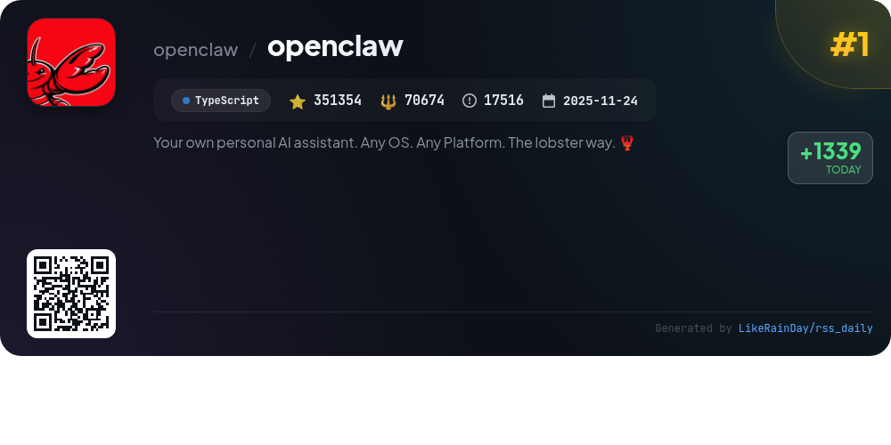
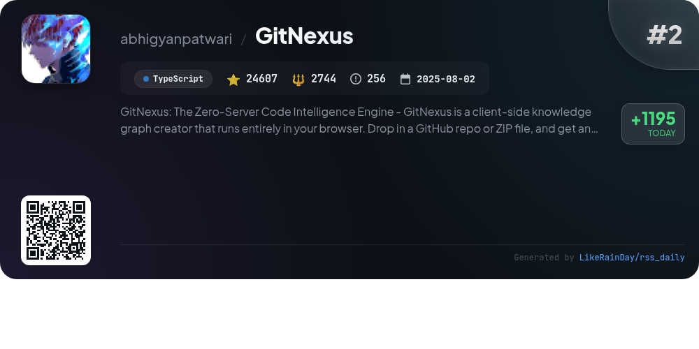
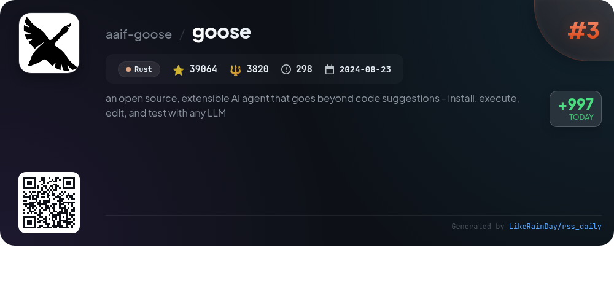
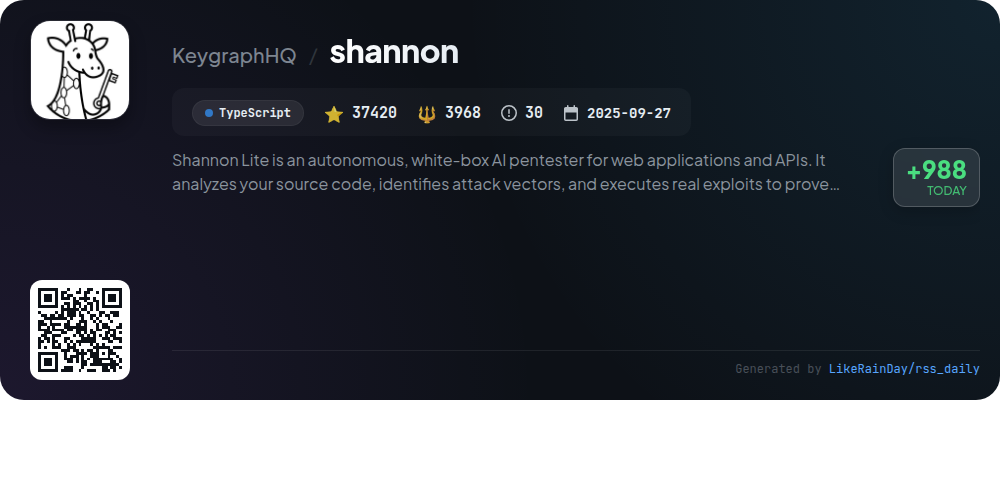
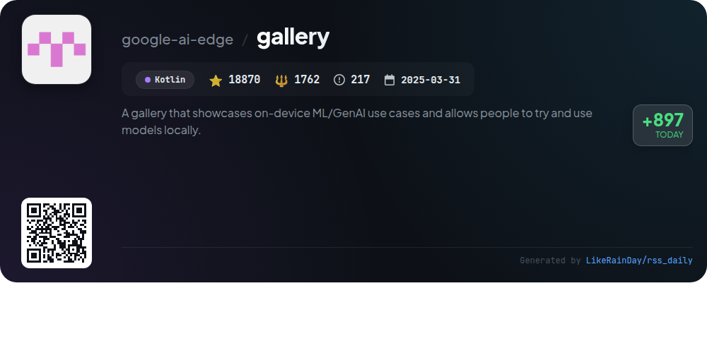
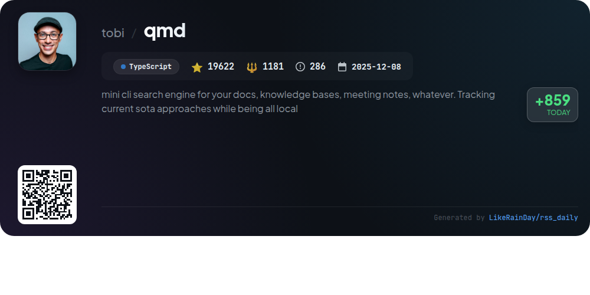
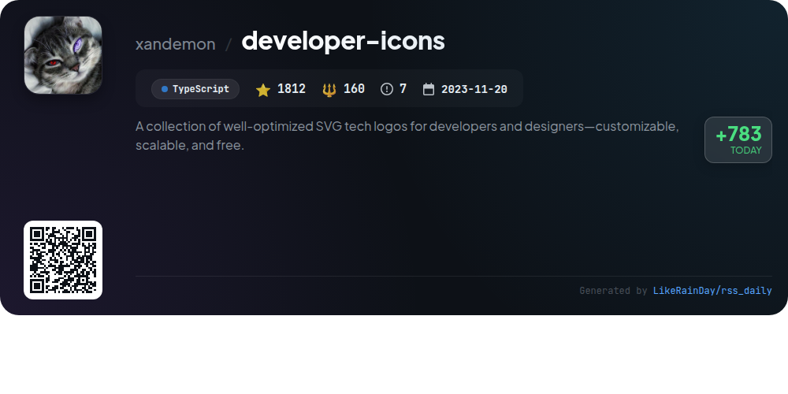
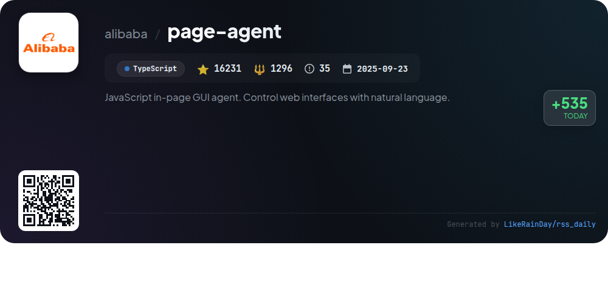
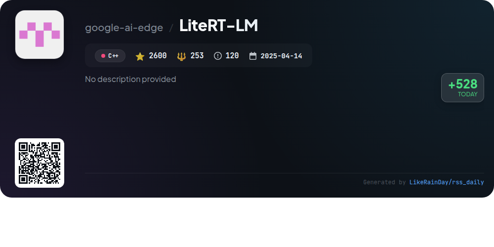
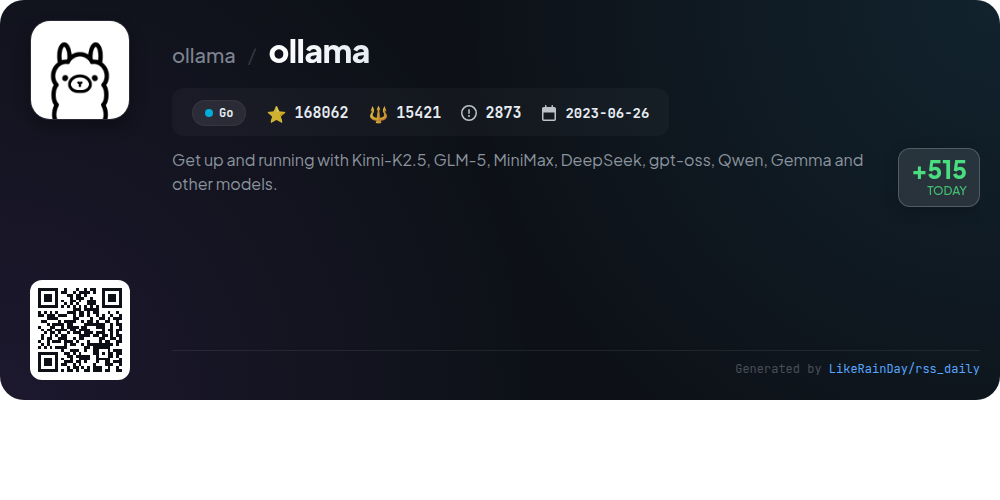

# 📊 🌟 GitHub Trending Daily - 2026-04-08

> > 📅 Daily Picks of GitHub Trending Repositories | Powered by Smart Algorithms

## 📋 Overview

**10** Projects | **679642** ⭐ | **101279** 🍴

**Top Languages:** `TypeScript` (6) · `Go` (1) · `Rust` (1)

**Updated:** 2026-04-08 02:59 UTC

**Categories:**

- 🌟 Daily Top 10 (10 items)

---

## 🌟 Daily Top 10

### 1. [openclaw](https://github.com/openclaw/openclaw)

> 🤖 **Why Recommend**  
> *OpenClaw is a personal AI assistant designed to operate across multiple platforms and messaging channels, including WhatsApp, Telegram, Discord, and more. With over 351,000 stars, it offers features like multi-channel inbox integration, voice wake capabilities, and live Canvas for visual interactions. The assistant runs locally, ensuring speed and privacy, with an onboarding process to guide setup. It supports various models and tools, enhancing user experience through tailored skills and automation options, making it a versatile solution for personal assistance.*

- ⭐ 351354 stars
- 💻 TypeScript
- 📅 Updated: 2026-04-08

### 2. [GitNexus](https://github.com/abhigyanpatwari/GitNexus)

> 🤖 **Why Recommend**  
> *GitNexus: The Zero-Server Code Intelligence Engine -       GitNexus is a client-side knowledge graph creator that runs entirely in your browser. Drop . popular project, actively maintained, recently updated*

- ⭐ 24607 stars
- 🍴 2744 forks
- 💻 TypeScript
- 📅 Updated: 2026-04-08

### 3. [goose](https://github.com/aaif-goose/goose)

> 🤖 **Why Recommend**  
> *Goose is an open-source AI agent designed for versatile tasks beyond code suggestions, including research, automation, and data analysis. It offers a native desktop app for macOS, Linux, and Windows, a full CLI for terminal workflows, and an API for integration. Built in Rust, Goose supports 15+ providers like OpenAI and Google, enabling seamless connectivity to 70+ extensions via the Model Context Protocol. Now part of the Agentic AI Foundation at the Linux Foundation, it aims to enhance productivity across various domains.*

- ⭐ 39064 stars
- 💻 Rust
- 📅 Updated: 2026-04-08

### 4. [shannon](https://github.com/KeygraphHQ/shannon)

> 🤖 **Why Recommend**  
> *Shannon Lite is an autonomous AI pentester designed for web applications and APIs, developed by Keygraph. It conducts white-box security testing by analyzing source code to identify vulnerabilities, executing real exploits to validate findings. Key features include fully autonomous operation, reproducible proof-of-concept exploits, and comprehensive OWASP coverage (e.g., Injection, XSS, SSRF). Available via `npx @keygraph/shannon`, it enhances security by enabling on-demand testing against every build. Shannon Pro offers an expanded feature set for organizations needing an all-in-one AppSec platform with CI/CD integration.*

- ⭐ 37420 stars
- 💻 TypeScript
- 📅 Updated: 2026-04-08

### 5. [gallery](https://github.com/google-ai-edge/gallery)

> 🤖 **Why Recommend**  
> *The Google AI Edge Gallery is a mobile app enabling users to explore and experience cutting-edge on-device Generative AI, including the advanced Gemma 4 model. Key features include Agent Skills for enhanced model capabilities, AI Chat with a Thinking Mode for transparent reasoning, multimodal image and audio processing, and a Prompt Lab for testing prompts. With 100% on-device privacy and support for various open-source models, the app provides a secure and flexible environment to evaluate AI capabilities directly on users' devices. Available on Android and iOS.*

- ⭐ 18870 stars
- 💻 Kotlin
- 📅 Updated: 2026-04-08

### 6. [qmd](https://github.com/tobi/qmd)

> 🤖 **Why Recommend**  
> *qmd is a mini CLI search engine designed for efficiently indexing and searching through various types of documents, including knowledge bases, meeting notes, and personal documentation. Built with TypeScript, it leverages state-of-the-art techniques while ensuring that all operations are conducted locally, prioritizing user privacy and data security. With over 19,600 stars, qmd offers powerful features such as intuitive search capabilities, customizable indexing options, and a user-friendly command-line interface, making it an invaluable tool for knowledge management and retrieval.*

- ⭐ 19622 stars
- 💻 TypeScript
- 📅 Updated: 2026-04-08

### 7. [developer-icons](https://github.com/xandemon/developer-icons)

> 🤖 **Why Recommend**  
> *developer-icons is a collection of high-quality, customizable SVG tech logos designed for developers and designers. Built with TypeScript, it features optimized performance, scalability, and consistent styles across various icon families, including light and dark modes. The project is free and open-source, making it accessible for all. Key highlights include seamless integration with React, extensive customization options, and support for various development tools like Astro and Tailwind CSS. Explore and enhance your projects with these versatile icons today!*

- ⭐ 1812 stars
- 💻 TypeScript
- 📅 Updated: 2026-04-08

### 8. [page-agent](https://github.com/alibaba/page-agent)

> 🤖 **Why Recommend**  
> *JavaScript in-page GUI agent. Control web interfaces with natural language.. popular project, actively maintained, recently updated*

- ⭐ 16231 stars
- 🍴 1296 forks
- 💻 TypeScript
- 📅 Updated: 2026-04-08

### 9. [LiteRT-LM](https://github.com/google-ai-edge/LiteRT-LM)

> 🤖 **Why Recommend**  
> *LiteRT-LM is Google's high-performance, open-source inference framework for deploying Large Language Models on edge devices. It supports cross-platform usage (Android, iOS, Web, Desktop, IoT) and offers hardware acceleration via GPUs and NPUs. Key features include multi-modality for vision and audio inputs, tool use for agentic workflows, and broad model support (Gemma, Llama, etc.). LiteRT-LM powers on-device GenAI experiences in products like Chrome and Pixel Watch. Users can start quickly with the LiteRT-LM CLI for immediate model deployment.*

- ⭐ 2600 stars
- 💻 C++
- 📅 Updated: 2026-04-08

### 10. [ollama](https://github.com/ollama/ollama)

> 🤖 **Why Recommend**  
> *Ollama is a powerful platform for building with open AI models like Kimi-K2.5, GLM-5, and Gemma. With support for macOS, Windows, and Linux, users can easily install and integrate models via CLI or REST API. Key features include launching AI assistants (e.g., OpenClaw), chatting with models, and integrating with existing applications like Claude and Codex. Ollama also offers extensive community support, libraries for Python and JavaScript, and a Docker image for containerized deployments, making it a versatile tool for developers.*

- ⭐ 168062 stars
- 💻 Go
- 📅 Updated: 2026-04-08

---

## 📡 RSS Subscription

Subscribe via RSS to get daily trending updates:

- 🔔 [RSS XML] (../../daily-top.xml)
- 🔔 [Daily Report] (../../GITHUB_TODAY.md)
- 🔔 [Daily Top 10](../../daily-top.xml)

---

*⚡ Powered by Smart Trending Algorithm | Generated at 2026-04-08 02:59:00 UTC
