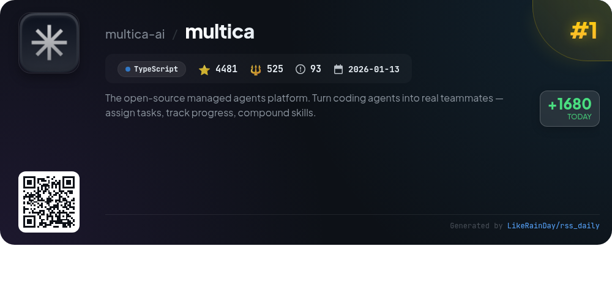
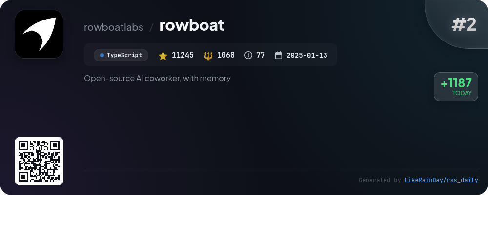
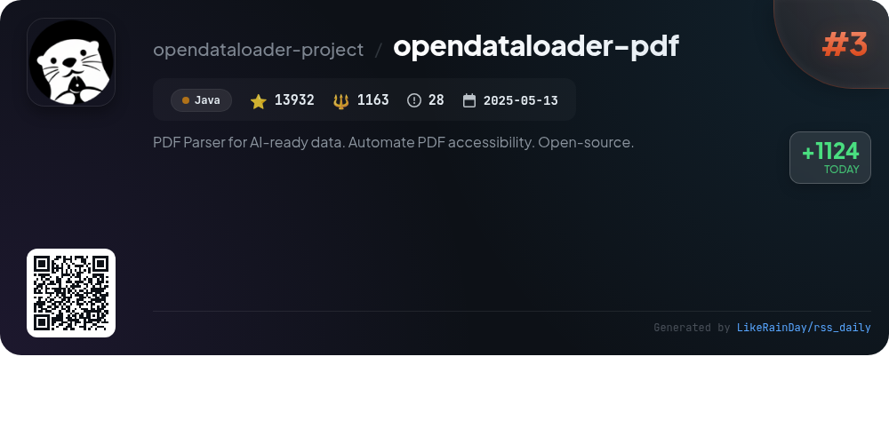
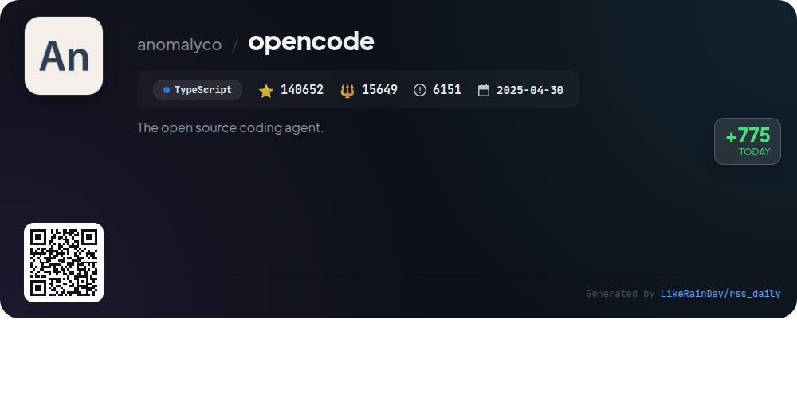
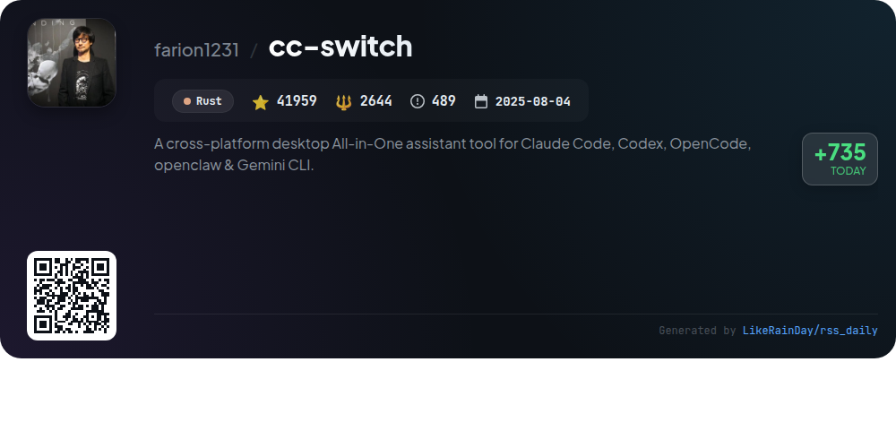
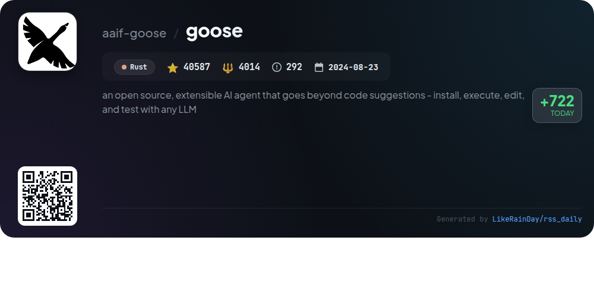
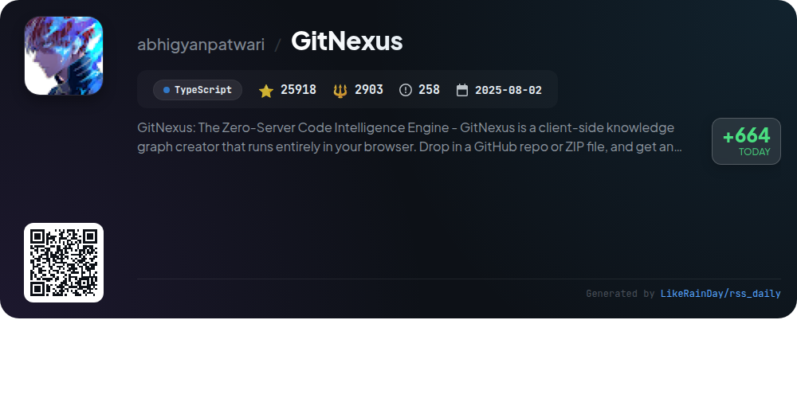
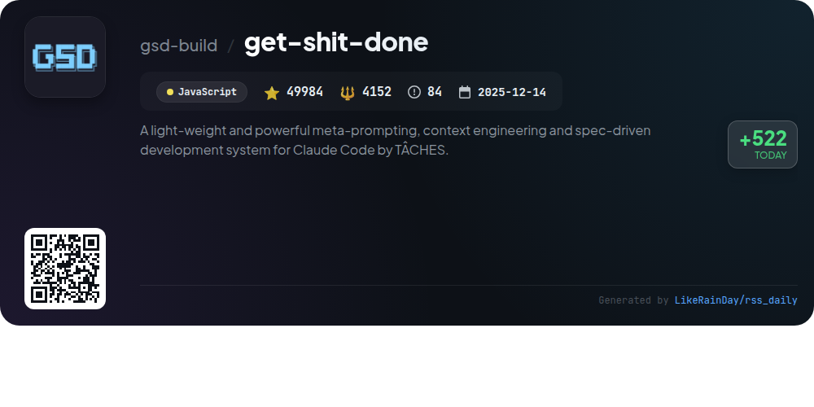
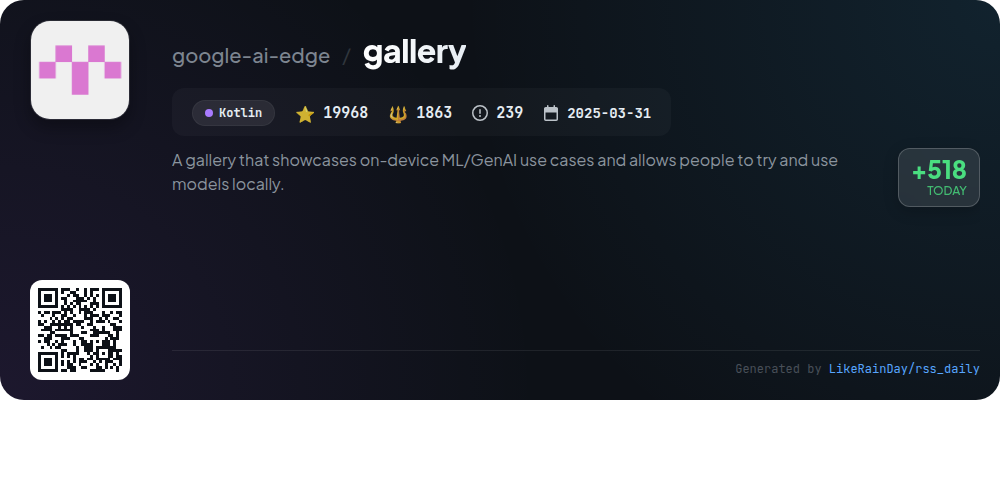
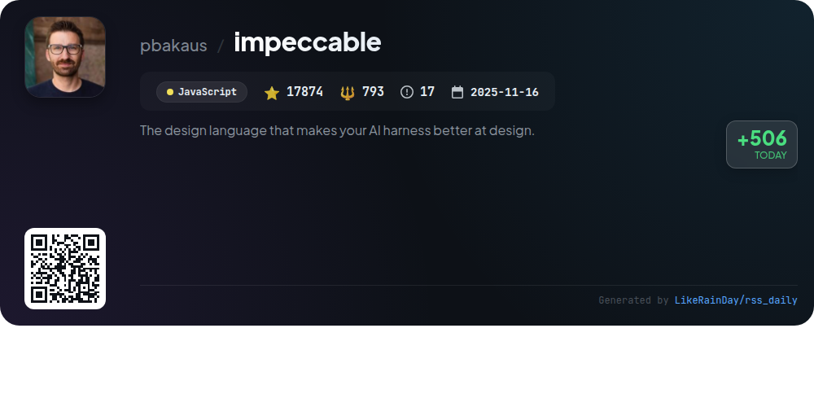

# 📊 🌟 GitHub Trending Daily - 2026-04-10

> > 📅 Daily Picks of GitHub Trending Repositories | Powered by Smart Algorithms

## 📋 Overview

**10** Projects | **366600** ⭐ | **34766** 🍴

**Top Languages:** `TypeScript` (4) · `JavaScript` (2) · `Rust` (2)

**Updated:** 2026-04-10 03:25 UTC

**Categories:**

- 🌟 Daily Top 10 (10 items)

---

## 🌟 Daily Top 10

### 1. [multica](https://github.com/multica-ai/multica)

> 🤖 **Why Recommend**  
> *Multica is an open-source managed agents platform designed to enhance productivity by integrating coding agents as teammates. With 4,481 stars, it allows users to assign tasks, track progress, and compound skills seamlessly. Key features include autonomous execution of tasks, reusable skills, unified runtimes for local and cloud environments, and multi-workspace organization. The platform supports major coding agents like Claude Code, Codex, OpenClaw, and OpenCode, making it a versatile choice for teams looking to optimize collaboration between humans and AI.*

- ⭐ 4481 stars
- 💻 TypeScript
- 📅 Updated: 2026-04-10

### 2. [rowboat](https://github.com/rowboatlabs/rowboat)

> 🤖 **Why Recommend**  
> *Rowboat is an open-source AI coworker designed to enhance productivity by transforming work into a long-lived knowledge graph. Key features include email and meeting integration, automated document generation, and live note tracking. Users can prepare for meetings with context from past interactions, draft emails grounded in history, and visualize their knowledge graph in Markdown. Rowboat operates locally, ensuring data privacy and control, while supporting various external tools via Model Context Protocol (MCP). Download for Mac, Windows, and Linux at the official website.*

- ⭐ 11245 stars
- 💻 TypeScript
- 📅 Updated: 2026-04-10

### 3. [opendataloader-pdf](https://github.com/opendataloader-project/opendataloader-pdf)

> 🤖 **Why Recommend**  
> *OpenDataLoader PDF is an open-source PDF parser designed for AI-ready data extraction and accessibility automation. It excels in converting PDFs to structured formats like Markdown, JSON, and HTML, achieving #1 benchmark accuracy (0.907 overall). Key features include hybrid AI mode for complex documents, built-in OCR support for scanned PDFs, and deterministic output with bounding boxes. The tool automates PDF accessibility with auto-tagging to Tagged PDF (available Q2 2026) and collaborates with PDF Association for compliance validation. Available SDKs include Python, Node.js, and Java.*

- ⭐ 13932 stars
- 💻 Java
- 📅 Updated: 2026-04-10

### 4. [opencode](https://github.com/anomalyco/opencode)

> 🤖 **Why Recommend**  
> *OpenCode is an open-source AI coding agent built with TypeScript, boasting over 140,000 stars on GitHub. It features two main agent modes: "build" for full development access and "plan" for read-only exploration, ideal for unfamiliar codebases. OpenCode supports multiple programming models, ensuring flexibility across platforms. The project includes a desktop application for macOS, Windows, and Linux, and features a terminal user interface (TUI) designed for enhanced usability. Join the community via Discord for collaboration and support.*

- ⭐ 140652 stars
- 💻 TypeScript
- 📅 Updated: 2026-04-10

### 5. [cc-switch](https://github.com/farion1231/cc-switch)

> 🤖 **Why Recommend**  
> *CC Switch is a cross-platform desktop tool that unifies management for Claude Code, Codex, Gemini CLI, OpenCode, and OpenClaw. With over 50 built-in provider presets, it simplifies API provider switching through a visual interface, eliminating manual config editing. Key features include unified management of MCP and Skills, cloud sync across devices, and system tray quick access. Built with Rust and Tauri, it supports Windows, macOS, and Linux. The application also offers session management, usage tracking, and integrated proxy services, enhancing AI-powered coding efficiency.*

- ⭐ 41959 stars
- 💻 Rust
- 📅 Updated: 2026-04-10

### 6. [goose](https://github.com/aaif-goose/goose)

> 🤖 **Why Recommend**  
> *goose is an open-source AI agent designed for versatile use, allowing users to install, execute, edit, and test code with various LLMs. Built in Rust, it offers a native desktop app for macOS, Linux, and Windows, along with a CLI and API for seamless integration. Supporting over 15 providers like OpenAI and Google, goose connects to 70+ extensions via the Model Context Protocol. Now part of the Agentic AI Foundation, it focuses on empowering workflows in coding, research, automation, and data analysis. Join the community on Discord and explore extensive documentation for setup and tutorials.*

- ⭐ 40587 stars
- 💻 Rust
- 📅 Updated: 2026-04-10

### 7. [GitNexus](https://github.com/abhigyanpatwari/GitNexus)

> 🤖 **Why Recommend**  
> *GitNexus: The Zero-Server Code Intelligence Engine -       GitNexus is a client-side knowledge graph creator that runs entirely in your browser. Drop . popular project, actively maintained, recently updated*

- ⭐ 25918 stars
- 🍴 2903 forks
- 💻 TypeScript
- 📅 Updated: 2026-04-10

### 8. [get-shit-done](https://github.com/gsd-build/get-shit-done)

> 🤖 **Why Recommend**  
> *Get Shit Done (GSD) is a powerful meta-prompting and context engineering system designed for Claude Code and other AI runtimes. It combats context rot by maintaining high-quality outputs throughout development. Key features include streamlined project initialization, a structured workflow for discussing, planning, executing, and verifying phases, and built-in quality gates to ensure code integrity. GSD enables atomic Git commits, supports multiple AI runtimes, and provides a user-friendly command interface. Trusted by engineers at major tech companies, GSD simplifies spec-driven development without unnecessary complexity.*

- ⭐ 49984 stars
- 💻 JavaScript
- 📅 Updated: 2026-04-10

### 9. [gallery](https://github.com/google-ai-edge/gallery)

> 🤖 **Why Recommend**  
> *Google AI Edge Gallery is an innovative platform for running advanced on-device Generative AI models, including the latest Gemma 4 family, entirely offline and with full privacy. Core features include Agent Skills for enhanced model interactions, AI Chat with a "Thinking Mode" for transparent reasoning, multimodal capabilities with Ask Image, and real-time voice transcription via Audio Scribe. Users can manage models easily, experiment in the Prompt Lab, and enjoy privacy-focused functionality. Available on Android and iOS, it supports a seamless experience in AI exploration.*

- ⭐ 19968 stars
- 💻 Kotlin
- 📅 Updated: 2026-04-10

### 10. [impeccable](https://github.com/pbakaus/impeccable)

> 🤖 **Why Recommend**  
> *Impeccable is a powerful design language for enhancing AI-driven frontend design, featuring 21 commands and 7 domain-specific reference files. It offers tools for auditing, reviewing, and polishing designs while providing curated anti-patterns to avoid common mistakes. Key commands include `/audit` for quality checks, `/critique` for UX reviews, and `/polish` for final touches. Impeccable integrates with various AI tools and is designed to provide deeper expertise than generic templates, ensuring better UI design outcomes. Visit [impeccable.style](https://impeccable.style) for more information.*

- ⭐ 17874 stars
- 💻 JavaScript
- 📅 Updated: 2026-04-10

---

## 📡 RSS Subscription

Subscribe via RSS to get daily trending updates:

- 🔔 [RSS XML] (../../daily-top.xml)
- 🔔 [Daily Report] (../../GITHUB_TODAY.md)
- 🔔 [Daily Top 10](../../daily-top.xml)

---

*⚡ Powered by Smart Trending Algorithm | Generated at 2026-04-10 03:25:07 UTC
