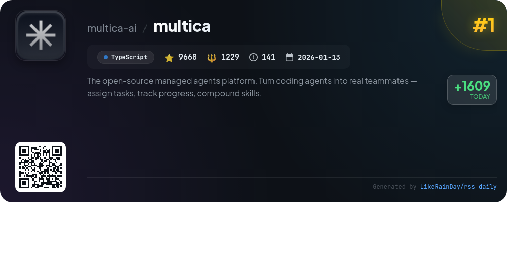
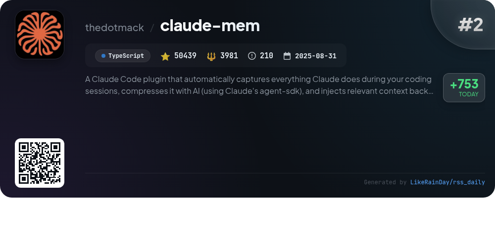
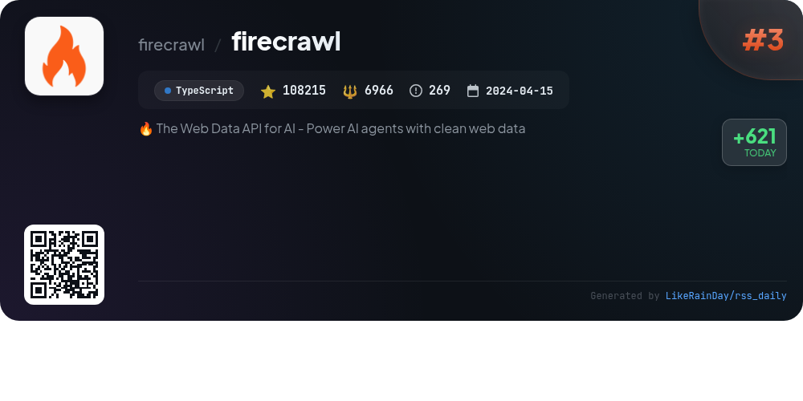
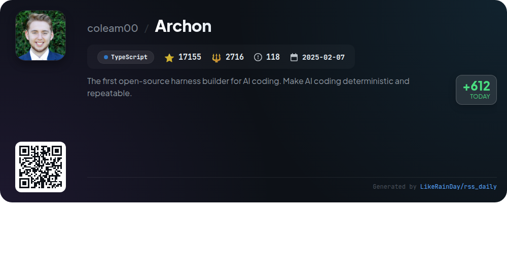
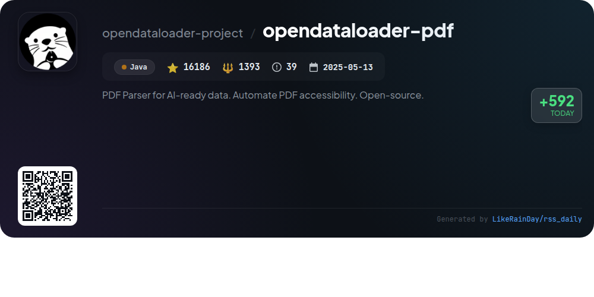
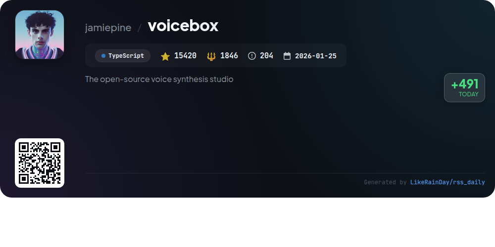
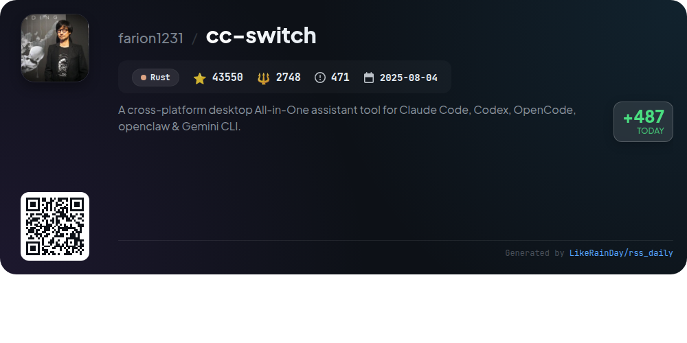
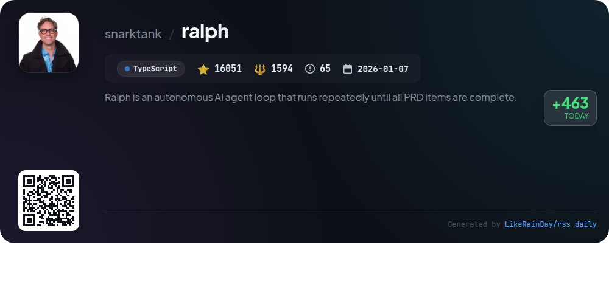
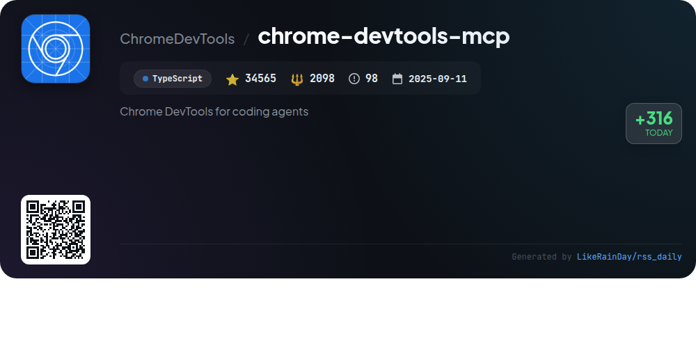
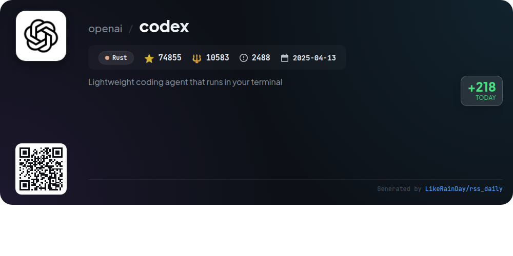

# 📊 🌟 GitHub Trending Daily - 2026-04-13

> > 📅 每日精选 GitHub 热门仓库 | 基于智能算法推荐

## 📋 Overview

**10** 个项目 | **386096** ⭐ | **35154** 🍴

**热门语言:** `TypeScript` (7) · `Rust` (2) · `Java` (1)

**更新时间:** 2026-04-13 03:36 UTC

**分类分布:**

- 🌟 每日 Top 10 精选 (10 项)

---

## 🌟 每日 Top 10 精选

### 1. [multica](https://github.com/multica-ai/multica)

> 🤖 **推荐理由**  
> *The open-source managed agents platform. Turn coding agents into real teammates — assign tasks, track progress, compound skills.. popular project, actively maintained, recently updated*

- ⭐ 9660 stars
- 🍴 1229 forks
- 💻 TypeScript
- 📅 Updated: 2026-04-13

### 2. [claude-mem](https://github.com/thedotmack/claude-mem)

> 🤖 **推荐理由**  
> *Claude-Mem is a powerful plugin for Claude Code that captures and compresses coding session activities using AI. It preserves context across sessions, ensuring continuity of project knowledge. Key features include persistent memory, skill-based search for project history, a web viewer UI for real-time memory access, and privacy controls for sensitive content. With automatic operation and easy installation via command line, it enhances coding efficiency by allowing Claude to recall past interactions seamlessly. The project boasts 50,439 stars on GitHub, underscoring its popularity and utility.*

- ⭐ 50439 stars
- 💻 TypeScript
- 📅 Updated: 2026-04-13

### 3. [firecrawl](https://github.com/firecrawl/firecrawl)

> 🤖 **推荐理由**  
> *Firecrawl is an open-source Web Data API designed to power AI agents with clean web data, boasting 108,215 stars on GitHub. It offers reliable web scraping capabilities, covering 96% of the web, including JavaScript-heavy pages, with a P95 latency of 3.4 seconds. Key features include seamless search, scraping, and interaction with web pages, as well as automated data gathering through its Agent feature. Firecrawl supports multiple output formats, including markdown and JSON, and handles complexities like proxy management and rate limits, making it ideal for real-time applications.*

- ⭐ 108215 stars
- 💻 TypeScript
- 📅 Updated: 2026-04-13

### 4. [Archon](https://github.com/coleam00/Archon)

> 🤖 **推荐理由**  
> *Archon is an open-source harness builder for AI coding, designed to make AI-driven development deterministic and repeatable. With over 17,000 stars on GitHub, it allows users to define workflows in YAML, covering planning, implementation, validation, and code review. Key features include isolated workflow runs, composability of deterministic and AI nodes, and cross-platform portability. Archon offers a web UI for monitoring and managing workflows, and integrates easily with platforms like Slack and GitHub. It streamlines development processes, ensuring consistent outcomes and efficient collaboration.*

- ⭐ 17155 stars
- 💻 TypeScript
- 📅 Updated: 2026-04-13

### 5. [opendataloader-pdf](https://github.com/opendataloader-project/opendataloader-pdf)

> 🤖 **推荐理由**  
> *OpenDataLoader PDF is an open-source PDF parser designed for AI-ready data extraction and PDF accessibility automation. It offers top-tier extraction accuracy (0.907 overall) for structured data in Markdown, JSON, HTML, and Tagged PDF formats, supporting complex layouts, OCR for scanned documents, and AI-generated descriptions for images and charts. The tool automates PDF accessibility compliance with a unique end-to-end auto-tagging feature, set to launch in Q2 2026, validated by PDF Association standards. Available in Python, Node.js, and Java, it serves both free and enterprise needs.*

- ⭐ 16186 stars
- 💻 Java
- 📅 Updated: 2026-04-13

### 6. [voicebox](https://github.com/jamiepine/voicebox)

> 🤖 **推荐理由**  
> *Voicebox is an open-source voice synthesis studio that allows users to clone voices, generate speech in 23 languages, and apply post-processing effects—all running locally. Key features include five TTS engines, a multi-voice timeline editor for projects, real-time audio effects, and an API for integration. Voicebox emphasizes privacy, as models and data remain on the user's machine. It supports various platforms, including macOS, Windows, and Linux, and offers capabilities like voice profile management, asynchronous generation, and in-app recording.*

- ⭐ 15420 stars
- 💻 TypeScript
- 📅 Updated: 2026-04-13

### 7. [cc-switch](https://github.com/farion1231/cc-switch)

> 🤖 **推荐理由**  
> *CC Switch is a cross-platform desktop assistant tool designed to manage multiple AI CLI tools, including Claude Code, Codex, Gemini CLI, OpenCode, and OpenClaw, all from a unified interface. It offers over 50 built-in provider presets, eliminating the need for manual configuration edits. Key features include instant provider switching, unified MCP and Skills management, cloud sync, and comprehensive usage tracking. Built with Rust and Tauri, CC Switch supports Windows, macOS, and Linux, providing a seamless experience for developers leveraging AI technologies.*

- ⭐ 43550 stars
- 💻 Rust
- 📅 Updated: 2026-04-13

### 8. [ralph](https://github.com/snarktank/ralph)

> 🤖 **推荐理由**  
> *Ralph is an autonomous AI agent that iteratively processes Product Requirements Documents (PRDs) until all items are complete. Utilizing AI coding tools like Amp or Claude Code, Ralph creates a fresh instance for each iteration, tracking progress through git history and files like `prd.json` and `progress.txt`. Key features include automatic PRD generation, conversion to JSON format, and a structured workflow for implementing user stories. With over 16,000 stars, Ralph enhances coding efficiency while ensuring quality through feedback loops and automated checks.*

- ⭐ 16051 stars
- 💻 TypeScript
- 📅 Updated: 2026-04-13

### 9. [chrome-devtools-mcp](https://github.com/ChromeDevTools/chrome-devtools-mcp)

> 🤖 **推荐理由**  
> *Chrome DevTools MCP is a powerful tool that allows AI coding agents (like Gemini and Copilot) to control and inspect live Chrome browsers. With over 34,500 stars on GitHub, it provides essential features such as advanced browser debugging, performance insights via Chrome DevTools, and reliable automation using Puppeteer. Key highlights include network analysis, screenshot capabilities, and performance tracing. It supports configurations for various environments and ensures secure handling of browser data. Ideal for developers seeking robust automation and debugging solutions.*

- ⭐ 34565 stars
- 💻 TypeScript
- 📅 Updated: 2026-04-13

### 10. [codex](https://github.com/openai/codex)

> 🤖 **推荐理由**  
> *Codex is a lightweight coding agent by OpenAI that runs locally in your terminal, designed for seamless coding assistance. With over 74,000 stars, it can be installed globally via npm or Homebrew. Key features include integration with popular IDEs (like VS Code) and a desktop app experience. Users can sign in with their ChatGPT account for enhanced functionality or utilize an API key for custom setups. The project is open-source under the Apache-2.0 License and offers comprehensive documentation for installation and usage.*

- ⭐ 74855 stars
- 💻 Rust
- 📅 Updated: 2026-04-13

---

## 📡 RSS订阅

通过 RSS 订阅，第一时间获取每日精选项目：

- 🔔 [RSS 订阅源] (../../daily-top.xml)
- 🔔 [每日简报] (../../GITHUB_TODAY_CN.md)
- 🔔 [每日 Top 10 精选](../../daily-top.xml)

---

*⚡ Powered by Smart Trending Algorithm | Generated at 2026-04-13 03:36:06 UTC
