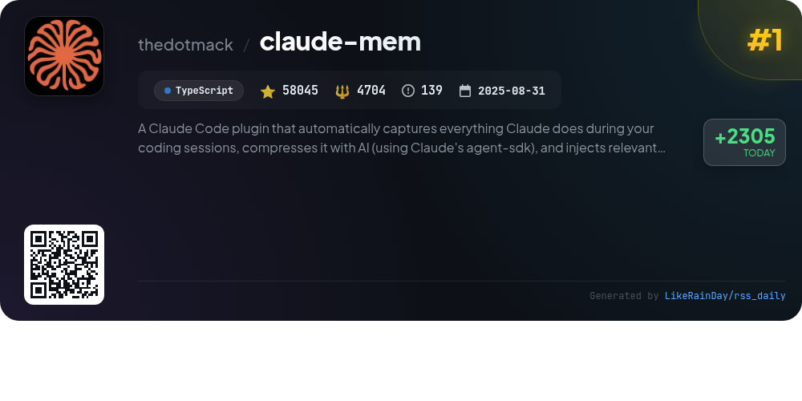
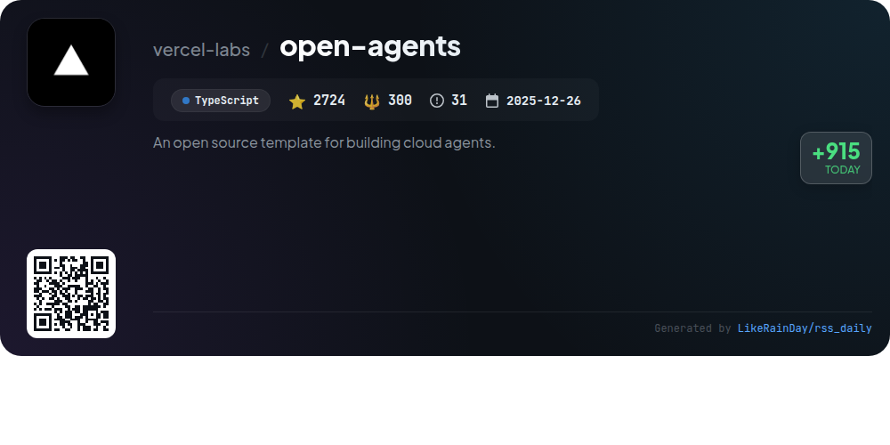
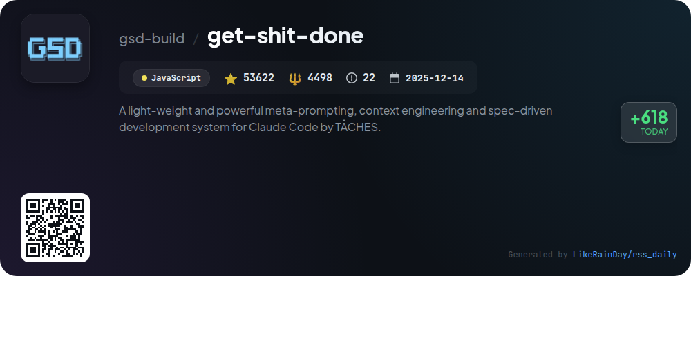
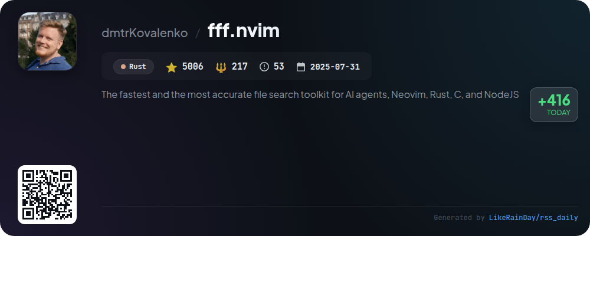
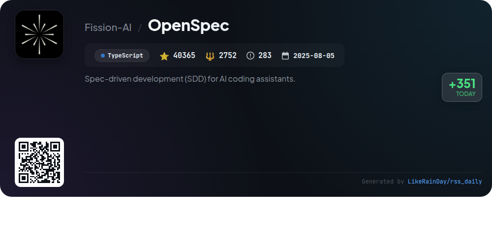

# 📊 🌟 GitHub Trending Daily - 2026-04-16

> > 📅 Daily Picks of GitHub Trending Repositories | Powered by Smart Algorithms

## 📋 Overview

**10** Projects | **379859** ⭐ | **46033** 🍴

**Top Languages:** `TypeScript` (6) · `JavaScript` (3) · `Rust` (1)

**Updated:** 2026-04-16 03:31 UTC

**Categories:**

- 🌟 Daily Top 10 (10 items)

---

## 🌟 Daily Top 10

### 1. [claude-mem](https://github.com/thedotmack/claude-mem)

> 🤖 **Why Recommend**  
> *Claude-Mem is a TypeScript plugin for Claude Code that enhances coding sessions by automatically capturing tool usage and generating AI-compressed summaries for future reference. Key features include persistent memory for context continuity, progressive disclosure for token-efficient memory retrieval, and a web viewer UI for real-time memory access. It supports various installation methods, integrates with OpenClaw for real-time updates, and offers privacy controls. With innovative search tools and a beta channel for experimental features, Claude-Mem significantly improves developer productivity.*

- ⭐ 58045 stars
- 💻 TypeScript
- 📅 Updated: 2026-04-16

### 2. [everything-claude-code](https://github.com/affaan-m/everything-claude-code)

> 🤖 **Why Recommend**  
> *Everything Claude Code is a comprehensive performance optimization system for AI agents, compatible with Claude Code, Codex, Cursor, and OpenCode. Key features include skills, instincts, memory optimization, continuous learning, and security scanning. It boasts 48 agents and 183 skills to streamline workflows in software development. The project is a winner of the Anthropic Hackathon and supports multiple languages, with a focus on production-ready tools. Installation is flexible, accommodating both plugin and manual setups, making it versatile for various development environments.*

- ⭐ 157629 stars
- 💻 JavaScript
- 📅 Updated: 2026-04-16

### 3. [editor](https://github.com/pascalorg/editor)

> 🤖 **Why Recommend**  
> *Pascal Editor is a powerful 3D architectural project editor built with TypeScript, React Three Fiber, and WebGPU, designed for creating and sharing detailed architectural designs. Key features include a monorepo architecture with dedicated packages for core functionality, 3D rendering, and an intuitive UI. The editor supports interactive tools for wall drawing, item placement, and zone creation, while utilizing Zustand for state management and advanced systems for geometry generation. With features like undo/redo and spatial validation, it streamlines the architectural design process.*

- ⭐ 12752 stars
- 💻 TypeScript
- 📅 Updated: 2026-04-16

### 4. [voicebox](https://github.com/jamiepine/voicebox)

> 🤖 **Why Recommend**  
> *Voicebox is an open-source voice synthesis studio that allows users to clone voices, generate speech in 23 languages, and apply effects—all running locally for complete privacy. Key features include five TTS engines, a multi-voice timeline editor for projects, and an API for integration. Users can apply post-processing effects, manage voice profiles, and utilize real-time async generation. Built with Tauri for native performance, Voicebox supports macOS, Windows, and Linux, making it suitable for diverse applications like podcasts, game dialogue, and accessibility tools.*

- ⭐ 18398 stars
- 💻 TypeScript
- 📅 Updated: 2026-04-16

### 5. [open-agents](https://github.com/vercel-labs/open-agents)

> 🤖 **Why Recommend**  
> *Open Agents is an open-source template for building cloud agents, designed for Vercel. With 2,724 stars, it offers a robust architecture comprising a web UI, agent workflow, and sandbox VM. Key features include a chat-driven coding agent, multi-step execution, isolated Vercel sandboxes, and GitHub integration for repo management, auto-commit, and PR creation. The separation of agent and sandbox allows independent lifecycle management. Developers can easily fork the repo and adapt it, making it a versatile tool for cloud-based coding solutions.*

- ⭐ 2724 stars
- 💻 TypeScript
- 📅 Updated: 2026-04-16

### 6. [get-shit-done](https://github.com/gsd-build/get-shit-done)

> 🤖 **Why Recommend**  
> *Get Shit Done (GSD) is a lightweight meta-prompting and spec-driven development system designed for Claude Code and various AI runtimes. It effectively combats context degradation, enhancing code quality through context engineering and automated task management. Key features include project initialization, phase planning, multi-agent orchestration, and user acceptance testing. GSD integrates knowledge graphs, supports TDD, and ensures atomic Git commits for traceability. Trusted by engineers at major tech companies, GSD streamlines development workflows without the complexity of traditional tools.*

- ⭐ 53622 stars
- 💻 JavaScript
- 📅 Updated: 2026-04-16

### 7. [fff.nvim](https://github.com/dmtrKovalenko/fff.nvim)

> 🤖 **Why Recommend**  
> *fff.nvim is a high-performance fuzzy file search toolkit for AI agents and Neovim, built with Rust. It features rapid file matching, memory usage optimization for AI interactions, and enhanced typo resistance. Key functionalities include multi-grep support, customizable search modes (plain, regex, fuzzy), git integration with status highlighting, and cross-mode suggestions for improved search results. The plugin supports Neovim 0.10.0+, with easy installation via a bash script. With over 5000 stars on GitHub, it stands out for its speed and accuracy in file searching.*

- ⭐ 5006 stars
- 💻 Rust
- 📅 Updated: 2026-04-16

### 8. [camofox-browser](https://github.com/jo-inc/camofox-browser)

> 🤖 **Why Recommend**  
> *Camofox-browser is a headless browser automation server designed for AI agents, utilizing the Camoufox engine for advanced anti-detection. Key features include C++ level fingerprint spoofing, REST API integration, stable element references, and token-efficient accessibility snapshots. It supports cookie import for authenticated browsing, proxy routing with GeoIP, and structured JSON logging for observability. The server can handle multiple user sessions, automated tab management, and provides search macros for popular platforms. Camofox-browser is deployable via Docker and various cloud platforms.*

- ⭐ 2587 stars
- 💻 JavaScript
- 📅 Updated: 2026-04-16

### 9. [OpenSpec](https://github.com/Fission-AI/OpenSpec)

> 🤖 **Why Recommend**  
> *OpenSpec is a spec-driven development framework designed for AI coding assistants, boasting over 40,000 stars on GitHub. Built with TypeScript, it enables fluid collaboration between humans and AI by establishing clear specifications before coding begins. Key features include a structured proposal process, artifact management for each change, and support for over 20 AI tools via intuitive slash commands. OpenSpec promotes iterative development, organization, and adaptability, making it suitable for projects of any scale. Join the community on Discord for support and updates.*

- ⭐ 40365 stars
- 💻 TypeScript
- 📅 Updated: 2026-04-16

### 10. [postiz-app](https://github.com/gitroomhq/postiz-app)

> 🤖 **Why Recommend**  
> *Postiz is an advanced social media scheduling tool that leverages AI to streamline post management across various platforms like X, Bluesky, and Discord. With features such as analytics, team collaboration, and an intuitive API for automation with tools like N8N and Zapier, Postiz empowers users to efficiently build their audience and capture leads. The self-hosted option ensures data privacy, while integration with popular services and a user-friendly interface make it a competitive alternative to tools like Buffer and Hypefury. Explore Postiz for a comprehensive social media strategy.*

- ⭐ 28731 stars
- 💻 TypeScript
- 📅 Updated: 2026-04-16

---

## 📡 RSS Subscription

Subscribe via RSS to get daily trending updates:

- 🔔 [RSS XML] (../../daily-top.xml)
- 🔔 [Daily Report] (../../GITHUB_TODAY.md)
- 🔔 [Daily Top 10](../../daily-top.xml)

---

*⚡ Powered by Smart Trending Algorithm | Generated at 2026-04-16 03:31:52 UTC
