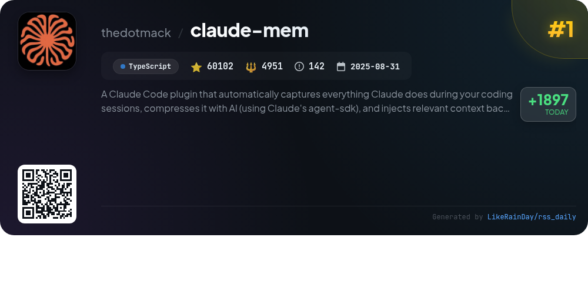
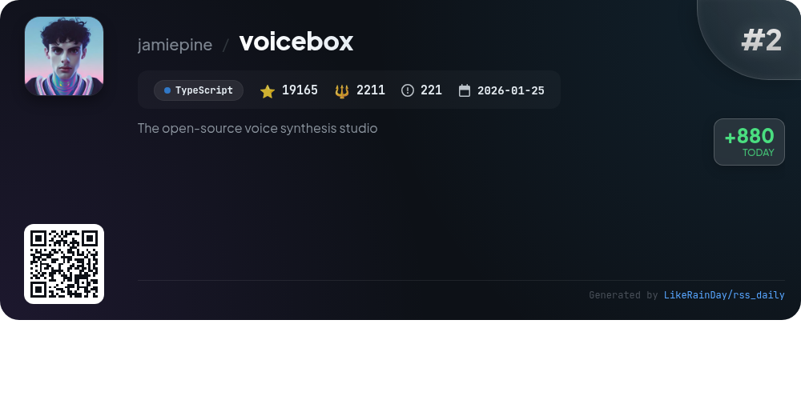
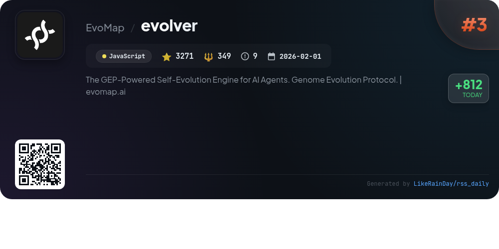
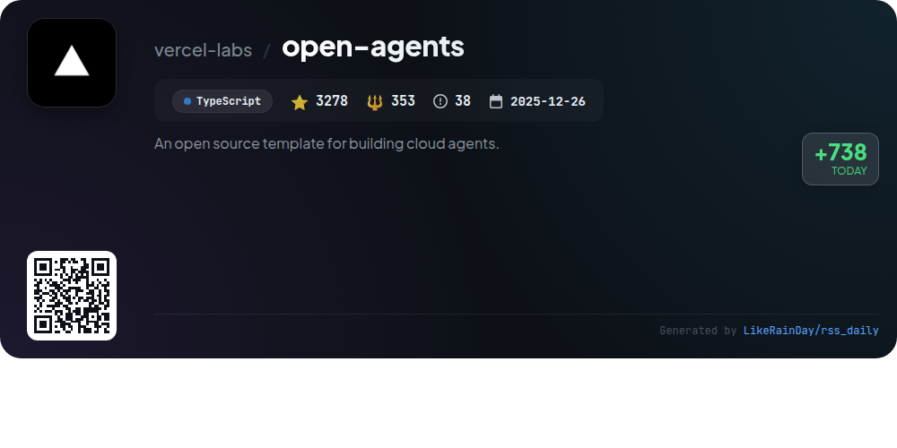
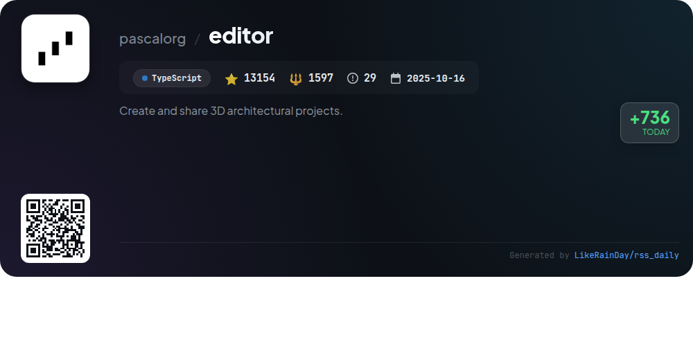
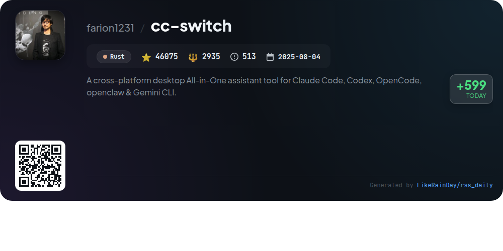
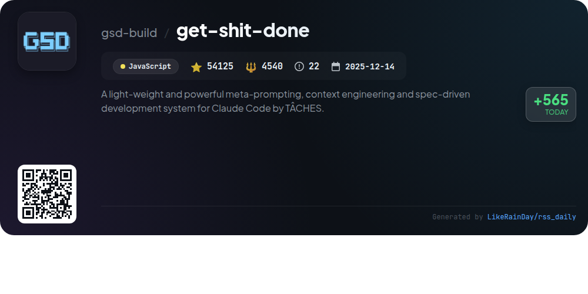
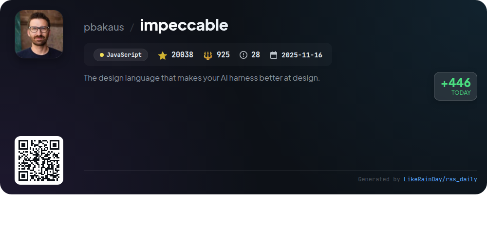
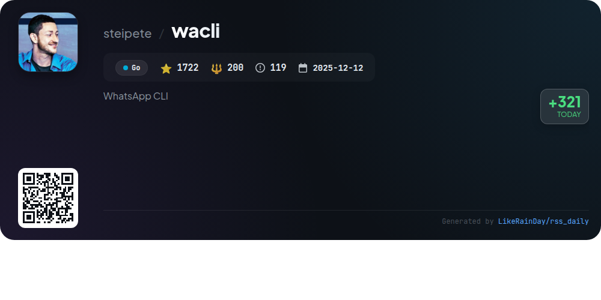

# 📊 🌟 GitHub Trending Daily - 2026-04-17

> > 📅 每日精选 GitHub 热门仓库 | 基于智能算法推荐

## 📋 Overview

**10** 个项目 | **254894** ⭐ | **19298** 🍴

**热门语言:** `TypeScript` (4) · `JavaScript` (3) · `Rust` (2)

**更新时间:** 2026-04-17 03:27 UTC

**分类分布:**

- 🌟 每日 Top 10 精选 (10 项)

---

## 🌟 每日 Top 10 精选

### 1. [claude-mem](https://github.com/thedotmack/claude-mem)

> 🤖 **推荐理由**  
> *Claude-Mem is a powerful plugin for Claude Code, enabling persistent memory across coding sessions. It automatically captures and compresses coding activities using AI, ensuring continuity and context in future sessions. Key features include progressive memory retrieval, skill-based search, real-time memory streaming, and privacy controls for sensitive content. Installation is straightforward, with support for various IDEs and a web UI for interaction. Designed for seamless integration, Claude-Mem enhances productivity by providing contextual insights and easy access to project history.*

- ⭐ 60102 stars
- 💻 TypeScript
- 📅 Updated: 2026-04-17

### 2. [voicebox](https://github.com/jamiepine/voicebox)

> 🤖 **推荐理由**  
> *Voicebox is an open-source voice synthesis studio that allows users to clone voices, generate speech in 23 languages, and apply audio effects, all running locally on their machines. Key features include five TTS engines, a multi-track timeline editor for projects, expressive speech capabilities with paralinguistic tags, and extensive post-processing effects. Voicebox emphasizes privacy, ensuring all models and data remain on the user's device. It also offers a REST API for integration into custom applications, making it suitable for diverse use cases like podcasts, game dialogue, and accessibility tools.*

- ⭐ 19165 stars
- 💻 TypeScript
- 📅 Updated: 2026-04-17

### 3. [evolver](https://github.com/EvoMap/evolver)

> 🤖 **推荐理由**  
> *Evolver is a GEP-powered self-evolution engine for AI agents, enabling efficient evolution through auditable, reusable assets. It analyzes runtime logs to generate protocol-bound prompts for guided evolution, enhancing scalability and collaboration within the EvoMap network. Key features include auto-log analysis, self-repair guidance, and customizable evolution strategies. Users can operate offline or connect to the EvoMap Hub for additional services like skill sharing and task execution. Ideal for teams managing complex AI prompts, Evolver emphasizes safety and traceability in evolution processes.*

- ⭐ 3271 stars
- 💻 JavaScript
- 📅 Updated: 2026-04-17

### 4. [open-agents](https://github.com/vercel-labs/open-agents)

> 🤖 **推荐理由**  
> *Open Agents is an open-source template for building cloud coding agents, featuring a three-layer architecture: a web UI for user interactions, an agent workflow for durable execution, and a sandbox for code execution. Key capabilities include chat-driven coding, isolated Vercel sandboxes, automated GitHub integration for repo management, and multi-step execution with streaming. The project emphasizes a modular design, allowing developers to adapt and extend functionalities. With over 3,278 stars, it offers a robust foundation for creating advanced coding agents on Vercel.*

- ⭐ 3278 stars
- 💻 TypeScript
- 📅 Updated: 2026-04-17

### 5. [editor](https://github.com/pascalorg/editor)

> 🤖 **推荐理由**  
> *Pascal Editor is a powerful 3D architectural project editor built with React Three Fiber and WebGPU, enabling users to create and share detailed building designs. It features a modular architecture with three main packages: @pascal-app/core for state management and schema definitions, @pascal-app/viewer for 3D rendering, and apps/editor for UI tools. Key functionalities include an interactive toolset for drawing walls and placing items, an efficient state management system with undo/redo capabilities, and a spatial grid manager for accurate object placement. The project has garnered 13,154 stars on GitHub, showcasing its popularity and utility.*

- ⭐ 13154 stars
- 💻 TypeScript
- 📅 Updated: 2026-04-17

### 6. [cc-switch](https://github.com/farion1231/cc-switch)

> 🤖 **推荐理由**  
> *CC Switch is a cross-platform desktop assistant for managing five AI CLI tools: Claude Code, Codex, Gemini CLI, OpenCode, and OpenClaw. With over 46,000 stars on GitHub, it offers a unified interface for provider management, eliminating the need for manual configuration edits. Key features include 50+ built-in provider presets, cloud sync, system tray quick switching, and a unified MCP and Skills management panel. Built with Rust and Tauri, CC Switch ensures data integrity through SQLite and provides utilities for seamless user experience.*

- ⭐ 46075 stars
- 💻 Rust
- 📅 Updated: 2026-04-17

### 7. [get-shit-done](https://github.com/gsd-build/get-shit-done)

> 🤖 **推荐理由**  
> *Get Shit Done (GSD) is a powerful meta-prompting and context engineering system designed for Claude Code and various other AI coding assistants. With over 54,000 stars on GitHub, it effectively combats context rot, ensuring high-quality outputs. Key features include project initialization, multi-agent orchestration, automatic verification, and seamless integration with tools like OpenCode and Codex. GSD supports TDD workflows, knowledge graph integration, and offers atomic Git commits for traceability. It simplifies the development process, enabling users to focus on building rather than managing complexity.*

- ⭐ 54125 stars
- 💻 JavaScript
- 📅 Updated: 2026-04-17

### 8. [impeccable](https://github.com/pbakaus/impeccable)

> 🤖 **推荐理由**  
> *Impeccable is a powerful design language tool for enhancing AI-driven frontend design, boasting over 20,000 stars on GitHub. It features an expanded skill with 7 domain-specific references, 18 steering commands for auditing, critiquing, and polishing designs, and curated anti-patterns to avoid common design mistakes. Users can quickly start by downloading bundles from impeccable.style. It supports various AI harnesses like Cursor and Codex, making it versatile for developers seeking to elevate their UI/UX design quality.*

- ⭐ 20038 stars
- 💻 JavaScript
- 📅 Updated: 2026-04-17

### 9. [sniffnet](https://github.com/GyulyVGC/sniffnet)

> 🤖 **推荐理由**  
> *Comfortably monitor your Internet traffic 🕵️‍♂️. popular project, actively maintained, recently updated*

- ⭐ 33964 stars
- 🍴 1237 forks
- 💻 Rust
- 📅 Updated: 2026-04-17

### 10. [wacli](https://github.com/steipete/wacli)

> 🤖 **推荐理由**  
> *wacli is a powerful WhatsApp CLI tool built in Go, enabling local message history sync, fast offline search, and message sending. Key features include contact and group management, interactive authentication with QR code support, and a best-effort approach for backfilling message history. Users can send texts and files, manage groups, and perform diagnostics with clear commands. The project is open-source and leverages the WhatsApp Web protocol via `whatsmeow`, ensuring a robust experience while remaining independent of WhatsApp.*

- ⭐ 1722 stars
- 💻 Go
- 📅 Updated: 2026-04-17

---

## 📡 RSS订阅

通过 RSS 订阅，第一时间获取每日精选项目：

- 🔔 [RSS 订阅源] (../../daily-top.xml)
- 🔔 [每日简报] (../../GITHUB_TODAY_CN.md)
- 🔔 [每日 Top 10 精选](../../daily-top.xml)

---

*⚡ Powered by Smart Trending Algorithm | Generated at 2026-04-17 03:27:14 UTC
