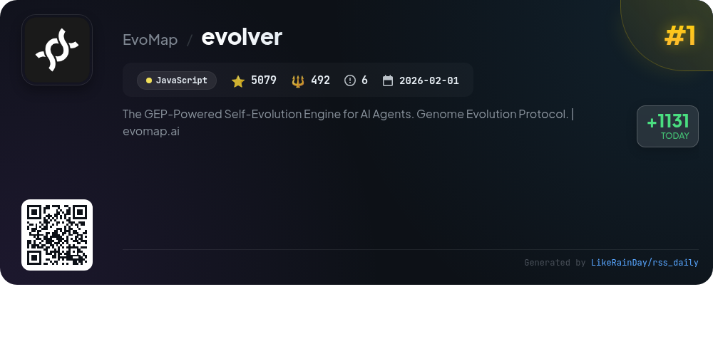
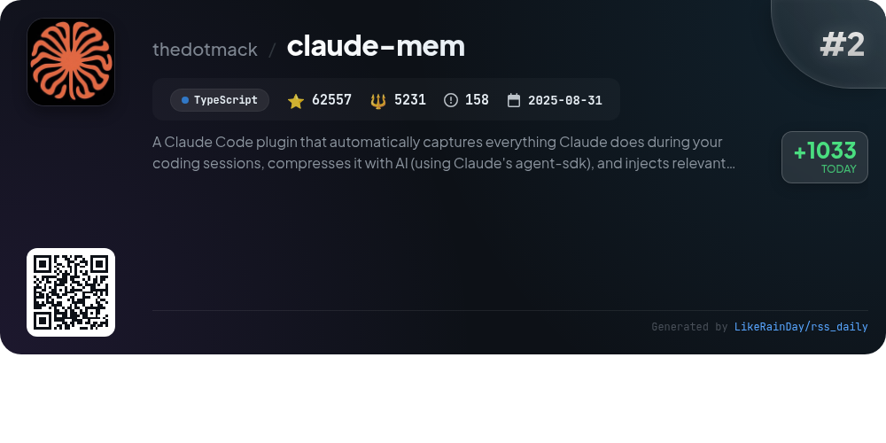
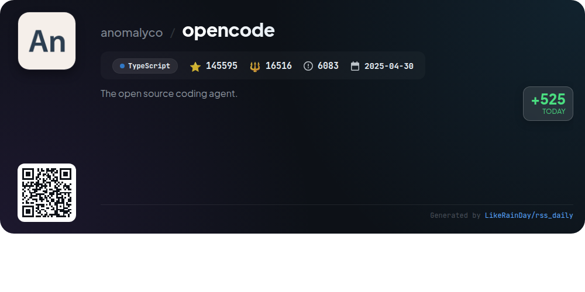
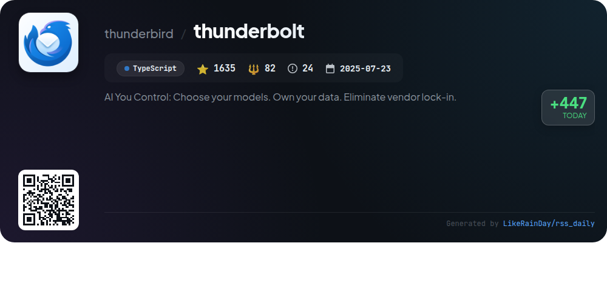
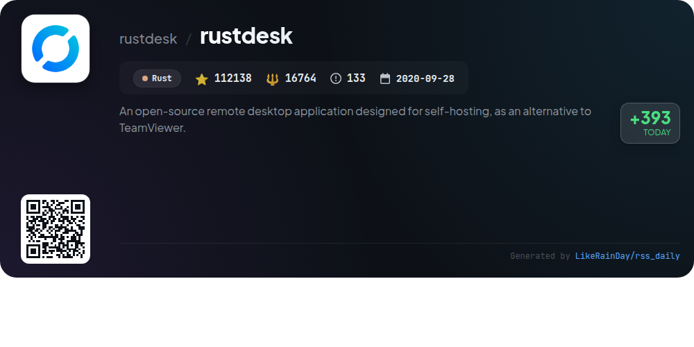
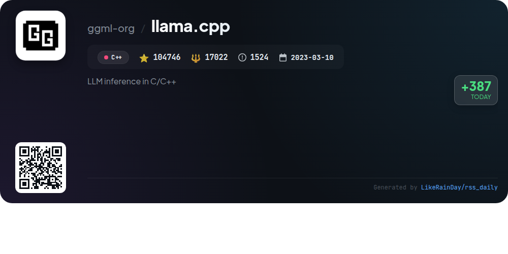
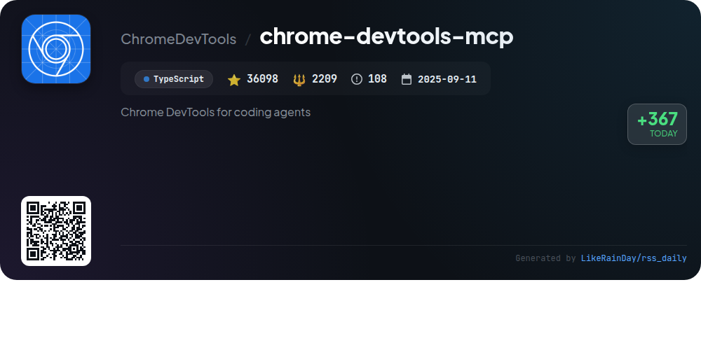
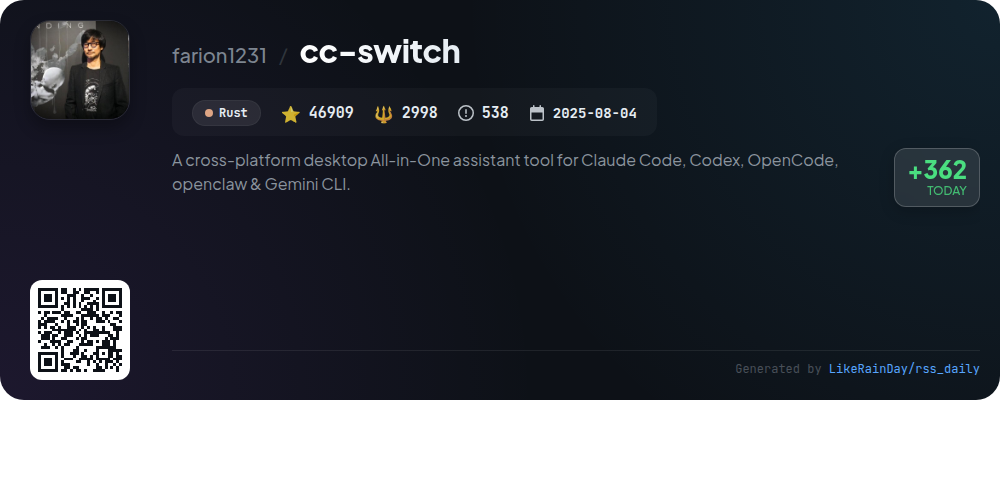
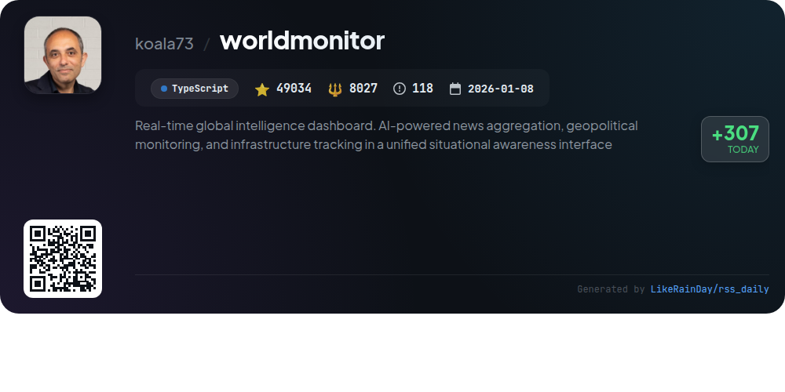

# 📊 🌟 GitHub Trending Daily - 2026-04-19

> > 📅 每日精选 GitHub 热门仓库 | 基于智能算法推荐

## 📋 Overview

**10** 个项目 | **584417** ⭐ | **71702** 🍴

**热门语言:** `TypeScript` (6) · `Rust` (2) · `JavaScript` (1)

**更新时间:** 2026-04-19 03:34 UTC

**分类分布:**

- 🌟 每日 Top 10 精选 (10 项)

---

## 🌟 每日 Top 10 精选

### 1. [evolver](https://github.com/EvoMap/evolver)

> 🤖 **推荐理由**  
> *Evolver is a GEP-powered self-evolution engine for AI agents, enabling auditable and reusable evolution assets. Key features include auto-log analysis, self-repair guidance, and protocol-bound evolution through configurable strategies. It integrates seamlessly with major agent runtimes and offers a Skill Store for sharing reusable skills. Evolver operates offline, allowing for secure evolution management, while optional connection to the EvoMap network enhances collaboration and skill sharing. With 5,079 stars on GitHub, it is a leading solution for scalable agent evolution.*

- ⭐ 5079 stars
- 💻 JavaScript
- 📅 Updated: 2026-04-19

### 2. [claude-mem](https://github.com/thedotmack/claude-mem)

> 🤖 **推荐理由**  
> *Claude-Mem is an advanced plugin for Claude Code that enhances coding sessions by automatically capturing and compressing context from past interactions. Key features include persistent memory, enabling continuity across sessions, a semantic search tool for project history, and a web viewer for real-time insights. It supports multiple languages and offers privacy controls for sensitive content. With its automatic operation and integration capabilities, Claude-Mem streamlines coding workflows and optimizes context management, making it an essential tool for developers.*

- ⭐ 62557 stars
- 💻 TypeScript
- 📅 Updated: 2026-04-19

### 3. [voicebox](https://github.com/jamiepine/voicebox)

> 🤖 **推荐理由**  
> *Voicebox is an open-source voice synthesis studio that enables users to clone voices, generate speech, and apply effects—all locally on your device. Key features include five TTS engines supporting 23 languages, expressive speech with paralinguistic tags, unlimited generation length via auto-chunking, and a multi-voice timeline editor for projects. It offers complete privacy, post-processing audio effects, an API for integration, and runs on macOS, Windows, and Linux. With over 20,600 stars on GitHub, Voicebox is a powerful tool for creating voice-powered applications.*

- ⭐ 20626 stars
- 💻 TypeScript
- 📅 Updated: 2026-04-19

### 4. [opencode](https://github.com/anomalyco/opencode)

> 🤖 **推荐理由**  
> *OpenCode is an open-source AI coding agent built with TypeScript, boasting 145,595 stars on GitHub. It features two built-in agents: the full-access "build" agent for development and the read-only "plan" agent for code exploration. OpenCode supports multiple installation methods across platforms, including a desktop app in beta. Notably, it is provider-agnostic, allowing users to integrate various AI models. Its terminal user interface (TUI) is optimized for neovim users, enhancing coding efficiency. For more details, visit opencode.ai.*

- ⭐ 145595 stars
- 💻 TypeScript
- 📅 Updated: 2026-04-19

### 5. [thunderbolt](https://github.com/thunderbird/thunderbolt)

> 🤖 **推荐理由**  
> *Thunderbolt is an open-source AI client designed for enterprise use, enabling users to select models, maintain data ownership, and avoid vendor lock-in. It supports deployment on various platforms, including web, iOS, Android, Mac, Linux, and Windows. Key features include compatibility with local and on-prem models, enterprise support, and a focus on security and active development. Users can self-host via Docker and integrate with model providers like Ollama or OpenAI-compatible APIs. Thunderbolt is geared towards privacy-conscious users seeking customizable AI solutions.*

- ⭐ 1635 stars
- 💻 TypeScript
- 📅 Updated: 2026-04-19

### 6. [rustdesk](https://github.com/rustdesk/rustdesk)

> 🤖 **推荐理由**  
> *RustDesk is an open-source remote desktop application built in Rust, designed for self-hosting as an alternative to TeamViewer. It offers out-of-the-box functionality with no configuration required, ensuring complete control over data and security. Key features include support for file transfer, audio, clipboard sharing, and customizable rendezvous/relay server options. With over 112,000 stars on GitHub, RustDesk supports multiple languages and encourages community contributions. It is suitable for both personal and professional use, providing a reliable and secure remote access solution.*

- ⭐ 112138 stars
- 💻 Rust
- 📅 Updated: 2026-04-19

### 7. [llama.cpp](https://github.com/ggml-org/llama.cpp)

> 🤖 **推荐理由**  
> *llama.cpp is a high-performance library for large language model (LLM) inference written in C/C++, boasting over 104,000 stars on GitHub. Core features include minimal dependency requirements, optimized performance on various hardware (Apple Silicon, x86, RISC-V), and support for multiple quantization formats. It offers a CLI tool, `llama-cli`, for easy model interaction, and a `llama-server` that mimics OpenAI's API for serving models over HTTP. Additionally, it supports multimodal tasks, various backends, and extensive model compatibility, including integrations with Hugging Face and several programming language bindings.*

- ⭐ 104746 stars
- 💻 C++
- 📅 Updated: 2026-04-19

### 8. [chrome-devtools-mcp](https://github.com/ChromeDevTools/chrome-devtools-mcp)

> 🤖 **推荐理由**  
> *Chrome DevTools for Agents (`chrome-devtools-mcp`) is a TypeScript-based tool enabling coding agents like Gemini and Copilot to control and inspect a live Chrome browser. With over 36,000 stars on GitHub, it serves as a Model-Context-Protocol (MCP) server, facilitating reliable automation, in-depth debugging, and performance analysis. Key features include performance insights, advanced debugging tools, and automation capabilities via Puppeteer. The tool also supports a CLI for streamlined usage. It ensures secure handling of sensitive data and offers extensive configuration options for optimal integration.*

- ⭐ 36098 stars
- 💻 TypeScript
- 📅 Updated: 2026-04-19

### 9. [cc-switch](https://github.com/farion1231/cc-switch)

> 🤖 **推荐理由**  
> *CC Switch is a cross-platform desktop assistant tool designed for managing multiple CLI tools, including Claude Code, Codex, Gemini CLI, OpenCode, and OpenClaw. It features a user-friendly interface for seamless switching between over 50 provider presets, eliminating manual configuration edits. Key highlights include unified MCP and Skills management, cloud sync capabilities, and a system tray for quick access. Built with Rust and Tauri, CC Switch offers robust performance across Windows, macOS, and Linux, ensuring an efficient coding experience with enhanced productivity.*

- ⭐ 46909 stars
- 💻 Rust
- 📅 Updated: 2026-04-19

### 10. [worldmonitor](https://github.com/koala73/worldmonitor)

> 🤖 **推荐理由**  
> *World Monitor is a real-time global intelligence dashboard that integrates AI-powered news aggregation, geopolitical monitoring, and infrastructure tracking into a single interface. With over 435 curated news feeds across 15 categories, it features a dual map engine with a 3D globe and flat map, cross-stream correlation for military and economic signals, and a comprehensive Country Intelligence Index. The platform supports multiple languages and offers native desktop applications for macOS, Windows, and Linux. Its modular architecture allows for various site variants, making it versatile for different user needs.*

- ⭐ 49034 stars
- 💻 TypeScript
- 📅 Updated: 2026-04-19

---

## 📡 RSS订阅

通过 RSS 订阅，第一时间获取每日精选项目：

- 🔔 [RSS 订阅源] (../../daily-top.xml)
- 🔔 [每日简报] (../../GITHUB_TODAY_CN.md)
- 🔔 [每日 Top 10 精选](../../daily-top.xml)

---

*⚡ Powered by Smart Trending Algorithm | Generated at 2026-04-19 03:34:00 UTC
