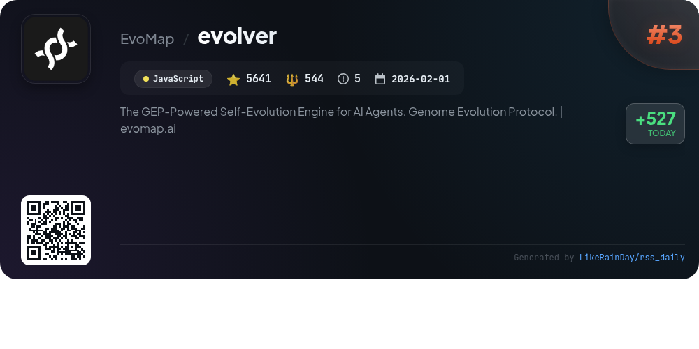
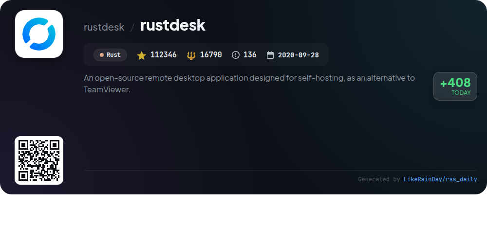
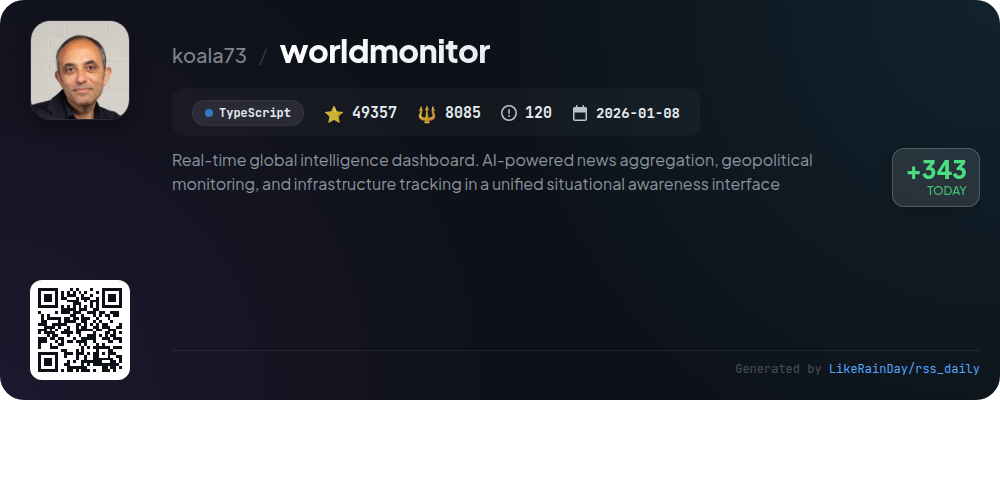
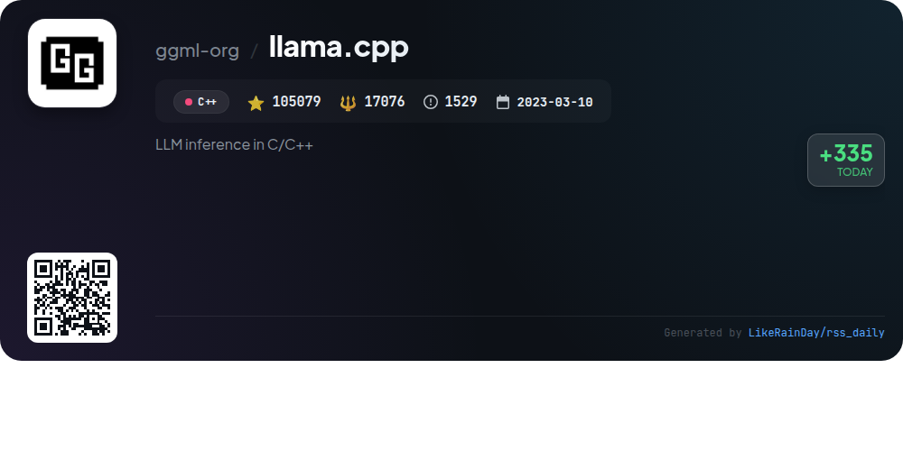
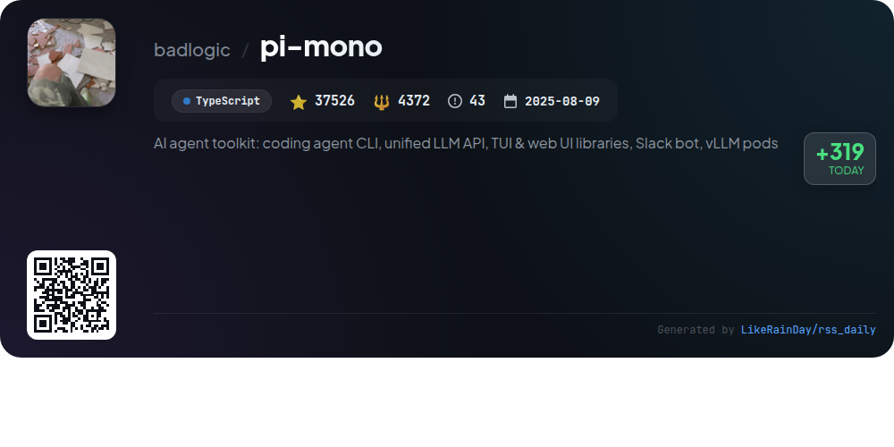
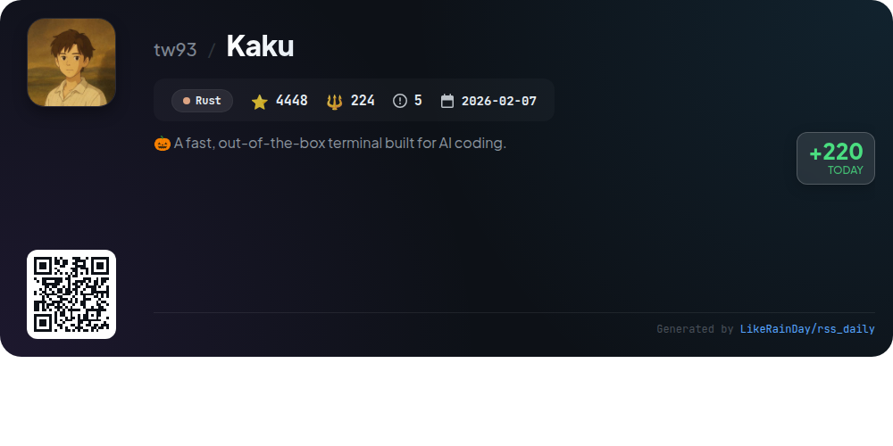
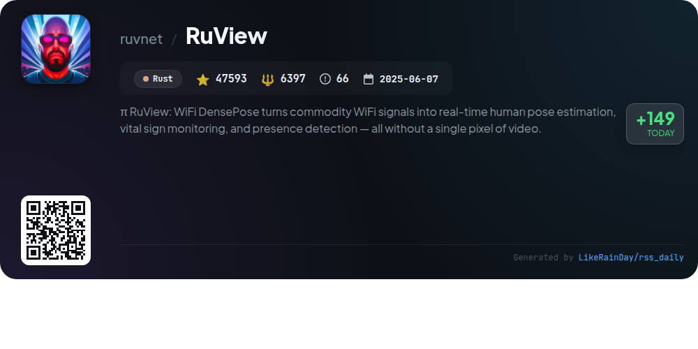

# 📊 🌟 GitHub Trending Daily - 2026-04-20

> > 📅 Daily Picks of GitHub Trending Repositories | Powered by Smart Algorithms

## 📋 Overview

**10** Projects | **394115** ⭐ | **56682** 🍴

**Top Languages:** `TypeScript` (5) · `Rust` (3) · `JavaScript` (1)

**Updated:** 2026-04-20 03:36 UTC

**Categories:**

- 🌟 Daily Top 10 (10 items)

---

## 🌟 Daily Top 10

### 1. [thunderbolt](https://github.com/thunderbird/thunderbolt)

> 🤖 **Why Recommend**  
> *Thunderbolt is an open-source AI client designed for enterprise use, allowing users to choose their models, own their data, and avoid vendor lock-in. It supports deployment on major platforms (web, iOS, Android, Mac, Linux, and Windows) and is compatible with local and on-prem models. Key features include enterprise support, self-hosting capabilities via Docker, and integration with various model providers. Currently under active development and security audit, Thunderbolt is ideal for enterprises seeking customizable AI solutions.*

- ⭐ 2304 stars
- 💻 TypeScript
- 📅 Updated: 2026-04-20

### 2. [voicebox](https://github.com/jamiepine/voicebox)

> 🤖 **Why Recommend**  
> *Voicebox is an open-source voice synthesis studio that enables users to clone voices, generate speech in 23 languages, and apply audio effects—all locally on their machines. Key features include seven TTS engines, zero-shot voice cloning, a multi-track timeline editor for projects, and extensive post-processing options. With a focus on privacy, all models and data remain on-device. Voicebox supports API integration for custom applications and offers seamless performance across multiple platforms, including macOS, Windows, and Linux.*

- ⭐ 21272 stars
- 💻 TypeScript
- 📅 Updated: 2026-04-20

### 3. [evolver](https://github.com/EvoMap/evolver)

> 🤖 **Why Recommend**  
> *Evolver is a GEP-powered self-evolution engine for AI agents that transforms ad hoc prompt tweaks into reusable, auditable evolution assets. With features like auto-log analysis, self-repair guidance, and protocol-bound evolution, it enables teams to maintain agent prompts at scale. Evolver integrates seamlessly with platforms like OpenClaw and offers a skill store for sharing reusable skills. Key highlights include configurable evolution strategies, a decentralized validator role, and robust security measures, making it ideal for environments needing deterministic changes. Explore more at evomap.ai.*

- ⭐ 5641 stars
- 💻 JavaScript
- 📅 Updated: 2026-04-20

### 4. [rustdesk](https://github.com/rustdesk/rustdesk)

> 🤖 **Why Recommend**  
> *RustDesk is an open-source remote desktop application built in Rust, offering a self-hosted alternative to TeamViewer. With over 112,000 stars on GitHub, it prioritizes user data security and ease of use, requiring no configuration for setup. Key features include a rendezvous/relay server, customizable server options, and robust file transfer capabilities. RustDesk supports multiple languages and encourages community contributions. It provides comprehensive documentation for building from source, using Docker, and accessing its various services, ensuring a flexible and user-friendly experience.*

- ⭐ 112346 stars
- 💻 Rust
- 📅 Updated: 2026-04-20

### 5. [worldmonitor](https://github.com/koala73/worldmonitor)

> 🤖 **Why Recommend**  
> *World Monitor is a real-time global intelligence dashboard offering AI-powered news aggregation, geopolitical monitoring, and infrastructure tracking. Key features include over 435 curated news feeds across 15 categories, dual map engines (3D globe and WebGL), and cross-stream correlation for comprehensive situational awareness. It provides a Country Intelligence Index, finance radar tracking 92 stock exchanges, and native desktop apps for macOS, Windows, and Linux. With support for 21 languages and multiple site variants, World Monitor serves as a vital tool for informed decision-making.*

- ⭐ 49357 stars
- 💻 TypeScript
- 📅 Updated: 2026-04-20

### 6. [llama.cpp](https://github.com/ggml-org/llama.cpp)

> 🤖 **Why Recommend**  
> *llama.cpp is a high-performance library for large language model (LLM) inference in C/C++, boasting over 105,000 stars on GitHub. Key features include dependency-free implementation, extensive hardware optimization (Apple Silicon, AVX, RISC-V), and various quantization options for faster inference. It supports multiple model formats, including Hugging Face integration for easy model management. The project also offers a command-line interface, a REST API server, and tools for model benchmarking and perplexity measurement, making it a comprehensive solution for developers working with LLMs.*

- ⭐ 105079 stars
- 💻 C++
- 📅 Updated: 2026-04-20

### 7. [pi-mono](https://github.com/badlogic/pi-mono)

> 🤖 **Why Recommend**  
> *pi-mono is an AI agent toolkit designed for building and managing AI agents and LLM deployments. Key features include a unified LLM API for multiple providers, an interactive coding agent CLI, and libraries for terminal and web UIs. It also offers a Slack bot for message delegation and tools for managing vLLM deployments. With over 37,000 stars, pi-mono promotes open-source collaboration by enabling users to share coding sessions. The project is built in TypeScript and supports various AI applications, making it a valuable resource for developers.*

- ⭐ 37526 stars
- 💻 TypeScript
- 📅 Updated: 2026-04-20

### 8. [VidBee](https://github.com/nexmoe/VidBee)

> 🤖 **Why Recommend**  
> *VidBee is an open-source video downloader enabling users to download videos and audio from over 1000 websites worldwide, including YouTube, TikTok, and Instagram. Built with TypeScript and Electron, it features a user-friendly interface for easy management of downloads, including pause/resume options and real-time progress tracking. Unique to VidBee is the RSS auto-download function, which allows users to automatically subscribe to feeds and download new content from favorite creators seamlessly. The project supports Docker deployment and encourages community contributions.*

- ⭐ 8549 stars
- 💻 TypeScript
- 📅 Updated: 2026-04-20

### 9. [Kaku](https://github.com/tw93/Kaku)

> 🤖 **Why Recommend**  
> *Kaku is a fast, out-of-the-box terminal for AI coding, built as a customized fork of WezTerm. Key features include zero configuration setup, theme-aware modes, a curated shell suite with zsh plugins, and an AI assistant for error recovery and natural language command generation. Kaku is lightweight, with a 40% smaller binary and instant startup. It supports WezTerm's Lua config for seamless integration. Currently macOS-only, Kaku aims to enhance productivity for developers through optimized performance and practical defaults.*

- ⭐ 4448 stars
- 💻 Rust
- 📅 Updated: 2026-04-20

### 10. [RuView](https://github.com/ruvnet/RuView)

> 🤖 **Why Recommend**  
> *RuView is an innovative WiFi sensing platform that transforms commodity WiFi signals into real-time human pose estimation, vital sign monitoring, and presence detection, all without cameras or wearables. Key features include multi-person tracking, through-wall detection, and vital sign extraction (breathing and heart rate). The system operates on low-cost ESP32 nodes, utilizing advanced techniques like spiking neural networks and edge intelligence for privacy and efficiency. With robust APIs and Docker support, RuView offers an accessible, powerful solution for diverse applications in healthcare, security, and smart environments.*

- ⭐ 47593 stars
- 💻 Rust
- 📅 Updated: 2026-04-20

---

## 📡 RSS Subscription

Subscribe via RSS to get daily trending updates:

- 🔔 [RSS XML] (../../daily-top.xml)
- 🔔 [Daily Report] (../../GITHUB_TODAY.md)
- 🔔 [Daily Top 10](../../daily-top.xml)

---

*⚡ Powered by Smart Trending Algorithm | Generated at 2026-04-20 03:36:13 UTC
