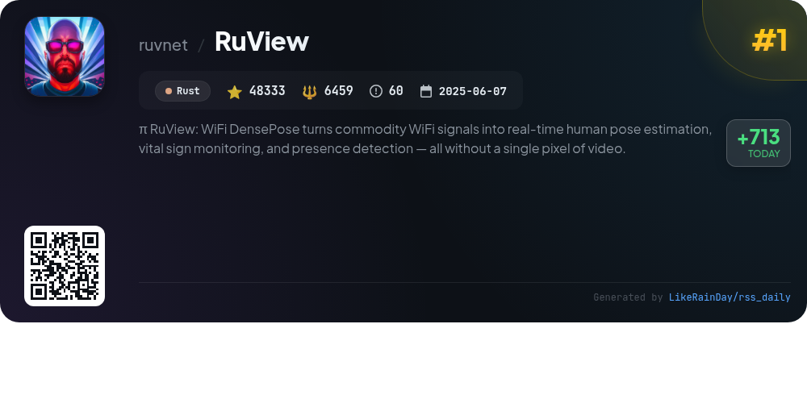
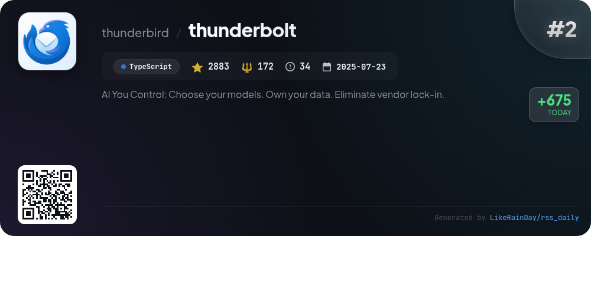
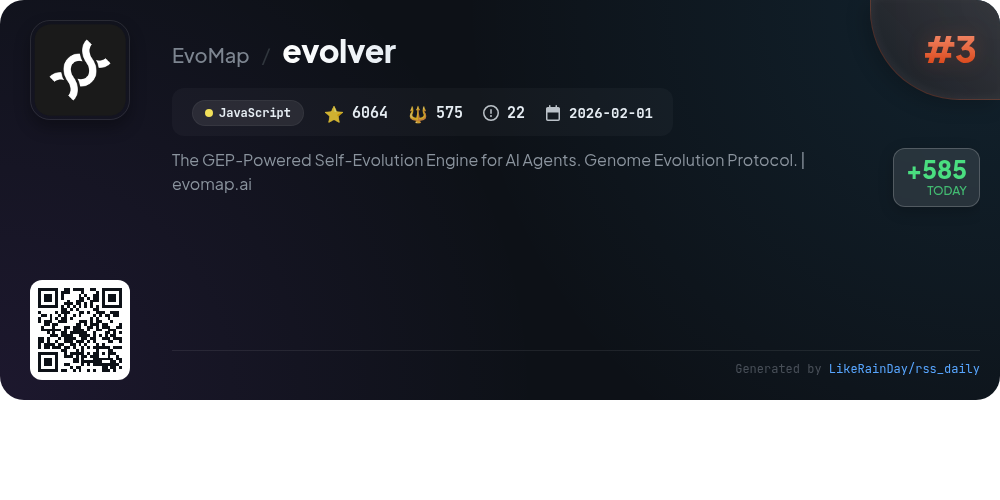
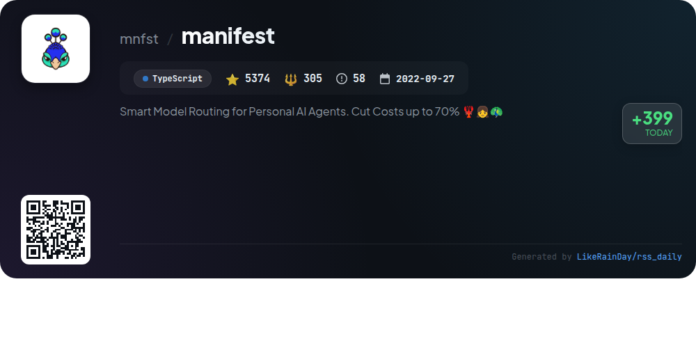
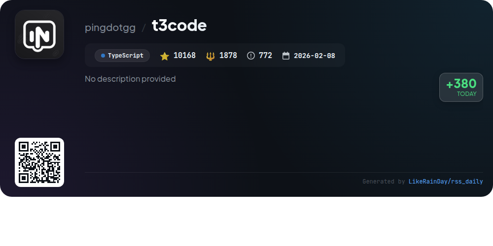
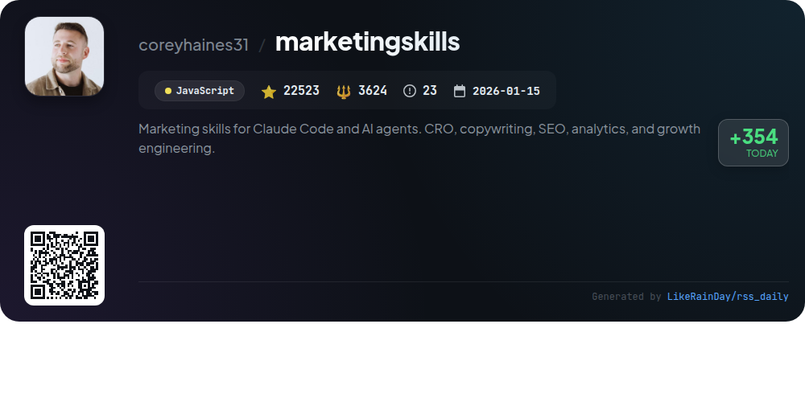
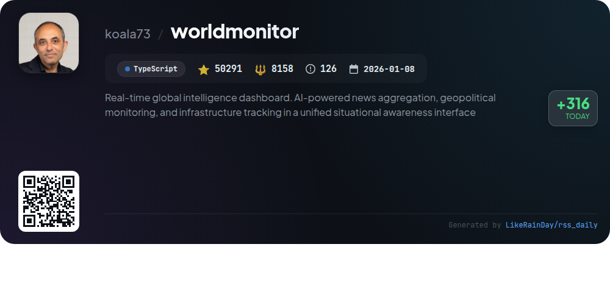
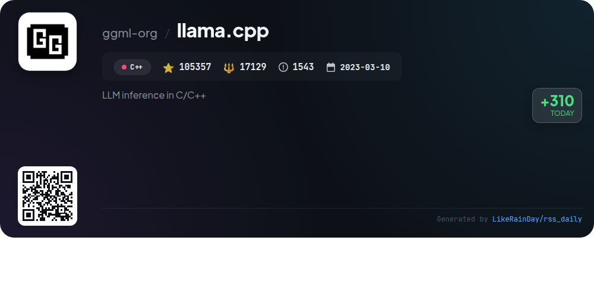
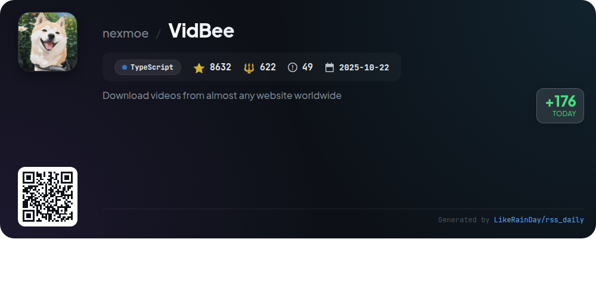
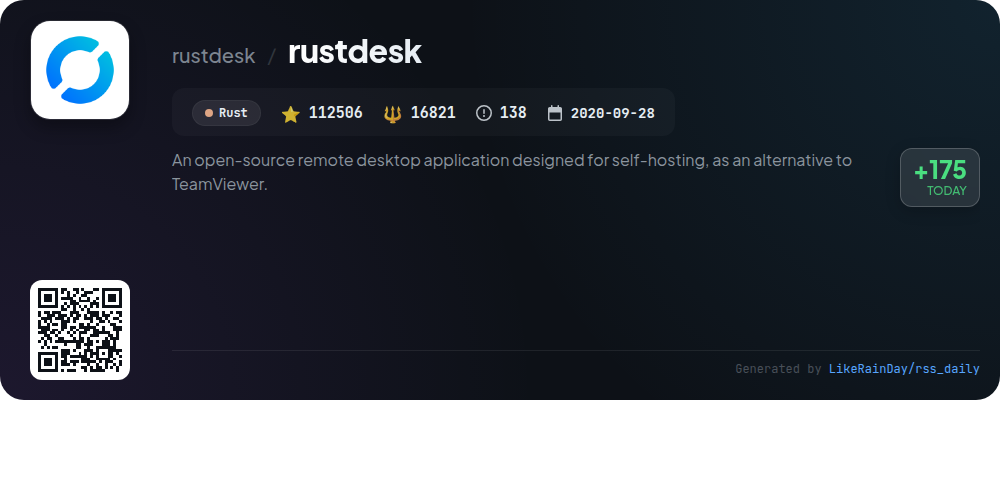

# 📊 🌟 GitHub Trending Daily - 2026-04-21

> > 📅 Daily Picks of GitHub Trending Repositories | Powered by Smart Algorithms

## 📋 Overview

**10** Projects | **372131** ⭐ | **55743** 🍴

**Top Languages:** `TypeScript` (5) · `Rust` (2) · `JavaScript` (2)

**Updated:** 2026-04-21 03:28 UTC

**Categories:**

- 🌟 Daily Top 10 (10 items)

---

## 🌟 Daily Top 10

### 1. [RuView](https://github.com/ruvnet/RuView)

> 🤖 **Why Recommend**  
> *RuView is a cutting-edge WiFi sensing platform that utilizes Channel State Information (CSI) to enable real-time human pose estimation, vital sign monitoring, and presence detection without cameras or wearables. Key features include the ability to detect multiple individuals through walls, monitor breathing and heart rates, and provide advanced activity recognition. Built on ESP32 nodes, RuView operates entirely on edge devices, ensuring privacy and low-cost implementation. It employs advanced AI techniques for self-learning and environment adaptation, making it applicable in healthcare, disaster response, and smart environments.*

- ⭐ 48333 stars
- 💻 Rust
- 📅 Updated: 2026-04-21

### 2. [thunderbolt](https://github.com/thunderbird/thunderbolt)

> 🤖 **Why Recommend**  
> *Thunderbolt is an open-source, cross-platform AI client designed for enterprise customers, enabling on-prem deployment while ensuring data ownership and model flexibility. Key features include compatibility with various AI models, support for major platforms (web, iOS, Android, Mac, Linux, Windows), and enterprise-grade functionalities. Currently in active development, Thunderbolt emphasizes security and user control, allowing self-hosting with Docker and integration with OpenAI-compatible models. The project encourages community contributions and ongoing engagement.*

- ⭐ 2883 stars
- 💻 TypeScript
- 📅 Updated: 2026-04-21

### 3. [evolver](https://github.com/EvoMap/evolver)

> 🤖 **Why Recommend**  
> *Evolver is a GEP-powered self-evolution engine for AI agents, enabling auditable and reusable evolution assets. With over 6,000 stars on GitHub, it simplifies the evolution process by analyzing logs, selecting optimal Genes or Capsules, and generating protocol-bound prompts. Key features include auto-log analysis, self-repair guidance, and integration with major agent runtimes. Evolver connects to the EvoMap network for enhanced capabilities like skill sharing and collaborative evolution. Users can run it offline or leverage network features for advanced functionalities.*

- ⭐ 6064 stars
- 💻 JavaScript
- 📅 Updated: 2026-04-21

### 4. [manifest](https://github.com/mnfst/manifest)

> 🤖 **Why Recommend**  
> *Smart Model Routing for Personal AI Agents. Cut Costs up to 70% 🦞👧🦚. popular project, actively maintained, recently updated*

- ⭐ 5374 stars
- 🍴 305 forks
- 💻 TypeScript
- 📅 Updated: 2026-04-21

### 5. [t3code](https://github.com/pingdotgg/t3code)

> 🤖 **Why Recommend**  
> *T3 Code is a minimal web GUI designed for coding agents, currently supporting Codex and Claude with plans for additional providers. Users can easily install and authenticate either service before use. The project offers a desktop application available on multiple platforms, including Windows, macOS, and Arch Linux. Although still in early development and prone to bugs, T3 Code aims to facilitate coding through intuitive interfaces. The community can access support via Discord and is encouraged to review contribution guidelines before participating.*

- ⭐ 10168 stars
- 💻 TypeScript
- 📅 Updated: 2026-04-21

### 6. [marketingskills](https://github.com/coreyhaines31/marketingskills)

> 🤖 **Why Recommend**  
> *The **marketingskills** project offers a comprehensive suite of AI agent skills designed for marketing tasks, including conversion optimization, copywriting, SEO, analytics, and growth engineering. Built for technical marketers and founders, it supports agents like Claude Code and OpenAI Codex. Key features include specialized markdown skills that enhance AI capabilities, a foundational product-marketing-context skill, and a wide array of marketing-focused skills for various tasks. Additionally, users can access hands-on services through Corey Haines' agency, Conversion Factory, and explore educational resources at Swipe Files. Contributions are encouraged to expand the skill set.*

- ⭐ 22523 stars
- 💻 JavaScript
- 📅 Updated: 2026-04-21

### 7. [worldmonitor](https://github.com/koala73/worldmonitor)

> 🤖 **Why Recommend**  
> *World Monitor is a real-time global intelligence dashboard featuring AI-powered news aggregation, geopolitical monitoring, and infrastructure tracking. Key features include over 500 curated news feeds, dual map engines for 3D and flat visuals, cross-stream correlation for military and economic data, and a comprehensive Country Intelligence Index. It offers five site variants, a native desktop app for multiple platforms, and supports 21 languages. Built with TypeScript, it aggregates data from 65+ sources, providing users with a unified situational awareness interface.*

- ⭐ 50291 stars
- 💻 TypeScript
- 📅 Updated: 2026-04-21

### 8. [llama.cpp](https://github.com/ggml-org/llama.cpp)

> 🤖 **Why Recommend**  
> *llama.cpp is a high-performance C/C++ library for large language model (LLM) inference, boasting over 105,000 stars on GitHub. It supports various architectures, including ARM, x86, and RISC-V, and enables efficient model execution with advanced quantization techniques. Key features include a lightweight OpenAI-compatible HTTP server, multimodal support, and bindings for multiple programming languages. Users can easily obtain and run models via the Hugging Face platform and utilize tools for model conversion, benchmarking, and perplexity measurement.*

- ⭐ 105357 stars
- 💻 C++
- 📅 Updated: 2026-04-21

### 9. [VidBee](https://github.com/nexmoe/VidBee)

> 🤖 **Why Recommend**  
> *VidBee is an open-source video downloader that enables users to download videos and audio from over 1000 websites globally, including YouTube, TikTok, and Instagram. Built with TypeScript and Electron, it features a user-friendly interface with real-time progress tracking, a download queue, and one-click operations. Notably, VidBee supports RSS auto-download, automatically fetching new content from subscribed feeds. It also offers a Docker-ready web and API structure for easy deployment. With over 8,600 stars, VidBee is actively developed and welcomes contributions.*

- ⭐ 8632 stars
- 💻 TypeScript
- 📅 Updated: 2026-04-21

### 10. [rustdesk](https://github.com/rustdesk/rustdesk)

> 🤖 **Why Recommend**  
> *RustDesk is an open-source remote desktop application built in Rust, designed for self-hosting as an alternative to TeamViewer. It offers out-of-the-box functionality, allowing users full control over their data and ensuring security. Key features include a rendezvous/relay server for seamless connections, comprehensive support for file transfer, and easy setup via Docker. With over 112,500 stars on GitHub, RustDesk supports multiple languages and encourages community contributions. It is a robust solution for secure remote access and collaboration.*

- ⭐ 112506 stars
- 💻 Rust
- 📅 Updated: 2026-04-21

---

## 📡 RSS Subscription

Subscribe via RSS to get daily trending updates:

- 🔔 [RSS XML] (../../daily-top.xml)
- 🔔 [Daily Report] (../../GITHUB_TODAY.md)
- 🔔 [Daily Top 10](../../daily-top.xml)

---

*⚡ Powered by Smart Trending Algorithm | Generated at 2026-04-21 03:28:22 UTC
