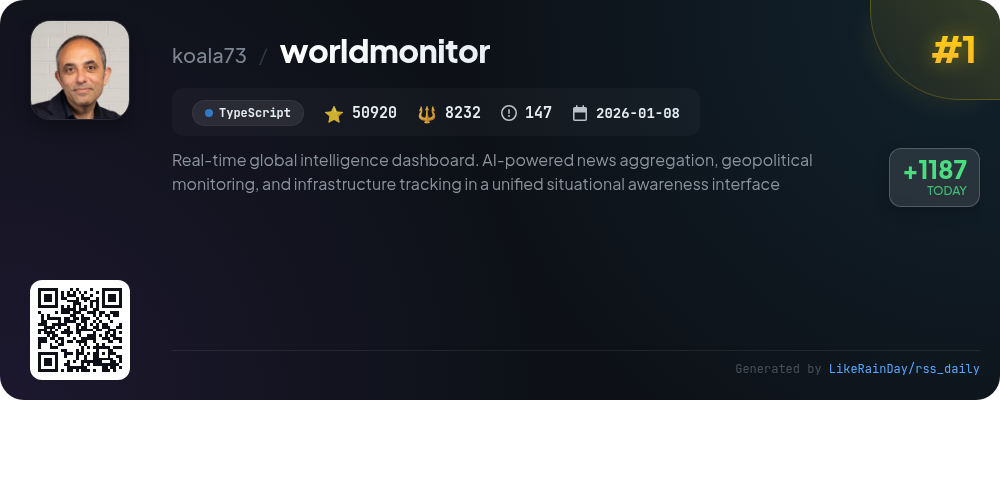
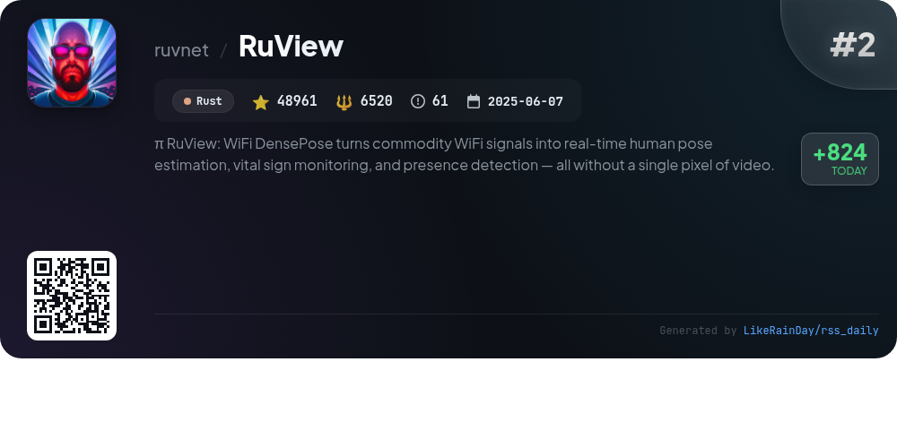
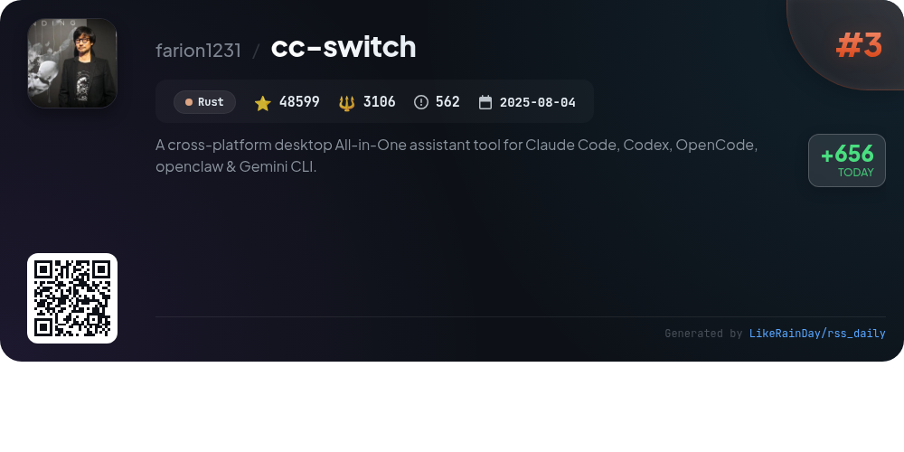
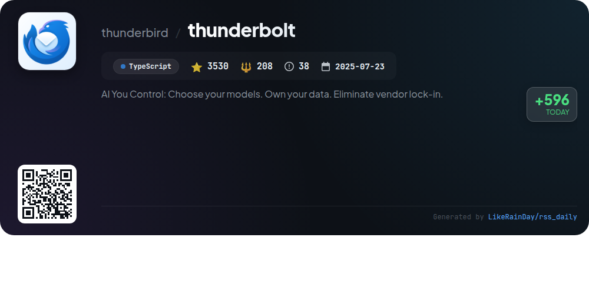
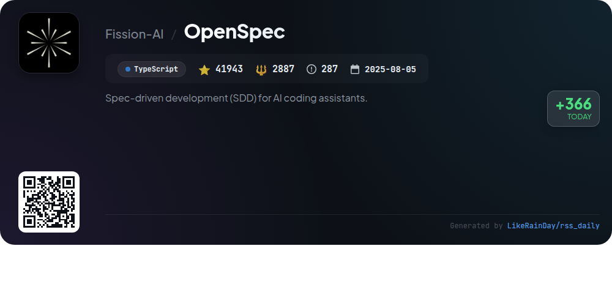
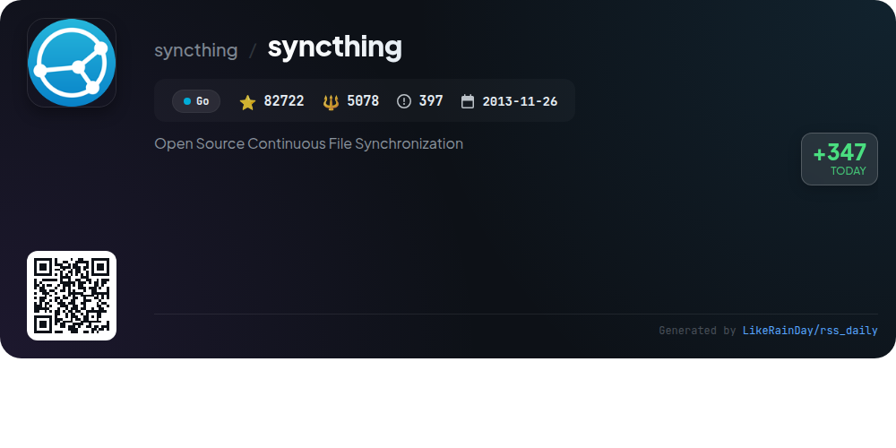
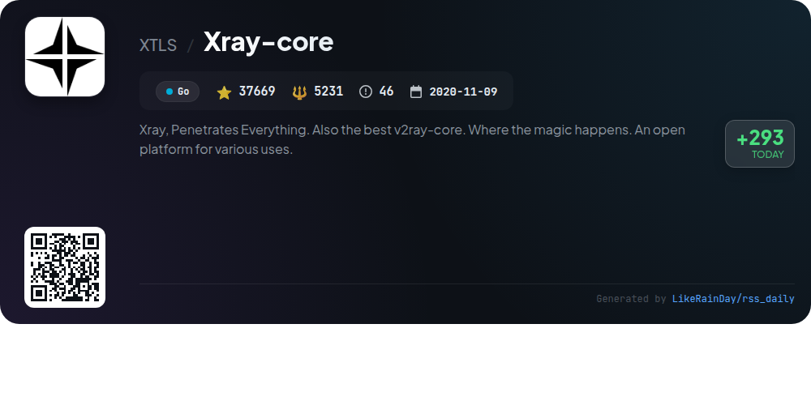
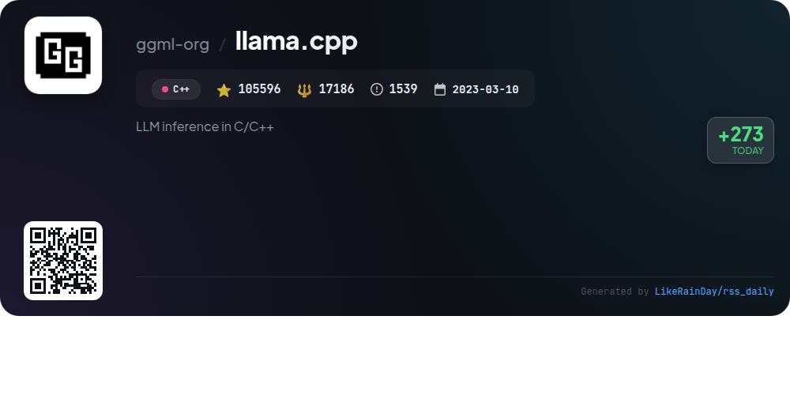
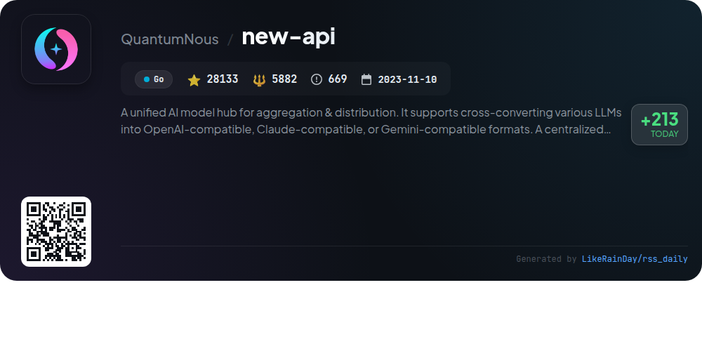
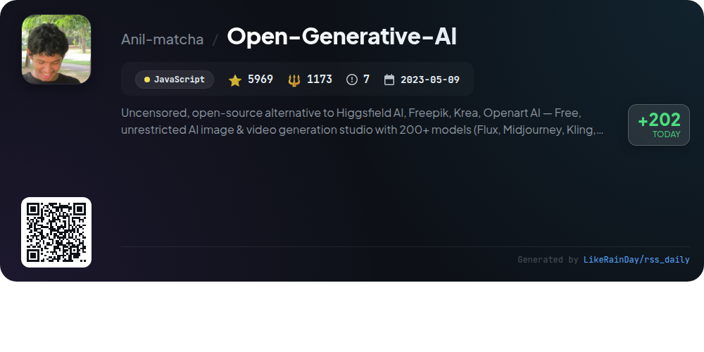

# 📊 🌟 GitHub Trending Daily - 2026-04-22

> > 📅 Daily Picks of GitHub Trending Repositories | Powered by Smart Algorithms

## 📋 Overview

**10** Projects | **454042** ⭐ | **55503** 🍴

**Top Languages:** `TypeScript` (3) · `Go` (3) · `Rust` (2)

**Updated:** 2026-04-22 03:26 UTC

**Categories:**

- 🌟 Daily Top 10 (10 items)

---

## 🌟 Daily Top 10

### 1. [worldmonitor](https://github.com/koala73/worldmonitor)

> 🤖 **Why Recommend**  
> *World Monitor is a real-time global intelligence dashboard featuring AI-powered news aggregation, geopolitical monitoring, and infrastructure tracking. Key features include over 500 curated news feeds, a dual map engine with 3D and flat maps, and a Country Intelligence Index for risk assessment. It supports 21 languages, offers five site variants, and provides a native desktop app for macOS, Windows, and Linux. The platform aggregates data from 65+ sources, ensuring comprehensive situational awareness. Ideal for personal, research, and educational use under AGPL-3.0.*

- ⭐ 50920 stars
- 💻 TypeScript
- 📅 Updated: 2026-04-22

### 2. [RuView](https://github.com/ruvnet/RuView)

> 🤖 **Why Recommend**  
> *RuView is a cutting-edge WiFi DensePose platform that transforms standard WiFi signals into real-time human pose estimation, vital sign monitoring, and presence detection—without any cameras. Key features include multi-person tracking, breathing and heart rate detection, and environment mapping, all achieved using low-cost ESP32 sensors. The system operates entirely on edge devices, ensuring privacy and instant response. With robust APIs, it supports various applications in healthcare, security, and smart environments. RuView is actively developed in Rust, boasting over 48,000 stars on GitHub.*

- ⭐ 48961 stars
- 💻 Rust
- 📅 Updated: 2026-04-22

### 3. [cc-switch](https://github.com/farion1231/cc-switch)

> 🤖 **Why Recommend**  
> *CC Switch is a versatile cross-platform desktop assistant for managing AI-powered coding tools like Claude Code, Codex, Gemini CLI, OpenCode, and OpenClaw. With over 48,500 stars on GitHub, this Rust-based application features a user-friendly interface for seamless provider switching, eliminating manual configuration edits. Key highlights include 50+ built-in provider presets, unified management for MCP and Skills, cloud sync capabilities, and a system tray for quick access. It supports Windows, macOS, and Linux, ensuring efficient AI service integration across devices.*

- ⭐ 48599 stars
- 💻 Rust
- 📅 Updated: 2026-04-22

### 4. [thunderbolt](https://github.com/thunderbird/thunderbolt)

> 🤖 **Why Recommend**  
> *Thunderbolt is an open-source AI client designed for enterprise use, enabling users to select their models, retain data ownership, and avoid vendor lock-in. It supports deployment across major platforms (web, iOS, Android, Mac, Linux, Windows) and is compatible with local and on-prem models. Key features include enterprise support, Docker deployment, and customization with model providers like Ollama. Currently in active development, Thunderbolt aims for offline-first capability and enhanced security. Contributions and community engagement are encouraged.*

- ⭐ 3530 stars
- 💻 TypeScript
- 📅 Updated: 2026-04-22

### 5. [OpenSpec](https://github.com/Fission-AI/OpenSpec)

> 🤖 **Why Recommend**  
> *OpenSpec is a spec-driven development framework designed for AI coding assistants, enabling structured collaboration between humans and AI. Key features include artifact-guided workflows for proposals, implementations, and archiving, ensuring clarity before coding begins. It supports over 20 AI tools through intuitive slash commands, promoting fluid and iterative development. OpenSpec is built for scalability, catering to both individual projects and enterprise environments. With over 41,000 stars, it emphasizes organization and predictability in AI-assisted coding, making it a preferred choice for developers.*

- ⭐ 41943 stars
- 💻 TypeScript
- 📅 Updated: 2026-04-22

### 6. [syncthing](https://github.com/syncthing/syncthing)

> 🤖 **Why Recommend**  
> *Syncthing is an open-source, continuous file synchronization tool designed for secure, automatic, and user-friendly file sharing across multiple devices. With over 82,000 stars on GitHub, it prioritizes data safety and security against unauthorized access. Key features include easy installation, cross-platform compatibility, automatic background operation, and a built-in upgrade mechanism. Users can run it via Docker and access a range of GUI implementations. Syncthing empowers individuals by providing a reliable solution for file synchronization without compromising privacy.*

- ⭐ 82722 stars
- 💻 Go
- 📅 Updated: 2026-04-22

### 7. [Xray-core](https://github.com/XTLS/Xray-core)

> 🤖 **Why Recommend**  
> *Xray-core is an advanced open-source platform based on the XTLS protocol, designed for versatile network applications. With over 37,000 stars on GitHub, it offers powerful tools for secure and efficient network traffic management, including support for VLESS, XTLS, and REALITY protocols. Key features include easy installation via scripts, Docker support, and a variety of GUI clients for multiple platforms. Additionally, Xray-core supports community contributions and is backed by a diverse ecosystem of related projects and tools, enhancing its functionality and usability.*

- ⭐ 37669 stars
- 💻 Go
- 📅 Updated: 2026-04-22

### 8. [llama.cpp](https://github.com/ggml-org/llama.cpp)

> 🤖 **Why Recommend**  
> *llama.cpp is a high-performance C/C++ library for large language model (LLM) inference, boasting over 105,000 stars on GitHub. Key features include dependency-free implementation, extensive hardware support (Apple Silicon, x86, RISC-V), and advanced quantization options for optimized inference. It offers an OpenAI-compatible API, a CLI for easy model interaction, and multimodal capabilities. Users can easily install it via package managers or Docker, and it supports various models from Hugging Face, enhancing accessibility for developers and researchers alike.*

- ⭐ 105596 stars
- 💻 C++
- 📅 Updated: 2026-04-22

### 9. [new-api](https://github.com/QuantumNous/new-api)

> 🤖 **Why Recommend**  
> *New API is a unified AI model hub enabling the aggregation and distribution of various LLMs in OpenAI, Claude, or Gemini formats. Key features include a modern UI, multi-language support, data compatibility with One API, and a visual data dashboard. It offers flexible billing options, OAuth integrations for security, and intelligent routing for model requests. The platform also supports format conversions between major LLMs and advanced functionalities such as permission management and statistical analysis. With over 28,000 stars, it serves both personal and enterprise needs in AI model management.*

- ⭐ 28133 stars
- 💻 Go
- 📅 Updated: 2026-04-22

### 10. [Open-Generative-AI](https://github.com/Anil-matcha/Open-Generative-AI)

> 🤖 **Why Recommend**  
> *Open-Generative-AI is an uncensored, open-source alternative to platforms like Higgsfield AI and Freepik, offering free AI image and video generation through 200+ models, including Flux and Midjourney. Key features include a user-friendly web interface with no content filters, self-hosting options, and extensive customization capabilities. The platform supports various modalities such as text-to-image, image-to-video, and lip sync generation. Users can also access a desktop app for macOS, Windows, and Linux, ensuring versatile use without subscription fees. Ideal for creative freedom and innovation.*

- ⭐ 5969 stars
- 💻 JavaScript
- 📅 Updated: 2026-04-22

---

## 📡 RSS Subscription

Subscribe via RSS to get daily trending updates:

- 🔔 [RSS XML] (../../daily-top.xml)
- 🔔 [Daily Report] (../../GITHUB_TODAY.md)
- 🔔 [Daily Top 10](../../daily-top.xml)

---

*⚡ Powered by Smart Trending Algorithm | Generated at 2026-04-22 03:26:46 UTC
