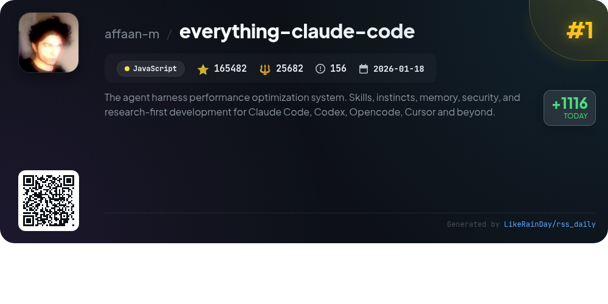
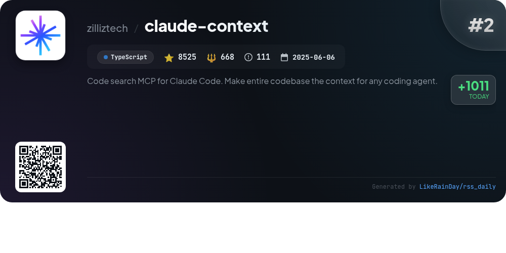
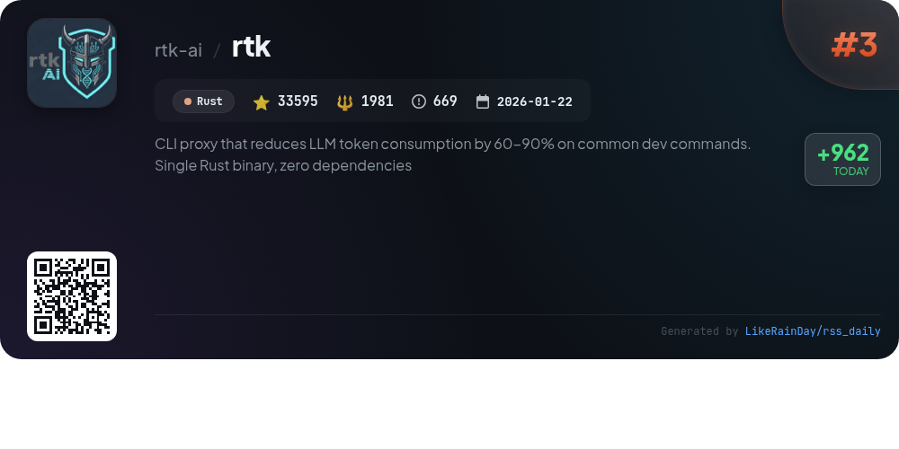
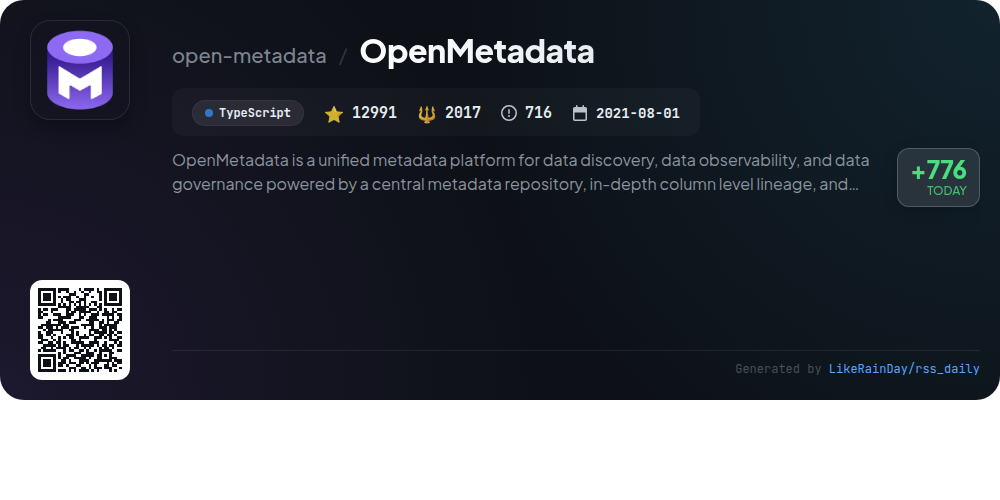
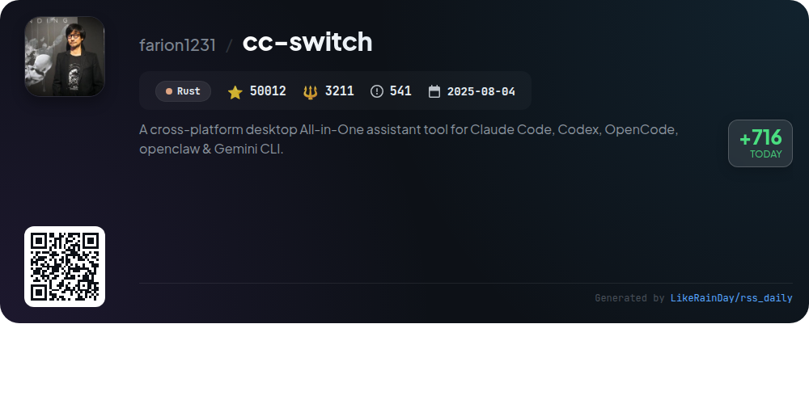
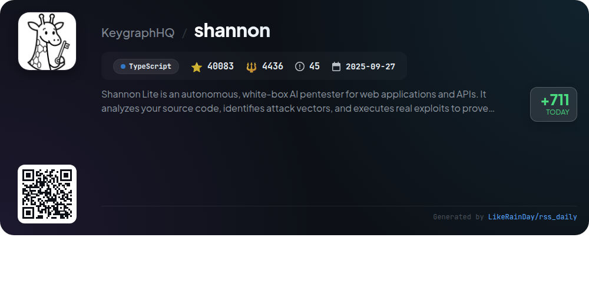
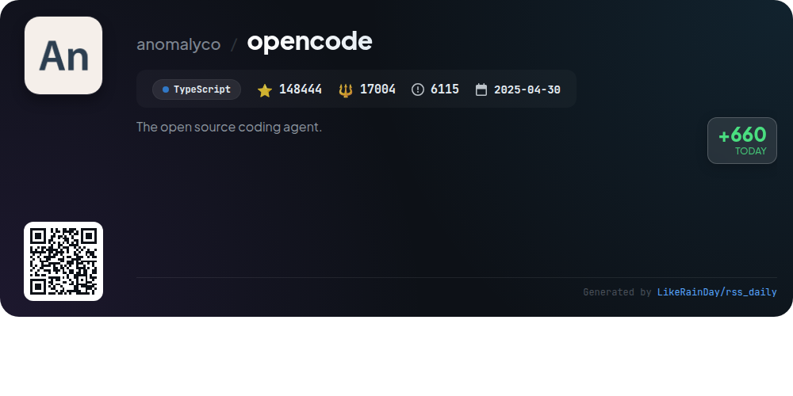
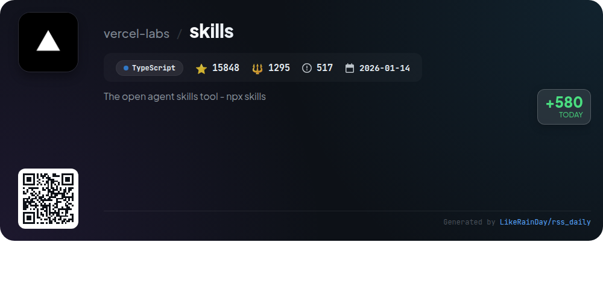
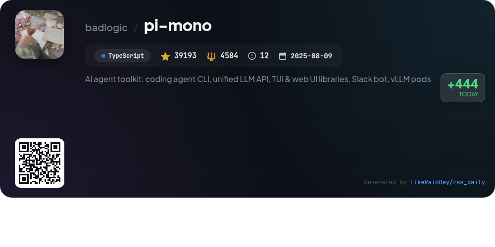
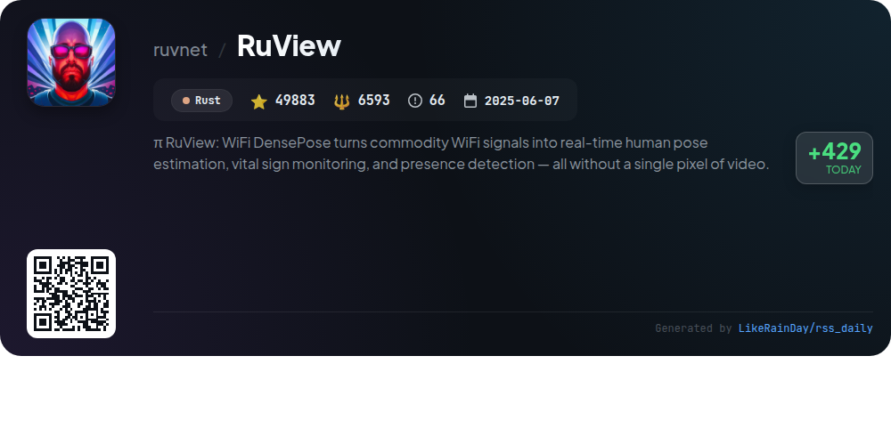

# 📊 🌟 GitHub Trending Daily - 2026-04-24

> > 📅 Daily Picks of GitHub Trending Repositories | Powered by Smart Algorithms

## 📋 Overview

**10** Projects | **564056** ⭐ | **67471** 🍴

**Top Languages:** `TypeScript` (6) · `Rust` (3) · `JavaScript` (1)

**Updated:** 2026-04-24 03:33 UTC

**Categories:**

- 🌟 Daily Top 10 (10 items)

---

## 🌟 Daily Top 10

### 1. [everything-claude-code](https://github.com/affaan-m/everything-claude-code)

> 🤖 **Why Recommend**  
> *Everything Claude Code is a powerful performance optimization system designed for AI agent harnesses like Claude Code, Codex, Cursor, and OpenCode. With over 165,000 stars, it provides a comprehensive suite of tools including 48 agents, 183 skills, and 79 legacy commands, facilitating continuous learning, memory optimization, and security scanning. Key features include a user-friendly dashboard, multi-language support, and advanced hooks for automation. It also integrates seamlessly with various development environments, ensuring a robust and efficient coding experience.*

- ⭐ 165482 stars
- 💻 JavaScript
- 📅 Updated: 2026-04-24

### 2. [claude-context](https://github.com/zilliztech/claude-context)

> 🤖 **Why Recommend**  
> *Claude Context is a powerful MCP plugin designed for semantic code search within AI coding agents like Claude Code. It enables instant access to relevant code across extensive codebases without the need for multi-round retrieval, significantly reducing costs. Key features include hybrid search capabilities, incremental indexing, and intelligent code chunking. The project supports integration with various AI assistants and offers a VS Code extension for ease of use. Claude Context efficiently stores code in a vector database, ensuring context-aware searches while managing resource consumption effectively.*

- ⭐ 8525 stars
- 💻 TypeScript
- 📅 Updated: 2026-04-24

### 3. [rtk](https://github.com/rtk-ai/rtk)

> 🤖 **Why Recommend**  
> *RTK is a high-performance CLI proxy that significantly reduces LLM token consumption by 60-90% on common development commands, packaged as a single Rust binary with zero dependencies. With over 100 supported commands and under 10ms overhead, RTK optimizes outputs through smart filtering, grouping, truncation, and deduplication. It integrates seamlessly with multiple AI tools like Claude Code and GitHub Copilot, offering a transparent auto-rewrite hook for enhanced efficiency. Users can track token savings and command performance through built-in analytics, making it an essential tool for developers looking to optimize their workflows.*

- ⭐ 33595 stars
- 💻 Rust
- 📅 Updated: 2026-04-24

### 4. [OpenMetadata](https://github.com/open-metadata/OpenMetadata)

> 🤖 **Why Recommend**  
> *OpenMetadata is a unified metadata platform designed for data discovery, observability, and governance, utilizing a central repository and in-depth column-level lineage. Key features include seamless data collaboration, no-code data quality monitoring, robust governance with policy enforcement, and detailed insights through dashboards and KPIs. With support for over 84 connectors, it enables efficient ingestion from various data sources. OpenMetadata empowers teams to manage and unlock the value of their data assets, fostering a collaborative and informed data culture.*

- ⭐ 12991 stars
- 💻 TypeScript
- 📅 Updated: 2026-04-24

### 5. [cc-switch](https://github.com/farion1231/cc-switch)

> 🤖 **Why Recommend**  
> *CC Switch is a cross-platform desktop tool for managing AI CLI tools like Claude Code, Codex, Gemini CLI, OpenCode, and OpenClaw. It features a unified interface to switch between providers without manual editing, offers over 50 presets for easy configuration, and allows for seamless MCP and Skills management. Users benefit from quick switching via system tray access, cloud sync capabilities, and built-in utilities. With robust tracking for usage and cost, CC Switch enhances productivity for developers using multiple AI coding services.*

- ⭐ 50012 stars
- 💻 Rust
- 📅 Updated: 2026-04-24

### 6. [shannon](https://github.com/KeygraphHQ/shannon)

> 🤖 **Why Recommend**  
> *Shannon Lite is an autonomous, white-box AI pentester designed for web applications and APIs, developed by Keygraph. It performs comprehensive security testing by analyzing source code to identify vulnerabilities and executing real exploits, ensuring only validated findings are reported. Key features include fully autonomous operation, reproducible proof-of-concept exploits, and support for OWASP vulnerability categories. Shannon Lite is ideal for local testing, while Shannon Pro offers an integrated AppSec platform with CI/CD support and advanced static analysis.*

- ⭐ 40083 stars
- 💻 TypeScript
- 📅 Updated: 2026-04-24

### 7. [opencode](https://github.com/anomalyco/opencode)

> 🤖 **Why Recommend**  
> *OpenCode is an open-source AI coding agent designed to enhance development workflows. It features two built-in agents: a full-access **build** agent for development tasks and a **plan** agent for code exploration. OpenCode supports various installation methods and is available as a desktop application for macOS, Windows, and Linux. Key highlights include provider-agnostic functionality, integration with local and cloud models, and a focus on terminal user interfaces (TUI). The project boasts 148,444 stars on GitHub and encourages contributions and community engagement through its Discord channel.*

- ⭐ 148444 stars
- 💻 TypeScript
- 📅 Updated: 2026-04-24

### 8. [skills](https://github.com/vercel-labs/skills)

> 🤖 **Why Recommend**  
> *The open agent skills tool - npx skills. popular project, actively maintained, recently updated*

- ⭐ 15848 stars
- 🍴 1295 forks
- 💻 TypeScript
- 📅 Updated: 2026-04-24

### 9. [pi-mono](https://github.com/badlogic/pi-mono)

> 🤖 **Why Recommend**  
> *pi-mono is an AI agent toolkit designed for building and managing AI agents and LLM deployments. Key features include a unified multi-provider LLM API, an interactive coding agent CLI, and Slack bot integration. It offers TUI and web UI libraries for creating AI chat interfaces, as well as CLI tools for managing vLLM deployments. With 39,193 stars on GitHub, pi-mono encourages users to share their coding agent sessions to enhance real-world performance. The project is open-source and contributions are welcome.*

- ⭐ 39193 stars
- 💻 TypeScript
- 📅 Updated: 2026-04-24

### 10. [RuView](https://github.com/ruvnet/RuView)

> 🤖 **Why Recommend**  
> *RuView is a cutting-edge WiFi DensePose platform that leverages commodity WiFi signals for real-time human pose estimation, vital sign monitoring, and presence detection—without any video. Key features include camera-free pose tracking using 17 COCO keypoints, breathing and heart rate detection, and multi-person tracking through walls. The system operates entirely on low-cost ESP32 hardware, ensuring privacy and local processing. With robust edge intelligence, adaptive learning, and a seamless integration with the Cognitum Seed for persistent memory, RuView redefines human sensing technology.*

- ⭐ 49883 stars
- 💻 Rust
- 📅 Updated: 2026-04-24

---

## 📡 RSS Subscription

Subscribe via RSS to get daily trending updates:

- 🔔 [RSS XML] (../../daily-top.xml)
- 🔔 [Daily Report] (../../GITHUB_TODAY.md)
- 🔔 [Daily Top 10](../../daily-top.xml)

---

*⚡ Powered by Smart Trending Algorithm | Generated at 2026-04-24 03:33:00 UTC
