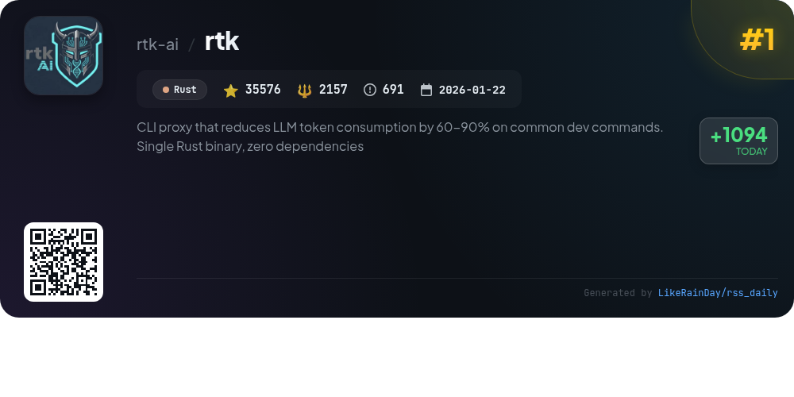
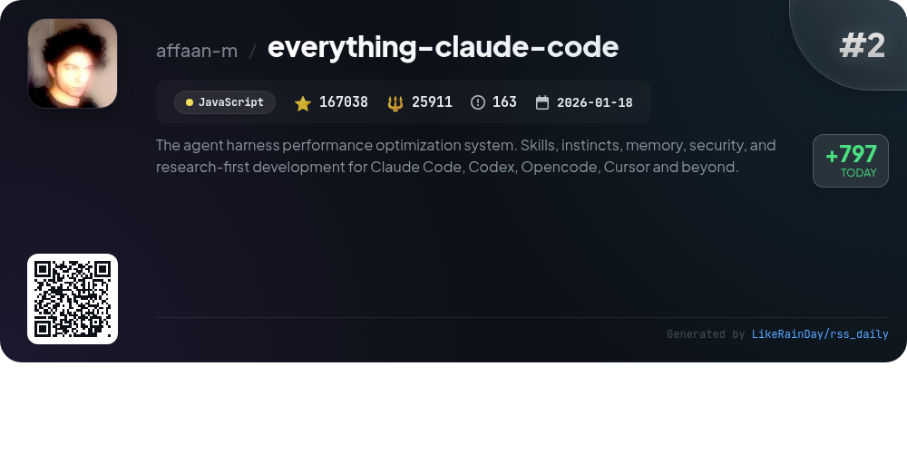
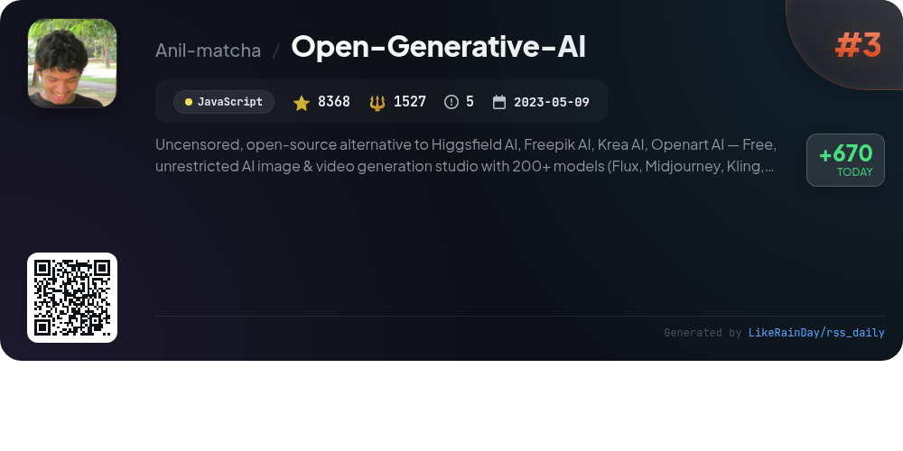
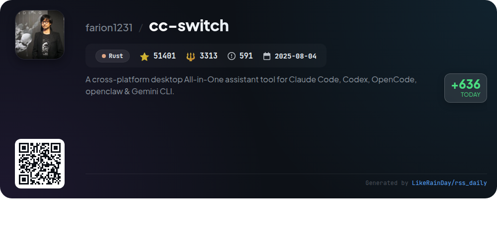
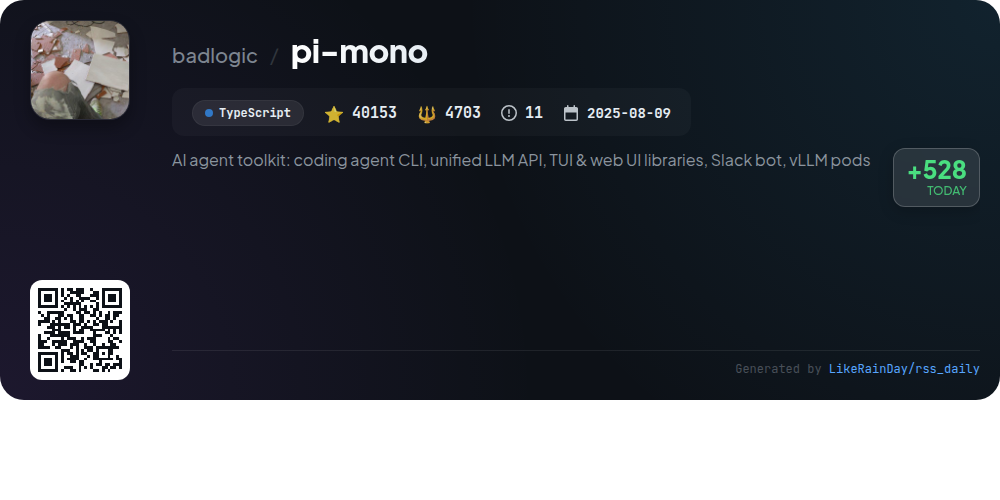
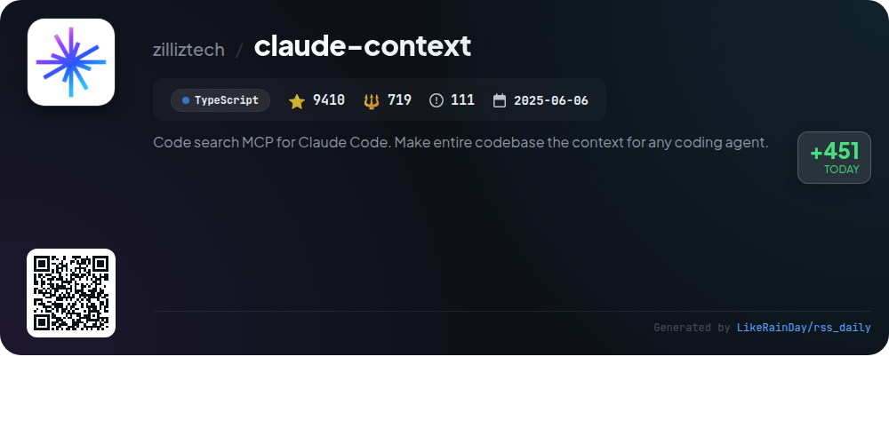
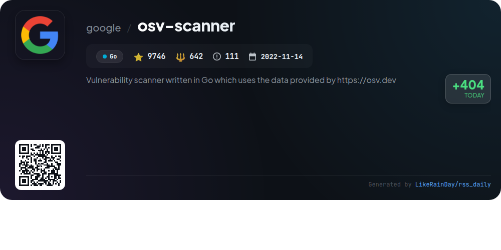
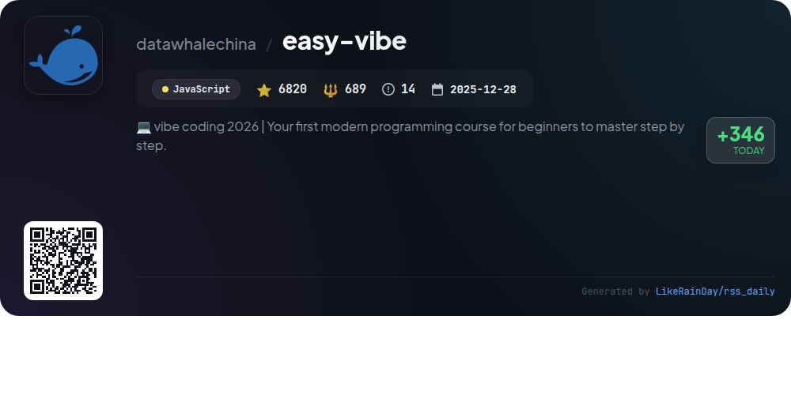
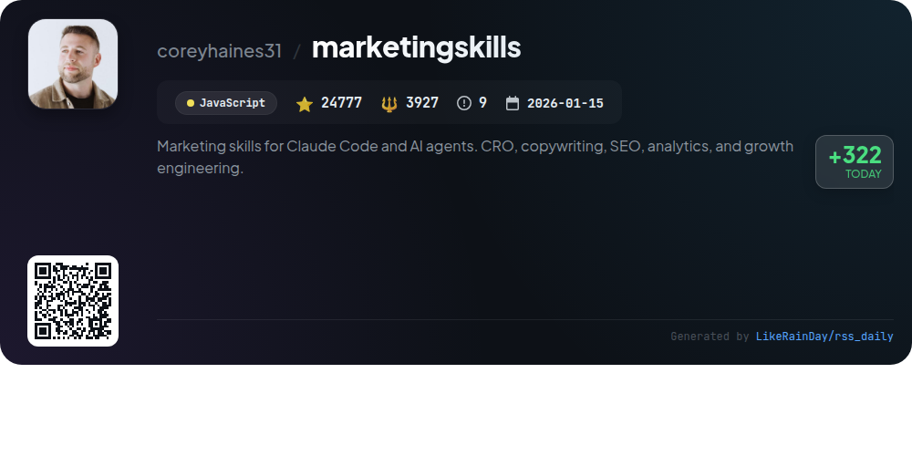
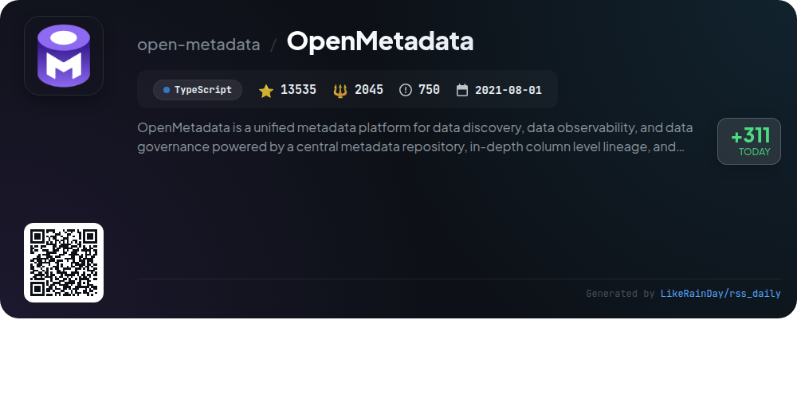

# 📊 🌟 GitHub Trending Daily - 2026-04-26

> > 📅 每日精选 GitHub 热门仓库 | 基于智能算法推荐

## 📋 Overview

**10** 个项目 | **366824** ⭐ | **45633** 🍴

**热门语言:** `JavaScript` (4) · `TypeScript` (3) · `Rust` (2)

**更新时间:** 2026-04-26 03:38 UTC

**分类分布:**

- 🌟 每日 Top 10 精选 (10 项)

---

## 🌟 每日 Top 10 精选

### 1. [rtk](https://github.com/rtk-ai/rtk)

> 🤖 **推荐理由**  
> *RTK (Rust Token Killer) is a high-performance CLI proxy designed to reduce LLM token consumption by 60-90% for common development commands, leveraging a single Rust binary with no dependencies. With support for over 100 commands, it filters and compresses command outputs, achieving significant token savings. Key features include an auto-rewrite hook for seamless integration with various AI tools, analytics for tracking savings, and compatibility with popular tools like Git, Docker, and test runners. RTK is widely adopted, boasting over 35,000 stars on GitHub.*

- ⭐ 35576 stars
- 💻 Rust
- 📅 Updated: 2026-04-26

### 2. [everything-claude-code](https://github.com/affaan-m/everything-claude-code)

> 🤖 **推荐理由**  
> *Everything Claude Code is a robust performance optimization system designed for AI agents like Claude Code, Codex, and Cursor. With over 167K stars, it offers skills, instincts, memory optimization, and security scanning for production-ready agents. Key features include a dashboard GUI, selective install architecture, and continuous learning capabilities. New updates enhance multi-agent workflows, security auditing with AgentShield, and cross-platform support. This comprehensive toolkit streamlines AI development, ensuring efficient, secure, and scalable solutions.*

- ⭐ 167038 stars
- 💻 JavaScript
- 📅 Updated: 2026-04-26

### 3. [Open-Generative-AI](https://github.com/Anil-matcha/Open-Generative-AI)

> 🤖 **推荐理由**  
> *Open Generative AI is a free, uncensored, open-source alternative to platforms like Higgsfield AI and Freepik. It offers unrestricted AI image and video generation using over 200 models, including text-to-image, image-to-video, and lip sync capabilities. Key features include a self-hosted option, local inference engines, and a user-friendly interface supporting multi-image uploads. Users can build automated workflows without coding, ensuring full creative control and data privacy. The platform is available online and as a desktop app, promoting flexibility and customization for creators.*

- ⭐ 8368 stars
- 💻 JavaScript
- 📅 Updated: 2026-04-26

### 4. [cc-switch](https://github.com/farion1231/cc-switch)

> 🤖 **推荐理由**  
> *CC Switch is a cross-platform desktop application that seamlessly integrates management for five major CLI tools: Claude Code, Codex, Gemini CLI, OpenCode, and OpenClaw. With over 50 built-in provider presets, users can easily switch between them without manual edits. Key features include unified MCP and Skills management, one-click provider switching, cloud sync capabilities, and a user-friendly interface. Built on Rust with Tauri, CC Switch ensures reliable configuration management and supports Windows, macOS, and Linux. Ideal for developers seeking streamlined AI tool management.*

- ⭐ 51401 stars
- 💻 Rust
- 📅 Updated: 2026-04-26

### 5. [pi-mono](https://github.com/badlogic/pi-mono)

> 🤖 **推荐理由**  
> *pi-mono is an AI agent toolkit built in TypeScript, boasting over 40,000 stars on GitHub. It features a coding agent CLI, a unified API for various LLM providers, and libraries for terminal and web UIs. Key components include the interactive coding agent, Slack bot for message delegation, and tools for managing vLLM deployments on GPU pods. The project encourages sharing open-source coding sessions to enhance agent performance. Contributing guidelines and a robust development setup are available for users.*

- ⭐ 40153 stars
- 💻 TypeScript
- 📅 Updated: 2026-04-26

### 6. [claude-context](https://github.com/zilliztech/claude-context)

> 🤖 **推荐理由**  
> *Claude Context is an advanced MCP plugin for Claude Code, empowering AI coding agents with semantic code search capabilities across entire codebases. With efficient indexing and retrieval mechanisms, it minimizes costs by utilizing only relevant code snippets from large repositories. Key features include hybrid search (BM25 + dense vector), context-aware coding support, and seamless integration with Zilliz Cloud for scalable vector databases. Additionally, it offers a VS Code extension for intuitive code search. Explore persistent memory options with the memsearch Claude Code plugin for long-term AI context management.*

- ⭐ 9410 stars
- 💻 TypeScript
- 📅 Updated: 2026-04-26

### 7. [osv-scanner](https://github.com/google/osv-scanner)

> 🤖 **推荐理由**  
> *OSV-Scanner is a Go-based vulnerability scanner that leverages the OSV database to identify vulnerabilities in project dependencies. With support for various languages (C/C++, Java, Python, etc.) and package managers (npm, pip, Maven, etc.), it scans source directories, container images, and even vendored C/C++ code. Key features include guided remediation for package upgrades, offline scanning capabilities, and license compliance checks. Its comprehensive data sources ensure accurate vulnerability notifications, making it a crucial tool for enhancing software security.*

- ⭐ 9746 stars
- 💻 Go
- 📅 Updated: 2026-04-26

### 8. [easy-vibe](https://github.com/datawhalechina/easy-vibe)

> 🤖 **推荐理由**  
> *Easy-Vibe is a modern programming course designed for beginners to master coding step-by-step using JavaScript. With over 6,820 stars, it emphasizes practical learning by enabling users to turn ideas into real products through interactive tutorials and a structured learning map. Key features include immersive simulated coding environments, detailed visual tutorials, and a focus on AI capabilities. The course supports multiple languages and offers pathways for various skill levels, from complete beginners to advanced developers, making it accessible for everyone looking to enhance their coding skills.*

- ⭐ 6820 stars
- 💻 JavaScript
- 📅 Updated: 2026-04-26

### 9. [marketingskills](https://github.com/coreyhaines31/marketingskills)

> 🤖 **推荐理由**  
> *The "marketingskills" project equips AI agents with a suite of marketing capabilities, including conversion optimization, copywriting, SEO, analytics, and growth engineering. Designed for technical marketers and founders, it supports integration with Claude Code and other agent platforms. Key features include a structured skill system for various marketing tasks, collaboration capabilities, and a comprehensive library of skills for tasks like A/B testing, social media content, and customer research. For hands-on support, check out Corey Haines' agency, Conversion Factory, or explore learning resources like Swipe Files. Contributions are welcome to enhance the skill set.*

- ⭐ 24777 stars
- 💻 JavaScript
- 📅 Updated: 2026-04-26

### 10. [OpenMetadata](https://github.com/open-metadata/OpenMetadata)

> 🤖 **推荐理由**  
> *OpenMetadata is a unified metadata platform designed for data discovery, observability, and governance, powered by a central repository and detailed column-level lineage. Key features include data discovery through advanced search, seamless team collaboration, data quality monitoring, governance policies, and insights via KPIs. It supports over 84 connectors for diverse data services and offers robust security and integration options. With a vibrant community and extensive documentation, OpenMetadata empowers organizations to effectively manage and unlock the value of their data assets.*

- ⭐ 13535 stars
- 💻 TypeScript
- 📅 Updated: 2026-04-26

---

## 📡 RSS订阅

通过 RSS 订阅，第一时间获取每日精选项目：

- 🔔 [RSS 订阅源] (../../daily-top.xml)
- 🔔 [每日简报] (../../GITHUB_TODAY_CN.md)
- 🔔 [每日 Top 10 精选](../../daily-top.xml)

---

*⚡ Powered by Smart Trending Algorithm | Generated at 2026-04-26 03:38:59 UTC
