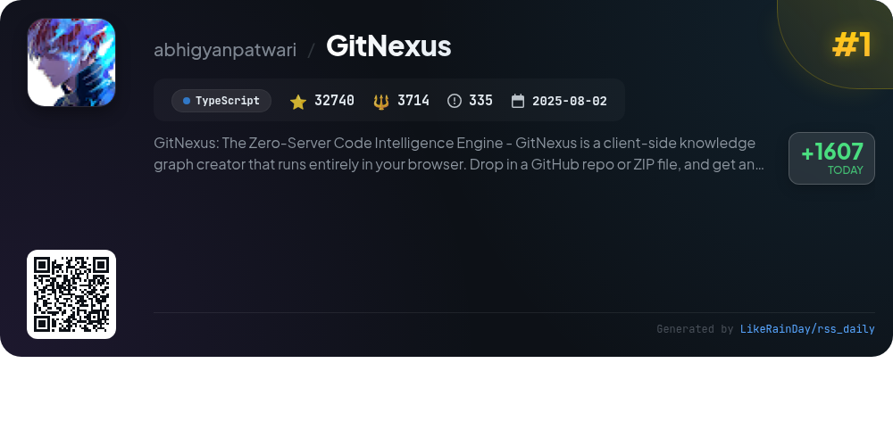
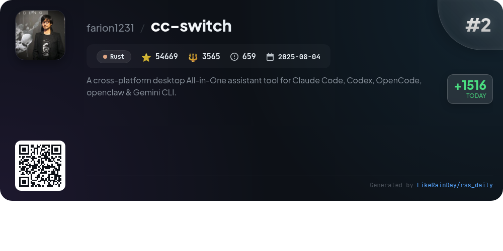
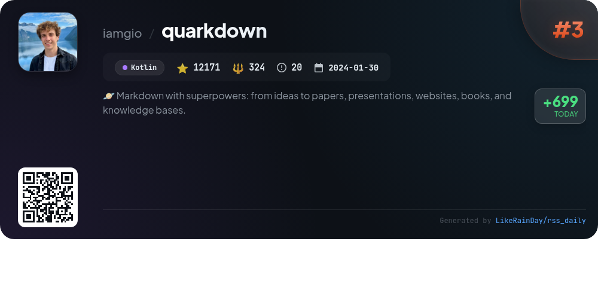
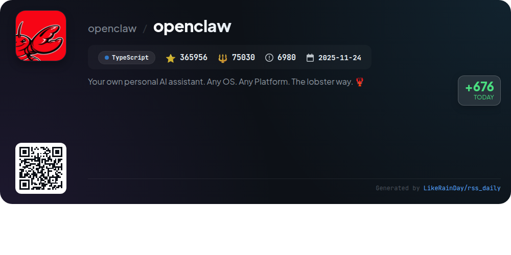
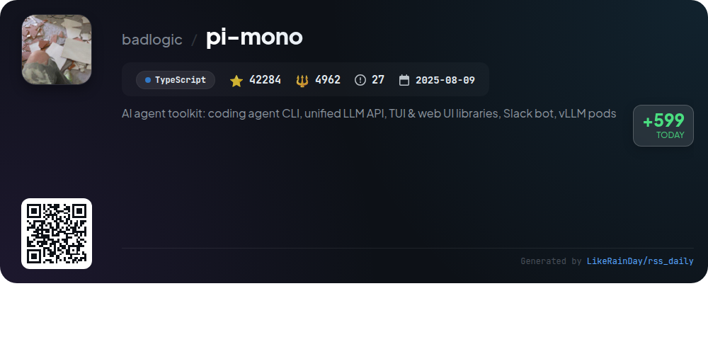
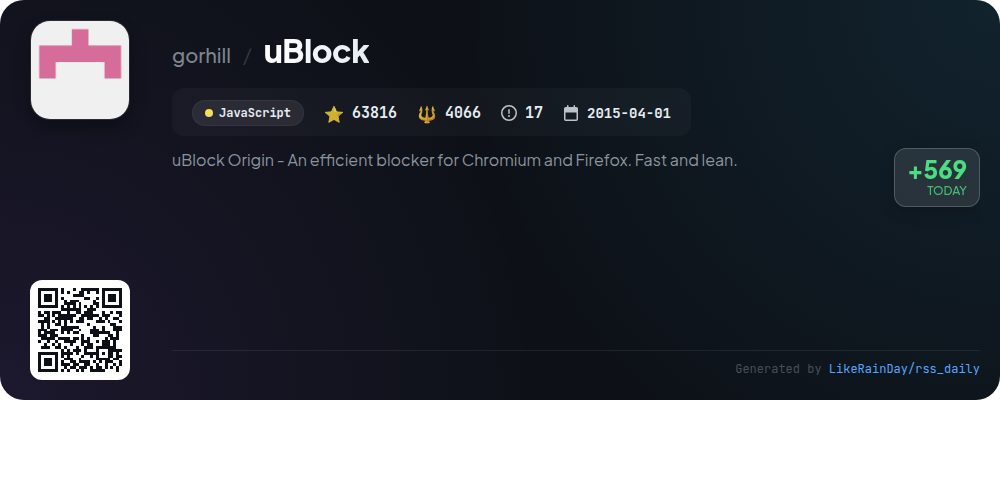
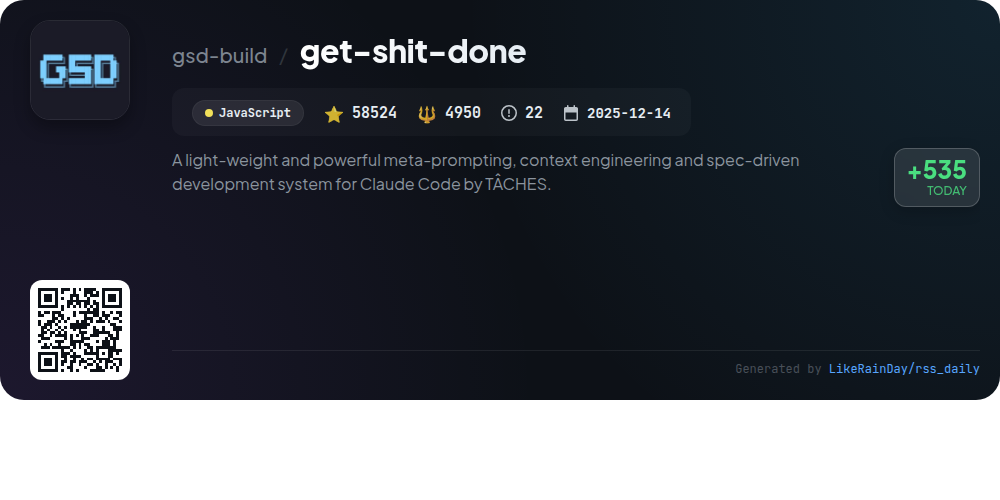
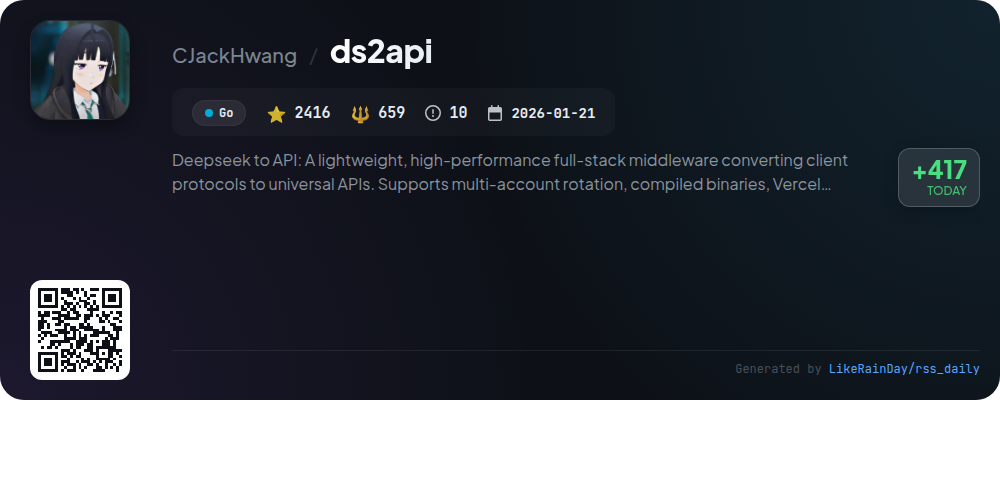
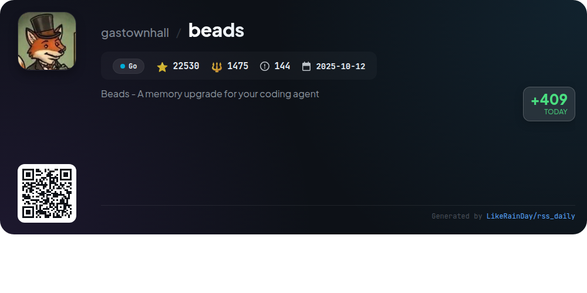
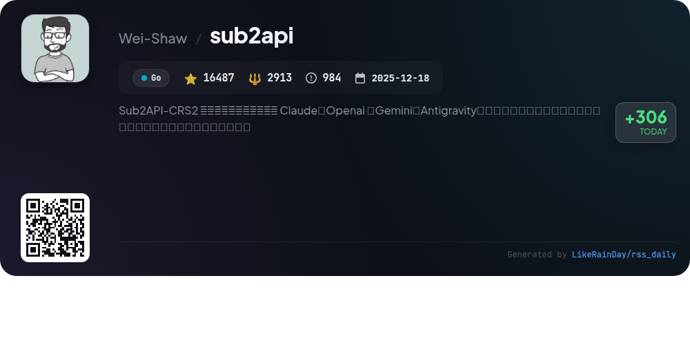

# 📊 🌟 GitHub Trending Daily - 2026-04-29

> > 📅 Daily Picks of GitHub Trending Repositories | Powered by Smart Algorithms

## 📋 Overview

**10** Projects | **671593** ⭐ | **101658** 🍴

**Top Languages:** `Go` (3) · `TypeScript` (3) · `JavaScript` (2)

**Updated:** 2026-04-29 03:45 UTC

**Categories:**

- 🌟 Daily Top 10 (10 items)

---

## 🌟 Daily Top 10

### 1. [GitNexus](https://github.com/abhigyanpatwari/GitNexus)

> 🤖 **Why Recommend**  
> *GitNexus: The Zero-Server Code Intelligence Engine -       GitNexus is a client-side knowledge graph creator that runs entirely in your browser. Drop . popular project, actively maintained, recently updated*

- ⭐ 32740 stars
- 🍴 3714 forks
- 💻 TypeScript
- 📅 Updated: 2026-04-29

### 2. [cc-switch](https://github.com/farion1231/cc-switch)

> 🤖 **Why Recommend**  
> *CC Switch is a cross-platform desktop assistant tool designed to manage five CLI tools: Claude Code, Codex, Gemini CLI, OpenCode, and OpenClaw. With over 54,000 stars on GitHub, it offers a unified interface for seamless provider management without manual configuration edits. Key features include 50+ built-in provider presets, unified MCP and Skills management, quick switching via system tray, and cloud sync across devices. Built with Tauri in Rust, it enhances AI coding efficiency while ensuring data integrity with atomic writes and comprehensive usage tracking.*

- ⭐ 54669 stars
- 💻 Rust
- 📅 Updated: 2026-04-29

### 3. [quarkdown](https://github.com/iamgio/quarkdown)

> 🤖 **Why Recommend**  
> *Quarkdown is a versatile Markdown-based typesetting system that enables seamless compilation into various formats, including print-ready books, academic papers, presentations, and knowledge bases. It extends CommonMark with scripting capabilities, allowing users to define functions and use a rich standard library for dynamic content creation. Core features include fast compilation, live preview, and a powerful VS Code extension. Quarkdown supports multiple output formats (HTML, PDF, TXT) and is designed for ease of use, making it ideal for both simple documents and complex projects.*

- ⭐ 12171 stars
- 💻 Kotlin
- 📅 Updated: 2026-04-29

### 4. [openclaw](https://github.com/openclaw/openclaw)

> 🤖 **Why Recommend**  
> *OpenClaw is a personal AI assistant designed to run on any OS or platform, offering seamless communication across various messaging channels, including WhatsApp, Telegram, Discord, and more. Key features include a local-first gateway for managing sessions, multi-channel support, voice activation on macOS/iOS/Android, a live Canvas for visual interaction, and a robust onboarding process for easy setup. With a focus on privacy and security, OpenClaw ensures a responsive and fast user experience, making it an ideal choice for anyone seeking a reliable AI assistant.*

- ⭐ 365956 stars
- 💻 TypeScript
- 📅 Updated: 2026-04-29

### 5. [pi-mono](https://github.com/badlogic/pi-mono)

> 🤖 **Why Recommend**  
> *pi-mono is an AI agent toolkit designed for building and managing LLM deployments. Key features include a unified LLM API supporting multiple providers (OpenAI, Anthropic, Google), an interactive coding agent CLI, and libraries for terminal and web UIs. Additionally, it offers a Slack bot for message delegation and tools for managing vLLM deployments on GPU pods. With over 42,000 stars, pi-mono emphasizes community engagement by encouraging users to share coding agent sessions to enhance real-world performance. Contributions are welcomed as per the guidelines in the repository.*

- ⭐ 42284 stars
- 💻 TypeScript
- 📅 Updated: 2026-04-29

### 6. [uBlock](https://github.com/gorhill/uBlock)

> 🤖 **Why Recommend**  
> *uBlock Origin (uBO) is a highly efficient content blocker for Chromium and Firefox, boasting over 63,800 stars on GitHub. It effectively blocks ads, trackers, coin miners, and malware sites using a wide range of filter lists like EasyList and EasyPrivacy. Users can customize their experience with a simple or advanced user interface for site-specific configurations. uBO is open-source, free, and optimized for performance, making it an excellent choice for privacy-conscious users. Available across multiple platforms, it ensures a seamless browsing experience while safeguarding user privacy.*

- ⭐ 63816 stars
- 💻 JavaScript
- 📅 Updated: 2026-04-29

### 7. [get-shit-done](https://github.com/gsd-build/get-shit-done)

> 🤖 **Why Recommend**  
> *get-shit-done is a lightweight meta-prompting and context engineering system designed for Claude Code and various AI coding tools. It addresses "context rot," ensuring consistent quality in code generation. Key features include spiking and sketching for rapid experimentation, agent orchestration for efficient execution, and built-in quality gates to prevent issues like schema drift. Trusted by engineers at major companies, it allows seamless project initialization, planning, execution, and verification with atomic commits and a focus on user-defined goals.*

- ⭐ 58524 stars
- 💻 JavaScript
- 📅 Updated: 2026-04-29

### 8. [ds2api](https://github.com/CJackHwang/ds2api)

> 🤖 **Why Recommend**  
> *ds2api is a lightweight, high-performance middleware designed to convert client protocols into universal APIs, supporting OpenAI, Claude, and Gemini formats. Key features include multi-account rotation, compiled binaries, Vercel Serverless, and Docker compatibility. It offers a React-based WebUI for management, unified CORS policies, and extensive admin APIs. With a robust architecture built in Go, ds2api ensures efficient request handling through account pooling and dynamic concurrency management. Ideal for developers seeking a versatile API integration solution.*

- ⭐ 2416 stars
- 💻 Go
- 📅 Updated: 2026-04-29

### 9. [beads](https://github.com/gastownhall/beads)

> 🤖 **Why Recommend**  
> *Beads is a distributed graph issue tracker for AI agents, built on Dolt, providing persistent, structured memory for coding tasks. With support for macOS, Linux, Windows, and FreeBSD, it enhances task management through a dependency-aware graph, allowing agents to effectively manage long-horizon tasks. Key features include version-controlled SQL database capabilities, zero conflict task tracking, semantic memory decay, and messaging functionalities. Beads operates seamlessly in both embedded and server modes, offering flexibility for various workflows, including Git-free usage for isolated task management.*

- ⭐ 22530 stars
- 💻 Go
- 📅 Updated: 2026-04-29

### 10. [sub2api](https://github.com/Wei-Shaw/sub2api)

> 🤖 **Why Recommend**  
> *Sub2API is an open-source AI API gateway platform that efficiently distributes API quotas from various AI service subscriptions like Claude, OpenAI, Gemini, and Antigravity. Key features include multi-account management, precise billing, API key generation, and built-in payment support for services like Alipay and Stripe. The platform offers an admin dashboard for monitoring, concurrency control, and smart scheduling. Users can self-host or deploy via Docker, making it versatile for individual developers and teams. With 16,487 stars, Sub2API provides a seamless integration experience for AI service utilization.*

- ⭐ 16487 stars
- 💻 Go
- 📅 Updated: 2026-04-29

---

## 📡 RSS Subscription

Subscribe via RSS to get daily trending updates:

- 🔔 [RSS XML] (../../daily-top.xml)
- 🔔 [Daily Report] (../../GITHUB_TODAY.md)
- 🔔 [Daily Top 10](../../daily-top.xml)

---

*⚡ Powered by Smart Trending Algorithm | Generated at 2026-04-29 03:45:23 UTC
