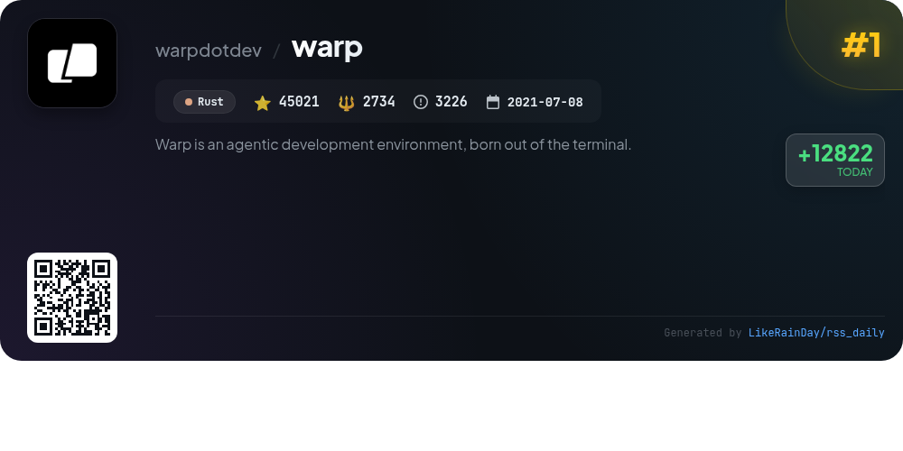
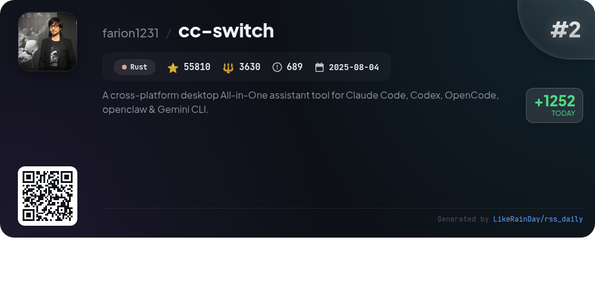
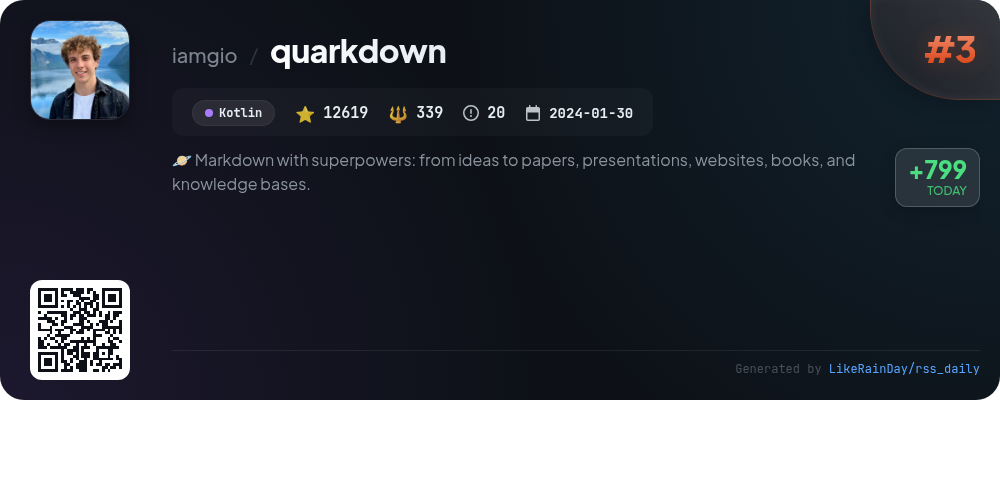
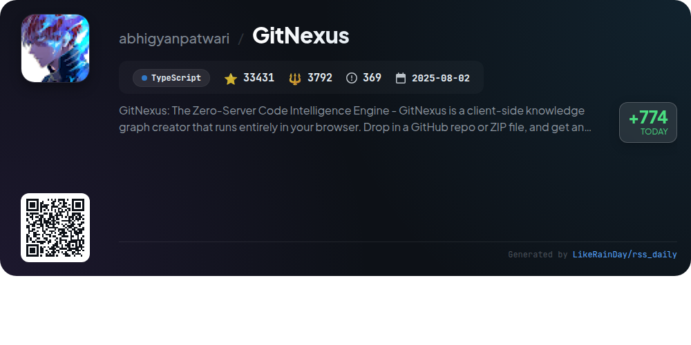
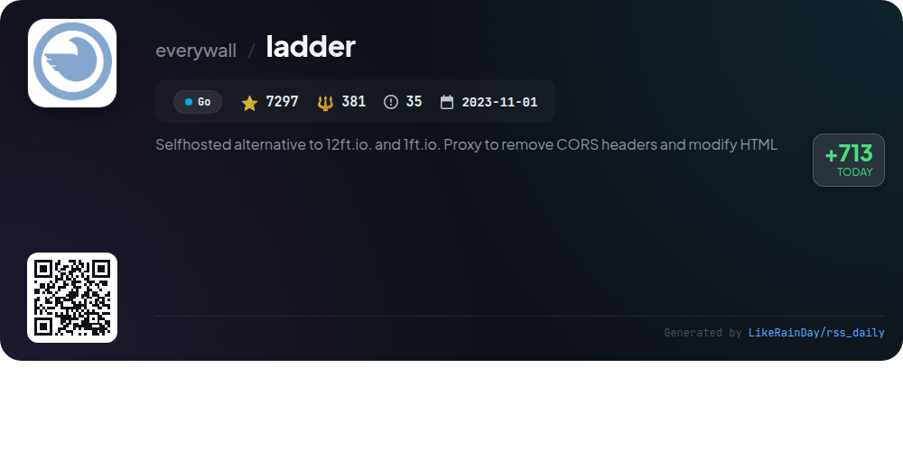
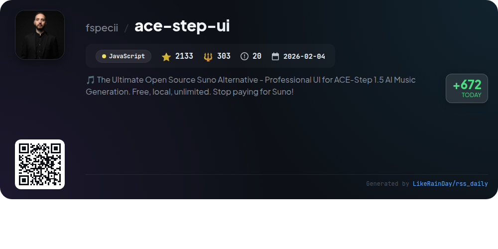
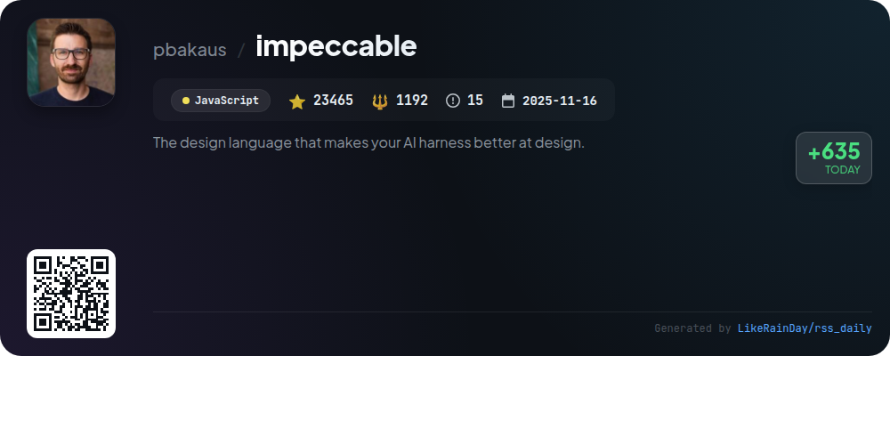
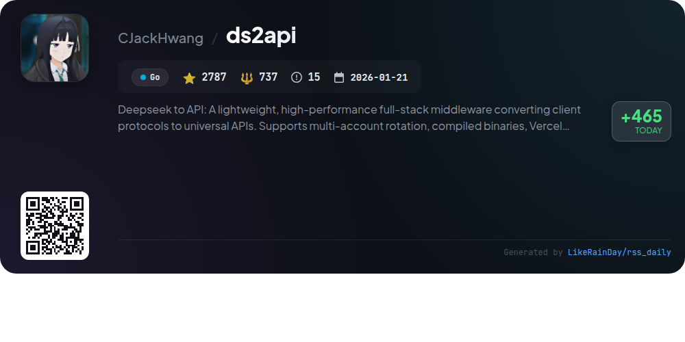
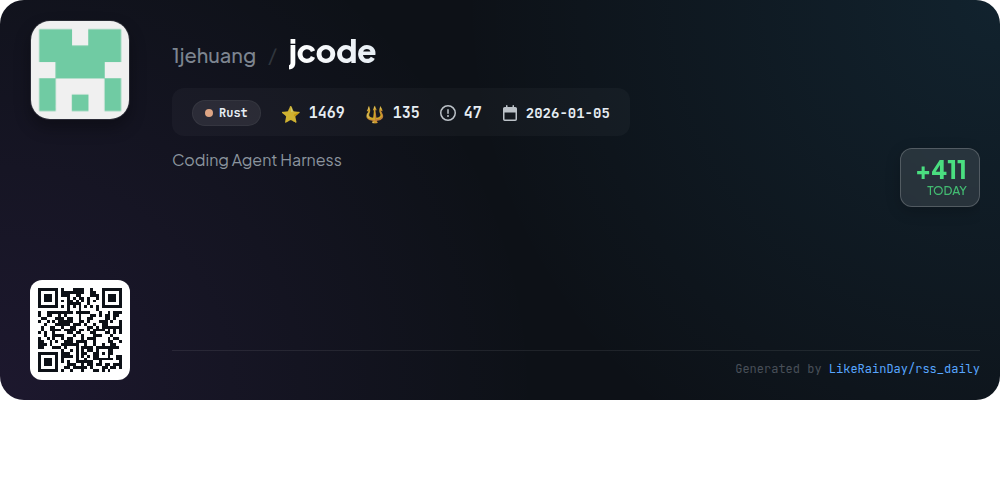
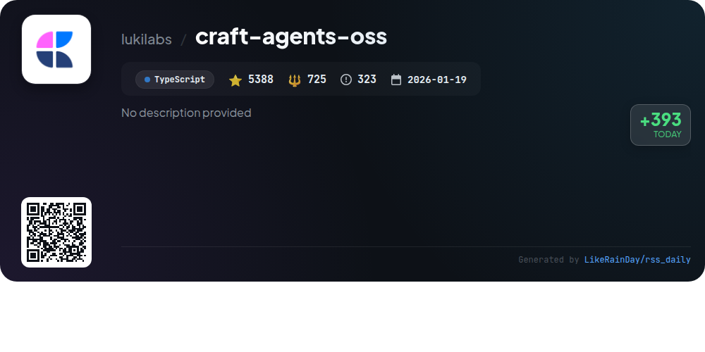

# 📊 🌟 GitHub Trending Daily - 2026-04-30

> > 📅 Daily Picks of GitHub Trending Repositories | Powered by Smart Algorithms

## 📋 Overview

**10** Projects | **189420** ⭐ | **13968** 🍴

**Top Languages:** `Rust` (3) · `Go` (2) · `TypeScript` (2)

**Updated:** 2026-04-30 03:47 UTC

**Categories:**

- 🌟 Daily Top 10 (10 items)

---

## 🌟 Daily Top 10

### 1. [warp](https://github.com/warpdotdev/warp)

> 🤖 **Why Recommend**  
> *Warp is an innovative agentic development environment built from the terminal, utilizing Rust. It features a built-in coding agent and supports external CLI agents like Claude Code and Codex. With over 45,000 stars, Warp enhances developer workflows through automated agents that triage issues, write specifications, and manage pull requests. Key services include a user-friendly web interface for monitoring contributions and active agent sessions. Warp is open-source, encourages community contributions, and offers comprehensive documentation and support resources.*

- ⭐ 45021 stars
- 💻 Rust
- 📅 Updated: 2026-04-30

### 2. [cc-switch](https://github.com/farion1231/cc-switch)

> 🤖 **Why Recommend**  
> *CC Switch is a cross-platform desktop assistant tool for managing multiple AI CLI tools, including Claude Code, Codex, Gemini CLI, OpenCode, and OpenClaw. With over 55,810 stars on GitHub, it streamlines provider management through a unified interface, eliminating tedious manual configuration. Key features include one-click provider switching, 50+ built-in presets, cloud sync for configurations, and a session manager for conversation history. Built with Rust and Tauri, CC Switch ensures efficient performance and supports Windows, macOS, and Linux. Ideal for developers seeking to enhance their AI coding workflows.*

- ⭐ 55810 stars
- 💻 Rust
- 📅 Updated: 2026-04-30

### 3. [quarkdown](https://github.com/iamgio/quarkdown)

> 🤖 **Why Recommend**  
> *Quarkdown is a powerful Markdown-based typesetting system that enables seamless compilation of projects into various formats, including books, academic papers, presentations, and knowledge bases. Built on an extended version of Markdown, it supports scripting and custom functions, allowing for dynamic content creation. Key features include live preview, fast compilation, and a robust VS Code extension. Quarkdown supports HTML, PDF, and plain text outputs, making it versatile for diverse documentation needs. With over 12,600 stars on GitHub, it's a popular choice for modern documentation tasks.*

- ⭐ 12619 stars
- 💻 Kotlin
- 📅 Updated: 2026-04-30

### 4. [GitNexus](https://github.com/abhigyanpatwari/GitNexus)

> 🤖 **Why Recommend**  
> *GitNexus: The Zero-Server Code Intelligence Engine -       GitNexus is a client-side knowledge graph creator that runs entirely in your browser. Drop . popular project, actively maintained, recently updated*

- ⭐ 33431 stars
- 🍴 3792 forks
- 💻 TypeScript
- 📅 Updated: 2026-04-30

### 5. [ladder](https://github.com/everywall/ladder)

> 🤖 **Why Recommend**  
> *Ladder is a self-hosted HTTP web proxy designed for developers to test paywall implementations and analyze content delivery. Key features include the ability to modify CORS headers, inject custom HTML/CSS/JavaScript, and apply domain-based rules. It supports a customizable API, provides access logs, and offers Docker compatibility. Users can emulate different client environments and integrate with FlareSolverr for bypassing anti-bot challenges. Ladder is ideal for legitimate testing and research while ensuring compliance with applicable laws and website terms.*

- ⭐ 7297 stars
- 💻 Go
- 📅 Updated: 2026-04-30

### 6. [ace-step-ui](https://github.com/fspecii/ace-step-ui)

> 🤖 **Why Recommend**  
> *ACE-Step UI is an open-source alternative to Suno, designed for professional AI music generation with ACE-Step 1.5. It offers a beautiful, Spotify-like interface for generating unlimited, high-quality songs locally, ensuring privacy and ownership. Key features include full song generation, customizable parameters, batch processing, and advanced audio editing tools. Users can leverage AI for lyrics formatting and music video creation. With active development and a robust tech stack, ACE-Step UI empowers musicians to create without subscription fees, making it a valuable addition to the AI music landscape.*

- ⭐ 2133 stars
- 💻 JavaScript
- 📅 Updated: 2026-04-30

### 7. [impeccable](https://github.com/pbakaus/impeccable)

> 🤖 **Why Recommend**  
> *Impeccable is a robust design language tool for enhancing AI-driven frontend design, featuring 23 commands to audit, critique, and polish UI elements. It includes 7 domain-specific references covering typography, color, spatial, motion, interaction, responsive design, and UX writing. By providing curated anti-patterns, Impeccable helps avoid common design mistakes. Users can quickly integrate it into various AI harnesses, making it ideal for developers seeking to improve design quality and accessibility. Visit impeccable.style for quick-start bundles and case studies.*

- ⭐ 23465 stars
- 💻 JavaScript
- 📅 Updated: 2026-04-30

### 8. [ds2api](https://github.com/CJackHwang/ds2api)

> 🤖 **Why Recommend**  
> *DS2API is a high-performance middleware that transforms Deepseek's conversational capabilities into APIs compatible with OpenAI, Claude, and Gemini. Built in Go, it features a React-based WebUI for management, multi-account rotation, and supports deployment via Docker, Vercel, or local environments. Key functionalities include unified CORS handling, concurrent request management, and a robust admin API for configuration and monitoring. With over 2,700 stars, DS2API aims for high efficiency and accessibility in API integrations, making it suitable for developers and researchers alike.*

- ⭐ 2787 stars
- 💻 Go
- 📅 Updated: 2026-04-30

### 9. [jcode](https://github.com/1jehuang/jcode)

> 🤖 **Why Recommend**  
> *jcode is a cutting-edge coding agent harness built in Rust, designed for multi-session workflows with exceptional performance and customizability. With 1,469 stars on GitHub, it supports Linux, macOS, and Windows. Key features include an efficient memory system that allows for human-like recall, real-time collaboration with swarm capabilities, and seamless integration with various OAuth providers like OpenAI and GitHub Copilot. The interface supports advanced UI elements, browser automation, and self-modification for enhanced adaptability, making it a powerful tool for developers.*

- ⭐ 1469 stars
- 💻 Rust
- 📅 Updated: 2026-04-30

### 10. [craft-agents-oss](https://github.com/lukilabs/craft-agents-oss)

> 🤖 **Why Recommend**  
> *Craft Agents is an innovative open-source tool designed for seamless interaction with various APIs and services through a user-friendly desktop application. Key features include intuitive multitasking, multi-session management, and dynamic status systems. Users can connect to numerous data sources, including MCP servers and REST APIs, with minimal configuration. The platform supports multiple AI providers, enabling real-time collaboration and skill creation. Built with customizability in mind, Craft Agents fosters a document-centric workflow, enhancing productivity without the need for traditional coding environments.*

- ⭐ 5388 stars
- 💻 TypeScript
- 📅 Updated: 2026-04-30

---

## 📡 RSS Subscription

Subscribe via RSS to get daily trending updates:

- 🔔 [RSS XML] (../../daily-top.xml)
- 🔔 [Daily Report] (../../GITHUB_TODAY.md)
- 🔔 [Daily Top 10](../../daily-top.xml)

---

*⚡ Powered by Smart Trending Algorithm | Generated at 2026-04-30 03:47:06 UTC
