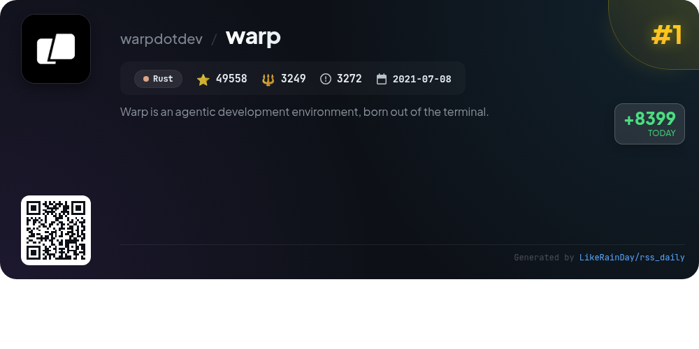
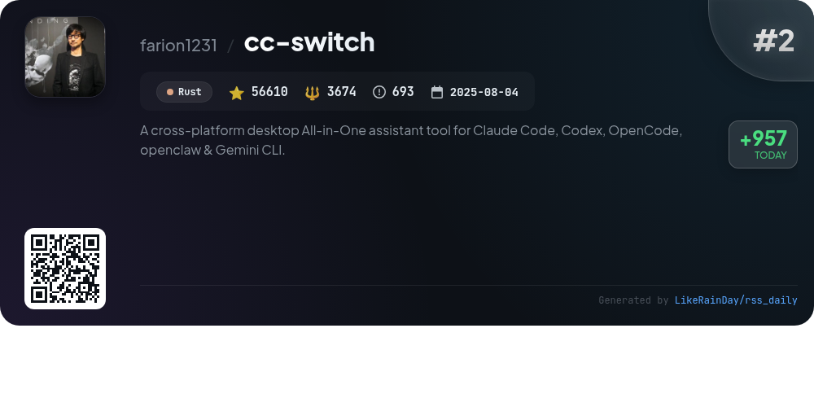
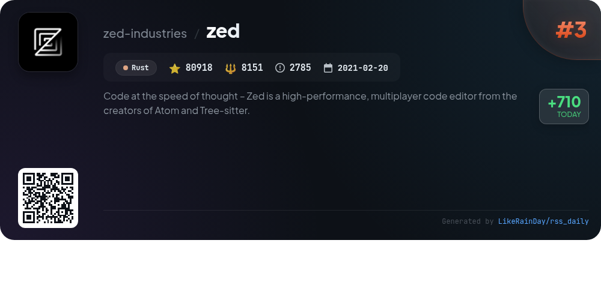
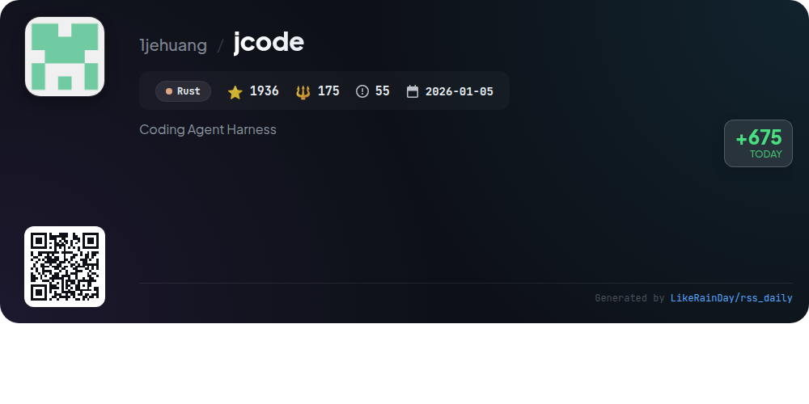
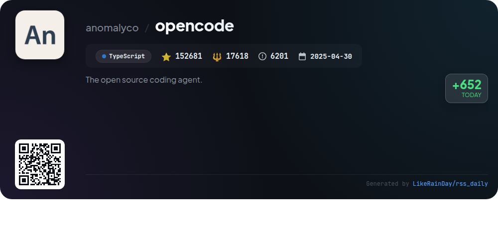
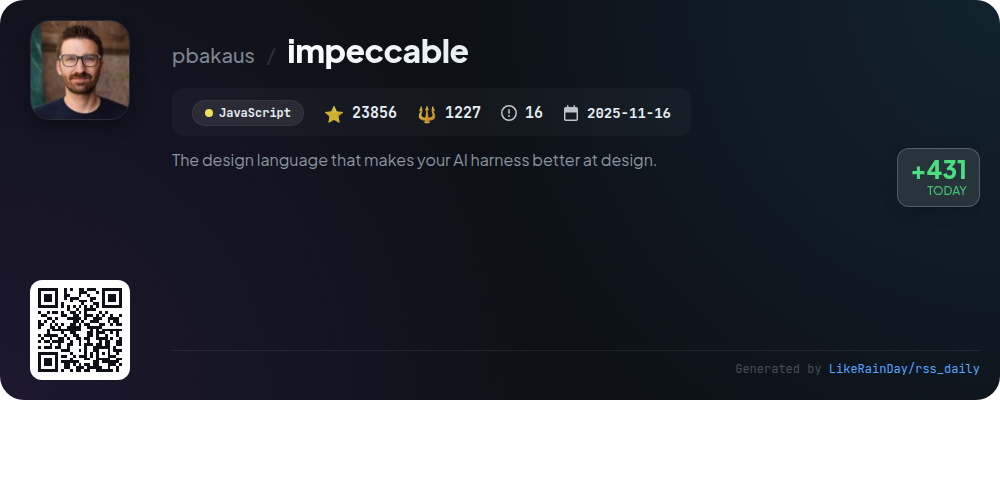
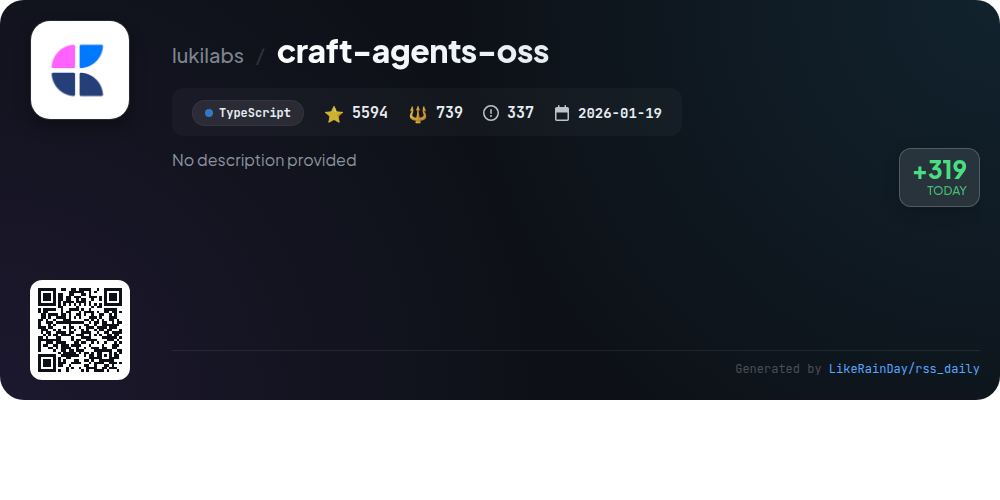
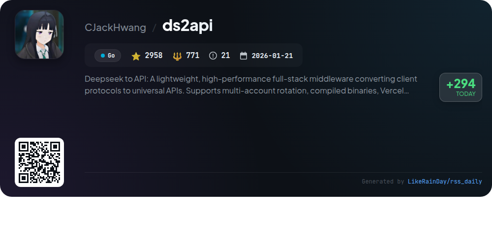
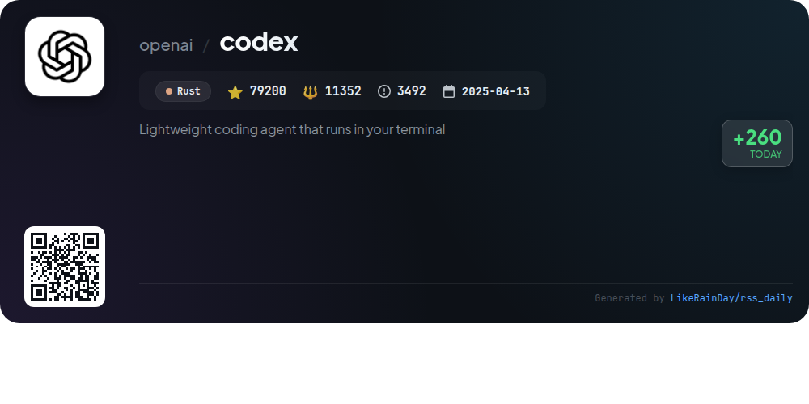
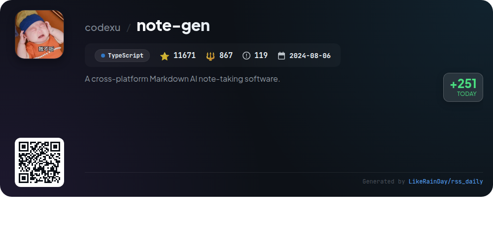

# 📊 🌟 GitHub Trending Daily - 2026-05-01

> > 📅 Daily Picks of GitHub Trending Repositories | Powered by Smart Algorithms

## 📋 Overview

**10** Projects | **464982** ⭐ | **47823** 🍴

**Top Languages:** `Rust` (5) · `TypeScript` (3) · `JavaScript` (1)

**Updated:** 2026-05-01 03:59 UTC

**Categories:**

- 🌟 Daily Top 10 (10 items)

---

## 🌟 Daily Top 10

### 1. [warp](https://github.com/warpdotdev/warp)

> 🤖 **Why Recommend**  
> *Warp is an innovative agentic development environment built from the terminal, designed to enhance productivity through integrated coding agents like GPT models. With over 49,000 stars, it supports custom CLI agents and features a collaborative contributions dashboard at build.warp.dev. Key services include a robust documentation hub, a Slack community for user support, and open-source contributions. Warp is open for community involvement and offers a seamless setup for users looking to leverage cutting-edge coding workflows. Explore more at warp.dev.*

- ⭐ 49558 stars
- 💻 Rust
- 📅 Updated: 2026-05-01

### 2. [cc-switch](https://github.com/farion1231/cc-switch)

> 🤖 **Why Recommend**  
> *CC Switch is a cross-platform desktop assistant tool designed for managing CLI tools like Claude Code, Codex, Gemini CLI, OpenCode, and OpenClaw. With over 56,610 stars on GitHub, it offers a unified interface to switch between these tools effortlessly, featuring 50+ built-in provider presets, automatic configuration management, and cloud sync capabilities. The app ensures seamless provider switching from the system tray, supports bidirectional skill management, and includes usage tracking. Built using Rust and Tauri, CC Switch is available on Windows, macOS, and Linux.*

- ⭐ 56610 stars
- 💻 Rust
- 📅 Updated: 2026-05-01

### 3. [zed](https://github.com/zed-industries/zed)

> 🤖 **Why Recommend**  
> *Zed is a high-performance, multiplayer code editor developed by the creators of Atom and Tree-sitter. It offers seamless collaboration, fast coding capabilities, and supports installation on macOS, Linux, and Windows. The project emphasizes user contribution and community engagement, with resources available for building and developing Zed. It also features a dedicated jobs page for hiring opportunities. With over 80,000 stars on GitHub, Zed aims to revolutionize coding efficiency and teamwork. Financial support for the project can be provided through GitHub Sponsors.*

- ⭐ 80918 stars
- 💻 Rust
- 📅 Updated: 2026-05-01

### 4. [jcode](https://github.com/1jehuang/jcode)

> 🤖 **Why Recommend**  
> *jcode is a versatile coding agent harness built in Rust, designed for optimal performance and resource efficiency across multi-session workflows. Key features include a human-like memory system that retrieves relevant information, real-time interactive TUI, and a browser automation tool integrated with Firefox. It supports collaboration through swarm functionality, allowing multiple agents to work seamlessly. jcode offers extensive customizability, enabling self-development and integration with various OAuth providers like OpenAI and GitHub Copilot, making it a powerful tool for developers.*

- ⭐ 1936 stars
- 💻 Rust
- 📅 Updated: 2026-05-01

### 5. [opencode](https://github.com/anomalyco/opencode)

> 🤖 **Why Recommend**  
> *OpenCode is an open-source AI coding agent built in TypeScript, boasting over 152,000 stars on GitHub. Key features include two built-in agents—'build' for full development access and 'plan' for safe code exploration—along with a general subagent for complex tasks. It offers easy installation across multiple platforms, including a desktop app in beta. OpenCode supports multiple AI models, is provider-agnostic, and emphasizes terminal user interface (TUI) capabilities. For more details, visit the documentation on opencode.ai.*

- ⭐ 152681 stars
- 💻 TypeScript
- 📅 Updated: 2026-05-01

### 6. [impeccable](https://github.com/pbakaus/impeccable)

> 🤖 **Why Recommend**  
> *Impeccable is a robust design language enhancing AI-driven frontend design with 23 commands and curated anti-patterns to elevate UI quality. Developed by Anthropic, it offers an expanded skill set with 7 domain-specific references covering typography, color, spatial, motion, interaction, responsive design, and UX writing. Key features include design audits, critiques, and optimizations, all accessible via a user-friendly CLI. Impeccable supports various tools like Cursor and Codex, making it a versatile solution for developers seeking to refine their design processes. Visit impeccable.style for quick-start bundles and case studies.*

- ⭐ 23856 stars
- 💻 JavaScript
- 📅 Updated: 2026-05-01

### 7. [craft-agents-oss](https://github.com/lukilabs/craft-agents-oss)

> 🤖 **Why Recommend**  
> *Craft Agents is an open-source tool designed for seamless interaction with agents, enabling intuitive multitasking and integration with various APIs and services. Key features include multi-session management, dynamic source connections (e.g., Google, Slack), real-time updates, and a document-centric workflow. Users can easily create skills through natural language prompts and manage permissions with customizable modes. Built on Agent Native principles, it supports multiple LLM providers like Anthropic and OpenAI, fostering a highly customizable and fluid user experience.*

- ⭐ 5594 stars
- 💻 TypeScript
- 📅 Updated: 2026-05-01

### 8. [ds2api](https://github.com/CJackHwang/ds2api)

> 🤖 **Why Recommend**  
> *DS2API is a high-performance middleware designed to convert client protocols into universal APIs, supporting OpenAI, Claude, and Gemini formats. Key features include multi-account rotation, a React-based WebUI for management, and deployment options via Docker and Vercel Serverless. It offers a unified API surface for chat, responses, and embeddings, along with concurrency control and tool calling capabilities. With over 2,900 stars on GitHub, DS2API is built entirely in Go, ensuring lightweight and efficient operation for developers seeking versatile API integration solutions.*

- ⭐ 2958 stars
- 💻 Go
- 📅 Updated: 2026-05-01

### 9. [codex](https://github.com/openai/codex)

> 🤖 **Why Recommend**  
> *Codex is a lightweight coding agent by OpenAI that runs locally in your terminal, designed to enhance productivity for developers. With over 79,200 stars on GitHub, it supports installation via npm or Homebrew and integrates seamlessly with IDEs like VS Code. Users can easily start by running `codex` and sign in with their ChatGPT account for additional functionalities. Codex also offers a desktop app and a cloud-based version (Codex Web) for versatile coding experiences. Comprehensive documentation and contribution guidelines are available on the project page.*

- ⭐ 79200 stars
- 💻 Rust
- 📅 Updated: 2026-05-01

### 10. [note-gen](https://github.com/codexu/note-gen)

> 🤖 **Why Recommend**  
> *NoteGen is a cross-platform Markdown note-taking application designed to capture messy thoughts and transform them into structured notes using AI. Key features include an AI-native writing workflow, image handling, native Markdown storage, and a built-in knowledge base with hybrid retrieval. It supports seamless syncing with GitHub and other platforms, and is available on Windows, macOS, Linux, Android, and iOS. With over 11,600 stars, NoteGen emphasizes recording first and organizing later, making it ideal for dynamic workflows.*

- ⭐ 11671 stars
- 💻 TypeScript
- 📅 Updated: 2026-05-01

---

## 📡 RSS Subscription

Subscribe via RSS to get daily trending updates:

- 🔔 [RSS XML] (../../daily-top.xml)
- 🔔 [Daily Report] (../../GITHUB_TODAY.md)
- 🔔 [Daily Top 10](../../daily-top.xml)

---

*⚡ Powered by Smart Trending Algorithm | Generated at 2026-05-01 03:59:37 UTC
